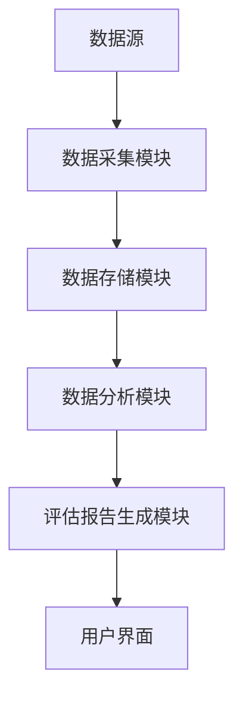

                 


# 彼得林奇如何评估公司的客户多样性

> 关键词：彼得·林奇、客户多样性、投资策略、风险管理、公司评估、金融分析

> 摘要：本文深入分析了彼得·林奇的投资理念，探讨了客户多样性评估的重要性及其对投资决策的影响。通过数学模型和系统架构的设计，结合实际案例，本文详细阐述了如何通过客户多样性来优化投资组合，降低风险，提升收益。

---

## 第一部分: 彼得林奇与客户多样性评估概述

### 第1章: 彼得·林奇及其投资理念

#### 1.1 彼得·林奇的背景介绍
彼得·林奇（Peter Lynch）是全球最著名的股票基金经理之一，以其卓越的投资业绩和独特的投资策略闻名。他在富达投资管理公司（Fidelity Investments）任职期间，管理的麦哲伦基金（Magellan Fund）取得了辉煌的业绩，年平均回报率超过29%，为投资者创造了巨额财富。

#### 1.2 彼得·林奇的投资哲学
彼得·林奇的投资哲学强调长期投资、分散投资和深入研究。他认为，成功的投资不仅依赖于市场分析，更需要对公司的基本面有深刻的理解。他主张通过分析公司的财务数据、市场地位、竞争优势等因素，寻找具有成长潜力的公司。

#### 1.3 客户多样性在投资中的重要性
客户多样性是指公司在不同客户群体中的分布情况，包括客户规模、行业、地理区域等。彼得·林奇认为，客户多样化的公司具有更强的抗风险能力和增长潜力，因为不同客户群体的需求变化不同，能够分散市场波动带来的风险。

---

### 第2章: 客户多样性评估的核心概念

#### 2.1 客户多样性评估的维度
客户多样性评估可以从以下几个维度进行：

- **客户规模与分布**：包括大客户和小客户的分布情况。
- **客户行业与领域**：公司客户所处的行业分布，如科技、金融、制造等。
- **客户地理分布**：客户所在的地理区域，如国内和国际市场分布。

#### 2.2 客户多样性评估的指标体系
为了量化客户多样性，我们可以设计以下指标：

- **多样性指数（Diversity Index）**：衡量客户群体的分散程度。
- **客户集中度（Customer Concentration）**：评估最大客户的贡献比例。
- **客户增长率与稳定性**：分析客户群体的增长趋势和稳定性。

#### 2.3 客户多样性评估的数学模型
**多样性指数**（Diversity Index）可以通过以下公式计算：

$$ D = \sum_{i=1}^{n} \frac{c_i^2}{\sum_{j=1}^{n} c_j} $$

其中，$c_i$ 表示第 $i$ 个客户的权重，$n$ 是客户总数。该公式衡量了客户分布的集中程度，$D$ 越小，客户分布越分散。

---

## 第二部分: 客户多样性评估的系统架构与实现

### 第3章: 客户多样性评估的系统架构

#### 3.1 系统功能设计
客户多样性评估系统的主要功能包括：

- **数据采集模块**：收集客户数据，包括客户ID、收入、行业、地理位置等。
- **数据分析模块**：对数据进行清洗、转换和分析，计算多样性指数和其他指标。
- **评估报告生成模块**：生成评估报告，提供可视化结果和建议。

#### 3.2 系统架构设计
以下是客户多样性评估系统的架构图：



---

### 第4章: 项目实战与案例分析

#### 4.1 项目环境安装
为了实现客户多样性评估系统，需要以下环境：

- **Python**：用于数据分析和建模。
- **Pandas** 和 **NumPy**：用于数据处理。
- **Matplotlib** 或 **Seaborn**：用于数据可视化。

#### 4.2 核心代码实现
以下是客户多样性评估的核心代码示例：

```python
import pandas as pd

# 读取客户数据
data = pd.read_csv('client_data.csv')

# 计算客户权重
total_revenue = data['revenue'].sum()
data['weight'] = data['revenue'] / total_revenue

# 计算多样性指数
def calculate_diversity_index(df):
    weights = df['weight']
    diversity_index = sum(weights**2) / sum(weights)
    return diversity_index

diversity_index = calculate_diversity_index(data)
print(f"多样性指数: {diversity_index}")
```

#### 4.3 案例分析
假设我们有以下客户数据：

| 客户ID | 收入（美元） |
|-------|-------------|
| C1    | 1000        |
| C2    | 2000        |
| C3    | 3000        |
| C4    | 4000        |
| C5    | 5000        |

计算多样性指数：

$$ D = \frac{1000^2 + 2000^2 + 3000^2 + 4000^2 + 5000^2}{1000 + 2000 + 3000 + 4000 + 5000} = \frac{10000000}{15000} \approx 666.67 $$

---

## 第三部分: 客户多样性评估的策略与优化

### 第5章: 客户多样性评估的优化策略

#### 5.1 优化客户分布
通过分析客户分布，可以识别高风险客户，并寻找新的客户群体以分散风险。

#### 5.2 动态监控
定期监控客户多样性指数，及时调整投资策略。

#### 5.3 结合其他评估指标
将客户多样性评估与其他财务指标（如盈利能力、成长性）相结合，全面评估公司的投资价值。

---

## 第四部分: 总结与展望

### 第6章: 总结

#### 6.1 核心观点回顾
- 客户多样性是投资成功的重要因素。
- 通过数学模型和系统架构，可以有效评估客户多样性。
- 动态监控和优化是保持客户多样性的重要手段。

#### 6.2 小结与注意事项
- 在实际应用中，需要结合具体业务场景进行调整。
- 数据的准确性和完整性对评估结果至关重要。

---

## 参考文献与拓展阅读

- 彼得·林奇的著作：《彼得·林奇的成功投资策略》。
- 数据分析工具：Pandas、NumPy、Matplotlib。

---

## 作者信息

作者：AI天才研究院 & 禅与计算机程序设计艺术

---

通过以上内容，我们详细探讨了彼得·林奇如何评估公司的客户多样性，从理论到实践，从分析到系统实现，为投资者提供了全面的指导。希望本文能为读者在投资决策中提供有价值的参考。

