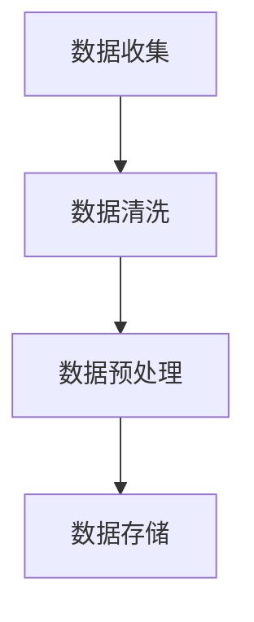
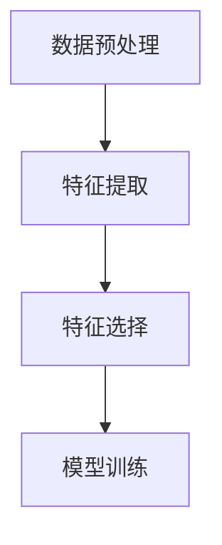
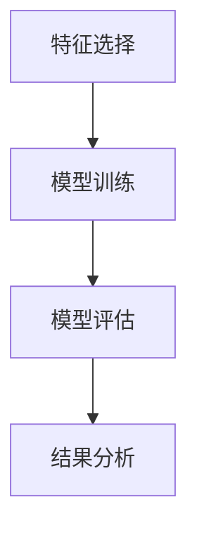
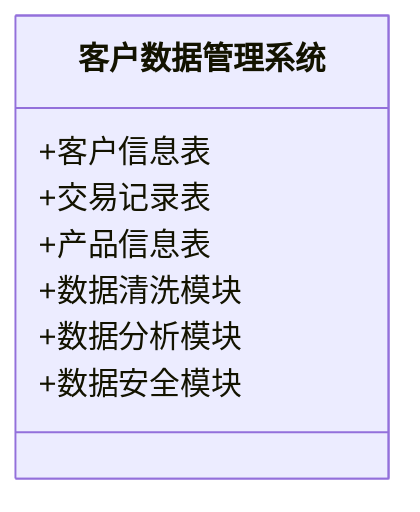
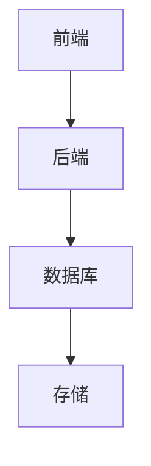

                 


# 彼得林奇如何评估公司的客户数据变现能力

## 关键词：客户数据变现，数据资产，数据价值，数据安全，彼得·林奇，投资策略，数据隐私

## 摘要：本文深入分析了彼得·林奇在评估客户数据变现能力方面的策略和方法。通过核心概念解析、算法原理、数学模型、系统架构设计和实际案例分析，揭示了客户数据变现的关键步骤和注意事项。文章内容涵盖数据资产的形成、数据价值的评估、数据安全的保护机制，以及如何通过算法和系统设计实现数据变现。结合具体项目实战，总结了最佳实践和未来趋势。

---

## 第一部分：客户数据变现的背景与重要性

### 第1章：客户数据变现的背景介绍

#### 1.1 问题背景

- **数据驱动经济的重要性**：在当今数字经济时代，数据已成为企业的核心资产。客户数据能够为企业提供关键的市场洞察，帮助优化业务流程、提升客户体验并创造新的收入来源。

- **数字化转型与数据资产的价值**：随着企业数字化转型的推进，客户数据的价值逐渐凸显。通过有效利用客户数据，企业能够更好地理解客户需求，提供个性化服务，从而提高客户忠诚度和满意度。

- **客户数据在商业中的核心地位**：客户数据不仅仅是交易记录，更是企业洞察市场趋势、竞争对手动态和客户需求的重要工具。通过对客户数据的分析，企业能够制定更精准的市场策略，优化产品和服务。

#### 1.2 问题描述

- **数据变现的定义与范围**：数据变现是指企业通过收集、分析和利用客户数据，将其转化为可 monetization 的资产，从而创造收入的过程。这包括但不限于通过数据销售、数据驱动的广告投放、个性化服务收费等方式实现数据价值。

- **数据变现面临的挑战**：数据变现过程中面临的主要挑战包括数据隐私和安全问题、数据质量和完整性、数据相关性和可用性、数据处理和分析能力等。此外，如何在合法合规的前提下实现数据价值最大化也是企业需要解决的关键问题。

- **数据变现的潜在机会**：随着大数据技术的发展和人工智能的应用，企业能够从海量数据中提取有价值的信息，从而为客户提供更精准的服务，创造新的商业机会。数据变现为企业提供了新的收入来源，同时也推动了数据驱动的商业模式创新。

#### 1.3 问题解决

- **数据变现的策略选择**：企业可以根据自身业务特点和数据资源，选择合适的数据变现策略。例如，通过数据清洗和分析，识别高价值客户群体，提供定制化服务；或者通过数据建模，预测市场趋势，优化供应链管理。

- **数据变现的实现路径**：数据变现的实现路径包括数据收集与整合、数据清洗与预处理、数据分析与建模、数据产品开发与应用等。每个阶段都需要精心设计和实施，确保数据质量和分析结果的准确性。

- **数据变现的评估方法**：企业可以通过多种方法评估数据变现能力，例如数据价值评估模型、数据安全风险评估、数据资产的 ROI 分析等。这些方法能够帮助企业量化数据价值，识别数据变现的潜力和风险。

#### 1.4 边界与外延

- **数据变现的边界**：数据变现的边界包括数据的合法性和合规性、数据隐私保护、数据安全风险控制等。企业需要在遵守相关法律法规的前提下，合理利用客户数据，确保数据的合法性和合规性。

- **数据变现与其他商业模式的关系**：数据变现是数据驱动经济的重要组成部分，但它并不是唯一的商业模式。企业可以结合其他商业模式，如产品销售、服务收费等，形成多元化的收入来源。

- **数据变现的未来趋势**：随着技术的进步和数据的广泛应用，数据变现的未来趋势将更加注重数据的深度挖掘和创新应用。例如，通过人工智能技术，企业可以进一步提升数据分析的深度和广度，挖掘数据的潜在价值。

#### 1.5 概念结构与核心要素

- **数据资产的定义与分类**：数据资产是指企业拥有或控制的，能够为企业带来经济利益的数据资源。数据资产可以分为结构化数据、非结构化数据、半结构化数据等类型。结构化数据包括客户信息、交易记录等，非结构化数据包括文本、图像、音频等。

- **数据价值的评估维度**：数据价值的评估可以从数据的完整性、准确性、相关性、及时性等多个维度进行。完整性是指数据是否包含所有必要的信息，准确性是指数据的正确性，相关性是指数据与业务目标的相关程度，及时性是指数据的更新速度。

- **数据安全与隐私保护**：数据安全是指保护数据不被未经授权的访问、泄露、篡改等。隐私保护是指在数据使用过程中，确保个人隐私不被侵犯。企业需要通过技术手段和管理措施，确保数据安全和隐私保护，维护客户信任。

---

## 第二部分：客户数据变现的核心概念与联系

### 第2章：核心概念与联系

#### 2.1 核心概念原理

- **数据资产的形成过程**：数据资产的形成需要经过数据收集、数据清洗、数据整合等步骤。企业需要从多个来源收集数据，如CRM系统、网站日志、社交媒体等，然后进行数据清洗和预处理，确保数据的完整性和准确性。最后，通过数据整合，形成统一的数据仓库，为后续的分析和应用提供基础。

- **数据价值的评估方法**：数据价值的评估方法包括定量分析和定性分析。定量分析可以通过数据价值评估模型，计算数据的经济价值；定性分析则需要结合业务目标和数据的相关性，评估数据对业务决策的影响力。

- **数据安全与隐私保护机制**：数据安全和隐私保护机制包括数据加密、访问控制、数据匿名化等。企业需要通过技术手段，确保数据在存储和传输过程中的安全性；通过访问控制，限制未经授权的人员访问敏感数据；通过数据匿名化处理，保护客户隐私。

#### 2.2 概念属性特征对比表格

| 概念       | 属性               | 特征描述                                   |
|------------|--------------------|--------------------------------------------|
| 数据资产   | 完整性             | 数据是否包含所有必要的信息               |
|            | 准确性             | 数据的正确性和可靠性                     |
|            | 相关性             | 数据与业务目标的相关程度                 |
| 数据价值   | 经济价值           | 数据为企业带来的经济利益                 |
|            | 战略价值           | 数据对企业发展战略的支持程度             |
| 数据安全   | 机密性             | 数据的保密性                             |
|            | 完整性             | 数据的完整性和准确性                     |
|            | 可用性             | 数据的可访问性和可用性                   |

#### 2.3 ER实体关系图

```mermaid
erDiagram
    customer [客户] {
        id : int
        name : string
        email : string
        phone : string
    }
    product [产品] {
        id : int
        name : string
        price : float
    }
    transaction [交易] {
        id : int
        customer_id : int
        product_id : int
        date : date
    }
    customer -> transaction : 进行
    product -> transaction : 被购买
```

---

## 第三部分：客户数据变现的算法原理讲解

### 第3章：算法原理

#### 3.1 数据清洗与预处理



Python代码示例：

```python
import pandas as pd

# 数据清洗
data = pd.read_csv('customer_data.csv')
# 处理缺失值
data.dropna(inplace=True)
# 标准化处理
data['age'] = data['age'].astype(int)
```

#### 3.2 数据特征提取



Python代码示例：

```python
from sklearn.feature_selection import SelectKBest
from sklearn.feature_selection import chi2

# 特征提取
features = SelectKBest(chi2, k=2).fit_transform(X, y)
```

#### 3.3 数据建模与预测



Python代码示例：

```python
from sklearn.tree import DecisionTreeClassifier
from sklearn.metrics import accuracy_score

# 模型训练
model = DecisionTreeClassifier().fit(X_train, y_train)
# 模型预测
y_pred = model.predict(X_test)
# 模型评估
print(accuracy_score(y_test, y_pred))
```

---

## 第四部分：客户数据变现的数学模型与公式

### 第4章：数学模型与公式

#### 4.1 数据价值评估模型

$$ 数据价值 = 0.5 \times 数据量 + 0.3 \times 数据质量 + 0.2 \times 数据相关性 $$

#### 4.2 数据安全风险评估模型

$$ 数据安全风险 = 0.4 \times 数据敏感性 + 0.3 \times 数据访问控制 + 0.3 \times 数据

---

## 第五部分：系统分析与架构设计方案

### 第5章：系统分析与架构设计方案

#### 5.1 系统功能设计



#### 5.2 系统架构设计



---

## 第六部分：项目实战

### 第6章：项目实战

#### 6.1 环境安装

- 安装Python和相关库：
  ```bash
  pip install pandas numpy scikit-learn
  ```

#### 6.2 核心代码实现

```python
import pandas as pd
from sklearn.tree import DecisionTreeClassifier
from sklearn.metrics import accuracy_score

# 数据清洗
data = pd.read_csv('customer_data.csv')
data.dropna(inplace=True)

# 特征提取
X = data.drop('target', axis=1)
y = data['target']

# 模型训练
model = DecisionTreeClassifier().fit(X, y)

# 模型预测
y_pred = model.predict(X)
print(accuracy_score(y, y_pred))
```

#### 6.3 案例分析

通过对客户数据的分析，发现高价值客户群体，并提供个性化服务，从而提升客户满意度和忠诚度。案例分析展示了数据变现的实际应用和效果。

---

## 第七部分：最佳实践与小结

### 第7章：最佳实践

- **数据安全的重要性**：企业必须重视数据安全和隐私保护，确保数据的合法性和合规性。
- **持续优化的必要性**：数据变现是一个动态过程，企业需要不断优化数据收集、分析和应用的各个环节。
- **未来趋势的展望**：随着技术的进步，数据变现将更加注重数据的深度挖掘和创新应用。

---

## 作者：AI天才研究院 & 禅与计算机程序设计艺术

