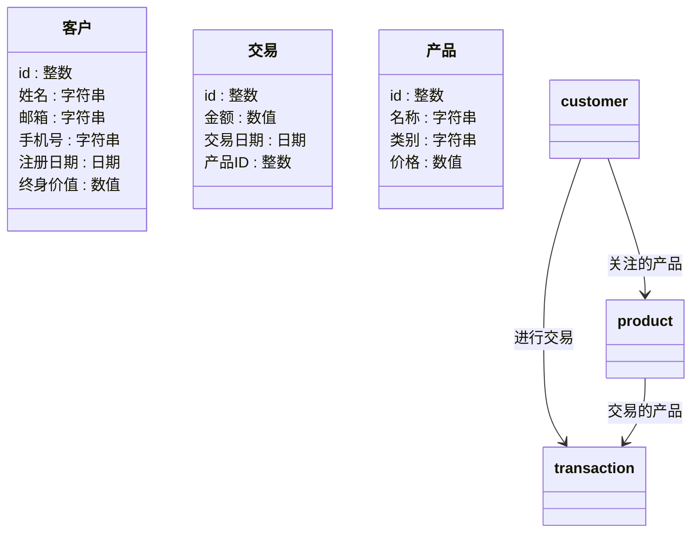

                 


# 彼得林奇如何评估公司的客户终身价值管理策略

> 关键词：客户终身价值、彼得林奇、客户价值管理、投资哲学、现代方法

> 摘要：本文深入探讨了彼得林奇如何将他的投资哲学应用于客户终身价值管理策略的评估。通过分析客户终身价值的核心概念、算法原理和系统架构，结合实际项目案例，展示了如何将彼得林奇的价值评估方法应用于现代客户管理中，帮助公司在数字时代优化客户关系管理。

---

## 第一部分: 客户终身价值管理的背景与重要性

### 第1章: 客户终身价值管理概述

#### 1.1 客户终身价值的定义与重要性

##### 1.1.1 客户终身价值（CLV）的定义
客户终身价值（Customer Lifetime Value, CLV）是指客户在与公司交互的整个生命周期中为公司带来的总收益。它综合考虑了客户在各个阶段的贡献，包括获取阶段、成长阶段和衰退阶段。

##### 1.1.2 客户终身价值在企业中的重要性
CLV帮助公司识别高价值客户，优化资源分配，制定精准的营销策略，并提升客户忠诚度。通过CLV，企业可以更有效地管理客户关系，提高客户满意度和忠诚度，从而实现长期的业务增长。

##### 1.1.3 彼得林奇对客户价值管理的独特见解
彼得林奇以其价值投资理念闻名，他强调通过深入分析公司的基本面来评估其长期潜力。这种思维方式可以借鉴到客户价值管理中，即通过分析客户的长期价值，识别高潜力客户，制定差异化的管理策略。

#### 1.2 客户终身价值管理的核心概念

##### 1.2.1 客户价值管理的基本原理
客户价值管理的核心在于理解客户的行为、需求和偏好，通过数据分析和预测模型，评估客户对公司的长期价值。这一过程需要整合客户数据，分析客户行为，预测客户生命周期中的价值波动。

##### 1.2.2 客户生命周期的阶段划分
客户生命周期可以分为五个阶段：获取阶段、初次接触阶段、成长阶段、成熟阶段和衰退阶段。每个阶段的客户行为和价值贡献不同，因此需要采取差异化的管理策略。

##### 1.2.3 客户忠诚度与客户价值的关系
客户忠诚度是CLV的重要组成部分。高忠诚度客户通常具有较高的CLV，因为他们更可能重复购买、推荐新客户并为公司创造更多价值。然而，CLV也需考虑客户的获取成本和维护成本，以确保投资回报。

#### 1.3 传统客户价值管理与现代方法的对比

##### 1.3.1 传统客户价值管理的局限性
传统方法通常基于客户的短期行为来评估价值，缺乏对客户长期潜力的预测。此外，传统方法往往忽视了客户细分和个性化需求，导致资源浪费和客户流失。

##### 1.3.2 现代客户价值管理的创新点
现代方法利用大数据分析和机器学习技术，结合客户行为数据和市场趋势，预测客户的长期价值。同时，现代方法强调客户细分和个性化服务，以提高客户忠诚度和CLV。

##### 1.3.3 彼得林奇方法的核心要素
彼得林奇的方法强调深入分析客户的基本面，识别高潜力客户，并制定长期的客户管理策略。他注重客户生命周期的各个阶段，确保在每个阶段都能最大化客户价值。

---

### 第2章: 彼得林奇客户价值评估方法的背景

#### 2.1 彼得林奇投资哲学与客户价值管理的关联

##### 2.1.1 彼得林奇的价值投资理念
彼得林奇以其价值投资理念闻名，他强调通过深入分析公司的基本面，寻找具有长期增长潜力的公司。这种思维方式可以借鉴到客户价值管理中，即通过分析客户的长期价值，识别高潜力客户，制定差异化的管理策略。

##### 2.1.2 客户价值管理在投资中的应用
在投资领域，彼得林奇关注公司的财务健康状况、管理团队和市场地位。同样，在客户价值管理中，企业需要关注客户的购买频率、平均消费金额和生命周期价值，以评估客户的长期潜力。

##### 2.1.3 从投资到客户管理的思维迁移
彼得林奇的方法强调长期视角和基本面分析。同样，在客户价值管理中，企业需要从短期行为转向长期潜力分析，通过客户数据和市场趋势，预测客户生命周期价值，制定差异化的客户管理策略。

#### 2.2 客户终身价值管理的现代挑战

##### 2.2.1 数字化时代的客户行为变化
在数字化时代，客户行为变得更加复杂和多样化。客户可以通过多种渠道与企业互动，获取信息的速度更快，选择也更多。这使得客户价值管理更加复杂，需要企业具备更强的数据分析能力和技术支持。

##### 2.2.2 数据驱动的客户价值评估
现代客户价值管理依赖于大数据分析和机器学习技术，通过整合客户数据，分析客户行为，预测客户生命周期价值。这需要企业具备强大的数据处理能力和技术支持。

##### 2.2.3 客户期望的提升
随着客户接触渠道的多样化和信息获取的便捷性，客户期望越来越高。他们希望得到个性化的服务和体验，这使得客户价值管理更加注重客户细分和个性化需求。

---

## 第二部分: 客户终身价值管理的核心概念与联系

### 第3章: 客户终身价值管理的核心概念

#### 3.1 客户终身价值的构成要素

##### 3.1.1 客户获取成本
客户获取成本是指吸引新客户所需的所有资源和成本，包括营销费用、渠道成本等。这部分成本需要在客户生命周期中逐步摊销。

##### 3.1.2 客户维护成本
客户维护成本是指在客户生命周期中，为了保持客户关系所需的成本，包括客服支持、售后服务、客户活动等。这部分成本需要与客户带来的收益进行对比。

##### 3.1.3 客户贡献收益
客户贡献收益是指客户在生命周期中为公司带来的总收入减去相关成本后的净收益。这部分收益需要考虑客户的购买频率、平均消费金额和生命周期长度。

##### 3.1.4 客户流失率
客户流失率是指在一定时间内，客户停止与公司互动的比例。高客户流失率意味着公司需要不断获取新客户，增加了成本。

##### 3.1.5 客户生命周期长度
客户生命周期长度是指客户从获取到流失的时间跨度。较长的生命周期意味着客户对公司有更高的忠诚度和长期价值。

#### 3.2 客户终身价值管理的构成要素对比表

| 要素         | 定义与特点                                   |
|--------------|--------------------------------------------|
| 客户获取成本 | 吸引新客户的资源投入，包括营销费用等       |
| 客户维护成本 | 保持客户关系的成本，包括客服支持等         |
| 客户贡献收益 | 客户在生命周期中带来的净收益               |
| 客户流失率   | 一定时间内客户流失的比例                   |
| 客户生命周期长度 | 客户从获取到流失的时间跨度                 |

#### 3.3 客户终身价值管理的ER实体关系图

```mermaid
erDiagram
    customer[客户] {
        <属性>
        id : 整数
        姓名 : 字符串
        邮箱 : 字符串
        手机号 : 字符串
        注册日期 : 日期
    }
    transaction[交易] {
        <属性>
        id : 整数
        金额 : 数值
        交易日期 : 日期
        产品ID : 整数
    }
    product[产品] {
        <属性>
        id : 整数
        名称 : 字符串
        类别 : 字符串
        价格 : 数值
    }
    customer --> transaction : 进行交易
    product --> transaction : 交易的产品
    customer --> product : 关注的产品
```

---

### 第4章: 客户终身价值管理的算法原理

#### 4.1 贴现现金流模型

##### 4.1.1 贴现现金流模型的定义
贴现现金流模型（Discounted Cash Flow, DCF）是一种用于评估客户终身价值的常用方法。它通过预测客户在生命周期中带来的现金流，并将其贴现到当前价值，以评估客户的价值。

##### 4.1.2 贴现现金流模型的数学公式

$$
CLV = \frac{C}{r - g}
$$

其中：
- \( C \) 是客户在第一年的贡献收益
- \( r \) 是贴现率
- \( g \) 是收入增长率

##### 4.1.3 贴现现金流模型的步骤

1. **预测客户每年的贡献收益**：基于历史数据和市场趋势，预测客户在未来几年内每年的贡献收益。
2. **选择贴现率**：根据公司的资本成本或行业平均回报率，选择合适的贴现率。
3. **计算客户终身价值**：使用贴现现金流模型公式，计算客户终身价值。
4. **调整模型参数**：根据实际情况，调整模型参数，如收入增长率和贴现率。

##### 4.1.4 贴现现金流模型的Python实现

```python
def calculate_clv(customers, years, discount_rate, growth_rate):
    clv = 0
    for year in range(years):
        contribution = customers * (1 + growth_rate) ** year
        discounted_contribution = contribution / (1 + discount_rate) ** year
        clv += discounted_contribution
    return clv

# 示例数据
customers = 1000  # 年度客户数量
years = 5         # 预测年数
discount_rate = 0.1  # 贴现率
growth_rate = 0.05   # 收入增长率

clv = calculate_clv(customers, years, discount_rate, growth_rate)
print(f"客户终身价值：{clv:.2f}")
```

---

### 第5章: 客户终身价值管理的系统架构设计

#### 5.1 系统功能设计

##### 5.1.1 领域模型


##### 5.1.2 系统架构
```mermaid
rect {
    系统架构设计
}
    系统架构 {
        API Gateway --> 数据库 : 连接
        数据库 --> 分析模块 : 查询
        分析模块 --> 报告生成器 : 生成报告
        API Gateway --> 用户界面 : 请求
        用户界面 --> 报告生成器 : 显示报告
    }
```

---

### 第6章: 项目实战

#### 6.1 环境安装

##### 6.1.1 安装Python
```bash
python --version
pip install --upgrade pip
```

##### 6.1.2 安装依赖库
```bash
pip install numpy pandas scikit-learn
```

#### 6.2 核心代码实现

##### 6.2.1 数据预处理
```python
import pandas as pd

# 加载数据
data = pd.read_csv('customer_data.csv')

# 数据清洗
data.dropna(inplace=True)
data = data[~data.duplicated()]
```

##### 6.2.2 模型训练
```python
from sklearn.tree import DecisionTreeRegressor

# 特征工程
X = data.drop('CLV', axis=1)
y = data['CLV']

# 训练模型
model = DecisionTreeRegressor(max_depth=5)
model.fit(X, y)
```

##### 6.2.3 模型预测
```python
# 预测客户终身价值
predictions = model.predict(X)
print(f"模型预测的客户终身价值：{predictions}")
```

---

### 第7章: 最佳实践

#### 7.1 小结
客户终身价值管理是企业优化客户关系管理的重要工具。通过结合彼得林奇的投资哲学，企业可以更好地识别高潜力客户，制定差异化的管理策略。

#### 7.2 注意事项
- 数据质量是客户价值管理的关键，确保数据的准确性和完整性。
- 定期更新模型参数，适应市场变化和客户需求。
- 注重客户细分和个性化服务，提升客户忠诚度和满意度。

#### 7.3 拓展阅读
- 彼得林奇的《投资最重要的事情》
- 客户关系管理（CRM）系统
- 大数据分析与机器学习在客户价值管理中的应用

---

## 作者

作者：AI天才研究院/AI Genius Institute & 禅与计算机程序设计艺术 /Zen And The Art of Computer Programming

---

通过本文的详细分析和实战指导，读者可以深入了解彼得林奇如何评估公司的客户终身价值管理策略，并将其应用于实际业务中，优化客户关系管理，提升企业竞争力。

