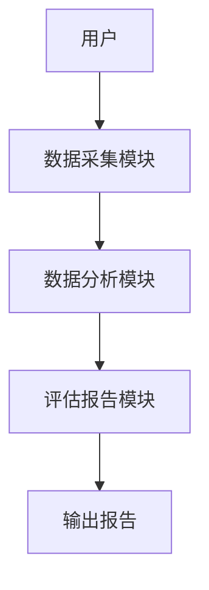

                 


# 彼得林奇如何评估公司的数字化转型速度

## 关键词：数字化转型，彼得林奇，企业评估，转型速度，投资价值

## 摘要：彼得·林奇作为投资界的传奇，提出了独特的评估公司数字化转型速度的方法，帮助投资者和企业管理者识别转型中的关键指标和潜在风险，从而做出明智的投资决策。

---

# 第一部分：数字化转型的背景与核心概念

## 第1章：数字化转型的背景与定义

### 1.1 数字化转型的定义与内涵

#### 1.1.1 数字化转型的定义
数字化转型（Digital Transformation）是指利用数字技术改变业务模式、文化、哲学以及实践的综合过程。它不仅仅是技术的更新，更是对企业战略、组织结构、业务流程和文化的根本性变革。

#### 1.1.2 数字化转型的核心特征
- **数据驱动**：依赖数据进行决策和优化。
- **技术整合**：结合AI、大数据、云计算等技术。
- **客户中心**：以客户体验为核心。
- **敏捷性**：快速适应市场变化。

#### 1.1.3 数字化转型与企业价值的关系
数字化转型能够提升企业的效率、创新能力和竞争力，从而提高企业价值和投资吸引力。

### 1.2 数字化转型的现状与趋势

#### 1.2.1 当前企业数字化转型的现状
- **普及率高**：大多数企业已经开始数字化转型。
- **技术驱动**：技术进步推动转型进程。
- **行业差异**：不同行业转型速度和重点不同。

#### 1.2.2 数字化转型的驱动因素
- **技术进步**：如AI、大数据等技术的发展。
- **客户需求**：客户期望更个性化的服务。
- **竞争压力**：数字化转型成为企业竞争的必要条件。

#### 1.2.3 数字化转型的未来趋势
- **智能化**：AI和自动化将主导转型。
- **生态系统**：企业将更加依赖生态系统合作。
- **可持续性**：绿色技术将成为转型的重要部分。

### 1.3 数字化转型的挑战与机遇

#### 1.3.1 数字化转型的主要挑战
- **技术障碍**：技术集成和更新的难度。
- **组织变革**：文化转变和员工适应性问题。
- **资金投入**：转型需要大量资金投入。

#### 1.3.2 数字化转型带来的机遇
- **竞争优势**：提升企业竞争力。
- **效率提升**：优化业务流程，降低成本。
- **新商业模式**：创造新的收入来源。

#### 1.3.3 如何应对挑战抓住机遇
- **技术投资**：加大技术投入，推动创新。
- **组织文化**：培养创新文化，促进员工适应性。
- **战略规划**：制定清晰的数字化战略，分阶段实施。

## 第2章：数字化转型的核心概念与框架

### 2.1 数字化转型的核心要素

#### 2.1.1 技术要素
- **AI与大数据**：用于数据分析和决策支持。
- **云计算**：提供弹性计算资源。
- **物联网**：连接物理世界和数字世界。

#### 2.1.2 组织要素
- **领导力**：高层支持和推动转型。
- **员工技能**：员工具备数字化能力。
- **文化适应**：企业文化和价值观支持转型。

#### 2.1.3 业务要素
- **客户体验**：优化客户互动。
- **业务流程**：重新设计和优化流程。
- **商业模式**：创新商业模式，如订阅制。

### 2.2 数字化转型的评估指标

#### 2.2.1 技术成熟度
- **技术采用率**：企业采用新技术的比例。
- **系统集成度**：技术系统的整合程度。
- **数据利用率**：数据在决策中的应用程度。

#### 2.2.2 业务影响度
- **业务绩效提升**：数字化对业务绩效的影响。
- **客户满意度**：客户对数字化服务的满意度。
- **市场份额变化**：数字化对市场份额的影响。

#### 2.2.3 组织适应度
- **组织结构变化**：组织结构的调整情况。
- **员工适应性**：员工对数字化的适应程度。
- **文化变革**：企业文化是否支持数字化。

### 2.3 数字化转型的框架模型

#### 2.3.1 技术架构
- **数据层**：数据的采集、存储和处理。
- **应用层**：应用程序的设计与开发。
- **平台层**：平台的搭建与维护。

#### 2.3.2 业务架构
- **业务流程优化**：重新设计业务流程。
- **客户体验设计**：优化客户互动体验。
- **价值主张**：明确数字化带来的价值。

#### 2.3.3 组织架构
- **领导结构**：高层领导的职责和角色。
- **团队结构**：数字化转型团队的构建。
- **文化架构**：企业文化与价值观的塑造。

## 第3章：数字化转型的评估方法与工具

### 3.1 数字化转型的评估指标体系

#### 3.1.1 评估指标的选择
- **关键性**：指标是否影响企业核心业务。
- **可衡量性**：指标是否可量化。
- **相关性**：指标是否相互关联。

#### 3.1.2 指标权重的确定
- **层次分析法（AHP）**：用于确定指标权重。
- **专家评分法**：专家根据经验评分。

#### 3.1.3 评估结果的分析
- **数据可视化**：使用图表展示评估结果。
- **趋势分析**：分析指标变化趋势。
- **基准比较**：与行业基准进行比较。

### 3.2 数字化转型的评估工具

#### 3.2.1 自评估问卷
- **设计问卷**：根据核心指标设计问卷。
- **收集反馈**：通过问卷收集员工和客户的反馈。
- **分析结果**：统计分析问卷结果，识别问题。

#### 3.2.2 数据分析工具
- **数据可视化工具**：如Tableau、Power BI。
- **预测分析工具**：如Python的机器学习库。

#### 3.2.3 专家评估法
- **专家小组**：邀请行业专家进行评估。
- **定性分析**：专家根据经验进行分析。

### 3.3 数字化转型的评估流程

#### 3.3.1 评估准备
- **确定目标**：明确评估的目的和范围。
- **组建团队**：组建评估团队，分配任务。
- **制定计划**：制定详细的评估计划。

#### 3.3.2 数据收集
- **内部数据**：收集企业内部数据。
- **外部数据**：收集行业数据和最佳实践。
- **数据清洗**：清理数据，确保数据质量。

#### 3.3.3 分析与诊断
- **数据分析**：对收集的数据进行分析。
- **问题诊断**：识别数字化转型中的问题。
- **原因分析**：分析问题的根本原因。

#### 3.3.4 评估结果的应用
- **制定改进计划**：根据评估结果制定改进计划。
- **资源分配**：合理分配资源，支持改进。
- **持续监控**：持续监控转型进度，确保目标达成。

## 第4章：数字化转型的行业案例分析

### 4.1 零售行业的数字化转型

#### 4.1.1 零售行业的转型现状
- **线上销售增长**：线上销售占比增加。
- **客户体验优化**：通过数字化提升客户体验。
- **数据驱动决策**：利用数据优化库存和营销。

#### 4.1.2 数字化转型的关键举措
- **Omnichannel策略**：整合线上和线下渠道。
- **个性化推荐**：基于用户数据推荐产品。
- **智能库存管理**：利用AI优化库存。

#### 4.1.3 成功案例分析
- **案例1：某零售巨头的数字化转型**：通过Omnichannel策略和个性化推荐，客户满意度提升30%，销售额增长20%。

### 4.2 制造业的数字化转型

#### 4.2.1 制造业的转型挑战
- **数据孤岛**：不同部门之间的数据无法共享。
- **设备兼容性**：传统设备与新技术的兼容问题。
- **成本控制**：数字化转型初期投入大。

#### 4.2.2 数字化转型的关键技术
- **工业物联网（IIoT）**：连接设备和系统，实现数据共享。
- **预测性维护**：基于数据分析预测设备故障。
- **数字孪生**：创建虚拟模型，优化生产流程。

#### 4.2.3 成功案例分析
- **案例2：某汽车制造商的数字化转型**：通过IIoT和数字孪生技术，生产效率提高25%，维护成本降低15%。

### 4.3 金融行业的数字化转型

#### 4.3.1 金融行业的转型趋势
- **数字化服务普及**：线上银行、移动支付等服务普及。
- **风险管理优化**：利用大数据和AI优化风险管理。
- **客户体验提升**：通过个性化服务提升客户满意度。

#### 4.3.2 数字化转型的核心技术
- **区块链**：用于安全的金融交易。
- **AI客服**：提供智能客服支持。
- **云计算**：提供弹性计算资源，支持金融业务的扩展。

#### 4.3.3 成功案例分析
- **案例3：某银行的数字化转型**：通过区块链和AI客服，交易安全性提高，客户满意度提升40%。

## 第5章：数字化转型的评估方法与工具（续）

### 5.1 数字化转型的评估方法

#### 5.1.1 层次分析法（AHP）

##### 5.1.1.1 AHP的定义
层次分析法是一种用于结构化决策问题的方法，通过构建层次结构，确定各因素的权重，进行综合评估。

##### 5.1.1.2 AHP的步骤
1. **构建层次结构**：将问题分解为各个因素。
2. **确定各因素的权重**：通过专家评分法确定权重。
3. **计算综合得分**：根据权重计算各方案的综合得分。

##### 5.1.1.3 AHP的实现

```python
import numpy as np

# 示例：使用层次分析法评估数字化转型指标权重
criteria = ['技术成熟度', '业务影响度', '组织适应度']
weights = [0.5, 0.3, 0.2]

for i in range(len(criteria)):
    print(f"{criteria[i]}的权重为：{weights[i]}")
```

#### 5.1.2 数学模型

##### 5.1.2.1 数学模型的定义
数学模型是用来描述问题的数学表达式，能够帮助我们量化评估指标。

##### 5.1.2.2 数学模型的应用

$$ \text{综合得分} = \sum_{i=1}^{n} w_i \times s_i $$

其中，\( w_i \) 是第i个指标的权重，\( s_i \) 是第i个指标的得分。

#### 5.1.3 评估流程

##### 5.1.3.1 评估准备
- **目标设定**：明确评估的目标和范围。
- **数据收集**：收集相关的数据和信息。
- **团队组建**：组建评估团队，分配任务。

##### 5.1.3.2 数据分析
- **数据清洗**：清理数据，确保数据质量。
- **指标计算**：根据模型计算各个指标的得分。
- **结果分析**：分析结果，找出问题和改进方向。

##### 5.1.3.3 结果应用
- **制定改进计划**：根据评估结果制定改进计划。
- **资源分配**：合理分配资源，支持改进。
- **持续监控**：持续监控转型进度，确保目标达成。

### 5.2 数字化转型的系统架构设计

#### 5.2.1 系统功能设计

##### 5.2.1.1 系统功能模块
- **数据采集模块**：采集企业内部和外部数据。
- **数据分析模块**：对数据进行分析和处理。
- **评估报告模块**：生成评估报告和改进建议。

##### 5.2.1.2 功能模块的交互
$$ \text{数据采集} \rightarrow \text{数据分析} \rightarrow \text{评估报告生成} $$

#### 5.2.2 系统架构设计

##### 5.2.2.1 系统架构图



#### 5.2.3 系统接口设计

##### 5.2.3.1 数据接口
- **输入接口**：接收外部数据。
- **输出接口**：输出评估结果和报告。

##### 5.2.3.2 接口协议
- **HTTP**：用于Web服务之间的通信。
- **RESTful API**：用于数据接口的标准化设计。

### 5.3 数字化转型的项目实战

#### 5.3.1 环境安装

##### 5.3.1.1 安装Python
```bash
# 安装Python
sudo apt-get install python3
```

##### 5.3.1.2 安装数据分析库
```bash
# 安装pandas和numpy
pip install pandas numpy
```

#### 5.3.2 核心代码实现

##### 5.3.2.1 数据处理代码
```python
import pandas as pd
import numpy as np

# 示例数据
data = {
    '技术成熟度': [0.8, 0.7, 0.9],
    '业务影响度': [0.6, 0.8, 0.7],
    '组织适应度': [0.5, 0.6, 0.8]
}

df = pd.DataFrame(data)
print(df)
```

##### 5.3.2.2 评估模型代码
```python
# 示例评估模型
def calculate_score(data, weights):
    return np.dot(data, weights)

weights = [0.5, 0.3, 0.2]
scores = calculate_score(df.values, weights)
print(scores)
```

#### 5.3.3 案例分析

##### 5.3.3.1 案例分析
假设某企业的数字化转型指标如下：
- **技术成熟度**：0.8
- **业务影响度**：0.6
- **组织适应度**：0.5

根据上述模型，计算综合得分：
$$ \text{综合得分} = 0.5 \times 0.8 + 0.3 \times 0.6 + 0.2 \times 0.5 = 0.4 + 0.18 + 0.1 = 0.68 $$

综合得分为0.68，属于中等水平，需要进一步优化。

#### 5.3.4 项目总结

##### 5.3.4.1 项目总结
- **项目目标**：评估企业的数字化转型速度。
- **项目成果**：通过层次分析法和数学模型，得出综合得分，并提出改进建议。
- **经验教训**：数据质量对评估结果影响重大，需确保数据的准确性和完整性。

## 第6章：数字化转型的未来趋势与投资建议

### 6.1 数字化转型的未来趋势

#### 6.1.1 技术融合
- **AI与大数据结合**：提升数据分析的深度和广度。
- **5G与物联网结合**：推动实时数据处理和万物互联。

#### 6.1.2 模式创新
- **订阅制**：通过订阅模式提供持续的服务。
- **共享经济**：利用数字化技术实现资源共享。

#### 6.1.3 可持续发展
- **绿色技术**：推动环保技术的发展和应用。
- **社会责任**：企业数字化转型中的社会责任意识增强。

### 6.2 数字化转型的投资建议

#### 6.2.1 投资策略
- **长期视角**：数字化转型是一个长期过程，需要持续投资。
- **技术驱动**：优先投资技术领先的企业。
- **行业选择**：选择数字化转型需求迫切的行业，如制造业和金融服务业。

#### 6.2.2 风险管理
- **技术风险**：评估企业的技术能力和创新潜力。
- **市场风险**：关注行业竞争格局和市场前景。
- **组织风险**：评估企业的组织结构和文化适应性。

### 6.3 数字化转型的未来展望

#### 6.3.1 技术进步
- **AI的进一步发展**：AI将更加智能化，推动自动化和无人化。
- **区块链的广泛应用**：区块链技术将在更多领域得到应用。

#### 6.3.2 商业模式创新
- **服务化转型**：从产品销售转向服务提供。
- **生态合作**：企业间合作更加紧密，形成生态系统。

#### 6.3.3 人才需求
- **数字人才需求增加**：企业需要更多数字化人才。
- **跨学科人才**：数字化转型需要跨学科的人才，如数据科学家和业务分析师。

## 第7章：总结与建议

### 7.1 本章总结
数字化转型是企业生存和发展的必然趋势，彼得·林奇的方法为我们提供了一个系统化的评估框架。通过技术、业务和组织三个维度的综合评估，可以帮助企业识别转型中的关键问题，制定有效的改进策略。

### 7.2 投资建议
投资者在评估企业数字化转型时，应关注企业的技术能力、业务模式和组织结构，选择那些在数字化转型中有明确战略和良好执行的企业进行投资。

### 7.3 未来展望
随着技术的不断进步和商业模式的创新，数字化转型将更加深入，企业需要持续关注技术发展和市场变化，保持竞争优势。

---

# 作者：AI天才研究院 & 禅与计算机程序设计艺术

---

通过以上结构，我们可以系统地评估公司的数字化转型速度，并基于彼得·林奇的评估方法，为企业和投资者提供有价值的洞察和建议。

