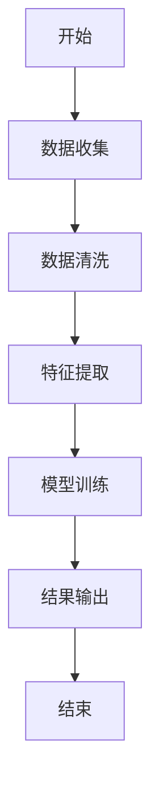

                 


# 彼得林奇如何评估公司的数字化转型速度与质量

## 关键词：数字化转型，彼得·林奇，评估模型，企业架构，系统设计，算法原理

## 摘要：  
数字化转型已成为现代企业生存和发展的关键，而如何评估转型的速度与质量则是企业面临的重要挑战。本文基于彼得·林奇的评估方法，从背景、核心概念、算法原理、系统设计到项目实战，全面解析如何科学、系统地评估数字化转型的进展。通过Mermaid流程图、数学公式和Python代码实现，本文为读者提供了一套实用的评估框架，帮助企业更好地把握转型节奏，实现高质量的数字化转型。

---

## 第一部分：数字化转型的背景与核心概念

### 第1章：数字化转型的背景与问题背景

#### 1.1 数字化转型的现状与挑战
- **1.1.1 数字化转型的定义与内涵**  
  数字化转型是指通过技术手段（如大数据、人工智能、云计算等）对企业业务流程、商业模式和组织结构进行重构和优化，以提升企业的竞争力和适应性。  
  数字化转型不仅仅是技术的升级，更是企业战略的调整和组织文化的变革。

- **1.1.2 当前企业数字化转型的痛点**  
  企业在数字化转型过程中常面临以下问题：  
  1. 数据孤岛：信息系统分散，数据难以整合。  
  2. 技术选型复杂：如何选择适合的技术架构和工具。  
  3. 业务与技术脱节：技术团队与业务部门缺乏有效沟通。  
  4. 转型效果难以量化：如何衡量数字化转型的实际效益。

- **1.1.3 彼得·林奇评估方法的引入背景**  
  彼得·林奇（Peter Lynch）是美国著名投资家，他在评估企业价值时注重基本面分析和长期战略。将这种方法应用于数字化转型评估，可以帮助企业在转型过程中找到优化方向，避免盲目投资和技术堆砌。

#### 1.2 数字化转型的核心问题
- **1.2.1 数字化转型的关键问题描述**  
  数字化转型的核心问题包括：  
  1. 如何量化转型的进度？  
  2. 如何评估转型的质量？  
  3. 如何预测转型的未来趋势？  

- **1.2.2 企业数字化转型的边界与外延**  
  数字化转型的边界包括：  
  - 业务层面：如客户体验、供应链管理等。  
  - 技术层面：如数据采集、存储、分析等。  
  - 组织层面：如团队协作、文化变革等。  

- **1.2.3 核心要素与组成结构**  
  数字化转型的核心要素包括：  
  1. 数据：数据的采集、存储和分析是转型的基础。  
  2. 技术：包括云计算、大数据、人工智能等技术的运用。  
  3. 业务：业务流程的优化和创新。  
  4. 组织：组织结构和文化的调整。  

#### 1.3 彼得·林奇评估方法的核心理念
- **1.3.1 彼得·林奇评估方法的概述**  
  彼得·林奇的评估方法强调对企业基本面的深入分析，包括财务状况、市场地位、管理团队等。将其应用于数字化转型评估，核心在于关注企业的数据质量、技术能力和业务成果。

- **1.3.2 评估方法的核心要素**  
  - 数据质量：数据的完整性和准确性。  
  - 技术能力：企业的技术储备和创新能力。  
  - 业务成果：转型对企业业绩的实际贡献。  

- **1.3.3 方法的适用场景与限制**  
  适用场景：  
  - 企业处于数字化转型的初期阶段。  
  - 需要量化转型成果的企业。  
  限制：  
  - 对于已经完成数字化转型的企业，该方法可能不适用。  
  - 评估结果依赖于数据的准确性和完整性。

#### 1.4 本章小结
本章从数字化转型的背景出发，分析了转型的现状与挑战，提出了彼得·林奇评估方法的核心理念，并明确了该方法的适用场景和限制。

---

## 第2章：数字化转型评估的核心概念与联系

### 2.1 核心概念的原理与特征
- **2.1.1 核心概念的原理分析**  
  数字化转型评估的核心概念包括：  
  1. 数据驱动：通过数据分析指导决策。  
  2. 技术赋能：利用先进技术推动业务创新。  
  3. 业务价值：衡量数字化转型对企业价值的贡献。  

- **2.1.2 核心概念的属性特征对比**  
  对比分析：  
  - 数据驱动与技术赋能：数据是基础，技术是手段。  
  - 技术赋能与业务价值：技术是为了实现业务目标。  

- **2.1.3 核心概念的ER实体关系图**  
  下图展示了数字化转型评估的核心概念之间的关系：  
  ```mermaid
  graph TD
      数据驱动[数据驱动] --> 技术赋能[技术赋能]
      技术赋能 --> 业务价值[业务价值]
  ```

### 2.2 评估模型的数学模型与公式
- **2.2.1 数学模型的构建**  
  数字化转型的评估模型可以表示为：  
  $$评估结果 = f(数据质量, 技术能力, 业务成果)$$  
  其中，$f$ 是一个加权函数，权重根据企业的实际情况确定。

- **2.2.2 评估公式与权重分配**  
  例如，假设数据质量、技术能力和业务成果的权重分别为0.3、0.4和0.3，则：  
  $$评估结果 = 0.3 \times 数据质量 + 0.4 \times 技术能力 + 0.3 \times 业务成果$$  

- **2.2.3 公式示例与解释**  
  假设某企业数据质量得分为80，技术能力得分为70，业务成果得分为90，则：  
  $$评估结果 = 0.3 \times 80 + 0.4 \times 70 + 0.3 \times 90 = 24 + 28 + 27 = 79$$  
  评估结果为79分，表示该企业的数字化转型处于中等偏上水平。

### 2.3 评估过程的Mermaid流程图


### 2.4 本章小结
本章详细介绍了数字化转型评估的核心概念，并通过数学模型和流程图展示了评估过程。通过加权计算，企业可以量化其数字化转型的进度和质量。

---

## 第3章：评估算法的原理与实现

### 3.1 算法原理的详细讲解
- **3.1.1 算法的基本原理**  
  该算法基于加权评分模型，通过对企业在数据质量、技术能力和业务成果三个维度的评分，计算出综合评估结果。

- **3.1.2 算法的输入与输出**  
  - 输入：数据质量、技术能力、业务成果的评分。  
  - 输出：综合评估结果。  

- **3.1.3 算法的步骤分解**  
  1. 收集企业在数据质量、技术能力和业务成果方面的评分。  
  2. 根据权重计算综合得分。  
  3. 根据得分将企业数字化转型的水平分为优秀、良好、一般、较差四个等级。  

### 3.2 算法的Mermaid流程图


### 3.3 算法的数学模型与公式
- **3.3.1 算法的数学模型**  
  $$评估结果 = w_1 \times 数据质量 + w_2 \times 技术能力 + w_3 \times 业务成果$$  

- **3.3.2 权重分配的依据**  
  权重分配可以根据企业的实际情况调整。例如，对于技术驱动型企业，技术能力的权重可以适当提高。  

### 3.4 本章小结
本章详细讲解了评估算法的原理和实现步骤，并通过流程图和数学公式展示了算法的实现过程。

---

## 第4章：系统分析与架构设计

### 4.1 问题场景介绍
- **4.1.1 问题背景**  
  企业需要一个系统化的工具来评估其数字化转型的进度和质量。  

- **4.1.2 问题目标**  
  开发一个数字化转型评估系统，帮助企业量化其转型成果。  

- **4.1.3 问题约束**  
  - 系统需要支持多维度的评估指标。  
  - 系统需要具有良好的扩展性。  

### 4.2 系统功能设计
- **4.2.1 领域模型的Mermaid类图**  
  ```mermaid
  classDiagram
      class 数据收集模块 {
          收集数据
      }
      class 数据清洗模块 {
          清洗数据
      }
      class 特征提取模块 {
          提取特征
      }
      class 模型训练模块 {
          训练模型
      }
      class 结果输出模块 {
          输出结果
      }
  ```

- **4.2.2 系统架构设计**  
  ```mermaid
  graph TD
      A[数据收集] --> B[数据清洗]
      B --> C[特征提取]
      C --> D[模型训练]
      D --> E[结果输出]
  ```

### 4.3 系统接口设计
- **4.3.1 输入接口**  
  - 数据输入接口：用于接收企业的评估数据。  
  - 权重设置接口：允许用户根据实际情况调整权重。  

- **4.3.2 输出接口**  
  - 评估结果输出接口：输出综合评估结果。  

### 4.4 本章小结
本章通过系统分析与架构设计，展示了如何构建一个数字化转型评估系统，帮助企业实现系统化的评估。

---

## 第5章：项目实战与案例分析

### 5.1 环境安装与配置
- **5.1.1 环境需求**  
  - 操作系统：Windows/Mac/Linux  
  - Python版本：3.6+  
  - 需要安装的库：numpy, pandas, matplotlib  

### 5.2 系统核心实现源代码
```python
def assess_digital_transformation(data_quality, technology_ability, business_outcome):
    weight_data = 0.3
    weight_tech = 0.4
    weight_business = 0.3
    score = weight_data * data_quality + weight_tech * technology_ability + weight_business * business_outcome
    return score

# 示例数据
data_quality = 80
technology_ability = 70
business_outcome = 90

result = assess_digital_transformation(data_quality, technology_ability, business_outcome)
print(f"评估结果：{result}")
```

### 5.3 代码应用解读与分析
- **5.3.1 代码功能解读**  
  该代码实现了数字化转型的评估算法，根据数据质量、技术能力和业务成果的评分计算综合得分。  

- **5.3.2 代码优化建议**  
  - 可以增加异常处理机制。  
  - 可以添加可视化输出，便于用户理解结果。  

### 5.4 实际案例分析
- **5.4.1 案例背景**  
  某零售企业希望评估其数字化转型的进度。  

- **5.4.2 案例分析**  
  该企业的数据质量得分为85，技术能力得分为75，业务成果得分为85。根据公式：  
  $$评估结果 = 0.3 \times 85 + 0.4 \times 75 + 0.3 \times 85 = 25.5 + 30 + 25.5 = 81$$  
  评估结果为81分，表示该企业的数字化转型处于良好水平。  

### 5.5 本章小结
本章通过项目实战和案例分析，展示了如何利用代码实现数字化转型的评估，并通过具体案例验证了算法的有效性。

---

## 第6章：总结与最佳实践

### 6.1 本章小结
本文从背景、核心概念、算法原理、系统设计到项目实战，全面解析了彼得·林奇如何评估公司的数字化转型速度与质量。通过加权评分模型和系统化的评估方法，企业可以量化其转型成果，并根据评估结果制定下一步的优化策略。

### 6.2 最佳实践 tips
- **数据质量是基础**：数据的准确性和完整性是评估的核心。  
- **技术能力是关键**：技术能力的提升是数字化转型成功的关键。  
- **业务成果是目标**：最终目标是通过数字化转型实现业务价值。  

### 6.3 注意事项
- 评估结果仅供参考，需结合实际情况调整权重。  
- 系统设计需考虑可扩展性和可维护性。  

### 6.4 拓展阅读
- 推荐阅读《数字化转型：技术与管理的双重视野》。  
- 参考资料：彼得·林奇的《投资成功术》。

---

## 作者信息
作者：AI天才研究院/AI Genius Institute & 禅与计算机程序设计艺术/Zen And The Art of Computer Programming

