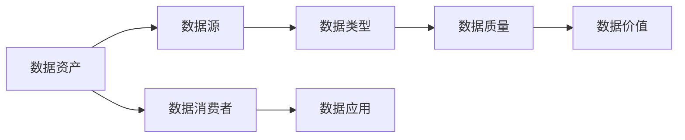
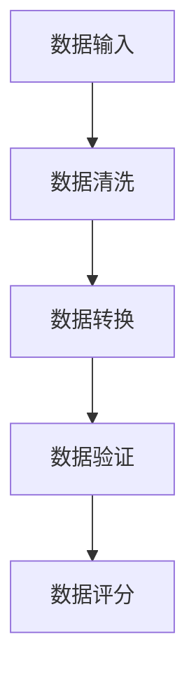
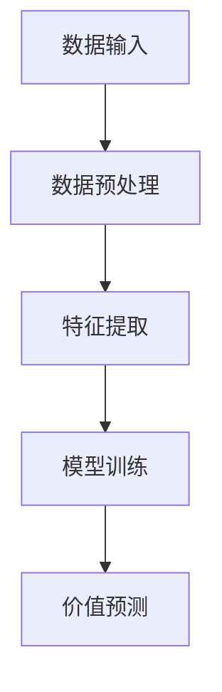
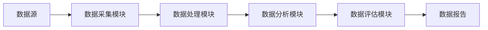
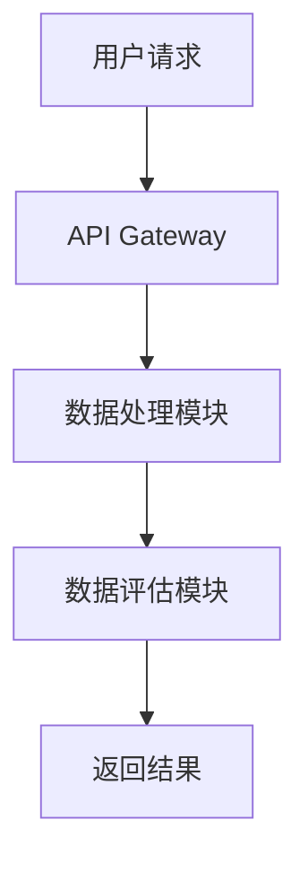

                 


# 彼得林奇如何评估公司的数据变现能力

## 关键词：数据变现，彼得·林奇，投资分析，数据资产，数据价值

## 摘要：  
彼得·林奇作为全球著名投资大师，其对公司的数据变现能力有着独特的分析框架。本文将从数据资产的核心概念出发，结合数据质量、数据隐私、数据安全等关键要素，详细阐述如何评估公司的数据变现能力。通过系统化的分析与实践案例，本文旨在为读者提供一套可操作的数据变现能力评估方法。

---

# 目录大纲

---

## 第一部分：数据变现能力评估的背景与核心概念

### 第1章：数据变现能力评估的背景与重要性

#### 1.1 数据变现的背景与现状  
- 数据作为资产的演进历程  
- 数据变现的定义与内涵  
- 数据变现的商业价值与社会意义  

#### 1.2 彼得·林奇的分析框架  
- 彼得·林奇的投资理念与方法  
- 数据变现能力在投资分析中的地位  
- 数据资产的定义与评估维度  

#### 1.3 数据变现能力评估的核心要素  
- 数据质量与可用性  
- 数据隐私与安全  
- 数据的商业应用场景  

#### 1.4 本章小结  

---

### 第2章：数据资产的关键属性与特征  

#### 2.1 数据资产的属性对比  
- 数据的可量性与可变现性  
- 数据的实时性与持久性  
- 数据的关联性与独立性  

#### 2.2 数据类型与定价模型  
- 结构化数据与非结构化数据  
- 数据定价的常见方法  
- 数据质量对定价的影响  

#### 2.3 数据资产的生命周期  
- 数据生成与收集  
- 数据处理与存储  
- 数据分析与变现  

#### 2.4 数据资产的实体关系图  


#### 2.5 本章小结  

---

## 第二部分：数据变现能力评估的算法原理  

### 第3章：数据质量评估算法  

#### 3.1 数据质量评估的数学模型  
- 数据完整性公式  
$$ 完整性 = \frac{完整数据量}{总数据量} $$  
- 数据一致性公式  
$$ 一致性 = \frac{一致数据量}{总数据量} $$  

#### 3.2 数据质量评估的流程图  


#### 3.3 数据质量评分算法实现  
```python
def data_quality_score(data):
    completeness = len(data.dropna()) / len(data)
    consistency = data.dropna().duplicated().sum() / len(data)
    return completeness * 0.4 + consistency * 0.6
```

#### 3.4 本章小结  

---

### 第4章：数据价值预测模型  

#### 4.1 数据价值预测的数学模型  
$$ 数据价值 = \alpha \times 数据质量 + \beta \times 数据隐私 + \gamma \times 数据应用场景 $$  

#### 4.2 数据价值预测的流程图  


#### 4.3 数据价值预测模型实现  
```python
import pandas as pd
from sklearn.linear_model import LinearRegression

def predict_data_value(data, target):
    model = LinearRegression()
    model.fit(data.drop(target, axis=1), data[target])
    return model.predict(data.drop(target, axis=1))
```

#### 4.4 本章小结  

---

## 第三部分：数据变现能力评估的系统架构与实现  

### 第5章：系统架构设计  

#### 5.1 数据采集与处理模块  
- 数据采集场景描述  
- 数据清洗与转换逻辑  
- 数据存储方案  

#### 5.2 数据分析与评估模块  
- 数据质量评估功能  
- 数据价值预测功能  
- 数据资产评分功能  

#### 5.3 系统架构图  


#### 5.4 本章小结  

---

### 第6章：系统接口与交互设计  

#### 6.1 系统接口设计  
- API设计与调用流程  
- 数据输入输出格式  

#### 6.2 系统交互流程图  


#### 6.3 本章小结  

---

## 第四部分：数据变现能力评估的实战与优化  

### 第7章：项目实战  

#### 7.1 环境安装与配置  
- 数据处理工具安装  
- 开发环境配置  

#### 7.2 核心代码实现  
- 数据质量评估代码  
- 数据价值预测代码  

#### 7.3 案例分析与解读  
- 数据来源与应用场景  
- 数据评估结果分析  

#### 7.4 本章小结  

---

### 第8章：最佳实践与小结  

#### 8.1 最佳实践总结  
- 数据质量管理的关键点  
- 数据隐私与安全的注意事项  
- 数据变现能力提升的建议  

#### 8.2 本章小结  

---

## 作者：AI天才研究院 & 禅与计算机程序设计艺术

