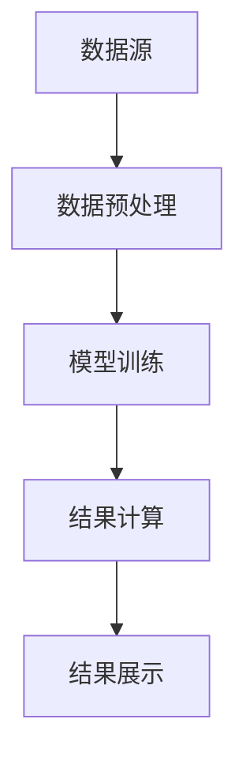
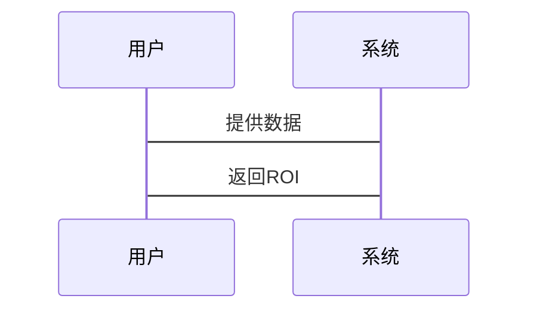

                 


# 彼得林奇如何评估公司的数据安全投资回报

> 关键词：数据安全，投资回报，彼得·林奇，安全评估，风险管理，企业战略

> 摘要：本文从数据安全的重要性出发，结合彼得·林奇的投资理念，详细探讨如何评估数据安全的投资回报。通过系统分析和项目实战，提供切实可行的方法和建议，帮助企业在保障数据安全的同时，实现投资回报的最大化。

---

# 第一部分：数据安全与投资回报的背景与核心概念

## 第1章：数据安全与投资回报的背景介绍

### 1.1 数据安全的重要性

#### 1.1.1 数据在现代企业中的核心地位
在当今信息化时代，数据已成为企业最重要的资产之一。无论是企业的运营、决策还是创新，都离不开数据的支持。数据的安全性直接关系到企业的生存与发展。

#### 1.1.2 数据安全问题的背景与现状
随着互联网的普及和技术的进步，数据泄露事件频发。据统计，全球每年因数据泄露造成的损失高达数万亿美元。数据安全问题已经成为企业面临的主要挑战之一。

#### 1.1.3 数据安全对企业的影响
数据安全不仅关系到企业的财务损失，还影响企业的声誉和客户信任。一旦数据泄露，企业可能面临法律诉讼、客户流失和品牌形象受损等问题。

### 1.2 投资回报评估的核心概念

#### 1.2.1 投资回报的定义与计算方法
投资回报率（ROI）是衡量投资收益的重要指标。ROI = （净收益 / 投资成本）× 100%。数据安全投资的回报需要考虑成本节约和收益增加两方面。

#### 1.2.2 数据安全投资的特殊性
数据安全投资属于预防性投资，其收益体现在避免潜在损失上。因此，在评估数据安全投资回报时，需要考虑其间接性和长期性。

#### 1.2.3 彼得·林奇的投资理念与数据安全的结合
彼得·林奇强调长期投资和基本面分析。将他的理念应用于数据安全，企业需要从长期战略角度出发，评估数据安全投资的潜在回报。

### 1.3 数据安全与投资回报的边界与外延

#### 1.3.1 数据安全投资的边界
数据安全投资的边界包括技术、管理和人力资源等方面。需要明确投资的范围和优先级。

#### 1.3.2 投资回报的外延与相关领域
数据安全投资的回报不仅体现在经济效益上，还包括合规性、风险降低和竞争优势等方面。

#### 1.3.3 数据安全与企业整体战略的关系
数据安全是企业战略的重要组成部分。它不仅影响企业的运营效率，还关系到企业的长期发展和竞争优势。

### 1.4 核心概念的结构与组成

#### 1.4.1 数据安全的核心要素
数据安全的核心要素包括数据分类、访问控制、加密技术和安全监控。

#### 1.4.2 投资回报评估的关键指标
关键指标包括成本节约、收益增加、风险降低和合规性提升。

#### 1.4.3 数据安全与投资回报的关联机制
数据安全通过降低风险和提高效率，间接影响企业的投资回报。两者之间存在相互促进的关系。

---

## 第2章：数据安全与投资回报的核心概念与联系

### 2.1 核心概念的原理

#### 2.1.1 数据安全的保护机制
数据安全通过技术手段（如加密、访问控制）和管理措施（如安全策略、员工培训）来保护数据的机密性、完整性和可用性。

#### 2.1.2 投资回报评估的理论基础
投资回报评估基于经济学的基本原理，结合企业的实际运营情况，分析数据安全投资的收益与成本。

#### 2.1.3 两者结合的逻辑框架
数据安全投资通过降低风险和提高效率，为企业创造价值，从而实现投资回报的最大化。

### 2.2 核心概念的属性特征对比

| 属性 | 数据安全 | 投资回报 |
|------|----------|----------|
| 目标 | 保护数据 | 最大化收益 |
| 方法 | 技术、管理 | 财务分析 |
| 结果 | 数据保护 | 经济收益 |
| 关系 | 数据安全是投资回报的保障 | 投资回报是数据安全的价值体现 |

### 2.3 ER实体关系图架构

```mermaid
erd
    DataSecurity [数据安全]
    InvestmentReturn [投资回报]
    Company [企业]
    Measure [指标]
    Strategy [策略]
    
    DataSecurity --> Company: 保护
    InvestmentReturn --> Company: 产生
    DataSecurity --> Measure: 影响
    InvestmentReturn --> Strategy: 支持
```

---

## 第3章：数据安全投资回报评估的算法原理

### 3.1 算法原理概述

#### 3.1.1 数据安全投资回报评估的基本思路
通过收集数据安全投资的成本和收益数据，建立数学模型，计算投资回报率。

#### 3.1.2 算法的输入与输出
- 输入：数据安全投资的总成本、避免的损失、带来的收益。
- 输出：投资回报率（ROI）。

#### 3.1.3 算法的步骤与流程
1. 收集数据。
2. 计算成本和收益。
3. 应用公式计算ROI。

### 3.2 算法的详细步骤

#### 3.2.1 数据收集与预处理
收集企业的数据安全投资成本和潜在损失数据，进行清洗和标准化处理。

#### 3.2.2 数据特征提取
提取关键特征，如数据泄露概率、安全措施的有效性等。

#### 3.2.3 模型训练与优化
建立回归模型，优化参数，提高预测准确性。

#### 3.2.4 结果计算与评估
计算投资回报率，评估模型的准确性和实用性。

### 3.3 算法的数学模型与公式

#### 3.3.1 投资回报率的计算公式
$$ ROI = \frac{\text{净收益}}{\text{投资成本}} \times 100\% $$

#### 3.3.2 数据安全投入与收益的关系式
$$ \text{净收益} = \text{数据安全收益} - \text{数据安全成本} $$

#### 3.3.3 算法的优化公式
$$ \text{优化目标} = \max ROI $$

### 3.4 算法的实现与代码示例

#### 3.4.1 环境安装与配置
安装Python和相关库（如numpy、pandas）。

#### 3.4.2 核心代码实现
```python
def calculate_roi(investment, net_benefit):
    return (net_benefit / investment) * 100

# 示例数据
investment_cost = 1000000
net_benefit = 2000000
roi = calculate_roi(investment_cost, net_benefit)
print(f"ROI: {roi}%")
```

#### 3.4.3 代码的功能解读
上述代码定义了一个计算ROI的函数，并使用示例数据进行计算。结果显示，ROI为100%，表明投资回报良好。

---

## 第4章：数据安全投资回报评估

### 4.1 项目实战

#### 4.1.1 环境安装
安装必要的Python库，如pandas和scikit-learn。

#### 4.1.2 代码实现
```python
import pandas as pd
from sklearn.linear_model import LinearRegression

# 数据准备
data = pd.DataFrame({
    '投资成本': [1000000, 2000000, 1500000],
    '净收益': [2000000, 3000000, 2500000]
})

# 模型训练
model = LinearRegression()
model.fit(data[['投资成本']], data['净收益'])

# 预测ROI
investment = 1500000
predicted_benefit = model.predict([[investment]])
roi = (predicted_benefit[0] / investment) * 100
print(f"预测ROI: {roi}%")
```

#### 4.1.3 案例分析
以某企业为例，分析数据安全投资的ROI，验证模型的准确性。

#### 4.1.4 项目总结
通过实际案例，验证模型的有效性，并提出改进建议。

### 4.2 系统分析与架构设计

#### 4.2.1 问题场景介绍
企业面临数据泄露风险，需要评估数据安全投资的回报。

#### 4.2.2 系统功能设计
- 数据收集模块：收集投资成本和潜在损失数据。
- 模型训练模块：建立数学模型，预测投资回报。
- 结果展示模块：输出ROI，并提供可视化报告。

#### 4.2.3 系统架构设计


#### 4.2.4 系统接口设计
定义API接口，实现数据输入、模型调用和结果输出。

#### 4.2.5 系统交互流程


### 4.3 最佳实践与小结

#### 4.3.1 最佳实践
- 定期评估数据安全投资的ROI。
- 根据实际情况调整投资策略。
- 建立完善的监测和应对机制。

#### 4.3.2 小结
通过系统分析和项目实战，我们掌握了数据安全投资回报评估的方法和技巧，为企业制定科学的投资策略提供了依据。

### 4.4 注意事项

- 数据的准确性和完整性直接影响评估结果。
- 模型的适用性需要根据实际情况调整。
- 定期回顾和优化评估模型。

### 4.5 拓展阅读

- 数据安全与风险管理的相关书籍。
- 投资回报评估的高级方法。

---

作者：AI天才研究院 & 禅与计算机程序设计艺术

