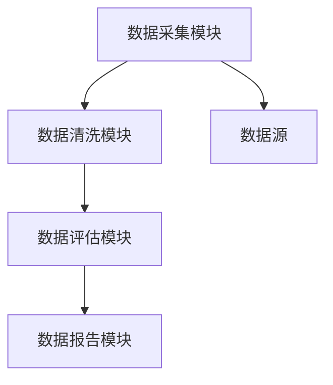
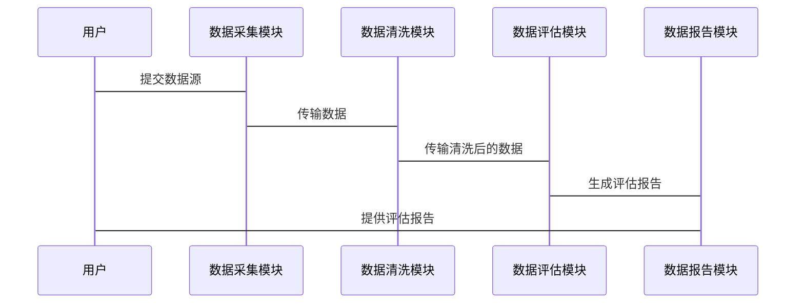

                 


# 彼得林奇如何评估公司的数据治理能力

> 关键词：数据治理，彼得林奇，企业数据管理，数据安全，数据质量管理

> 摘要：数据治理是企业在数字化转型中面临的核心挑战之一。本文以彼得林奇的管理思想为出发点，详细探讨如何系统性地评估公司的数据治理能力。通过背景介绍、核心概念、算法原理、系统架构、项目实战以及最佳实践等多个维度，本文将为您提供一套完整的数据治理能力评估方法论，帮助企业在复杂的数据环境中建立高效的数据管理体系，确保数据安全、合规性和战略价值的实现。

---

# 第一部分：数据治理能力评估背景与核心概念

## 第1章：数据治理能力评估概述

### 1.1 数据治理的重要性

#### 1.1.1 数据在企业中的战略地位
数据是企业的核心资产之一，被誉为“新石油”。在数字经济时代，数据驱动的决策已经成为企业竞争力的关键。数据治理能力直接影响企业的运营效率、创新能力和市场反应速度。

#### 1.1.2 数据治理的基本概念
数据治理是指通过制定政策、流程和技术手段，确保数据的完整性、准确性、一致性、安全性和合规性。它涉及数据的创建、存储、处理、共享和销毁的全生命周期管理。

#### 1.1.3 数据治理的核心目标
- 确保数据质量：数据的准确性、一致性和完整性。
- 保障数据安全：防止数据泄露、篡改和未经授权的访问。
- 提高数据利用率：最大化数据的业务价值和决策支持能力。
- 遵守法规要求：确保数据处理符合相关法律法规和行业标准。

### 1.2 数据治理能力评估的背景

#### 1.2.1 当前企业数据管理的挑战
- 数据孤岛问题：不同部门或系统之间的数据无法有效共享和整合。
- 数据质量问题：数据的不一致性和不完整性影响业务决策。
- 数据安全风险：数据泄露和滥用事件频发，对企业声誉和财务造成威胁。
- 数据管理成本高：缺乏统一的管理框架和工具，导致资源浪费。

#### 1.2.2 数据治理能力评估的必要性
通过系统性评估数据治理能力，企业可以识别自身的短板，制定改进计划，提升数据管理效率和效果。

#### 1.2.3 数据治理与企业竞争力的关系
数据治理能力是企业数字化转型的重要基石。良好的数据治理能力能够提升企业的运营效率、创新能力和市场响应速度，从而增强企业的竞争力。

### 1.3 彼得林奇评估方法的核心思想

#### 1.3.1 彼得林奇的管理风格
彼得林奇以价值投资和长期主义著称，注重企业的基本面分析和长期发展潜力。他的管理风格强调稳健、细致和数据驱动的决策。

#### 1.3.2 彼得林奇评估方法的特点
- 以数据为基础：通过详细的数据分析来评估企业的经营状况。
- 长期视角：关注企业的长期发展和持续改进。
- 系统性：注重从多个维度全面评估企业的能力。

#### 1.3.3 该方法在数据治理中的应用价值
将彼得林奇的评估方法应用于数据治理能力评估，可以帮助企业从多个维度全面分析数据管理现状，识别改进方向，制定切实可行的改进计划。

### 1.4 数据治理能力评估的维度

#### 1.4.1 数据质量评估
- 数据的准确性：数据是否反映真实情况。
- 数据的完整性：数据是否包含所有必要信息。
- 数据的一致性：数据在不同系统中是否一致。

#### 1.4.2 数据安全评估
- 数据访问控制：是否对数据访问进行了严格的权限管理。
- 数据加密：数据在存储和传输过程中是否加密。
- 数据备份与恢复：是否建立了完善的备份和恢复机制。

#### 1.4.3 数据管理能力评估
- 数据管理流程：是否建立了规范的管理流程。
- 数据管理工具：是否采用了先进的数据管理工具。
- 数据管理团队：是否有专业的数据管理团队。

#### 1.4.4 数据应用效果评估
- 数据驱动的决策：数据是否被有效地用于业务决策。
- 数据创新：数据是否被用于推动业务创新。
- 数据共享：数据是否能够在不同部门或系统之间有效共享。

## 第2章：数据治理能力评估的核心概念

### 2.1 数据治理的关键要素

#### 2.1.1 数据资产识别
数据资产识别是数据治理的第一步，需要明确企业中哪些数据是重要的资产，并对其进行分类和编号。

#### 2.1.2 数据质量管理
数据质量管理是指确保数据的准确性、一致性和完整性。这包括数据清洗、数据校验和数据补全等过程。

#### 2.1.3 数据安全管理
数据安全管理是指防止数据泄露、篡改和未经授权的访问。这包括数据加密、访问控制和安全审计等措施。

#### 2.1.4 数据生命周期管理
数据生命周期管理是指从数据的生成、存储、处理、共享到销毁的全过程管理。这包括数据归档、数据删除和数据存档等步骤。

### 2.2 数据治理能力评估的框架

#### 2.2.1 数据治理框架的构成
数据治理框架通常包括政策、流程、组织、工具和技术五个部分。

- 政策：企业的数据治理政策和法规遵守要求。
- 流程：数据治理的具体流程和操作步骤。
- 组织：数据治理的组织结构和职责分配。
- 工具：数据治理的工具和技术支持。
- 技术：数据治理的技术实现和系统架构。

#### 2.2.2 数据治理框架的实施步骤
1. 制定数据治理政策和目标。
2. 建立数据治理组织和团队。
3. 实施数据治理流程和操作。
4. 使用数据治理工具和技术支持。
5. 监测和优化数据治理效果。

#### 2.2.3 数据治理框架的优化方向
- 持续优化数据治理流程和工具。
- 加强数据治理团队的培训和能力提升。
- 定期评估数据治理效果并进行改进。

### 2.3 数据治理能力评估的指标体系

#### 2.3.1 指标体系的设计原则
- 全面性：覆盖数据治理的各个维度。
- 可操作性：指标应易于测量和计算。
- 可比性：指标应具有一定的可比性。

#### 2.3.2 指标体系的分类
- 数据质量指标：如数据准确性、完整性等。
- 数据安全指标：如数据泄露事件数量、数据加密比例等。
- 数据管理指标：如数据管理流程的规范性、数据管理工具的使用情况等。
- 数据应用指标：如数据驱动的决策数量、数据创新项目数量等。

#### 2.3.3 指标权重的确定方法
- 层次分析法（AHP）：通过专家评分确定各指标的权重。
- 主成分分析法（PCA）：通过统计方法确定各指标的权重。
- 专家经验法：根据专家的经验确定各指标的权重。

### 2.4 数据治理能力评估的核心流程

#### 2.4.1 评估准备阶段
- 明确评估目标和范围。
- 收集相关数据和文档。
- 组建评估团队并进行培训。

#### 2.4.2 数据收集阶段
- 收集数据治理相关的政策、流程、组织和工具信息。
- 收集数据质量、数据安全、数据管理和数据应用的相关数据。

#### 2.4.3 数据分析阶段
- 对收集的数据进行整理和清洗。
- 对数据进行分析和评估，得出评估结果。

#### 2.4.4 结果反馈与优化阶段
- 将评估结果反馈给相关部门和人员。
- 根据评估结果制定改进计划并实施优化。

---

# 第二部分：数据治理能力评估的核心算法与数学模型

## 第3章：数据治理能力评估的核心算法与数学模型

### 3.1 数据治理能力评估的数学模型

#### 3.1.1 数据质量评分模型
- 数据准确性评分：$Accuracy = \frac{正确数据量}{总数据量}$
- 数据完整性评分：$Completeness = \frac{完整数据量}{总数据量}$
- 数据一致性评分：$Consistency = \frac{一致数据量}{总数据量}$

#### 3.1.2 数据安全评分模型
- 数据安全评分：$Security = \alpha \times 数据访问控制评分 + \beta \times 数据加密评分 + \gamma \times 数据备份评分$
  其中，$\alpha + \beta + \gamma = 1$

#### 3.1.3 数据管理能力评分模型
- 数据管理能力评分：$Management = \alpha \times 数据管理流程评分 + \beta \times 数据管理工具评分 + \gamma \times 数据管理团队评分$
  其中，$\alpha + \beta + \gamma = 1$

#### 3.1.4 数据应用效果评分模型
- 数据应用效果评分：$Application = \alpha \times 数据驱动决策评分 + \beta \times 数据创新项目评分 + \gamma \times 数据共享评分$
  其中，$\alpha + \beta + \gamma = 1$

### 3.2 数据治理能力综合评分模型

#### 3.2.1 综合评分计算公式
$$
Total\ Score = \alpha \times 数据质量评分 + \beta \times 数据安全评分 + \gamma \times 数据管理能力评分 + \delta \times 数据应用效果评分
$$
其中，$\alpha + \beta + \gamma + \delta = 1$

#### 3.2.2 指标权重的确定
- 使用层次分析法（AHP）确定各指标的权重。
- 通过专家评分法或统计分析法对指标权重进行调整和优化。

---

## 第4章：数据治理能力评估的系统架构设计

### 4.1 系统功能设计

#### 4.1.1 数据采集模块
- 数据采集接口：支持多种数据源的接入，如数据库、文件、API等。
- 数据清洗模块：对采集到的数据进行去重、补全和格式转换。

#### 4.1.2 数据评估模块
- 数据质量评估：对数据的准确性、完整性和一致性进行评估。
- 数据安全评估：对数据的访问控制、加密和备份进行评估。
- 数据管理评估：对数据管理流程、工具和团队进行评估。
- 数据应用评估：对数据驱动的决策、创新项目和共享情况进行评估。

#### 4.1.3 数据报告模块
- 生成数据治理能力评估报告，包括各维度的评分结果和改进建议。
- 提供可视化界面，直观展示数据治理能力的现状和趋势。

### 4.2 系统架构设计

#### 4.2.1 系统架构图


#### 4.2.2 系统接口设计
- 数据采集接口：提供REST API，支持多种数据格式的接入。
- 数据评估接口：提供REST API，支持批量评估和实时评估。
- 数据报告接口：提供REST API，支持报告生成和下载。

#### 4.2.3 系统交互设计


---

## 第5章：数据治理能力评估的项目实战

### 5.1 环境安装

#### 5.1.1 系统要求
- 操作系统：Windows 10 或更高版本，或 Linux 系统。
- Python 版本：Python 3.6 或更高版本。
- 其他依赖：安装 Mermaid 和相关数据处理库（如 Pandas、NumPy 等）。

#### 5.1.2 安装步骤
```bash
pip install mermaid
pip install pandas numpy
```

### 5.2 核心代码实现

#### 5.2.1 数据采集模块
```python
import pandas as pd

def collect_data(source_type, source_path):
    if source_type == 'database':
        # 从数据库采集数据
        data = pd.read_sql_query(query, connection)
    elif source_type == 'file':
        # 从文件采集数据
        data = pd.read_csv(source_path)
    elif source_type == 'api':
        # 从API采集数据
        response = requests.get(api_url)
        data = response.json()
    return data
```

#### 5.2.2 数据清洗模块
```python
def clean_data(data):
    # 删除重复数据
    data.drop_duplicates(inplace=True)
    # 补全缺失数据
    data = data.fillna(method='ffill')
    # 转换数据格式
    data = data.astype({'id': 'int64', 'name': 'str'})
    return data
```

#### 5.2.3 数据评估模块
```python
def assess_data_quality(data):
    # 数据准确性评估
    accuracy = sum(data['value'].apply(lambda x: validate_value(x))) / len(data)
    # 数据完整性评估
    completeness = sum(data['id'].isna()) / len(data)
    # 数据一致性评估
    consistency = sum(data['id'].apply(lambda x: check_consistency(x))) / len(data)
    return {'accuracy': accuracy, 'completeness': completeness, 'consistency': consistency}
```

#### 5.2.4 数据报告生成模块
```python
def generate_report(assessment_results):
    # 生成HTML格式的报告
    report = """
    <html>
    <body>
    <h1>数据治理能力评估报告</h1>
    <p>数据准确性评分：{accuracy}%</p>
    <p>数据完整性评分：{completeness}%</p>
    <p>数据一致性评分：{consistency}%</p>
    </body>
    </html>
    """.format(**assessment_results)
    return report
```

### 5.3 代码应用解读与分析

#### 5.3.1 数据采集模块解读
数据采集模块负责从多种数据源（如数据库、文件、API等）采集数据，并将采集到的数据传递给数据清洗模块。

#### 5.3.2 数据清洗模块解读
数据清洗模块对采集到的数据进行去重、补全和格式转换，确保数据的干净和一致性。

#### 5.3.3 数据评估模块解读
数据评估模块对清洗后的数据进行质量评估，包括数据准确性、完整性和一致性评估。

#### 5.3.4 数据报告模块解读
数据报告模块根据评估结果生成评估报告，包括各维度的评分结果和改进建议，并通过可视化界面展示评估结果。

### 5.4 实际案例分析

#### 5.4.1 案例背景
某企业希望评估其客户数据的治理能力，包括数据的准确性、完整性、一致性和安全性。

#### 5.4.2 案例实施步骤
1. 从数据库采集客户数据。
2. 对数据进行清洗，去除重复数据并补全缺失数据。
3. 对数据进行质量评估，包括数据准确性、完整性和一致性评估。
4. 对数据进行安全评估，包括数据访问控制、加密和备份评估。
5. 根据评估结果生成数据治理能力评估报告。

#### 5.4.3 案例结果分析
- 数据准确性评分：95%
- 数据完整性评分：90%
- 数据一致性评分：85%
- 数据安全评分：90%

### 5.5 项目小结

---

## 第6章：数据治理能力评估的最佳实践

### 6.1 小结

### 6.2 注意事项

#### 6.2.1 数据治理能力评估的注意事项
- 确保数据采集的全面性和准确性。
- 数据清洗过程中要注意保护数据的原始信息。
- 数据评估过程中要结合企业的实际情况和业务需求。

#### 6.2.2 系统实施中的注意事项
- 确保系统的安全性和稳定性。
- 系统的可扩展性和可维护性。
- 系统的用户友好性和易用性。

### 6.3 拓展阅读

#### 6.3.1 推荐书籍
- 《数据治理：从战略到实践》
- 《数据质量管理：方法与实践》

#### 6.3.2 推荐在线资源
- 数据治理相关的行业报告和白皮书。
- 数据治理相关的技术博客和社区讨论。

---

# 结语

数据治理能力评估是企业在数字化转型中必须面对的重要课题。通过本文的探讨，我们从背景介绍、核心概念、算法原理、系统架构、项目实战以及最佳实践等多个维度，全面分析了如何系统性地评估公司的数据治理能力。未来，随着数据量的不断增加和技术的不断进步，数据治理能力评估的方法和工具也将不断优化和创新，为企业提供更加高效和智能的解决方案。

---

作者：AI天才研究院/AI Genius Institute & 禅与计算机程序设计艺术/Zen And The Art of Computer Programming

