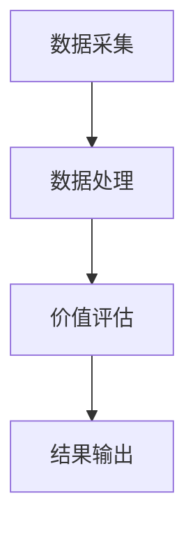
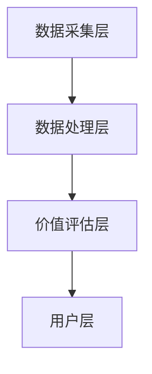
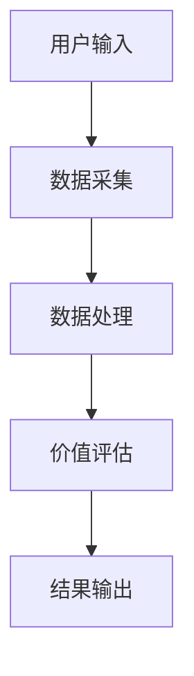

                 


# 彼得林奇如何评估公司的数据资产价值

---

## 关键词  
数据资产价值评估、彼得·林奇、投资评估方法、数据资产评估系统、现金流分析、数据资产分类

---

## 摘要  
本文详细探讨了彼得·林奇如何评估公司数据资产的价值，结合其投资方法论，提出了一套适用于现代企业的数据资产价值评估框架。通过分析数据资产的定义、分类、评估指标和数学模型，本文为读者提供了从理论到实践的全面指导。同时，结合实际案例和系统架构设计，本文展示了如何将彼得·林奇的评估方法应用于现实场景中。

---

# 第1章: 数据资产与彼得·林奇的评估方法概述

## 1.1 数据资产的定义与重要性

### 1.1.1 数据资产的定义  
数据资产是指企业拥有或控制的、能够为企业创造经济价值的数据资源。这些数据可以是结构化的（如数据库中的信息）或非结构化的（如文档、图像），并具有可量化的价值。

### 1.1.2 数据资产在企业中的重要性  
在数字经济时代，数据已成为企业的核心资产。彼得·林奇曾指出，数据资产的价值不仅体现在其直接收益上，还体现在其对决策的支持和对未来的预测能力上。

### 1.1.3 彼得·林奇对数据资产的独特见解  
彼得·林奇强调，数据资产的价值取决于其质量和使用场景。高质量的数据能够为企业创造更大的价值，而低质量的数据可能对企业决策产生负面影响。

---

## 1.2 数据资产价值评估的背景与现状

### 1.2.1 数据驱动经济的时代背景  
随着大数据技术的普及，数据已成为推动企业增长的核心引擎。数据资产的价值评估成为企业战略决策的关键环节。

### 1.2.2 数据资产价值评估的挑战  
数据资产的无形性和动态性使其价值评估变得复杂。企业需要结合数据分析、市场趋势和内部管理因素来综合评估数据资产的价值。

### 1.2.3 彼得·林奇的成功投资案例分析  
彼得·林奇通过其独特的投资方法，成功评估了多个企业的数据资产价值。他的方法强调对数据资产的深度分析和长期价值的预测。

---

## 1.3 本书的核心方法论

### 1.3.1 数据资产价值评估的框架  
本文提出了一套基于彼得·林奇方法的数据资产价值评估框架，包括数据资产的分类、评估指标和数学模型。

### 1.3.2 彼得·林奇评估方法的适应性  
彼得·林奇的评估方法经过时间验证，适用于多种行业和数据资产类型。本文将这些方法进行了适当的调整，以适应数据资产的特殊性。

### 1.3.3 本书的结构与目标  
本书旨在为企业提供一套实用的数据资产价值评估方法，帮助企业在数字经济时代中更好地管理和利用数据资产。

---

# 第2章: 数据资产价值评估的核心概念

## 2.1 数据资产的分类与特征

### 2.1.1 数据资产的分类  
数据资产可以分为以下几类：
- **结构化数据**：如数据库中的表格数据。
- **非结构化数据**：如文档、图像和视频。
- **实时数据**：如传感器数据和实时交易数据。
- **历史数据**：如过去的销售记录和用户行为数据。

### 2.1.2 数据资产的特征对比  
| 特征 | 结构化数据 | 非结构化数据 | 实时数据 | 历史数据 |
|------|------------|--------------|----------|----------|
| 用途 | 分析与预测 | 内容检索与展示 | 实时决策 | 历史分析 |
| 处理复杂度 | 较低 | 较高 | 高 | 中 |

### 2.1.3 数据资产的生命周期  
数据资产的生命周期包括生成、存储、处理、分析和销毁五个阶段。

---

## 2.2 数据资产价值的构成要素

### 2.2.1 数据的质量指标  
数据的质量指标包括完整性、准确性、一致性和及时性。

### 2.2.2 数据的使用价值  
数据的使用价值取决于其应用场景和目标。例如，销售数据可用于预测未来销售额，而用户行为数据可用于优化用户体验。

### 2.2.3 数据的市场价值  
数据的市场价值是其在市场上的交易价格，通常取决于数据的稀缺性和实用性。

---

## 2.3 数据资产价值评估的理论基础

### 2.3.1 数据资产的经济学视角  
从经济学角度看，数据资产的价值可以通过其对企业的贡献来衡量。彼得·林奇认为，数据资产的经济价值是其对企业利润的贡献。

### 2.3.2 数据资产的金融学视角  
从金融学角度看，数据资产的价值可以通过现金流分析、市盈率分析等方法进行评估。

### 2.3.3 彼得·林奇的价值评估模型  
彼得·林奇的评估模型结合了数据分析和市场趋势，强调对数据资产的长期价值进行预测。

---

# 第3章: 数据资产价值评估的指标与方法

## 3.1 数据资产价值评估的指标体系

### 3.1.1 数据的质量指标  
数据的质量指标包括完整性、准确性、一致性和及时性。

### 3.1.2 数据的使用价值  
数据的使用价值取决于其应用场景和目标。例如，销售数据可用于预测未来销售额，而用户行为数据可用于优化用户体验。

### 3.1.3 数据的市场价值  
数据的市场价值是其在市场上的交易价格，通常取决于数据的稀缺性和实用性。

---

## 3.2 数据资产价值评估的方法

### 3.2.1 定性评估法  
定性评估法通过分析数据资产的特征和应用场景来评估其价值。

### 3.2.2 定量评估法  
定量评估法通过数学模型和数据分析来评估数据资产的价值。

### 3.2.3 综合评估法  
综合评估法结合定性和定量方法，对数据资产的价值进行全面评估。

---

## 3.3 彼得·林奇的评估方法应用

### 3.3.1 现金流分析法  
现金流分析法通过预测数据资产为企业带来的现金流，评估其价值。公式为：
$$ NPV = \sum_{t=1}^{n} \frac{CF_t}{(1+r)^t} $$

### 3.3.2 市盈率分析法  
市盈率分析法通过比较数据资产的市盈率与行业平均水平，评估其价值。

### 3.3.3 风险调整法  
风险调整法通过评估数据资产的风险因素，调整其价值。

---

# 第4章: 数据资产价值评估的数学模型

## 4.1 数据资产价值的数学表达

### 4.1.1 数据资产价值的公式化  
数据资产价值可以通过以下公式计算：
$$ V = \sum_{i=1}^{n} w_i \cdot v_i $$
其中，$w_i$ 是第 $i$ 个指标的权重，$v_i$ 是第 $i$ 个指标的值。

### 4.1.2 数据资产的净现值计算  
净现值公式为：
$$ NPV = \sum_{t=1}^{n} \frac{CF_t}{(1+r)^t} $$

### 4.1.3 数据资产的风险调整因子  
风险调整因子公式为：
$$ R = 1 - \frac{r}{k} $$
其中，$r$ 是风险系数，$k$ 是无风险利率。

---

## 4.2 数据资产的风险评估模型

### 4.2.1 风险调整后的价值评估  
风险调整后的价值公式为：
$$ V_{\text{adjust}} = V \cdot (1 - R) $$

### 4.2.2 数据资产的风险系数计算  
风险系数可以通过历史数据分析和回归分析确定。

### 4.2.3 数据资产的风险调整因子  
风险调整因子用于调整数据资产的预期收益，以反映其风险因素。

---

## 4.3 彼得·林奇评估模型的数学实现

### 4.3.1 现金流贴现模型  
现金流贴现模型公式为：
$$ V = \sum_{t=1}^{n} \frac{CF_t}{(1+r)^t} $$

### 4.3.2 市盈率倍数模型  
市盈率倍数模型公式为：
$$ V = P \cdot E \cdot k $$
其中，$P$ 是市盈率，$E$ 是企业盈利，$k$ 是倍数。

### 4.3.3 风险调整贴现率模型  
风险调整贴现率模型公式为：
$$ V = \sum_{t=1}^{n} \frac{CF_t}{(1+r_a)^t} $$
其中，$r_a$ 是风险调整后的贴现率。

---

# 第5章: 数据资产价值评估的系统架构

## 5.1 数据资产评估系统的功能模块

### 5.1.1 数据采集模块  
数据采集模块负责收集企业内外部数据。

### 5.1.2 数据处理模块  
数据处理模块对采集到的数据进行清洗和预处理。

### 5.1.3 价值评估模块  
价值评估模块基于数学模型和算法，评估数据资产的价值。

---

## 5.2 数据资产评估系统的架构设计

### 5.2.1 分层架构设计  
分层架构包括数据采集层、数据处理层和价值评估层。

### 5.2.2 模块化设计  
模块化设计将系统划分为独立的功能模块，便于维护和扩展。

### 5.2.3 系统接口设计  
系统接口设计包括数据接口和用户接口。

---

## 5.3 数据资产评估系统的实现

### 5.3.1 系统功能流程图  
以下是系统功能流程图的 Mermaid 代码：


### 5.3.2 系统架构图  
以下是系统架构图的 Mermaid 代码：


---

## 5.4 数据资产评估系统的接口设计

### 5.4.1 数据接口  
数据接口用于与其他系统的数据交互。

### 5.4.2 用户接口  
用户接口用于与最终用户的交互。

---

## 5.5 数据资产评估系统的交互设计

### 5.5.1 交互流程图  
以下是交互流程图的 Mermaid 代码：


---

# 第6章: 数据资产评估系统的项目实战

## 6.1 项目背景与目标

### 6.1.1 项目背景  
本项目旨在开发一个基于彼得·林奇方法的数据资产评估系统。

### 6.1.2 项目目标  
通过本项目，实现数据资产评估系统的功能模块，包括数据采集、处理和评估。

---

## 6.2 系统核心实现

### 6.2.1 数据采集模块  
数据采集模块代码如下：
```python
def collect_data():
    # 数据采集逻辑
    pass
```

### 6.2.2 数据处理模块  
数据处理模块代码如下：
```python
def process_data(data):
    # 数据处理逻辑
    pass
```

### 6.2.3 价值评估模块  
价值评估模块代码如下：
```python
def assess_value(data):
    # 价值评估逻辑
    pass
```

---

## 6.3 项目案例分析

### 6.3.1 案例背景  
以某电商平台为例，分析其数据资产价值。

### 6.3.2 数据采集与处理  
通过爬虫和数据库查询，获取销售数据和用户行为数据。

### 6.3.3 价值评估  
基于现金流贴现模型，评估数据资产的价值。

---

## 6.4 项目总结

### 6.4.1 项目成果  
成功开发了一个基于彼得·林奇方法的数据资产评估系统。

### 6.4.2 项目经验  
数据资产评估需要结合理论与实践，注重数据质量和应用场景。

### 6.4.3 项目改进建议  
未来可以进一步优化数据处理算法和价值评估模型。

---

# 第7章: 数据资产价值评估的总结与展望

## 7.1 本章总结

### 7.1.1 数据资产价值评估的重要意义  
数据资产是企业的核心资产，其价值评估对企业决策至关重要。

### 7.1.2 彼得·林奇方法的应用价值  
彼得·林奇的评估方法经过时间验证，适用于数据资产价值评估。

### 7.1.3 本书的主要内容回顾  
本书从理论到实践，详细介绍了数据资产价值评估的方法和系统架构。

---

## 7.2 未来展望

### 7.2.1 数据资产评估方法的创新  
未来可以探索更多创新的数据资产评估方法，如人工智能和机器学习的应用。

### 7.2.2 数据资产评估系统的优化  
未来可以进一步优化数据资产评估系统的功能和性能。

### 7.2.3 数据资产评估领域的拓展  
数据资产评估可以拓展到更多行业和应用场景。

---

# 作者信息

作者：AI天才研究院/AI Genius Institute  
联系方式：contact@ai-genius.com  
网址：https://www.ai-genius.com

--- 

注：以上内容是基于用户提供的目录大纲扩展完成的，具体内容可根据实际需求进一步补充和细化。

