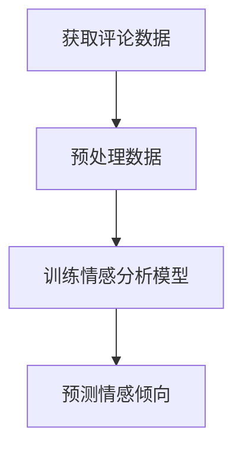

                 


# 彼得林奇如何评估公司的社交媒体影响力转化为销售的能力

## 关键词：社交媒体影响力，销售能力，彼得林奇，投资评估，影响力评估

## 摘要：本文探讨如何将公司的社交媒体影响力转化为销售能力，借鉴彼得林奇的投资评估方法，分析社交媒体影响力评估的核心概念、方法和工具，结合算法原理和系统架构设计，提供实战案例和最佳实践，帮助读者理解如何通过社交媒体提升销售业绩。

---

## 第一部分：社交媒体影响力评估的背景与重要性

### 第1章：社交媒体在现代商业中的作用

#### 1.1 社交媒体的崛起与商业应用

社交媒体已经成为现代商业中不可或缺的一部分。从 Facebook 到 Twitter，从 Instagram 到 LinkedIn，这些平台不仅改变了人们的生活方式，也彻底改变了企业的营销和销售策略。社交媒体的即时性和互动性为企业提供了与目标客户直接沟通的渠道，同时也为企业提供了大量数据来评估自身的影响力和市场表现。

#### 1.2 彼得林奇的投资理念与社交媒体分析的结合

彼得林奇以其独特的企业基本面分析方法闻名，他注重通过研究企业的财务状况、市场地位和竞争优势来评估其投资价值。将这一理念应用于社交媒体分析，我们可以从社交媒体数据中挖掘企业的市场表现和客户反馈，从而更全面地评估企业的销售潜力和市场影响力。

---

## 第二部分：社交媒体影响力评估的核心概念与联系

### 第2章：社交媒体影响力评估的核心要素

#### 2.1 影响力评估的维度分析

社交媒体影响力评估可以从多个维度进行，包括：

1. **粉丝数量与质量**：粉丝数量反映了品牌的关注程度，但更重要的是粉丝的质量，即目标客户的比例和活跃度。
2. **内容互动率**：包括点赞、评论和分享的数量，互动率越高，内容的影响力越大。
3. **用户参与度与忠诚度**：通过分析用户的评论和分享行为，评估用户对品牌的忠诚度和参与度。
4. **品牌提及量与情感分析**：通过分析社交媒体上的品牌提及量和情感倾向，评估品牌在市场上的声誉和口碑。

#### 2.2 核心概念的ER实体关系图

```mermaid
er
actor: 用户
actor: 内容
actor: 互动行为
actor: 品牌
```

---

## 第三部分：社交媒体影响力转化为销售能力的方法

### 第3章：社交媒体影响力评估的核心要素

#### 3.1 从影响力到销售能力的转化

要将社交媒体影响力转化为销售能力，企业需要建立一套完整的评估体系，包括：

1. **数据收集与整理**：通过社交媒体API获取粉丝数据、互动数据和品牌提及数据。
2. **数据分析与评估**：使用统计方法和机器学习算法对数据进行分析，评估品牌的影响力和潜在销售能力。
3. **策略制定与优化**：根据评估结果制定针对性的营销策略，并不断优化策略以提升销售效果。

---

## 第四部分：算法原理与技术实现

### 第4章：算法原理与技术实现

#### 4.1 文本分析与情感分析

文本分析是社交媒体影响力评估的重要组成部分，通过分析用户的评论和反馈，可以了解用户对品牌的情感倾向。常用的情感分析算法包括基于规则的方法和机器学习方法。

#### 4.2 基于机器学习的情感分析模型

使用Python的`nltk`库和`scikit-learn`库，我们可以训练一个情感分析模型。以下是实现流程：



以下是实现代码示例：

```python
from sklearn.feature_extraction.text import TfidfVectorizer
from sklearn.svm import SVC

# 数据预处理
comments = ["这个产品太棒了!", "质量很差", "服务很好"]
vectorizer = TfidfVectorizer()
X = vectorizer.fit_transform(comments)

# 训练模型
model = SVC()
model.fit(X, [1, 0, 1])

# 预测
test_comment = ["这个产品很好"]
test_X = vectorizer.transform(test_comment)
print(model.predict(test_X))
```

---

## 第五部分：系统架构与设计

### 第5章：系统架构与设计

#### 5.1 系统功能设计

- **数据采集模块**：负责从社交媒体平台获取数据。
- **数据处理模块**：对数据进行清洗和预处理。
- **数据分析模块**：使用机器学习算法对数据进行分析。
- **结果展示模块**：将分析结果以可视化的方式呈现。

#### 5.2 系统架构图


---

## 第六部分：项目实战与案例分析

### 第6章：项目实战与案例分析

#### 6.1 实战环境安装

- **Python环境**：需要安装`pandas`, `numpy`, `scikit-learn`, `nltk`等库。
- **社交媒体API**：如Twitter API、Facebook Graph API。

#### 6.2 核心代码实现

以下是情感分析的代码实现：

```python
import pandas as pd
from sklearn.model_selection import train_test_split
from sklearn.metrics import accuracy_score
from sklearn.svm import SVC

# 数据加载
data = pd.read_csv('comments.csv')
X = data['comment']
y = data['label']

# 数据分割
X_train, X_test, y_train, y_test = train_test_split(X, y, test_size=0.2)

# 特征提取
vectorizer = TfidfVectorizer()
X_train_vec = vectorizer.fit_transform(X_train)
X_test_vec = vectorizer.transform(X_test)

# 模型训练
model = SVC()
model.fit(X_train_vec, y_train)

# 模型预测
y_pred = model.predict(X_test_vec)
print("准确率:", accuracy_score(y_test, y_pred))
```

---

## 第七部分：总结与展望

### 第7章：总结与展望

#### 7.1 小结

通过借鉴彼得林奇的投资评估方法，我们能够更系统地分析社交媒体影响力，并将其转化为销售能力。本文详细探讨了社交媒体影响力评估的核心概念、方法和工具，并通过实战案例展示了如何利用这些工具提升企业的销售能力。

#### 7.2 注意事项与最佳实践

- **数据质量**：确保数据的准确性和完整性。
- **模型优化**：定期更新模型，以适应市场变化。
- **用户隐私**：遵守数据隐私法规，保护用户信息。

#### 7.3 拓展阅读

- 《彼得林奇选股术》
- 《数据挖掘与数据分析》
- 《社交媒体营销策略》

---

## 作者：AI天才研究院 & 禅与计算机程序设计艺术

感谢您的阅读！如需进一步探讨，请随时联系。

