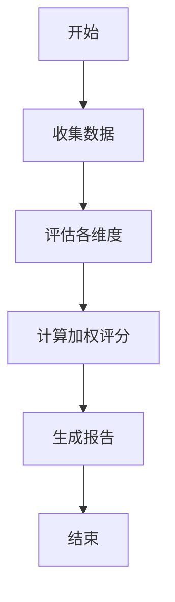
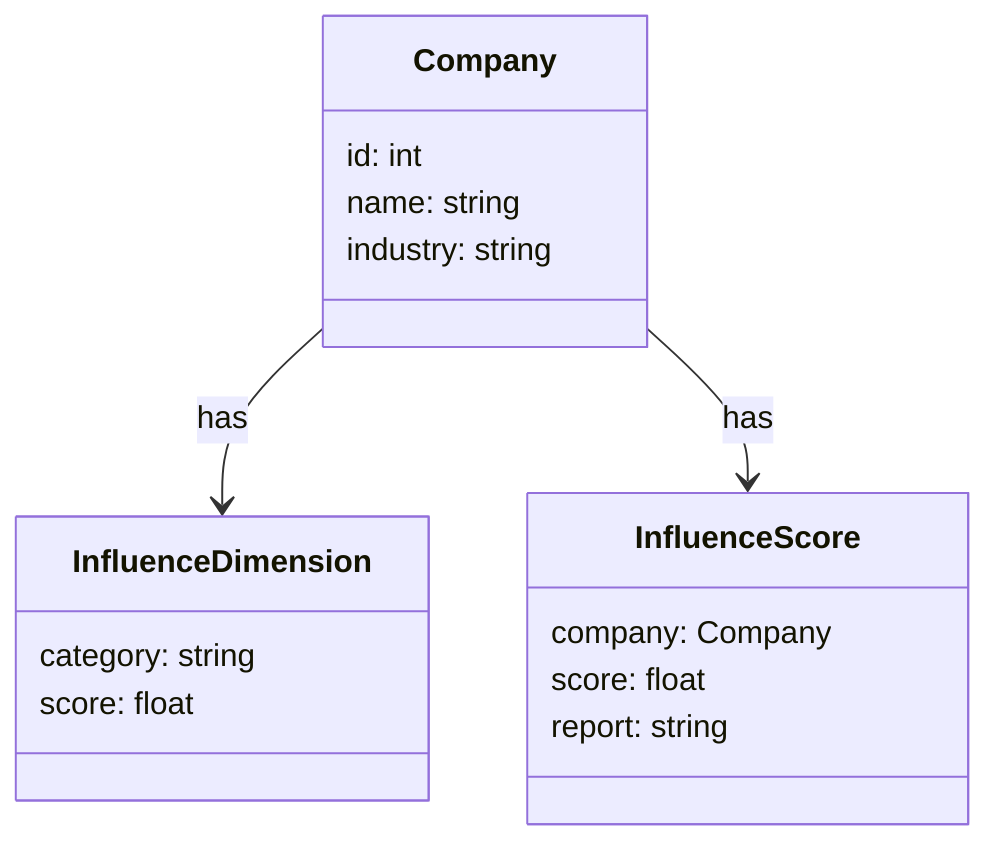
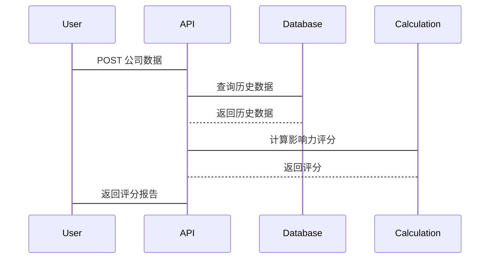

                 


# 彼得林奇如何评估公司的社会影响力

## 关键词：彼得林奇, 公司社会影响力, 评估方法, 影响力评分, 算法模型, 系统设计

## 摘要：本文详细探讨了彼得·林奇评估公司社会影响力的方法，从背景介绍、核心概念、算法原理到系统设计和项目实战，全面解析其评估体系。通过具体案例分析，展示了如何运用数学模型和系统架构来实现对公司社会影响力的量化评估。

---

## 第一部分：背景介绍

### 第1章：社会影响力评估的核心概念

#### 1.1 问题背景
- **公司社会影响力的重要性**：在当前商业环境中，企业不仅要追求经济效益，还要承担社会责任。社会影响力评估帮助企业衡量其对社会的影响，包括正面和负面因素。
- **传统评估方法的局限性**：传统的财务指标如利润和股价无法全面反映企业的社会价值。彼得·林奇提出的方法弥补了这一不足，提供了更全面的评估视角。

#### 1.2 问题描述
- **什么是公司社会影响力**：社会影响力是指企业在经营过程中对社会产生的综合影响，包括员工、客户、环境等多个方面。
- **影响力多维度分析**：包括企业对经济、社会和环境的影响，以及这些影响的正负面效果。
- **影响力与企业价值的关系**：社会影响力高的企业通常具有更强的市场竞争力和品牌忠诚度，从而影响企业价值。

#### 1.3 问题解决
- **彼得·林奇评估方法的核心目标**：通过分析企业的社会影响力，帮助投资者识别高价值企业。
- **方法解决的实际问题**：传统评估忽视了企业对社会的实际影响，而彼得·林奇的方法提供了更全面的视角。
- **边界与外延**：评估范围包括企业内部管理、外部影响和利益相关者关系，但不涉及企业的短期财务表现。

#### 1.4 概念结构与核心要素
- **核心要素组成**：包括企业治理、员工福祉、环境保护、社会责任履行和创新贡献。
- **要素之间的关系**：各要素相互关联，共同影响企业的整体社会影响力。
- **案例分析**：以科技公司为例，分析其在环境保护和员工福祉方面的表现。

---

## 第二部分：核心概念与联系

### 第2章：社会影响力评估的核心原理

#### 2.1 核心原理分析
- **彼得·林奇评估模型的原理**：基于对企业内部治理和外部影响的综合分析，通过定性和定量结合的方法评估社会影响力。
- **模型的数学基础**：利用加权评分法，将各社会影响力维度进行量化评估。

#### 2.2 不同评估方法的对比
- **对比表格展示**：列出传统财务评估与彼得·林奇方法在评估维度、方法和适用场景上的差异。
- **优缺点分析**：传统方法注重财务指标，而彼得·林奇方法更全面，但需要更多数据支持。

#### 2.3 ER实体关系图
```mermaid
erDiagram
    customer[客户] {
        id : int
        name : string
        age : int
    }
    employee[员工] {
        id : int
        name : string
        role : string
    }
    company[公司] {
        id : int
        name : string
        industry : string
    }
    society[社会] {
        id : int
        impact : float
        category : string
    }
    employee --> company : 属于
    customer --> company : 关联
    company --> society : 影响
```

---

## 第三部分：算法原理讲解

### 第3章：彼得·林奇评估算法

#### 3.1 算法流程


#### 3.2 算法实现
```python
def calculate_influence_score(company_data):
    # 权重分配
    weights = {
        'governance': 0.3,
        'employee_welfare': 0.2,
        'environment': 0.2,
        'social_responsibility': 0.15,
        'innovation': 0.15
    }
    score = 0
    for category, weight in weights.items():
        score += company_data[category] * weight
    return score

# 示例数据
company = {
    'governance': 85,
    'employee_welfare': 90,
    'environment': 75,
    'social_responsibility': 80,
    'innovation': 95
}

score = calculate_influence_score(company)
print(f"社会影响力得分为：{score}")
```

#### 3.3 案例分析
以某科技公司为例，计算其社会影响力得分为88分，说明其在创新和员工福祉方面表现优异。

---

## 第四部分：数学模型与公式

### 第4章：影响力评分公式

#### 4.1 公式推导
$$\text{影响力评分} = \sum (\text{维度得分} \times \text{权重})$$

#### 4.2 应用实例
$$\text{公司A影响力评分} = 0.3 \times 85 + 0.2 \times 90 + 0.2 \times 75 + 0.15 \times 80 + 0.15 \times 95 = 88$$

---

## 第五部分：系统分析与架构设计

### 第5章：评估系统设计方案

#### 5.1 项目介绍
- **项目目标**：开发一个基于彼得·林奇方法的社会影响力评估系统，帮助投资者和企业量化社会影响力。
- **系统功能设计**：包括数据收集、评估计算和报告生成模块。
- **领域模型类图**


#### 5.2 系统架构设计
- **架构图**


#### 5.3 接口设计
- **数据接口**：RESTful API，用于接收公司数据和返回评估结果。
- **交互序列图**


---

## 第六部分：项目实战

### 第6章：社会影响力评估系统实现

#### 6.1 环境安装
- **Python环境**：安装Python 3.8及以上版本。
- **依赖安装**：使用pip安装Django或Flask框架，以及pandas和numpy库。

#### 6.2 核心实现代码
```python
from flask import Flask, request, jsonify
import pandas as pd

app = Flask(__name__)

@app.route('/calculate', methods=['POST'])
def calculate():
    data = request.json
    company = data['company']
    dimensions = data['dimensions']
    
    # 加权计算
    weights = {
        'governance': 0.3,
        'employee_welfare': 0.2,
        'environment': 0.2,
        'social_responsibility': 0.15,
        'innovation': 0.15
    }
    score = sum(df[category] * weights[category] for category in dimensions)
    
    return jsonify({'score': score})

if __name__ == '__main__':
    app.run(debug=True)
```

#### 6.3 案例分析
- **输入数据**：某科技公司的维度数据。
- **输出结果**：社会影响力得分为88分，说明公司在创新和员工福祉方面表现优异。

#### 6.4 项目小结
通过项目实战，展示了如何将彼得·林奇的方法应用于实际系统开发，帮助企业量化社会影响力。

---

## 第七部分：最佳实践与总结

### 第7章：总结与建议

#### 7.1 最佳实践
- **数据准确性**：确保输入数据的准确性和完整性。
- **持续更新**：定期更新评估模型和权重，以反映最新的社会关注点。

#### 7.2 小结
彼得·林奇的方法提供了全面评估公司社会影响力的有效工具，结合定量和定性分析，帮助企业识别其对社会的影响。

#### 7.3 注意事项
- **数据隐私**：在收集和处理公司数据时，需遵守相关隐私法规。
- **模型局限性**：评估结果仅供参考，需结合其他因素进行综合判断。

#### 7.4 拓展阅读
推荐阅读彼得·林奇的《投资之道》和相关社会责任评估文献，深入理解其方法和应用。

---

## 作者：AI天才研究院 & 禅与计算机程序设计艺术

