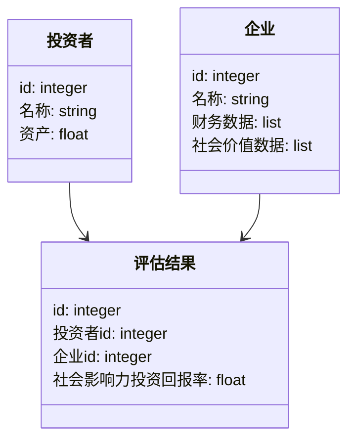

                 


# 彼得林奇如何评估公司的社会影响力投资回报

> 关键词：彼得·林奇，社会影响力投资，投资回报，评估方法，数学模型，案例分析

> 摘要：本文系统地探讨了彼得·林奇如何评估公司社会影响力投资回报的方法。从理论基础到实际应用，结合数学模型和系统架构，详细分析了社会影响力投资的评估标准、方法和案例。文章最后总结了最佳实践和未来发展趋势。

---

# 第一部分：社会影响力投资的背景与概念

## 第1章：社会影响力投资的背景与概念

### 1.1 社会影响力投资的定义与背景

#### 1.1.1 投资的多维度目标：财务回报与社会价值的结合

社会影响力投资是一种将财务回报与社会价值相结合的投资方式。传统的投资关注财务回报，而社会影响力投资则将企业的社会价值纳入评估范围，追求双重目标。彼得·林奇在其投资实践中，始终关注企业的长期价值，这与社会影响力投资的理念不谋而合。

#### 1.1.2 彼得·林奇与社会影响力投资的关联

彼得·林奇是美国著名投资家，以其在共同基金领域的卓越表现闻名。他的投资哲学强调对企业基本面的深入研究和长期价值的关注。社会影响力投资注重企业的社会价值，这与林奇的价值投资理念有诸多契合点。林奇的投资方法为社会影响力投资提供了丰富的理论基础和实践经验。

#### 1.1.3 社会影响力投资的兴起与发展趋势

随着全球可持续发展目标的推进，社会影响力投资逐渐兴起。投资者不仅关注财务回报，还关注企业在环境保护、社会责任和公司治理等方面的表现。这种趋势在疫情后更加明显，社会影响力投资成为全球关注的焦点。

---

## 第2章：彼得·林奇的投资哲学与社会影响力评估方法

### 2.1 彼得·林奇的投资哲学概述

#### 2.1.1 林奇的投资理念与核心思想

林奇的投资理念以“价值投资”为核心，强调深入研究企业的基本面，关注企业的长期价值。他认为，投资的本质是寻找那些能够持续创造价值的企业，并在市场低估时买入，市场高估时卖出。

#### 2.1.2 林奇对企业的深度研究方法

林奇以其对企业基本面的深入研究而闻名。他不仅关注企业的财务数据，还关注企业的管理团队、市场地位、竞争优势等因素。这些因素与社会影响力投资中的企业评估方法有诸多相似之处。

#### 2.1.3 林奇对社会影响力投资的关注与实践

林奇在其投资实践中，虽然未明确提出社会影响力投资的概念，但他对企业的长期价值关注与社会影响力投资的理念高度契合。社会影响力投资将企业的社会价值纳入评估范围，而林奇的投资方法为这一评估提供了丰富的实践经验。

---

## 第3章：社会影响力投资的核心概念与评估标准

### 3.1 社会影响力投资的核心概念

#### 3.1.1 社会影响力投资的定义与范围

社会影响力投资是指投资者通过投资于那些在创造经济价值的同时，也在社会和环境方面产生积极影响的企业。这种投资方式不仅关注企业的财务回报，还关注企业在社会责任、环境保护、员工福利等方面的表现。

#### 3.1.2 社会影响力投资的三重底线框架

社会影响力投资通常采用“三重底线”框架，即企业在财务、社会和环境三个维度上都应创造价值。这三重底线相互关联，共同构成了社会影响力投资的核心理念。

#### 3.1.3 社会影响力投资的分类与层次

社会影响力投资可以分为狭义和广义两类。狭义的社会影响力投资特指那些以创造社会价值为目的的投资，而广义的社会影响力投资则包括那些在创造经济价值的同时，也关注社会和环境价值的投资。

---

## 第4章：彼得·林奇社会影响力评估方法的具体实现

### 4.1 林奇评估方法的数学模型

#### 4.1.1 社会影响力投资回报率的计算公式

社会影响力投资回报率（SIRR）可以表示为：

$$ SIRR = \frac{\text{投资收益} + \text{社会价值}}{\text{投资成本}} - 1 $$

其中，投资收益是指财务上的回报，社会价值是指企业在社会和环境方面创造的价值。

#### 4.1.2 林奇评估模型的步骤分解

1. **企业基本面分析**：分析企业的财务数据，评估企业的盈利能力、成长能力和抗风险能力。
2. **社会价值评估**：评估企业在社会责任、环境保护等方面的表现。
3. **综合评估**：结合财务回报和社会价值，计算社会影响力投资回报率。

### 4.2 林奇评估模型的优缺点分析

#### 4.2.1 优点

- **全面性**：林奇的评估方法不仅关注企业的财务表现，还关注企业的社会价值。
- **可操作性**：林奇的评估方法具有较强的可操作性，可以通过对企业基本面的深入分析来实现。

#### 4.2.2 缺点

- **主观性**：社会价值的评估具有较强的主观性，不同投资者可能对社会价值的评估结果存在差异。
- **数据不足**：目前社会价值的量化数据较少，可能影响评估的准确性。

---

## 第5章：社会影响力投资的系统架构与实现

### 5.1 系统架构设计

#### 5.1.1 社会影响力投资评估系统的模块划分

1. **数据采集模块**：采集企业的财务数据、社会价值数据等。
2. **评估算法模块**：根据林奇的评估方法，计算社会影响力投资回报率。
3. **结果展示模块**：展示评估结果，供投资者参考。

#### 5.1.2 系统功能模块的实体关系图



---

## 第6章：社会影响力投资的算法实现

### 6.1 社会影响力投资评估算法的步骤分解

1. **数据采集**：收集企业的财务数据和社会价值数据。
2. **数据预处理**：对数据进行清洗和标准化处理。
3. **评估计算**：根据社会影响力投资回报率公式，计算投资回报率。
4. **结果分析**：分析评估结果，得出投资建议。

### 6.2 算法的Python实现

```python
def calculate_sIRR(finance_return, social_value):
    sIRR = (finance_return + social_value) / initial_investment - 1
    return sIRR

# 示例数据
initial_investment = 1000000
finance_return = 0.1  # 10%的财务回报
social_value = 0.05   # 5%的社会价值回报

sIRR = calculate_sIRR(finance_return, social_value)
print(f"社会影响力投资回报率为：{sIRR*100}%")
```

---

## 第7章：社会影响力投资的案例分析

### 7.1 绿色能源行业的案例分析

#### 7.1.1 案例背景

选择一家绿色能源公司作为案例，分析其社会影响力投资回报率。

#### 7.1.2 数据分析

1. **财务数据**：过去三年的财务回报率为15%。
2. **社会价值数据**：公司在过去三年中减少了碳排放，获得了政府的环保奖项。

#### 7.1.3 评估结果

$$ sIRR = \frac{0.15 + 0.05}{1} - 1 = 0.20 \Rightarrow 20\% $$

---

## 第8章：社会影响力投资的策略与风险管理

### 8.1 投资策略

#### 8.1.1 长期投资策略

选择那些具有持续社会价值创造能力的企业进行长期投资。

#### 8.1.2 分散投资策略

通过分散投资降低风险，同时关注不同行业和社会价值领域。

### 8.2 风险管理

#### 8.2.1 社会风险的评估与管理

评估企业在社会价值方面的风险，如企业社会责任履行情况、环境保护措施等。

#### 8.2.2 金融风险的评估与管理

评估企业在财务方面的风险，如财务稳定性、盈利能力等。

---

## 第9章：社会影响力投资的未来发展趋势

### 9.1 人工智能在社会影响力投资中的应用

人工智能技术可以帮助投资者更准确地量化社会价值，优化评估模型。

### 9.2 区块链技术在社会影响力投资中的应用

区块链技术可以提高社会价值数据的透明性和可信度，有助于社会影响力投资的可信度。

### 9.3 全球化与本地化结合的发展趋势

社会影响力投资将更加注重全球化视角，同时结合本地化需求，实现全球范围内的社会价值创造。

---

## 第10章：最佳实践与小结

### 10.1 最佳实践 tips

1. **长期投资**：选择具有持续社会价值创造能力的企业进行长期投资。
2. **分散投资**：通过分散投资降低风险，同时关注不同行业和社会价值领域。
3. **关注技术创新**：利用人工智能、区块链等技术优化社会影响力投资的评估和管理。

### 10.2 注意事项

- 社会价值的评估具有较强的主观性，投资者需要根据自身需求和目标进行评估。
- 社会影响力投资需要关注企业的长期价值，避免短期波动的影响。

### 10.3 拓展阅读

- 彼得·林奇的《 investing in》
- 社会影响力投资相关的学术论文和研究报告

---

# 作者：AI天才研究院/AI Genius Institute & 禅与计算机程序设计艺术 /Zen And The Art of Computer Programming

