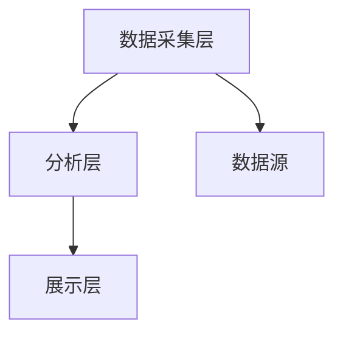
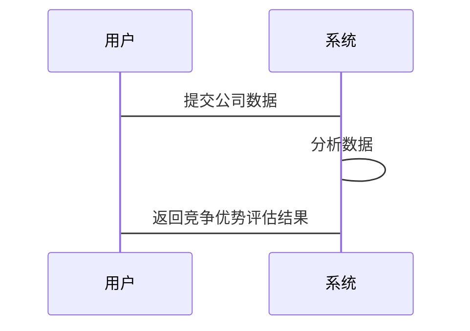

                 


# 彼得林奇如何评估公司的竞争优势

> 关键词：彼得林奇，竞争优势，投资分析，财务指标，市场定位，护城河

> 摘要：本文深入探讨了彼得林奇如何评估公司的竞争优势。通过分析其投资哲学、竞争优势的定义与评估维度、数学模型与公式、系统架构设计、项目实战和最佳实践，帮助读者全面理解并应用这些策略进行投资决策。

---

## 第一章: 彼得林奇的投资哲学与方法论

### 1.1 彼得林奇的投资理念概述

彼得林奇是全球著名投资专家，以其独特的投资哲学闻名。他的理念强调长期投资、深入研究和价值发现。以下是其核心观点：

- **长期投资**：彼得林奇主张长期持有优质股票，而非频繁交易。他认为市场波动是投资的机会，而非障碍。
- **深入研究**：他强调对公司基本面的深入分析，包括财务状况、行业地位和管理团队等。
- **价值发现**：寻找被市场低估的公司，挖掘其潜在价值。

### 1.2 竞争优势的定义与重要性

竞争优势是公司长期成功的关键因素。彼得林奇认为，竞争优势包括产品力、运营效率和财务状况等方面。这些因素共同决定了公司在市场中的地位和盈利能力。

### 1.3 投资分析的核心方法论

彼得林奇的方法论包括以下几个步骤：

1. **行业分析**：选择具有增长潜力的行业。
2. **公司分析**：评估公司的财务状况、管理团队和市场地位。
3. **价值评估**：计算公司的内在价值，判断其是否被低估。
4. **风险控制**：分散投资，降低风险。

---

## 第二章: 竞争优势的评估维度

### 2.1 产品力与市场定位

#### 2.1.1 产品力的核心要素

- **产品创新**：公司是否能够持续创新，推出新产品。
- **产品质量**：产品的质量和可靠性是否优于竞争对手。
- **品牌影响力**：品牌是否具有强大的市场影响力。

#### 2.1.2 市场定位与竞争优势的关系

市场定位直接影响公司的市场份额和盈利能力。彼得林奇认为，正确的市场定位是竞争优势的核心。

#### 2.1.3 产品创新与竞争优势的动态平衡

彼得林奇强调，产品创新是维持竞争优势的关键。公司需要在创新与成本控制之间找到平衡点。

### 2.2 运营效率与成本控制

#### 2.2.1 运营效率的衡量指标

- **库存周转率**：库存周转次数越高，运营效率越高。
- **生产周期**：生产周期越短，效率越高。

#### 2.2.2 成本控制对竞争优势的影响

成本控制是公司盈利能力的重要因素。彼得林奇认为，有效的成本控制可以提高利润率。

#### 2.2.3 行业基准与成本优化策略

公司应与行业基准进行比较，并制定成本优化策略，如流程优化和技术升级。

### 2.3 财务状况与盈利能力

#### 2.3.1 财务指标对竞争优势的评估

- **净利润率**：净利润率越高，盈利能力越强。
- **资产负债率**：资产负债率越低，财务风险越小。

#### 2.3.2 净资产收益率（ROE）与资产回报率（ROA）

ROE和ROA是衡量公司盈利能力的重要指标。彼得林奇认为，ROE高的公司具有更强的盈利能力。

#### 2.3.3 现金流分析与企业健康度评估

现金流是公司财务健康的重要指标。彼得林奇强调，正向现金流是公司持续发展的基础。

---

## 第三章: 竞争优势的数学模型与公式

### 3.1 常用财务指标公式

#### 净资产收益率（ROE）
$$ROE = \frac{\text{净利润}}{\text{净资产}}$$

#### 资产回报率（ROA）
$$ROA = \frac{\text{净利润}}{\text{总资产}}$$

#### 每股收益（EPS）
$$EPS = \frac{\text{净利润}}{\text{流通股数}}$$

### 3.2 竞争优势评估的综合模型

#### 竞争优势指数（CAI）
$$CAI = \alpha \times ROE + \beta \times ROA + \gamma \times EPS$$
其中，$\alpha$、$\beta$和$\gamma$是权重系数。

---

## 第四章: 竞争优势的系统分析与架构设计

### 4.1 系统功能设计

- **领域模型**：公司竞争优势的评估涉及多个领域，包括财务、运营和市场等。
- **系统架构**：采用分层架构，包括数据采集层、分析层和展示层。

### 4.2 系统架构设计



### 4.3 系统交互设计



---

## 第五章: 项目实战与案例分析

### 5.1 环境安装

- **工具安装**：安装Python和相关库（如pandas、numpy）。
- **数据获取**：收集目标公司的财务数据。

### 5.2 核心实现源代码

```python
import pandas as pd

def calculate_roe(net_income, equity):
    return net_income / equity

data = pd.read_csv('company_data.csv')
data['ROE'] = data.apply(lambda x: calculate_roe(x['净利润'], x['净资产']), axis=1)
```

### 5.3 代码应用解读与分析

- **代码功能**：计算公司ROE，评估其盈利能力。
- **结果分析**：ROE高的公司具有更强的盈利能力。

### 5.4 案例分析

分析一家公司，计算其ROE、ROA等指标，评估其竞争优势。

---

## 第六章: 最佳实践与小结

### 6.1 投资策略建议

- **长期投资**：选择具有持续竞争优势的公司。
- **分散投资**：降低投资风险。
- **持续学习**：关注市场动态和公司变化。

### 6.2 小结

彼得林奇的评估方法提供了系统化的竞争优势分析框架，帮助投资者做出明智决策。

---

## 作者

作者：AI天才研究院/AI Genius Institute & 禅与计算机程序设计艺术 /Zen And The Art of Computer Programming

