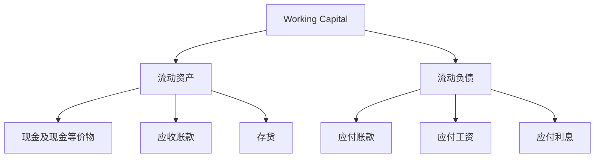
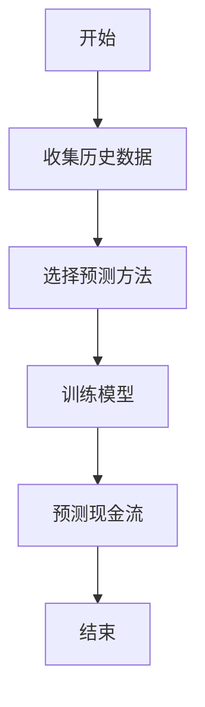

                 


# 彼得林奇对公司working capital效率的评估

> 关键词：Working Capital、彼得林奇、财务指标、企业评估、投资策略、现金流、风险管理

> 摘要：本文详细分析了彼得·林奇对公司working capital效率的评估方法，结合其独特的投资理念，深入探讨了working capital的核心概念、评估模型和实际应用。通过系统化的分析和案例研究，本文为读者提供了从理论到实践的全面指导，帮助投资者和企业管理者更好地理解和优化working capital效率。

---

## 目录大纲

# 第一部分: 背景介绍与核心概念

## 第1章: Working Capital 的定义与重要性

### 1.1 Working Capital 的定义
- 1.1.1 Working Capital 的基本概念
- 1.1.2 Working Capital 在企业运营中的作用
- 1.1.3 彼得·林奇对Working Capital 的关注点

### 1.2 彼得·林奇的投资策略
- 1.2.1 彼得·林奇的投资风格概述
- 1.2.2 彼得·林奇对财务指标的重视
- 1.2.3 Working Capital 在林奇投资决策中的地位

### 1.3 本书的核心目标
- 1.3.1 分析Working Capital 效率的评估方法
- 1.3.2 结合彼得·林奇的投资理念
- 1.3.3 提供实际应用的指导

---

# 第二部分: Working Capital 效率的核心概念与联系

## 第2章: Working Capital 的构成与属性

### 2.1 Working Capital 的构成要素
- 2.1.1 流动资产
  - 现金及现金等价物
  - 应收账款
  - 存货
  - 其他流动资产

- 2.1.2 流动负债
  - 应付账款
  - 应付工资
  - 应付利息
  - 其他应付款

### 2.2 Working Capital 的属性特征对比
- 2.2.1 流动性对比
- 2.2.2 周转速度对比
- 2.2.3 风险程度对比
- 2.2.4 对企业价值的影响对比

### 2.3 ER 实体关系图


---

# 第三部分: Working Capital 效率评估的算法原理

## 第3章: Working Capital 效率评估模型

### 3.1 现金流预测模型
- 3.1.1 现金流预测的定义与作用
- 3.1.2 现金流预测的算法流程


### 3.2 现金流预测的数学模型
- 3.2.1 线性回归模型
  $$ y = \beta_0 + \beta_1x + \epsilon $$
- 3.2.2 时间序列模型
  $$ ARIMA(p, d, q) $$

### 3.3 算法实现与代码示例
- 3.3.1 现金流预测的Python代码实现
```python
import pandas as pd
from sklearn.linear_model import LinearRegression

# 示例数据加载
data = pd.read_csv('financial_data.csv')
X = data[['revenue', 'expenses']]
y = data['cash_flow']

# 模型训练
model = LinearRegression()
model.fit(X, y)

# 预测现金流
predicted_flow = model.predict(X)
```

---

# 第四部分: 系统分析与架构设计

## 第4章: 系统功能设计

### 4.1 问题场景介绍
- 企业现金流管理的挑战
- 现金流预测系统的必要性

### 4.2 系统功能设计
- 4.2.1 数据采集模块
- 4.2.2 数据分析模块
- 4.2.3 预测结果展示模块

### 4.3 系统架构设计


### 4.4 系统接口设计
- 数据输入接口
- 预测结果输出接口

### 4.5 系统交互设计


---

# 第五部分: 项目实战

## 第5章: 项目实现与案例分析

### 5.1 环境安装
- 安装必要的Python库（pandas, scikit-learn）

### 5.2 核心实现代码
```python
import pandas as pd
from sklearn.linear_model import LinearRegression
from sklearn.metrics import mean_squared_error

# 数据加载
data = pd.read_csv('financial_data.csv')

# 特征和目标变量
X = data[['revenue', 'expenses']]
y = data['cash_flow']

# 划分训练集和测试集
from sklearn.model_selection import train_test_split
X_train, X_test, y_train, y_test = train_test_split(X, y, test_size=0.2, random_state=42)

# 模型训练
model = LinearRegression()
model.fit(X_train, y_train)

# 预测和评估
predicted_flow = model.predict(X_test)
mse = mean_squared_error(y_test, predicted_flow)
print(f'Mean Squared Error: {mse}')
```

### 5.3 案例分析与解读
- 通过实际案例分析现金流预测模型的准确性
- 对比不同算法的效果

---

# 第六部分: 最佳实践与总结

## 第6章: 小结与注意事项

### 6.1 小结
- 现金流预测模型的核心要点
- 彼得·林奇投资理念的启示

### 6.2 注意事项
- 数据质量的重要性
- 模型选择的合理性
- 结果的可解释性

### 6.3 拓展阅读
- 推荐相关书籍和文献

---

# 作者：AI天才研究院 & 禅与计算机程序设计艺术

