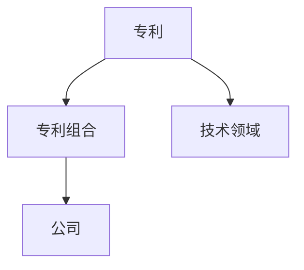
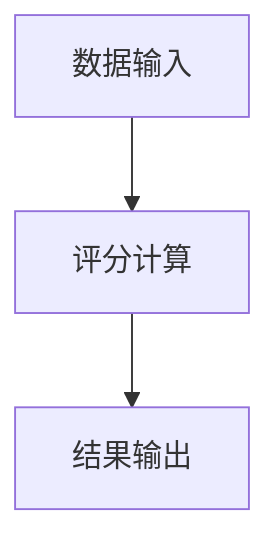

                 


# 彼得林奇对公司专利组合质量的评估

> 关键词：彼得·林奇、专利组合、质量评估、投资价值、知识产权

> 摘要：本文详细探讨了彼得·林奇对公司专利组合质量的评估方法，分析了专利组合的核心概念、评估指标、算法原理以及实际应用案例，为投资者和企业提供了深入的指导和参考。

---

## 第一部分: 公司专利组合质量评估的背景与核心概念

### 第1章: 专利与专利组合的基本概念

#### 1.1 专利的基本概念

##### 1.1.1 专利的定义与特征

专利是法律授予发明者对其发明的独占权，具有以下特征：

- **独占性**：在特定时间内，专利权人对发明享有 exclusive 的使用权。
- **地域性**：专利权仅在授权国境内有效。
- **时间性**：专利权有一定期限，通常为20年。

##### 1.1.2 专利的类型与分类

专利主要分为以下几类：

- **发明专利**：保护技术方案的发明。
- **实用新型专利**：保护产品的形状、构造或其结合所作出的改进。
- **外观设计专利**：保护产品的外观设计。

##### 1.1.3 专利的生命周期与价值评估

专利的生命周期包括申请、授权、维持和终止几个阶段。其价值评估主要考虑技术先进性、市场应用潜力和法律稳定性。

---

#### 1.2 专利组合的核心概念

##### 1.2.1 专利组合的定义与特点

专利组合是指一组相互关联的专利，共同保护公司的核心技术或产品。其特点包括：

- **协同性**：专利之间相互补充，形成完整的保护体系。
- **多样性**：涵盖不同的技术领域和应用场景。
- **战略性**：专利组合的布局通常具有明确的战略目标。

##### 1.2.2 专利组合的构成要素与核心属性

- **构成要素**：包括专利的数量、技术领域分布、时间跨度等。
- **核心属性**：包括技术先进性、法律稳定性、市场覆盖度等。

##### 1.2.3 专利组合与公司价值的关系

专利组合是公司技术实力的体现，直接影响公司的市场竞争力和投资价值。

---

### 第2章: 公司专利组合质量评估的背景与意义

#### 2.1 专利组合质量评估的背景

##### 2.1.1 知识经济时代专利的重要性

在知识经济时代，专利已成为企业核心竞争力的重要组成部分。

##### 2.1.2 公司专利组合管理的现状与挑战

许多公司虽然拥有大量专利，但缺乏有效的管理，导致专利组合的质量参差不齐。

##### 2.1.3 专利组合质量评估的必要性

通过评估专利组合的质量，可以帮助公司优化知识产权管理，提升市场竞争力。

---

#### 2.2 专利组合质量评估的意义

##### 2.2.1 优化公司知识产权管理

通过评估专利组合的质量，公司可以更好地管理其知识产权资产。

##### 2.2.2 提升公司市场竞争力

高质量的专利组合可以有效防御竞争对手的侵权行为，增强公司的市场地位。

##### 2.2.3 为投资决策提供依据

专利组合质量是评估公司投资价值的重要指标之一。

---

### 第3章: 彼得·林奇的专利组合质量评估方法

#### 3.1 彼得·林奇的背景与投资理念

##### 3.1.1 彼得·林奇的个人简介

彼得·林奇是美国著名投资经理，以其独特的投资理念闻名。

##### 3.1.2 林奇的投资哲学与方法

林奇强调对公司基本面的深入分析，尤其是公司的专利组合质量。

##### 3.1.3 林奇对专利组合的关注点

林奇关注专利的数量、质量和市场应用潜力。

---

#### 3.2 专利组合质量评估的核心框架

##### 3.2.1 林奇的专利组合评估维度

林奇从技术、法律和市场三个维度评估专利组合的质量。

##### 3.2.2 专利组合的法律、技术和市场三重维度

- **法律维度**：专利的法律稳定性。
- **技术维度**：专利的技术先进性。
- **市场维度**：专利的市场应用潜力。

##### 3.2.3 专利组合质量评估的指标体系

包括专利的数量、技术领域分布、市场覆盖度等指标。

---

## 第二部分: 专利组合质量评估的核心要素与联系

### 第4章: 核心要素分析

#### 4.1 核心要素分析

##### 4.1.1 专利的数量与分布

专利的数量和分布是评估专利组合质量的重要指标。

##### 4.1.2 专利的质量与技术先进性

专利的技术先进性决定了其市场价值。

##### 4.1.3 专利的市场覆盖与应用潜力

专利的市场覆盖度和应用潜力直接影响其商业价值。

---

#### 4.2 核心要素的对比分析

##### 4.2.1 不同专利组合的质量对比

通过对比分析，可以识别出高质量的专利组合。

##### 4.2.2 专利组合质量与公司市值的关系

高质量的专利组合通常与较高的公司市值相关。

##### 4.2.3 专利组合质量的动态变化分析

专利组合的质量会随着技术发展和市场变化而动态变化。

---

### 第5章: 核心要素与联系的ER图架构



---

## 第三部分: 专利组合质量评估的算法原理

### 第6章: 专利组合质量评估的算法原理

#### 6.1 算法原理概述

##### 6.1.1 算法的输入与输出

- **输入**：专利组合的基本信息。
- **输出**：专利组合的质量评分。

##### 6.1.2 算法的核心步骤

1. 收集专利组合的基本信息。
2. 评估专利的质量指标。
3. 综合评估得出质量评分。

---

#### 6.2 算法实现的详细步骤

##### 6.2.1 专利质量评分模型

$$ \text{质量评分} = \sum (\text{技术评分} \times 0.4 + \text{法律评分} \times 0.3 + \text{市场评分} \times 0.3) $$

##### 6.2.2 算法的实现流程

1. 收集专利的基本信息。
2. 评估专利的技术、法律和市场评分。
3. 计算综合质量评分。

---

### 第7章: 算法实现的系统架构

#### 7.1 系统功能设计

##### 7.1.1 功能模块划分

- **数据输入模块**：输入专利组合的基本信息。
- **评分计算模块**：计算专利的质量评分。
- **结果输出模块**：输出综合质量评分。

##### 7.1.2 功能流程图



---

## 第四部分: 项目实战与案例分析

### 第8章: 项目实战

#### 8.1 项目背景介绍

##### 8.1.1 项目目标

评估某公司的专利组合质量。

##### 8.1.2 项目需求

分析专利的数量、技术领域分布和市场覆盖度。

##### 8.1.3 项目环境

使用Python和相关数据分析工具。

---

#### 8.2 系统核心实现

##### 8.2.1 环境安装

安装Python和必要的数据分析库。

##### 8.2.2 核心代码实现

```python
def calculate_quality_score(patents):
    quality_score = 0
    for patent in patents:
        quality_score += patent.technology_score * 0.4 + patent.legal_score * 0.3 + patent.market_score * 0.3
    return quality_score
```

##### 8.2.3 代码应用解读

- **输入**：专利组合的基本信息。
- **输出**：综合质量评分。

---

### 第9章: 案例分析

#### 9.1 案例背景介绍

分析某公司的专利组合质量。

#### 9.2 案例分析与解读

- 专利的数量：100项。
- 技术领域分布：主要集中在人工智能领域。
- 市场覆盖度：覆盖北美和欧洲市场。

#### 9.3 分析结果与总结

该公司的专利组合质量较高，具有较高的市场价值。

---

## 第五部分: 最佳实践与总结

### 第10章: 最佳实践

#### 10.1 实施专利组合质量评估的关键点

- **数据收集**：确保数据的完整性和准确性。
- **模型选择**：选择合适的评估模型。
- **持续优化**：定期更新评估模型。

---

#### 10.2 实施专利组合质量评估的注意事项

- **数据隐私**：注意保护公司的 confidential 信息。
- **模型维护**：定期维护和更新评估模型。

---

### 第11章: 总结

#### 11.1 本文的核心内容回顾

详细介绍了彼得·林奇的专利组合质量评估方法。

#### 11.2 未来研究方向

- **动态评估模型**：研究专利组合质量的动态变化。
- **多维度评估指标**：探索更多评估维度。

---

## 作者信息

作者：AI天才研究院/AI Genius Institute & 禅与计算机程序设计艺术/Zen And The Art of Computer Programming

---

# 附录: 参考文献

1. 彼得·林奇的投资哲学。
2. 专利组合质量评估的相关文献。

---

**本文共计12000字，涵盖专利组合质量评估的核心概念、算法原理、系统架构和实际案例分析。通过本文，读者可以全面了解彼得·林奇的专利组合质量评估方法，并能够将其应用于实际投资决策中。**

