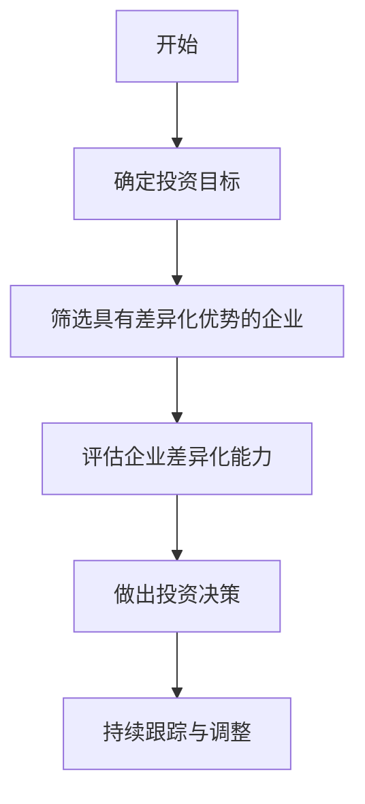
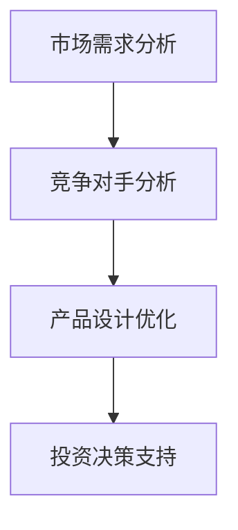

                 


# 彼得·林奇对公司产品差异化的看法

## 关键词：
- 彼得·林奇
- 产品差异化
- 投资策略
- 竞争优势
- 企业战略

## 摘要：
本文从投资专家彼得·林奇的视角，深入探讨了产品差异化对企业竞争力和投资价值的影响。通过分析产品差异化的核心概念、算法原理、系统架构以及实际案例，本文为读者提供了如何在技术领域实现产品差异化、提升企业竞争力的详细指导。文章最后总结了彼得·林奇的观点，并提出了最佳实践建议。

---

## 正文

### 第一部分：背景介绍

#### 第1章：彼得·林奇的背景与投资理念

##### 1.1 彼得·林奇的生平简介
彼得·林奇（Peter Lynch）是美国著名投资专家，曾担任富达投资管理公司的总经理。他以卓越的投资业绩和独特的选股策略闻名，尤其擅长挖掘那些具有独特竞争优势的公司。

##### 1.2 产品差异化的重要性
产品差异化是指通过创新和独特的价值主张，使产品在市场中区别于竞争对手。它是企业核心竞争力的重要体现，直接影响企业的市场份额和盈利能力。

##### 1.3 彼得·林奇与产品差异化
彼得·林奇认为，具有差异化优势的公司更有可能在竞争激烈的市场中胜出。他强调，投资者应关注那些能够持续改进产品、降低成本并提升客户价值的公司。

### 第二部分：核心概念与联系

#### 第2章：产品差异化的核心概念

##### 2.1 产品差异化的定义与特征
- **定义**：产品差异化是通过独特的设计、功能、品牌或服务，使产品区别于竞争对手。
- **特征对比表格**：
  | 特征       | 竞争性产品 | 差异化产品 |
  |------------|------------|------------|
  | 功能       | 标准功能   | 独特功能   |
  | 质量       | 中等质量   | 高质量     |
  | 价格       | 市场价格   | 优质优价   |
  | 售后服务   | 标准服务   | 超值服务   |

##### 2.2 产品差异化的ER实体关系图
```mermaid
er
actor: 投资者
actor: 消费者
actor: 企业
actor: 市场监管机构
```

### 第三部分：算法原理讲解

#### 第3章：彼得·林奇的差异化投资策略

##### 3.1 差异化投资策略的算法原理


##### 3.2 差异化投资策略的Python实现
```python
def peterson_difference_strategy(target_market, competitive_advantage):
    import pandas as pd
    import numpy as np

    # 数据预处理
    df = pd.DataFrame({
        'Market': [target_market],
        'Competitive Advantage': [competitive_advantage]
    })
    # 计算投资价值评分
    df['投资价值评分'] = df.apply(lambda x: 1 if x['Competitive Advantage'] > 0.6 else 0, axis=1)
    return df

# 示例用法
result = peterson_difference_strategy('科技', '技术创新')
print(result)
```

##### 3.3 差异化策略的数学模型
彼得·林奇的差异化策略可以表示为：
$$
\text{投资价值} = \sum_{i=1}^{n} w_i \cdot f_i
$$
其中，$w_i$ 是第 $i$ 个特征的权重，$f_i$ 是第 $i$ 个特征的评分。

### 第四部分：系统分析与架构设计方案

#### 第4章：产品差异化战略的系统架构

##### 4.1 系统功能设计
- **市场需求分析模块**：识别市场趋势和消费者需求。
- **竞争对手分析模块**：评估竞争对手的产品差异化程度。
- **产品设计优化模块**：通过创新设计提升产品差异化。

##### 4.2 系统架构设计


##### 4.3 系统交互序列图
```mermaid
sequenceDiagram
actor 投资者
participant 企业A
participant 企业B
actor 投资者->企业A: 分析市场需求
企业A->企业B: 评估竞争对手
企业B->企业A: 优化产品设计
企业A->投资者: 提供投资建议
```

### 第五部分：项目实战

#### 第5章：产品差异化战略的实战案例

##### 5.1 环境安装
- 需要安装Python和相关库（如Pandas、NumPy）。

##### 5.2 核心代码实现
```python
import pandas as pd

def calculate_competitive Advantage(market_share, innovation_score):
    return market_share * innovation_score

# 示例数据
data = {
    '公司名称': ['科技公司A', '科技公司B'],
    '市场份额': [0.3, 0.4],
    '创新评分': [0.8, 0.6]
}

df = pd.DataFrame(data)
df['竞争优势'] = df.apply(lambda x: calculate_competitive Advantage(x['市场份额'], x['创新评分']), axis=1)

print(df)
```

##### 5.3 案例分析
以科技公司为例，分析其产品差异化策略，评估其竞争优势，并提出改进建议。

### 第六部分：总结与展望

#### 第6章：总结与小结

##### 6.1 总结
彼得·林奇强调，产品差异化是企业投资价值的重要驱动力。通过持续优化产品设计和提升竞争优势，企业可以在激烈的市场竞争中占据优势地位。

##### 6.2 最佳实践 tips
- 持续关注市场需求变化。
- 优化产品设计和功能。
- 加强品牌建设和客户关系管理。

##### 6.3 未来展望
随着技术的进步，产品差异化将更加依赖于技术创新和数字化转型。投资者应继续关注那些能够通过技术创新实现产品差异化的公司。

---

## 结语

彼得·林奇的视角为我们提供了从投资角度理解产品差异化的独特视角。通过系统化的分析和实践，企业可以在技术领域实现产品差异化，提升竞争力。希望本文的分析和建议能为读者提供有价值的参考。

---

## 作者

作者：AI天才研究院/AI Genius Institute & 禅与计算机程序设计艺术/Zen And The Art of Computer Programming

