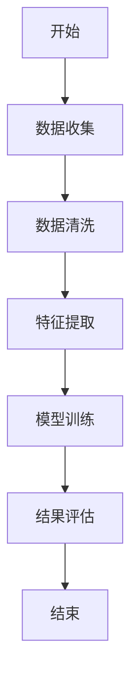
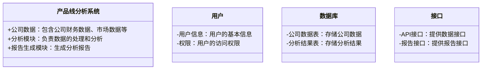
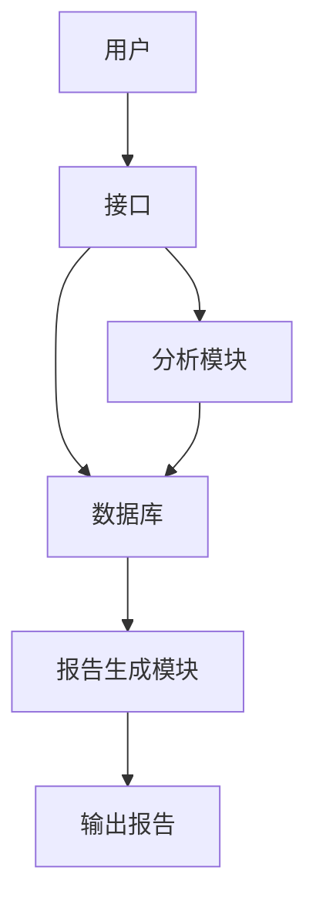
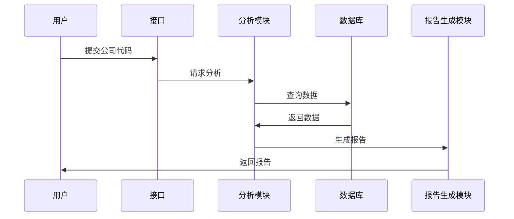

                 


# 彼得林奇对公司产品线的分析

## 关键词：彼得·林奇、产品线分析、投资理念、分析框架、系统架构

## 摘要：本文深入探讨了彼得·林奇在产品线分析领域的独特见解，详细介绍了其分析方法、算法原理、系统架构及实际应用。通过结合理论与实践，展示了如何运用林奇分析法进行产品线评估，帮助投资者做出明智决策。

---

## 第一部分：彼得·林奇与产品线分析概述

### 第1章：彼得·林奇的介绍

#### 1.1 彼得·林奇的生平简介
彼得·林奇（Peter Lynch）是全球最著名的投资者之一，曾任富达投资集团麦哲伦基金的经理。他以卓越的投资成绩闻名，尤其擅长分析公司的基本面，寻找被市场低估的投资机会。

#### 1.2 彼得·林奇的投资理念
林奇强调长期投资和价值发现，认为市场短期波动不应影响长期投资决策。他主张深入分析公司的财务数据、行业地位和竞争优势，以识别具有成长潜力的企业。

#### 1.3 彼得·林奇与产品线分析的关联
林奇分析法的核心在于评估公司的产品线，通过分析产品线的市场表现、竞争地位和盈利能力，判断公司是否具备长期增长潜力。

---

### 第2章：产品线分析的定义与重要性

#### 2.1 产品线的定义
产品线是指一家公司所提供的相关产品或服务的集合。产品线的健康状况直接影响公司的整体表现。

#### 2.2 产品线分析的必要性
通过分析产品线，投资者可以评估公司的市场地位、竞争优势和未来增长潜力。产品线分析是全面评估公司价值的重要组成部分。

#### 2.3 产品线分析的核心目标
产品线分析的核心目标是识别公司产品线的优势和劣势，评估其市场竞争力，并预测其未来表现。

---

## 第二部分：产品线分析的核心概念与联系

### 第3章：核心概念原理

#### 3.1 产品线分析的理论基础
产品线分析基于基本面分析，强调通过财务数据和市场数据评估公司的产品线价值。

#### 3.2 林奇分析法的数学模型
林奇分析法通过一系列指标评估产品线的健康状况，包括销售额增长率、利润率、市场份额等。

#### 3.3 产品线分析的关键指标
- 销售额增长率：衡量产品线的市场表现。
- 利润率：评估产品线的盈利能力。
- 市场份额：反映产品线的市场地位。

---

### 第4章：核心概念属性对比表格

| 概念       | 描述                         |
|------------|------------------------------|
| 产品线     | 公司相关产品的集合           |
| 分析框架   | 分析产品线的方法与工具         |
| 核心指标   | 产品线的关键评价指标           |
| 投资理念   | 林奇分析法的核心投资逻辑       |

---

## 第三部分：产品线分析的算法原理

### 第5章：算法原理概述

#### 5.1 林奇分析法的基本流程
1. 数据收集：获取公司的财务数据、市场数据等。
2. 数据清洗：处理数据，去除异常值。
3. 特征提取：提取关键指标，如销售额增长率、利润率等。
4. 模型训练：基于历史数据建立预测模型。
5. 结果评估：验证模型的准确性。

#### 5.2 数据预处理与特征提取
数据预处理包括缺失值填充和标准化处理。特征提取则聚焦于与产品线相关的财务和市场指标。

#### 5.3 模型训练与评估
采用回归分析或分类算法训练模型，并通过交叉验证评估模型性能。

---

### 第6章：算法流程图



---

## 第四部分：系统分析与架构设计方案

### 第7章：系统分析与架构设计方案

#### 7.1 问题场景介绍
投资者需要一个系统化的工具来分析公司的产品线，以做出投资决策。

#### 7.2 项目介绍
本项目旨在开发一个基于林奇分析法的产品线分析系统，帮助投资者评估公司产品线的价值。

#### 7.3 系统功能设计（领域模型Mermaid类图）


#### 7.4 系统架构设计（Mermaid架构图）


#### 7.5 系统接口设计
- 输入接口：接收公司数据和用户请求。
- 输出接口：返回分析结果和报告。

#### 7.6 系统交互（Mermaid序列图）


---

## 第五部分：项目实战

### 第8章：项目实战

#### 8.1 环境安装
需要安装Python、Pandas、Matplotlib等库。

#### 8.2 系统核心实现源代码

```python
import pandas as pd
import numpy as np
from sklearn.linear_model import LinearRegression

# 数据加载
data = pd.read_csv('company_data.csv')

# 数据清洗
data.dropna(inplace=True)

# 特征提取
features = data[['销售额增长率', '利润率', '市场份额']]
target = data['产品线价值']

# 模型训练
model = LinearRegression()
model.fit(features, target)

# 结果评估
predictions = model.predict(features)
print('预测值:', predictions)
```

#### 8.3 代码应用解读与分析
上述代码展示了如何使用线性回归模型进行产品线价值预测。首先加载数据，然后进行数据清洗和特征提取，最后训练模型并生成预测结果。

#### 8.4 实际案例分析
以某公司为例，分析其产品线的价值，展示如何通过代码实现分析并得出结论。

#### 8.5 项目小结
通过项目实战，我们可以看到如何将林奇分析法应用于实际投资决策中，帮助投资者评估公司产品线的价值。

---

## 第六部分：最佳实践与总结

### 第9章：最佳实践 tips

#### 9.1 投资建议
投资者应结合市场趋势和公司基本面进行综合分析，避免仅依赖单一指标做出决策。

#### 9.2 注意事项
- 数据来源的可靠性。
- 模型的适用性。
- 市场环境的变化。

#### 9.3 拓展阅读
推荐阅读彼得·林奇的书籍，深入理解其投资理念。

---

## 作者信息

作者：AI天才研究院/AI Genius Institute & 禅与计算机程序设计艺术 /Zen And The Art of Computer Programming

---

通过以上结构，文章详细介绍了彼得·林奇的产品线分析方法，从理论到实践，为投资者提供了系统的指导和参考。

