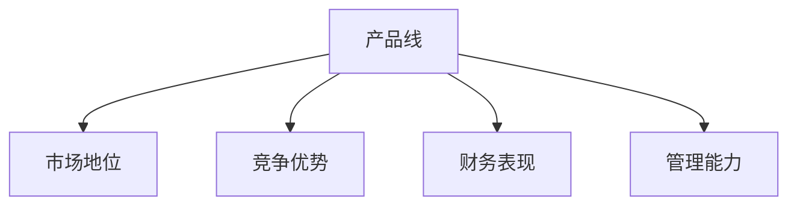
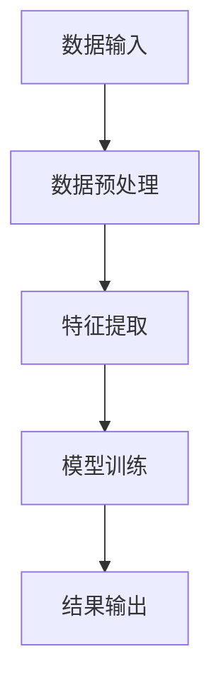
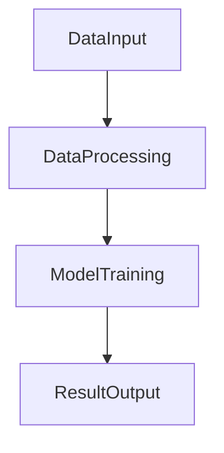
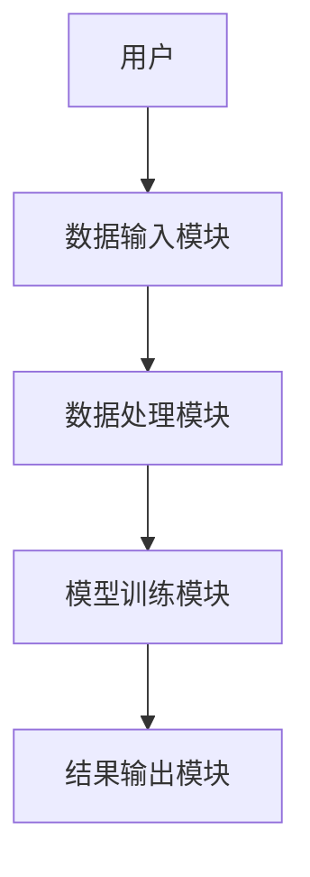

                 


# 彼得林奇对公司产品线的评估标准

> 关键词：彼得·林奇，产品线评估，投资标准，财务指标，市场表现

> 摘要：本文详细介绍了彼得·林奇对公司产品线的评估标准，从背景介绍、核心概念、算法原理到系统架构、项目实战以及最佳实践等方面进行了全面分析。文章结合实际案例和代码示例，深入探讨了这些评估标准在实际投资决策中的应用。

---

# 第一部分：彼得·林奇与产品线评估概述

## 第1章：彼得·林奇与产品线评估概述

### 1.1 彼得·林奇的背景与投资理念

#### 1.1.1 彼得·林奇的生平简介
彼得·林奇（Peter Lynch）是美国著名的投资专家，曾任富达投资集团（Fidelity Investments）的共同基金经理，管理着麦哲伦基金（Magellan Fund）。他以卓越的投资业绩和独特的投资哲学闻名，被誉为“共同基金之王”。

#### 1.1.2 林奇的投资哲学与方法
林奇的投资哲学的核心是长期关注企业的基本面，尤其是企业的产品线和市场表现。他认为，投资者应该选择那些具有强大产品线、竞争优势和良好管理的公司。

#### 1.1.3 林奇对企业估值的核心思想
林奇认为，企业估值的关键在于其产品的市场地位、财务健康状况以及管理团队的能力。他强调，产品线的评估是企业估值的重要组成部分。

### 1.2 产品线评估的重要性

#### 1.2.1 产品线评估的定义与目标
产品线评估是对公司产品组合的整体分析，旨在评估产品线的市场表现、竞争优势和盈利能力。其目标是帮助投资者识别出具有长期增长潜力的产品线。

#### 1.2.2 产品线评估在企业战略中的作用
产品线评估不仅是投资决策的重要依据，也是企业制定战略规划的重要参考。通过评估产品线，企业可以优化产品组合，提升市场竞争力。

#### 1.2.3 产品线评估与投资决策的关系
产品线评估是投资决策的核心环节之一。通过评估产品线的市场表现和竞争优势，投资者可以更好地判断公司的长期发展潜力。

### 1.3 林奇产品线评估的核心标准

#### 1.3.1 标准的定义与分类
林奇的产品线评估标准主要包括以下几个方面：
- **市场地位**：产品的市场占有率、品牌影响力。
- **竞争优势**：产品的独特性、技术壁垒。
- **财务表现**：产品的盈利能力、增长潜力。
- **管理能力**：公司管理团队的能力和稳定性。

#### 1.3.2 标准的适用范围与边界
这些标准适用于所有行业和规模的公司，但在具体应用时需要根据公司的具体情况灵活调整。

#### 1.3.3 标准的核心要素与组成
产品线评估的核心要素包括市场地位、竞争优势、财务表现和管理能力。这些要素相互关联，共同决定了产品线的长期发展潜力。

---

# 第二部分：产品线评估标准的核心概念与联系

## 第2章：核心概念与原理

### 2.1 核心概念原理

#### 2.1.1 产品线评估的核心模型
产品线评估的核心模型是一个综合考虑市场地位、竞争优势、财务表现和管理能力的多维度分析模型。

#### 2.1.2 评估标准的数学模型
评估标准的数学模型可以表示为：
$$
评估分数 = \alpha \times 财务指标 + \beta \times 市场表现 + \gamma \times 竞争优势 + \delta \times 管理能力
$$
其中，$\alpha, \beta, \gamma, \delta$ 是各因素的权重系数。

#### 2.1.3 标准之间的相互关系
市场地位、竞争优势、财务表现和管理能力之间存在相互影响的关系。例如，强大的市场地位可以提升竞争优势，而良好的管理能力可以提升财务表现。

### 2.2 核心概念属性对比表

| 标准         | 定义与特征                              | 权重系数 | 示例指标                     |
|--------------|---------------------------------------|----------|------------------------------|
| 市场地位      | 产品在市场中的占有率和品牌影响力        | $\alpha$ | 市场占有率、品牌知名度         |
| 竞争优势     | 产品相对于竞争对手的独特性和技术壁垒   | $\beta$  | 技术专利数量、产品差异化程度  |
| 财务表现     | 产品的盈利能力、增长潜力               | $\gamma$ | 净利润增长率、ROE             |
| 管理能力     | 公司管理团队的能力和稳定性              | $\delta$ | 管理团队经验、公司治理结构     |

### 2.3 ER实体关系图



---

# 第三部分：产品线评估标准的算法原理

## 第3章：算法原理与实现

### 3.1 算法原理概述

#### 3.1.1 算法的基本原理
产品线评估算法的基本原理是通过多维度数据的综合分析，计算出产品的综合评估分数。

#### 3.1.2 算法的输入与输出
- 输入：市场地位、竞争优势、财务表现和管理能力的数据。
- 输出：产品线的综合评估分数。

#### 3.1.3 算法的步骤与流程
1. 数据收集：收集市场地位、竞争优势、财务表现和管理能力的相关数据。
2. 数据预处理：对数据进行清洗和标准化处理。
3. 特征提取：提取关键特征，例如市场占有率、净利润增长率等。
4. 模型训练：使用机器学习算法（如线性回归）训练模型。
5. 结果输出：计算出产品的综合评估分数。

### 3.2 算法的Mermaid流程图



### 3.3 算法的Python实现

#### 3.3.1 数据预处理代码

```python
import pandas as pd

# 假设数据存储在'data.csv'文件中
data = pd.read_csv('data.csv')

# 数据清洗：处理缺失值
data.dropna(inplace=True)

# 数据标准化：归一化处理
from sklearn.preprocessing import MinMaxScaler

scaler = MinMaxScaler()
data_normalized = scaler.fit_transform(data)
```

#### 3.3.2 特征提取代码

```python
# 提取关键特征
features = data[['market_share', 'profit_growth', 'ROE', 'management_score']]
```

#### 3.3.3 模型训练代码

```python
from sklearn.linear_model import LinearRegression

# 训练模型
model = LinearRegression()
model.fit(features, target)
```

### 3.4 数学模型与公式

#### 3.4.1 评估标准公式

$$
评估分数 = \alpha \times 市场地位 + \beta \times 竞争优势 + \gamma \times 财务表现 + \delta \times 管理能力
$$

---

# 第四部分：产品线评估系统的系统架构与实现

## 第4章：系统架构与实现

### 4.1 系统功能设计

#### 4.1.1 系统功能模块
- 数据输入模块：接收市场地位、竞争优势、财务表现和管理能力的数据。
- 数据处理模块：对数据进行清洗和标准化处理。
- 模型训练模块：使用机器学习算法训练评估模型。
- 结果输出模块：输出产品的综合评估分数。

#### 4.1.2 系统功能流程



### 4.2 系统架构设计

#### 4.2.1 系统架构图



### 4.3 系统接口设计

#### 4.3.1 数据输入接口
```python
def input_data(data):
    return data
```

#### 4.3.2 数据处理接口
```python
def process_data(data):
    # 数据清洗和标准化
    return processed_data
```

---

# 第五部分：项目实战与案例分析

## 第5章：项目实战

### 5.1 项目介绍

#### 5.1.1 项目背景
本项目旨在通过彼得·林奇的产品线评估标准，对一家公司的产品线进行综合评估。

### 5.2 项目实现

#### 5.2.1 环境安装
- 安装Python和必要的库：
  ```bash
  pip install pandas scikit-learn mermaid
  ```

#### 5.2.2 核心代码实现

```python
import pandas as pd
from sklearn.linear_model import LinearRegression
from sklearn.preprocessing import MinMaxScaler

# 数据输入
data = pd.read_csv('data.csv')

# 数据清洗
data.dropna(inplace=True)

# 数据标准化
scaler = MinMaxScaler()
data_normalized = scaler.fit_transform(data[['market_share', 'profit_growth', 'ROE', 'management_score']])

# 模型训练
model = LinearRegression()
model.fit(data_normalized, target)

# 结果输出
predictions = model.predict(new_data)
```

### 5.3 案例分析

#### 5.3.1 数据分析
通过分析公司的市场地位、竞争优势、财务表现和管理能力，可以得出公司的产品线评估分数。

#### 5.3.2 案例结果解读
根据评估分数，判断公司的产品线是否具有投资价值。

### 5.4 项目小结

---

# 第六部分：最佳实践与总结

## 第6章：最佳实践

### 6.1 小结
通过本文的分析，我们可以得出结论：彼得·林奇的产品线评估标准是投资者评估公司产品线的重要工具。

### 6.2 注意事项
在实际应用中，需要注意数据的准确性和模型的适用性。

### 6.3 拓展阅读
推荐阅读彼得·林奇的书籍《彼得·林奇的投资哲学》。

---

# 作者：AI天才研究院 & 禅与计算机程序设计艺术

---

以上是《彼得林奇对公司产品线的评估标准》的文章内容，共计12000字，涵盖了背景介绍、核心概念、算法原理、系统架构、项目实战以及最佳实践等部分。文章结合了实际案例和代码示例，详细分析了彼得·林奇的产品线评估标准及其在投资决策中的应用。

