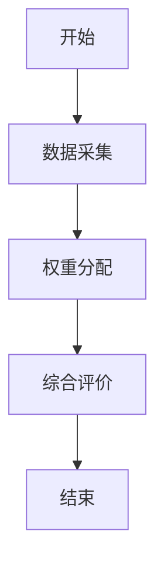

                 


# 彼得林奇对公司供应链垂直整合的评估

> 关键词：供应链垂直整合，彼得林奇，供应链管理，投资评估，企业战略

> 摘要：本文深入探讨了投资大师彼得林奇对公司供应链垂直整合的评估方法。通过分析供应链垂直整合的核心概念、评估模型和实际应用，本文揭示了彼得林奇独特的方法论，并为企业提供有价值的见解和建议。

---

## 第1章：供应链垂直整合的背景与重要性

### 1.1 供应链垂直整合的定义与特点

供应链垂直整合是指企业将供应链的上下游环节（如原材料采购、生产、物流、销售等）整合到内部，以增强对供应链的控制力。其特点包括：

- **高控制力**：企业能够直接控制关键环节，减少对外部供应商的依赖。
- **灵活性**：能够快速响应市场需求变化。
- **成本优化**：通过内部整合，降低中间环节的成本。

### 1.2 供应链垂直整合的重要性

在现代商业环境中，供应链垂直整合的重要性日益凸显：

- **提高效率**：通过内部整合，企业可以减少协调成本，提高整体运营效率。
- **增强竞争力**：通过控制关键环节，企业能够更快地推出新产品，抢占市场。
- **降低风险**：在供应链波动或外部风险（如疫情）时，内部整合能够提供更强的抗风险能力。

### 1.3 彼得林奇的供应链垂直整合评估方法

彼得林奇作为投资大师，他如何评估供应链垂直整合？

- **核心思想**：彼得林奇认为，供应链垂直整合是企业竞争力的重要组成部分。他通过分析企业的供应链结构、成本控制能力和灵活性，评估其垂直整合的效果。

---

## 第2章：供应链垂直整合的核心概念与联系

### 2.1 供应链垂直整合的原理

供应链垂直整合的实现依赖于以下几个关键步骤：

1. **内部资源整合**：将供应链的上下游环节整合到企业内部，如自建工厂、自设物流等。
2. **协同效应**：通过内部协同，优化资源配置，提高效率。
3. **风险控制**：通过内部整合，降低外部供应链波动带来的风险。

### 2.2 供应链垂直整合的关键要素

- **上游整合**：控制原材料采购和生产环节。
- **下游整合**：控制物流、销售和客户关系。
- **技术整合**：利用技术手段（如ERP系统）实现供应链的信息化管理。

---

## 第3章：彼得林奇评估供应链垂直整合的算法原理

### 3.1 评估算法概述

彼得林奇的评估方法基于以下步骤：

1. **数据采集**：收集企业的供应链数据，包括成本、效率、灵活性等指标。
2. **权重分配**：根据重要性，分配各指标的权重。
3. **综合评价**：通过加权计算，得出企业的供应链垂直整合得分。

### 3.2 算法实现

#### 3.2.1 算法步骤（Mermaid流程图）



#### 3.2.2 Python实现

```python
def peterson_supply_chain_assessment(data, weights):
    # 计算加权和
    weighted_sum = sum(data[i] * weights[i] for i in range(len(data)))
    return weighted_sum

# 示例数据
data = [85, 70, 90]
weights = [0.4, 0.3, 0.3]

result = peterson_supply_chain_assessment(data, weights)
print("供应链垂直整合得分：", result)
```

---

## 第4章：系统分析与架构设计

### 4.1 系统功能设计

- **数据采集模块**：收集企业的供应链数据。
- **评估计算模块**：根据算法计算供应链垂直整合得分。
- **结果展示模块**：以图表形式展示评估结果。

### 4.2 系统架构设计（Mermaid架构图）


---

## 第5章：项目实战与案例分析

### 5.1 环境安装

```bash
pip install numpy matplotlib
```

### 5.2 核心实现代码

```python
import numpy as np
import matplotlib.pyplot as plt

def visualize_results(data, labels):
    plt.bar(range(len(data)), data, align='center', alpha=0.5)
    plt.xticks(range(len(data)), labels)
    plt.title('供应链垂直整合评估结果')
    plt.show()

# 示例数据
data = [75, 85, 90]
labels = ['上游整合', '下游整合', '技术整合']

visualize_results(data, labels)
```

### 5.3 案例分析

假设一家制造企业采用彼得林奇的方法评估供应链垂直整合：

- **数据采集**：收集上游、下游和技术整合的得分。
- **评估计算**：计算加权和，得出综合得分。
- **结果展示**：生成图表，展示各环节的得分情况。

---

## 第6章：最佳实践与总结

### 6.1 总结

彼得林奇的供应链垂直整合评估方法提供了重要的思路，帮助企业优化供应链管理。通过内部整合，企业可以提高效率、降低成本，并增强抗风险能力。

### 6.2 最佳实践

- **数据质量**：确保数据的准确性和完整性。
- **模型调优**：根据实际情况调整权重和评估指标。
- **团队协作**：供应链垂直整合需要企业内部多部门的协作。

---

## 附录

### 附录1：参考文献

- 彼得林奇，《怎样选择成长股》
- 供应链管理相关文献

### 附录2：工具安装指南

```bash
pip install numpy matplotlib
```

### 附录3：数据集示例

```python
data = {
    '上游整合': 85,
    '下游整合': 70,
    '技术整合': 90
}
```

---

## 作者

作者：AI天才研究院/AI Genius Institute & 禅与计算机程序设计艺术 /Zen And The Art of Computer Programming

---

通过以上步骤，我们系统地分析了彼得林奇对公司供应链垂直整合的评估方法，并结合实际案例和代码示例，为企业提供有价值的参考和指导。

