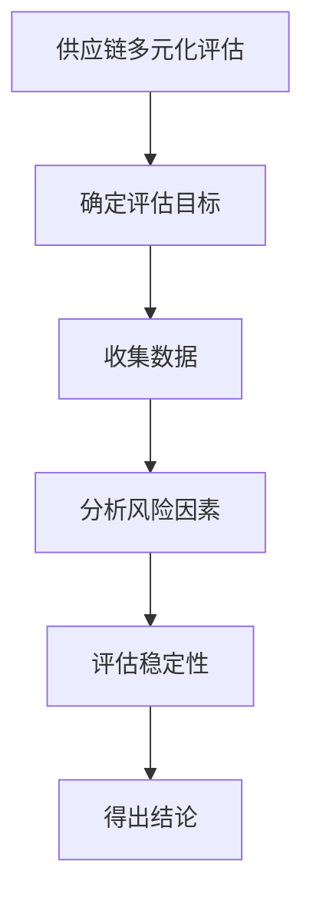

                 

# 彼得林奇对公司供应链多元化策略的评估

> 关键词：彼得林奇，供应链多元化，供应链评估，供应链风险管理，供应链优化，企业供应链管理

> 摘要：本文从彼得林奇的视角出发，系统地探讨了公司供应链多元化策略的评估方法。文章首先介绍了供应链多元化策略的背景与意义，随后分析了其核心概念与理论基础，重点阐述了彼得林奇提出的供应链多元化策略评估框架，包括数学模型、流程图和算法实现。接着，文章通过实际案例分析验证了评估框架的有效性，并提出了供应链多元化策略的实施路径和风险管理策略。最后，文章总结了供应链多元化策略的核心要点，并展望了未来的发展趋势。

---

# 第一章: 供应链多元化策略的背景与意义

## 1.1 供应链多元化策略的背景

### 1.1.1 全球化与供应链管理的演变

随着全球经济的快速发展，供应链管理已成为企业竞争力的重要组成部分。企业的供应链体系不仅需要满足生产需求，还需要应对市场变化、风险管理和成本优化等多重挑战。特别是在全球化背景下，供应链的复杂性和多样性显著增加，企业对供应链多元化的需求也日益迫切。

### 1.1.2 供应链多元化的重要性

供应链多元化是指企业在供应链的各个环节中采用多样化的供应商、生产方式和物流渠道，以降低风险、提高效率和增强灵活性。多元化策略可以帮助企业在面对市场波动、自然灾害、政策变化等不确定性时，保持供应链的稳定性和韧性。

### 1.1.3 彼得林奇与供应链多元化策略的关联

彼得林奇作为投资领域的传奇人物，其投资理念强调对企业的深入了解和风险控制。他将这些理念延伸到供应链管理中，提出了基于多元化策略的企业供应链评估方法。这种方法不仅关注供应链的效率，还注重其稳定性和可持续性。

## 1.2 供应链多元化策略的目标与意义

### 1.2.1 多元化策略的核心目标

供应链多元化策略的核心目标是通过多样化的供应商和生产方式，降低供应链的集中风险，提高企业的抗风险能力。同时，多元化策略还可以优化成本结构，提升企业的市场响应速度。

### 1.2.2 多元化策略对企业竞争力的影响

供应链多元化策略通过增强供应链的弹性和灵活性，提升了企业的市场竞争力。多元化供应商可以提供更多的选择和更好的价格，同时降低因单一供应商问题导致的风险。

### 1.2.3 多元化策略的风险与收益平衡

尽管供应链多元化策略能够带来诸多好处，但也需要权衡风险与收益。多元化可能会增加管理复杂性和成本，因此需要在风险可控的前提下，合理配置资源，实现收益最大化。

## 1.3 本章小结

本章介绍了供应链多元化策略的背景与重要性，分析了其核心目标和对企业发展的影响。彼得林奇的多元化策略强调了供应链的稳定性和风险管理，为后续的评估方法奠定了基础。

---

# 第二章: 供应链多元化策略的核心概念与理论基础

## 2.1 供应链多元化与集中化的对比

### 2.1.1 多元化供应链的优势

多元化供应链的优势体现在风险分散、资源优化和市场适应性方面。通过选择多个供应商和生产地点，企业可以降低单一供应商或生产地点出现问题的风险，同时利用不同地区的成本优势优化整体供应链成本。

### 2.1.2 集中化供应链的优缺点

集中化供应链的优势在于管理简单、成本低，但其缺点是风险集中，一旦单一供应商或生产地点出现问题，可能导致整个供应链中断。

### 2.1.3 多元化与集中的平衡点

企业需要根据自身的战略目标、行业特点和市场环境，找到多元化与集中的平衡点。在风险较高的行业，多元化策略更为重要；而在成本敏感的行业，集中化策略可能更优。

## 2.2 供应链多元化策略的核心要素

### 2.2.1 供应商多元化

供应商多元化是指选择多个供应商，以降低对单一供应商的依赖。通过与多个供应商合作，企业可以分散供应风险，同时获得更好的价格和服务。

### 2.2.2 生产能力多元化

生产能力多元化是指在多个地点建立生产能力，以分散生产风险。通过在全球范围内布局生产设施，企业可以更好地应对地区性风险，如自然灾害、政策变化等。

### 2.2.3 供应链网络的复杂性

供应链网络的复杂性是供应链多元化策略的重要特征。复杂的供应链网络可以提高企业的灵活性和抗风险能力，但也需要更高的管理和协调成本。

## 2.3 彼得林奇的供应链多元化理论框架

### 2.3.1 理论基础概述

彼得林奇的供应链多元化理论框架基于投资学中的分散化原理，强调通过多元化配置供应链资源来降低整体风险。该框架将供应链视为一个复杂的系统，需要从多个维度进行优化。

### 2.3.2 理论框架的核心要素

彼得林奇的理论框架包括以下几个核心要素：
- **供应商多样性**：选择多个供应商，降低对单一供应商的依赖。
- **生产布局多样性**：在全球范围内布局生产能力，分散生产风险。
- **物流渠道多样性**：采用多种物流方式，优化供应链效率。
- **风险管理**：通过风险评估和应急预案，降低供应链中断的风险。

### 2.3.3 理论框架的适用性分析

彼得林奇的供应链多元化理论框架适用于大多数行业，尤其是在风险较高的行业。对于那些依赖单一供应商或生产地点的企业，该框架尤为重要。

## 2.4 本章小结

本章分析了供应链多元化策略的核心概念，对比了多元化与集中化的优缺点，并详细阐述了彼得林奇的理论框架。通过这些分析，读者可以更好地理解供应链多元化策略的实施要点。

---

# 第三章: 彼得林奇的供应链多元化策略评估框架

## 3.1 彼得林奇评估框架的概述

### 3.1.1 评估框架的构成

彼得林奇的供应链多元化策略评估框架包括以下几个部分：
- **风险评估**：分析供应链各环节的风险因素。
- **稳定性评估**：评估供应链的稳定性和抗风险能力。
- **成本效益分析**：评估多元化策略的成本与收益的平衡。
- **优化建议**：根据评估结果提出优化建议。

### 3.1.2 评估框架的核心步骤

1. **确定评估目标**：明确评估的核心目标，如风险控制、成本优化等。
2. **收集数据**：收集供应链各环节的相关数据，包括供应商信息、生产成本、物流效率等。
3. **分析风险因素**：识别供应链中的主要风险因素，并进行量化分析。
4. **评估稳定性**：通过数学模型评估供应链的稳定性。
5. **得出结论**：根据评估结果提出优化建议。

### 3.1.3 评估框架的适用范围

该评估框架适用于各类企业，尤其是那些希望优化供应链管理、降低风险的企业。对于跨国企业，该框架尤为重要。

## 3.2 供应链多元化策略评估的数学模型与公式

### 3.2.1 供应链风险评估的数学模型

供应链风险评估的数学模型如下：

$$ R = \sum_{i=1}^{n} w_i \cdot r_i $$

其中：
- $R$ 表示供应链风险。
- $w_i$ 表示第 $i$ 个风险因素的权重。
- $r_i$ 表示第 $i$ 个风险因素的风险值。

### 3.2.2 供应链稳定性评估的数学模型

供应链稳定性评估的数学模型如下：

$$ S = \frac{\sum_{j=1}^{m} s_j}{m} $$

其中：
- $S$ 表示供应链稳定性。
- $s_j$ 表示第 $j$ 个供应商的稳定性评分。
- $m$ 表示供应商总数。

## 3.3 供应链多元化策略评估的流程图

## 3.4 本章小结

本章详细介绍了彼得林奇的供应链多元化策略评估框架，包括数学模型和流程图。通过这些工具，企业可以系统地评估供应链的稳定性和风险，为优化决策提供依据。

---

# 第四章: 供应链多元化策略评估的实际案例分析

## 4.1 案例背景介绍

假设某跨国企业A在单一供应商B处采购关键零部件，但由于B公司所在地区发生了自然灾害，导致供应链中断，对企业造成了巨大损失。为了降低风险，企业决定采用彼得林奇的多元化策略，选择多个供应商和生产地点。

## 4.2 评估过程与结果

### 4.2.1 数据收集

企业收集了供应商B的风险因素，包括自然灾害、政策变化、供应链中断等。

### 4.2.2 风险评估

使用数学模型对供应商B的风险进行评估：

$$ R_B = \sum_{i=1}^{n} w_i \cdot r_i $$

假设权重 $w_i$ 和风险值 $r_i$ 如下：

| 风险因素 | $w_i$ | $r_i$ |
|----------|-------|-------|
| 自然灾害 | 0.4   | 0.8   |
| 政策变化 | 0.3   | 0.6   |
| 供应链中断 | 0.3   | 0.7   |

计算得：

$$ R_B = 0.4 \times 0.8 + 0.3 \times 0.6 + 0.3 \times 0.7 = 0.32 + 0.18 + 0.21 = 0.71 $$

### 4.2.3 稳定性评估

选择新的供应商C和D，分别计算其稳定性评分：

$$ S_C = \frac{\sum_{j=1}^{m} s_j}{m} = \frac{0.8 + 0.7}{2} = 0.75 $$

$$ S_D = \frac{0.7 + 0.6}{2} = 0.65 $$

### 4.2.4 结论与优化建议

供应商C的稳定性评分高于供应商D，因此建议企业优先选择供应商C，并逐步减少对供应商B的依赖。

## 4.3 本章小结

本章通过实际案例分析，验证了彼得林奇评估框架的有效性。通过数学模型和流程图，企业可以系统地评估供应链风险，制定优化策略。

---

# 第五章: 供应链多元化策略的实施路径

## 5.1 供应链多元化策略的实施步骤

### 5.1.1 确定多元化目标

企业需要明确多元化的目标，如降低风险、优化成本等。

### 5.1.2 选择多元化供应商

根据风险评估和稳定性评估结果，选择合适的供应商。

### 5.1.3 优化供应链结构

通过调整供应链结构，实现多元化与效率的平衡。

## 5.2 供应链多元化策略的优化建议

### 5.2.1 供应商选择与管理

企业应建立供应商评价体系，定期评估供应商的稳定性，及时调整供应商组合。

### 5.2.2 供应链网络优化

通过在全球范围内布局生产能力，分散生产风险，同时利用不同地区的成本优势优化供应链成本。

## 5.3 本章小结

本章提出了供应链多元化策略的实施路径，包括目标设定、供应商选择和供应链优化等步骤，为企业提供了可操作的指导。

---

# 第六章: 供应链多元化策略的风险管理

## 6.1 供应链多元化策略的主要风险

### 6.1.1 供应链复杂性风险

多元化策略可能导致供应链复杂性增加，增加管理和协调成本。

### 6.1.2 供应商管理风险

供应商数量增加可能导致管理难度加大，影响供应链的稳定性。

### 6.1.3 成本增加风险

多元化策略可能导致供应链总成本增加，影响企业的盈利能力。

## 6.2 供应链风险管理策略

### 6.2.1 建立风险管理机制

企业应建立完善的风险管理体系，定期评估供应链风险，制定应急预案。

### 6.2.2 优化供应商管理

通过建立供应商评价体系和激励机制，提升供应商的稳定性和合作意愿。

## 6.3 本章小结

本章分析了供应链多元化策略的主要风险，并提出了相应的风险管理策略，为企业有效应对多元化策略带来的挑战提供了指导。

---

# 第七章: 供应链多元化策略的总结与展望

## 7.1 本章总结

本文从彼得林奇的视角出发，系统地探讨了供应链多元化策略的评估方法。通过数学模型和流程图，详细分析了供应链多元化策略的核心概念、评估框架和实施路径。同时，通过实际案例分析，验证了评估框架的有效性，并提出了风险管理策略。

## 7.2 未来展望

随着全球化和数字化的深入发展，供应链多元化策略的重要性将更加凸显。未来，企业需要更加注重供应链的灵活性和抗风险能力，进一步优化供应链管理，提升企业的核心竞争力。

---

# 作者：AI天才研究院 & 禅与计算机程序设计艺术

