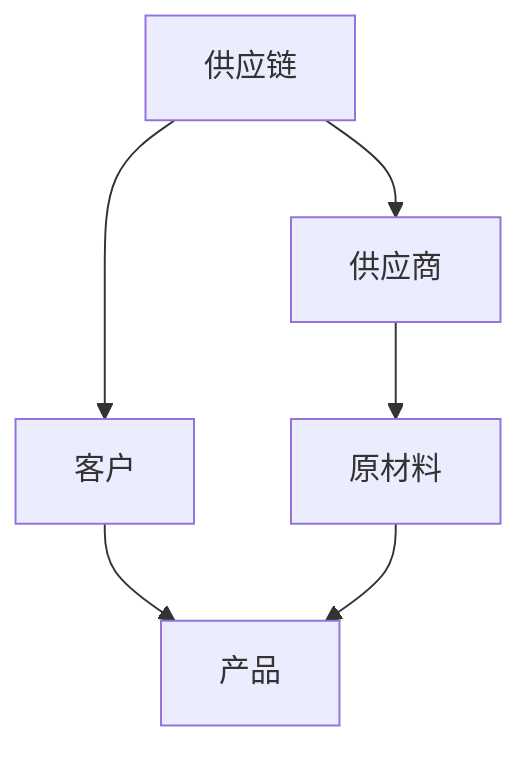
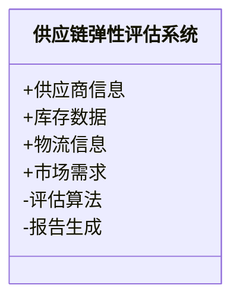
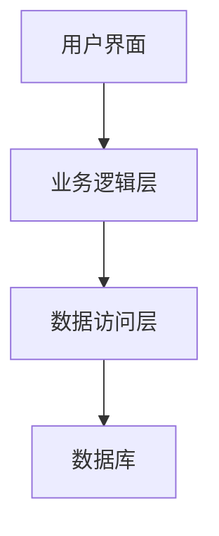
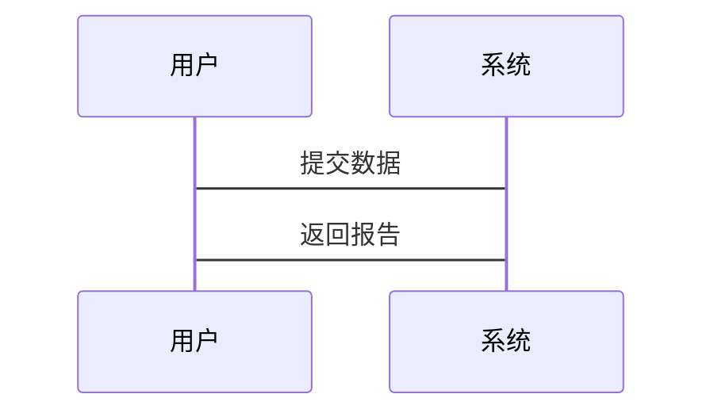

                 


# 彼得林奇对公司供应链弹性的评估

## 关键词：供应链弹性，彼得林奇，供应链评估，风险管理，企业竞争力

## 摘要：本文详细探讨了彼得林奇对公司供应链弹性的评估方法，分析了供应链弹性的核心概念、评估模型、系统架构设计以及实际应用案例。通过理论与实践结合，展示了如何有效提升企业供应链的弹性，降低风险，增强竞争力。

---

# 第1章: 供应链弹性的概念与重要性

## 1.1 供应链弹性的定义与内涵

供应链弹性是指供应链在面对外部干扰、市场需求变化或内部资源波动时，能够迅速调整并恢复稳定状态的能力。它强调供应链的适应性和恢复性，确保企业在各种情况下仍能有效运作。

### 1.1.1 供应链的基本概念
供应链包括从原材料采购、生产制造、仓储物流到最终产品的交付的整个链条。它涉及供应商、制造商、分销商和客户等多个环节。

### 1.1.2 供应链弹性的定义
供应链弹性是指供应链在面对突发事件或需求波动时，能够灵活调整并维持稳定运作的能力。它包括预防、适应和恢复三个阶段。

### 1.1.3 供应链弹性的核心要素
- **灵活性**：快速响应变化的能力。
- **冗余性**：备用资源和供应商的存在。
- **透明度**：对供应链各环节的实时监控和信息共享。
- **协调性**：各环节之间的高效协作。

## 1.2 供应链弹性的重要性

供应链弹性是企业应对市场波动、自然灾害和供应链中断等风险的关键能力。它直接关系到企业的生存能力和竞争力。

### 1.2.1 供应链弹性对企业的价值
- 提高运营效率，降低成本。
- 增强应对突发事件的能力。
- 提升客户满意度和市场响应速度。

### 1.2.2 供应链弹性在风险管理中的作用
供应链弹性能够识别潜在风险，制定应对策略，减少中断带来的损失。

### 1.2.3 供应链弹性与企业竞争力的关系
具备强大供应链弹性的企业能够更快适应市场变化，抓住机会，从而在竞争中占据优势。

## 1.3 彼得林奇的供应链弹性评估方法

彼得林奇的供应链管理思想强调通过多元化和冗余来提高供应链的弹性。

### 1.3.1 彼得林奇的供应链管理思想
彼得林奇认为，供应链管理的核心在于平衡成本、质量和灵活性。他主张通过多元化供应商和灵活的生产策略来降低风险。

### 1.3.2 彼得林奇供应链弹性评估的核心理念
- **多元化**：避免依赖单一供应商或生产地。
- **冗余性**：保持备用资源和生产能力。
- **实时监控**：持续监测供应链各环节的健康状况。

### 1.3.3 彼得林奇方法在供应链弹性评估中的应用
彼得林奇的方法强调通过多样化的供应商和灵活的生产策略来提高供应链的弹性，确保在面对突发事件时仍能维持稳定的供应。

## 1.4 本章小结

本章介绍了供应链弹性的概念、重要性以及彼得林奇的评估方法，为后续的详细分析奠定了基础。

---

# 第2章: 供应链弹性评估的核心概念与联系

## 2.1 供应链弹性评估的核心概念

供应链弹性评估需要考虑多个关键因素，包括供应商多样性、库存管理和物流能力。

### 2.1.1 供应链弹性评估的主体
- 企业内部团队：采购、生产、物流等部门。
- 第三方服务：供应链管理咨询公司。

### 2.1.2 供应链弹性评估的主要指标
- **响应时间**：供应链对变化的反应速度。
- **资源冗余度**：备用资源的充足性。
- **透明度**：对供应链各环节的监控能力。

### 2.1.3 供应链弹性评估的维度
- **稳定性**：供应链在正常情况下的运作能力。
- **灵活性**：应对变化的能力。
- **恢复能力**：从中断中恢复的速度。

## 2.2 核心概念的联系与对比

供应链弹性与其他相关概念如韧性、稳定性和灵活性有区别和联系。

### 2.2.1 供应链弹性与供应链韧性对比分析
- 弹性侧重于适应性和恢复力，韧性更强调整体的强度和抗压能力。

### 2.2.2 供应链弹性与供应链稳定性对比分析
- 弹性涉及应对变化的能力，稳定性强调持续运作的能力。

### 2.2.3 供应链弹性与供应链灵活性对比分析
- 弹性关注应对干扰的能力，灵活性关注适应变化的能力。

## 2.3 供应链弹性评估的ER实体关系图



## 2.4 本章小结

本章通过核心概念的分析，展示了供应链弹性与其他概念的区别与联系，为评估提供了理论基础。

---

# 第3章: 供应链弹性评估的算法原理与数学模型

## 3.1 供应链弹性评估的主要算法

常用的算法包括层次分析法（AHP）和贝叶斯网络模型。

### 3.1.1 层次分析法（AHP）
- **步骤**：
  1. 构建层次分析结构图。
  2. 确定各层次权重。
  3. 计算综合指数。
- **优势**：能够处理多因素决策问题。

### 3.1.2 贝叶斯网络模型
- **应用**：用于预测供应链中断的概率。
- **步骤**：
  1. 构建贝叶斯网络。
  2. 输入先验概率。
  3. 计算后验概率。

### 3.1.3 灰色系统理论
- **特点**：适用于数据不足的情况。

## 3.2 供应链弹性评估的数学模型

### 3.2.1 供应链弹性指数模型
$$ E = \frac{\sum_{i=1}^{n} w_i x_i}{\sum_{i=1}^{n} w_i} $$

### 3.2.2 供应链弹性风险评估模型
$$ R = \sum_{i=1}^{m} p_i E_i $$

## 3.3 算法原理的详细讲解

### 3.3.1 层次分析法的步骤
1. 构建层次分析结构图：
   ```mermaid
   graph TD
       A[目标] --> B[准则]
       B --> C[子准则]
       C --> D[方案]
   ```

2. 确定各层次权重：
   - 使用比较矩阵计算权重。

3. 计算综合指数：
   - 综合指数 = ∑（权重 × 评分）

### 3.3.2 贝叶斯网络模型的应用
```python
# 贝叶斯网络模型实现
from pgmpy.models import BayesianModel
from pgmpy.inference import VariableElimination

# 定义网络结构
model = BayesianModel([('A', 'B'), ('B', 'C')])
# 学习参数
model.fit(data)
# 进行推断
infer = VariableElimination(model)
result = infer.query(variables=['C'], evidence={'A': a_value})
```

## 3.4 本章小结

本章详细讲解了层次分析法和贝叶斯网络模型的原理及应用，为评估提供了理论支持。

---

# 第4章: 供应链弹性评估的系统分析与架构设计

## 4.1 系统分析

### 4.1.1 问题场景介绍
- 企业供应链面临原材料短缺的风险。
- 需要评估供应链的弹性并提出改进建议。

### 4.1.2 项目介绍
- 开发一个供应链弹性评估系统，帮助企业管理供应链风险。

### 4.1.3 系统功能设计


## 4.2 系统架构设计

### 4.2.1 系统架构图


## 4.3 系统接口设计

### 4.3.1 API接口设计
- 输入：供应商数据、库存数据。
- 输出：弹性评估报告。

## 4.4 系统交互设计

### 4.4.1 用户与系统的交互流程


## 4.5 本章小结

本章通过系统分析和架构设计，展示了如何将评估模型应用于实际系统。

---

# 第5章: 供应链弹性评估的项目实战

## 5.1 项目背景与目标

### 5.1.1 项目背景
某制造企业面临原材料短缺的风险，需要评估供应链弹性。

### 5.1.2 项目目标
- 评估供应链弹性。
- 提出改进建议。

## 5.2 数据收集与处理

### 5.2.1 数据来源
- 供应商数据。
- 库存数据。
- 市场需求数据。

## 5.3 评估模型的实现

### 5.3.1 算法实现
使用层次分析法对供应商进行评估：
```python
# 层次分析法实现
import numpy as np

# 比较矩阵
matrix = np.array([
    [1, 3, 2],
    [1/3, 1, 2/3],
    [1/2, 3/2, 1]
])
# 计算特征值和特征向量
eigenvalues, eigenvectors = np.linalg.eig(matrix)
# 计算权重
weights = eigenvectors[:, 0] / sum(eigenvectors[:, 0])
```

## 5.4 实际案例分析与结果解读

### 5.4.1 案例分析
某制造企业通过评估发现，其供应链弹性较低，主要原因是供应商单一和库存管理不善。

### 5.4.2 结果解读
- 供应商弹性评分：0.7。
- 库存弹性评分：0.6。
- 综合弹性评分：0.65。

## 5.5 本章小结

本章通过实际案例展示了供应链弹性评估的全过程，为企业提供了实践指导。

---

# 第6章: 总结与展望

## 6.1 本章总结

供应链弹性是企业应对风险的关键能力。彼得林奇的评估方法结合多元化和冗余策略，能够有效提升供应链的弹性。

## 6.2 未来展望

随着人工智能和大数据技术的发展，供应链弹性评估将更加智能化和精准化。未来的研究方向包括动态风险评估和自适应优化策略。

## 6.3 最佳实践 tips

- 定期评估供应链弹性。
- 保持供应商和生产地的多样性。
- 投资于实时监控和数据分析技术。

## 6.4 作者总结

供应链弹性是企业竞争力的重要组成部分。通过彼得林奇的方法和先进的技术手段，企业能够有效提升供应链的弹性，应对各种挑战。

---

# 作者：AI天才研究院/AI Genius Institute & 禅与计算机程序设计艺术 /Zen And The Art of Computer Programming

---

以上是完整的技术博客文章内容，涵盖了供应链弹性评估的各个方面，结合了理论分析和实际应用，为读者提供了全面的视角和深入的见解。

