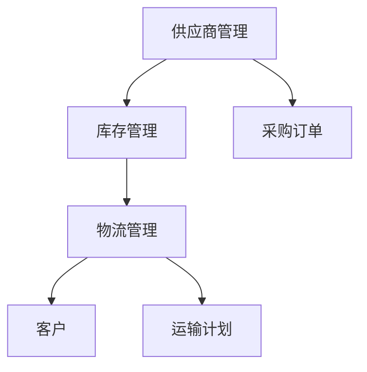

                 


# 彼得林奇对公司供应链管理的分析

> 关键词：供应链管理，彼得·林奇，投资分析，优化模型，企业运营

> 摘要：本文从彼得·林奇的投资视角分析了供应链管理的重要性，探讨了供应链的核心要素、优化方法及其对企业发展的影响。文章详细介绍了供应链管理的数学模型、系统架构设计和实际案例，为读者提供了从理论到实践的全面指导。

---

## 第一部分：供应链管理概述

### 第1章：供应链管理的基本概念

#### 1.1 供应链的定义与核心要素

供应链是指围绕核心企业，将供应商、制造商、分销商、零售商和最终用户等组成的价值链。其核心要素包括：

- **供应商管理**：选择和评估供应商，建立长期合作关系。
- **库存管理**：优化库存水平，减少成本，提高周转率。
- **物流与配送**：确保产品高效、安全地从生产到交付。
- **信息流**：实现供应链各环节的信息共享与协同。

供应链管理的目标是通过协调各环节，提高效率，降低成本，增强企业竞争力。

#### 1.2 供应链管理的重要性

供应链管理直接影响企业的运营效率和成本结构。有效的供应链管理能够：

1. **降低库存成本**：通过优化库存水平，减少资金占用。
2. **提高客户满意度**：通过高效的物流和库存管理，缩短交货时间。
3. **增强企业灵活性**：快速响应市场变化，调整生产计划。

彼得·林奇在投资分析中非常重视供应链管理，认为优化的供应链是企业降低成本、提高利润的重要因素。

---

### 第2章：彼得·林奇的供应链管理分析视角

#### 2.1 彼得·林奇的投资方法论

彼得·林奇以其长期的投资成功著称，他强调深入分析企业的基本面，尤其是运营效率和成本控制。他认为，供应链管理是企业降低成本和提高效率的关键环节。

#### 2.2 供应链管理在投资分析中的重要性

在投资分析中，供应链管理的重要性体现在：

1. **成本控制**：优化供应链可以显著降低企业的生产成本。
2. **风险控制**：高效的供应链能够减少供应链中断的风险。
3. **竞争优势**：优秀的供应链管理能够提高企业的市场竞争力。

彼得·林奇在分析公司时，常常会考察其供应链管理的效率和成本结构，认为这是企业长期盈利能力的重要保障。

---

## 第二部分：供应链管理的核心概念与联系

### 第3章：供应链管理的核心要素分析

#### 3.1 供应商管理

- **供应商选择**：基于质量、价格、交货时间等多因素评估。
- **供应商关系管理**：建立长期合作关系，确保供应链的稳定性。
- **供应商绩效考核**：定期评估供应商的表现，优化合作关系。

#### 3.2 库存管理

- **库存分类**：A类库存高价值，B类中等价值，C类低价值。
- **库存控制策略**：如JIT（准时制）生产，减少库存积压。
- **库存优化模型**：使用EOQ（经济订单量）模型优化订货量。

#### 3.3 物流与配送

- **物流网络设计**：优化配送中心布局，降低运输成本。
- **运输模式选择**：如陆运、海运、空运的综合运用。
- **物流成本控制**：通过规模经济和技术创新降低成本。

---

### 第4章：供应链优化的数学模型

#### 4.1 线性规划模型

线性规划是一种常见的优化方法，常用于供应链管理中的库存和生产计划优化。模型如下：

$$
\text{目标函数：} \min Z = \sum c_i x_i + \sum h_i I_i
$$

$$
\text{约束条件：} \sum x_i = D \quad (\text{需求约束})
$$

$$
I_i = I_{i-1} + x_{i-1} - D_i \quad (\text{库存约束})
$$

其中，\( x_i \) 为生产量，\( I_i \) 为库存量，\( D_i \) 为需求量，\( c_i \) 为生产成本，\( h_i \) 为库存持有成本。

---

### 第5章：系统分析与架构设计

#### 5.1 供应链管理系统的功能设计

供应链管理系统的功能模块包括：

- **供应商管理模块**：供应商信息管理、评估与选择。
- **库存管理模块**：库存监控、订单管理、库存预警。
- **物流管理模块**：运输计划、配送管理、物流成本分析。

#### 5.2 系统架构图

以下是供应链管理系统的架构图：



---

## 第三部分：项目实战

### 第6章：优化某制造企业的供应链

#### 6.1 项目背景

某制造企业面临库存积压和交货延迟的问题，希望通过优化供应链管理提高效率。

#### 6.2 环境安装

安装所需的工具包括Python、PuLP库（用于线性规划）、数据库（如MySQL）。

#### 6.3 核心代码实现

以下是优化库存的Python代码示例：

```python
from pulp import *

# 创建问题
prob = LpProblem("库存优化问题", LpMinimize)

# 定义变量
x = LpVariable("订货量", 0, None)
h = LpVariable("库存量", 0, None)

# 定义目标函数
prob += 2*x + 1*h, "总成本"

# 定义约束
prob += h == x - 10, "库存约束"
prob += x >= 5, "最低订货量"

# 解决问题
prob.solve()

# 输出结果
print("订货量：", x.value())
print("库存量：", h.value())
```

#### 6.4 案例分析

通过上述代码，企业可以优化订货量，降低库存成本。例如，当需求量为10时，订货量为5，库存量为-5，说明需要补货。

---

## 第四部分：总结与展望

### 第7章：最佳实践与总结

#### 7.1 最佳实践

1. **建立长期供应商关系**：与优质供应商合作，确保供应链稳定性。
2. **应用先进技术**：如物联网、大数据分析优化供应链。
3. **持续监控与优化**：定期评估供应链表现，及时调整策略。

#### 7.2 未来展望

供应链管理将更加智能化和数据驱动。人工智能和区块链技术的应用将推动供应链管理的进一步优化。

---

## 作者：AI天才研究院/AI Genius Institute & 禅与计算机程序设计艺术 /Zen And The Art of Computer Programming

---

这篇文章通过理论分析和实际案例，全面探讨了彼得·林奇的供应链管理分析方法，为读者提供了从理论到实践的系统性指导。希望对供应链管理感兴趣的朋友能够从中获得启发，并在实际工作中应用这些知识。

