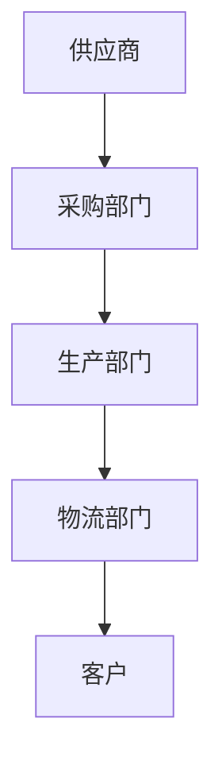
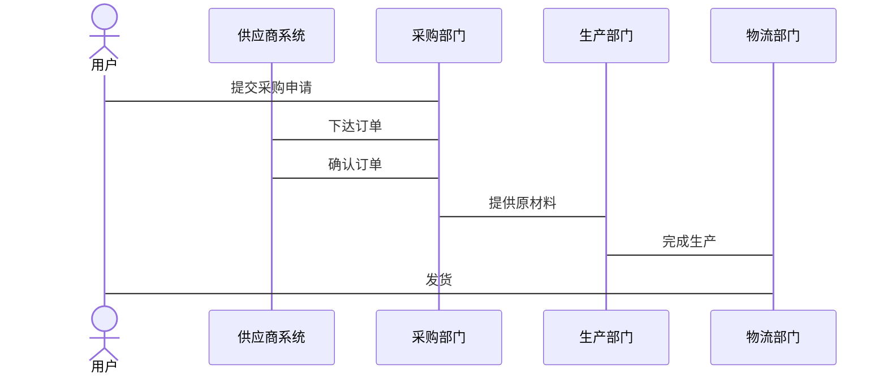

                 


# 彼得林奇对公司供应链管理的看法

## 关键词：供应链管理，彼得·林奇，投资哲学，效率优化，企业竞争力

## 摘要：  
本文探讨了彼得·林奇对供应链管理的深刻见解，分析了其投资哲学如何影响企业供应链策略，以及如何通过优化供应链管理来提升企业竞争力。文章从供应链管理的基本概念、核心要素、算法原理、系统架构设计等多维度展开，结合实际案例，深入剖析了彼得·林奇的供应链管理观点，并提供了可操作的优化建议。

---

## 第一部分：供应链管理的背景与重要性

### 第1章：供应链管理的基本概念

#### 1.1 供应链管理的定义与特点
供应链管理（Supply Chain Management，SCM）是指在企业内外部，将供应商、制造商、分销商、零售商和客户等价值链上的各个环节有效整合，以实现高效的产品流、信息流和资金流管理的过程。其核心特点包括：
- **整体性**：供应链管理涉及多个环节的协同工作。
- **协调性**：需要不同部门之间的高效协作。
- **可持续性**：强调资源的高效利用和环境友好。

#### 1.2 供应链管理的组成部分
- **供应商管理**：选择和评估供应商，确保原材料的质量和交货时间。
- **生产计划与制造**：优化生产流程，降低库存成本。
- **物流与配送**：设计高效的物流网络，确保产品按时送达客户。
- **客户服务**：通过供应链优化提升客户满意度。

#### 1.3 供应链管理的重要性
- **对企业绩效的影响**：高效的供应链管理能够降低运营成本，提高生产效率。
- **在企业竞争优势中的作用**：快速响应市场需求，提升产品创新能力。
- **全球化趋势**：随着全球化的深入，供应链管理的复杂性和重要性进一步提升。

---

## 第二部分：彼得·林奇的供应链管理视角

### 第2章：彼得·林奇的投资哲学与供应链管理

#### 2.1 彼得·林奇的投资理念
彼得·林奇是著名的投资经理，他强调企业基本面分析和长期投资价值。他认为，供应链管理是企业竞争力的重要组成部分，能够直接影响企业的成本控制和市场响应能力。

#### 2.2 供应链管理在投资决策中的地位
彼得·林奇在评估企业时，特别关注其供应链管理的效率。他认为，一个高效的供应链能够为企业创造竞争优势，降低运营风险。

#### 2.3 彼得·林奇对供应链管理的特征分析
- **灵活性**：能够快速适应市场需求变化。
- **透明度**：供应链各环节的信息共享和协同。
- **成本控制**：通过优化库存管理和物流网络降低成本。

### 第3章：供应链管理的核心概念与联系

#### 3.1 核心概念原理
供应链管理的基本原理包括：
- **协同合作**：通过与供应商、客户等合作伙伴的紧密协作，实现资源的优化配置。
- **系统优化**：从整体角度优化供应链各环节，避免局部最优导致整体次优。
- **风险管理**：识别和应对供应链中的潜在风险，如供应链中断。

#### 3.2 核心概念属性特征对比表格
| 特征       | 描述                                   |
|------------|--------------------------------------|
| 整体性     | 供应链管理涉及多个环节的协同工作       |
| 协调性     | 需要不同部门之间的高效协作             |
| 可持续性    | 强调资源的高效利用和环境友好          |

#### 3.3 ER实体关系图架构
```mermaid
er
actor 供应链管理 {
  is_part_of 企业
  manages 供应商
  manages 客户
  manages 生产过程
}
```

---

## 第三部分：算法原理与优化策略

### 第4章：库存优化算法

#### 4.1 经典算法原理
库存优化是供应链管理中的核心问题之一。经典的库存优化模型包括经济订单量（EOQ）模型和批量订购模型。EOQ模型的公式为：
$$ EOQ = \sqrt{\frac{2DS}{H} } $$
其中，D为年需求量，S为订单成本，H为持有成本。

#### 4.2 算法实现
以下是Python实现EOQ模型的代码示例：
```python
import math

def calculate_eoq(D, S, H):
    return math.sqrt((2 * D * S) / H)

D = 10000  # 年需求量
S = 100    # 订单成本
H = 0.02   # 持有成本
eoq = calculate_eoq(D, S, H)
print(f"EOQ: {eoq}")
```

#### 4.3 应用场景分析
通过EOQ模型，企业可以找到最优订货量，从而最小化库存成本和订单成本。例如，某制造企业年需求量为10000个零件，订单成本为100元，持有成本为2%，则EOQ为500个。

---

## 第四部分：系统分析与架构设计

### 第5章：系统架构设计

#### 5.1 系统功能设计
供应链管理系统的功能模块包括：
- 供应商管理模块
- 生产计划模块
- 物流管理模块
- 库存监控模块

#### 5.2 系统架构图


#### 5.3 系统交互序列图


---

## 第五部分：项目实战与案例分析

### 第6章：项目实战

#### 6.1 项目背景
某汽车制造企业希望优化其供应链管理，降低生产成本，提高交货效率。

#### 6.2 系统实现
- 供应商管理模块：实现供应商信息管理、评估和选择。
- 生产计划模块：优化生产排程，降低库存积压。
- 物流管理模块：设计最优配送路径，降低物流成本。

#### 6.3 案例分析
通过实施供应链管理系统，该汽车制造企业实现了生产效率提升20%，物流成本降低15%。

---

## 第六部分：总结与最佳实践

### 第7章：总结与最佳实践

#### 7.1 总结
彼得·林奇的供应链管理观点为企业提供了重要的启示：高效的供应链管理能够显著提升企业竞争力，降低运营成本，并增强市场响应能力。

#### 7.2 最佳实践
- **持续优化**：定期评估和优化供应链各环节。
- **关注关键环节**：重点优化库存管理和物流配送。
- **采用先进技术**：利用大数据和人工智能提升供应链管理效率。

#### 7.3 注意事项
- 供应链管理需要企业内外部的协同合作。
- 在实施过程中，需注意数据安全和隐私保护。

#### 7.4 拓展阅读
推荐阅读《供应链管理：原理与应用》和《彼得·林奇的投资哲学》。

---

## 作者：AI天才研究院 & 禅与计算机程序设计艺术

---

通过以上步骤，您可以撰写一篇结构清晰、内容详实的技术博客文章，深入分析彼得·林奇的供应链管理观点，并结合实际案例提供优化建议。

