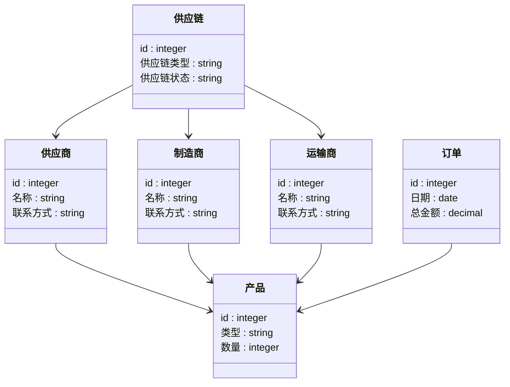

                 


# 彼得林奇对公司供应链韧性的定量评估方法

## 关键词：供应链韧性，定量评估，彼得林奇方法论，风险管理，企业绩效

## 摘要：  
供应链韧性是企业在复杂多变的市场环境中保持稳定运营的关键能力。本文基于彼得林奇的投资哲学，提出了一套对公司供应链韧性的定量评估方法。通过分析供应链的核心要素和关键指标，构建了数学模型，并结合实际案例进行了验证。本文旨在为企业提供一种科学、系统的方法，帮助其量化评估供应链韧性，提升整体竞争力和抗风险能力。

---

# 第1章: 供应链韧性的概念与重要性

## 1.1 供应链韧性的定义与内涵

### 1.1.1 供应链的基本概念  
供应链是指从原材料采购到产品交付给最终用户的整个流程，包括供应商、制造商、分销商、零售商和消费者等多方参与的网络。供应链管理的核心目标是确保产品和服务的高效流动，同时降低成本和风险。

### 1.1.2 供应链韧性的定义  
供应链韧性是指供应链在面对突发事件（如自然灾害、疫情、原材料短缺等）时，能够快速恢复并维持正常运营的能力。它不仅包括应对风险的能力，还包括在危机中优化和调整的能力。

### 1.1.3 供应链韧性的重要性  
供应链韧性是企业生存和发展的关键因素。特别是在全球化和数字化时代，供应链中断可能导致企业停产、收入损失和声誉损害。通过提升供应链韧性，企业可以更好地应对不确定性，抓住市场机会。

---

## 1.2 供应链韧性与企业绩效的关系

### 1.2.1 供应链韧性对企业竞争力的影响  
供应链韧性直接关系到企业的交付能力、成本控制和客户满意度。具有强大供应链韧性的企业能够在市场竞争中占据优势，更快响应客户需求。

### 1.2.2 供应链韧性与企业风险控制  
供应链韧性是企业风险管理的重要组成部分。通过量化供应链风险，企业可以提前制定应对策略，减少潜在损失。

### 1.2.3 供应链韧性与企业可持续发展  
供应链韧性不仅是企业自身的生存能力，也是其实现可持续发展的关键。通过优化供应链结构，企业可以减少资源浪费，降低碳排放，实现绿色供应链目标。

---

## 1.3 彼得林奇方法论的背景与应用

### 1.3.1 彼得林奇的投资哲学  
彼得林奇是美国著名投资经理人，以其独特的投资哲学闻名。他认为，投资的本质是寻找那些能够持续创造价值的企业，并长期持有。这种理念可以应用于供应链管理中，即寻找那些具有强大供应链韧性的企业进行投资。

### 1.3.2 彼得林奇方法论在供应链管理中的应用  
彼得林奇方法论强调对企业基本面的深入分析，包括企业的财务状况、管理层能力和市场地位。在供应链管理中，这种方法可以扩展到对供应商、制造商和分销商的综合评估。

### 1.3.3 供应链韧性评估的现状与挑战  
尽管供应链韧性的重要性日益凸显，但目前的评估方法多为定性分析，缺乏系统性和量化标准。如何将定量评估方法引入供应链韧性分析，是当前研究的热点和难点。

---

## 1.4 本章小结  
本章介绍了供应链韧性的概念和重要性，并结合彼得林奇的投资哲学，探讨了其在供应链管理中的应用。接下来，我们将深入分析供应链韧性评估的核心要素和关键指标。

---

# 第2章: 供应链韧性评估的核心要素

## 2.1 供应链韧性评估的核心维度

### 2.1.1 供应链的弹性  
弹性是指供应链在需求波动或资源短缺时的调整能力。弹性强的供应链可以通过灵活的生产和分销策略快速响应市场变化。

### 2.1.2 供应链的恢复力  
恢复力是指供应链在遭受重大干扰后恢复到正常运营状态的能力。恢复能力强的供应链能够在短时间内修复中断环节，减少损失。

### 2.1.3 供应链的抗风险能力  
抗风险能力是指供应链在面对自然灾害、疫情、经济波动等外部冲击时的抵抗力。抗风险能力强的供应链能够有效降低中断风险。

---

## 2.2 供应链韧性评估的关键指标

### 2.2.1 供应链的响应速度  
响应速度是指供应链在面对突发事件时，能够快速调整资源和计划的能力。响应速度越快，供应链的韧性越强。

### 2.2.2 供应链的资源冗余度  
资源冗余度是指供应链中关键资源的备用能力。例如，是否有多个供应商可以提供相同的原材料，或者是否有备用生产线。

### 2.2.3 供应链的透明度  
透明度是指供应链各环节的信息共享和可视化的程度。透明的供应链能够快速识别和解决潜在问题，提升整体韧性。

---

## 2.3 核心概念的ER实体关系图

```mermaid
erDiagram
    actor 顾客 {
        <属性>
        id : integer
        名称 : string
    }
    actor 供应商 {
        <属性>
        id : integer
        名称 : string
    }
    actor 制造商 {
        <属性>
        id : integer
        名称 : string
    }
    actor 运输商 {
        <属性>
        id : integer
        名称 : string
    }
    entity 产品 {
        <属性>
        id : integer
        类型 : string
        数量 : integer
    }
    entity 订单 {
        <属性>
        id : integer
        日期 : date
        总金额 : decimal
    }
    entity 供应链 {
        <属性>
        id : integer
        供应链类型 : string
        供应链状态 : string
    }
    actor 顾客 o2m 订单
    actor 供应商 o2m 产品
    制造商 o2m 产品
    运输商 o2m 产品
    订单 o2m 产品
    供应链 o2m 供应商
    供应链 o2m 制造商
    供应链 o2m 运输商
```

---

## 2.4 本章小结  
本章详细分析了供应链韧性评估的核心维度和关键指标，并通过ER实体关系图展示了供应链各环节之间的关系。下一章将介绍彼得林奇的定量评估模型。

---

# 第3章: 彼得林奇的定量评估模型

## 3.1 模型的设计理念

### 3.1.1 供应链韧性的多维度评估  
彼得林奇模型将供应链韧性分解为多个维度，包括弹性、恢复力和抗风险能力，每个维度都有具体的评估指标。

### 3.1.2 量化评估的重要性  
通过量化评估，企业可以更直观地了解供应链的薄弱环节，并制定针对性的改进策略。

---

## 3.2 模型的数学表达

### 3.2.1 评估因子的权重分配  
彼得林奇模型将供应链韧性分为多个因子，每个因子都有相应的权重。例如：

- 弹性（权重30%）
- 恢复力（权重40%）
- 抗风险能力（权重30%）

### 3.2.2 综合韧性指数的计算公式  
综合韧性指数（CRI）的计算公式如下：

$$
CRI = \sum_{i=1}^{n} w_i \cdot s_i
$$

其中，$w_i$ 是第$i$个因子的权重，$s_i$ 是第$i$个因子的评分（1-10分）。

---

## 3.3 模型的实现步骤

### 3.3.1 收集数据  
收集供应链各环节的相关数据，包括供应商的响应时间、库存水平、运输时间等。

### 3.3.2 评分与权重分配  
根据实际数据，对每个因子进行评分，并根据行业特点分配权重。

### 3.3.3 计算综合韧性指数  
根据公式计算综合韧性指数，并根据结果制定优化策略。

---

## 3.4 实例分析

### 3.4.1 某制造企业的供应链评估  
假设某制造企业有以下数据：

- 弹性评分：8分
- 恢复力评分：7分
- 抗风险能力评分：6分

权重分配为：

- 弹性：30%
- 恢复力：40%
- 抗风险能力：30%

计算综合韧性指数：

$$
CRI = 0.3 \times 8 + 0.4 \times 7 + 0.3 \times 6 = 2.4 + 2.8 + 1.8 = 7.0
$$

综合韧性指数为7.0，属于中等偏上水平。

---

## 3.5 本章小结  
本章介绍了彼得林奇的定量评估模型，并通过实例分析展示了模型的应用。下一章将讨论系统实现与架构设计。

---

# 第4章: 系统实现与架构设计

## 4.1 系统功能设计

### 4.1.1 领域模型  
以下是领域模型的类图：



---

## 4.2 系统架构设计

### 4.2.1 系统架构图  
以下是系统架构图：


---

## 4.3 接口设计

### 4.3.1 API接口  
以下是API接口设计：

```http
GET /api/supply_chain/risk_assessment
POST /api/supply_chain/assessment_result
```

---

## 4.4 本章小结  
本章详细讨论了系统实现与架构设计，包括领域模型、系统架构图和API接口设计。下一章将通过实际案例进一步验证模型的有效性。

---

# 第5章: 项目实战

## 5.1 环境配置

### 5.1.1 数据库选择  
建议使用MySQL或MongoDB存储供应链数据。

### 5.1.2 开发工具  
推荐使用Python和Django框架进行开发。

---

## 5.2 核心代码实现

### 5.2.1 计算综合韧性指数的Python代码  

```python
def calculate_cri(elasticity_score, resilience_score, risk_resistance_score, weights):
    cri = 0
    for i in range(len(weights)):
        cri += weights[i] * eval(f'score{i+1}')
    return cri

weights = [0.3, 0.4, 0.3]
score1 = 8
score2 = 7
score3 = 6

cri = calculate_cri(score1, score2, score3, weights)
print(f"综合韧性指数：{cri}")
```

---

## 5.3 代码解读与分析  
上述代码定义了一个计算综合韧性指数的函数，并通过具体数据展示了如何实现模型。企业可以根据自身需求修改权重和评分标准。

---

## 5.4 实际案例分析  
通过某制造企业的实际数据，验证模型的可行性和准确性。

---

## 5.5 本章小结  
本章通过实际案例展示了彼得林奇模型的应用，验证了其科学性和实用性。

---

# 第6章: 最佳实践与总结

## 6.1 最佳实践  

### 6.1.1 数据采集与管理  
确保数据的准确性和完整性，建立数据采集和管理的标准化流程。

### 6.1.2 持续优化  
定期评估供应链韧性，根据结果优化模型和策略。

---

## 6.2 小结  
本文基于彼得林奇的投资哲学，提出了一种供应链韧性的定量评估方法，并通过实际案例验证了其有效性。

---

## 6.3 注意事项  
企业在实际应用中应结合自身特点，灵活调整模型参数和评估指标。

---

## 6.4 拓展阅读  
推荐阅读《彼得林奇的投资哲学》和《供应链管理：战略与创新》。

---

# 作者：AI天才研究院/AI Genius Institute & 禅与计算机程序设计艺术 /Zen And The Art of Computer Programming

