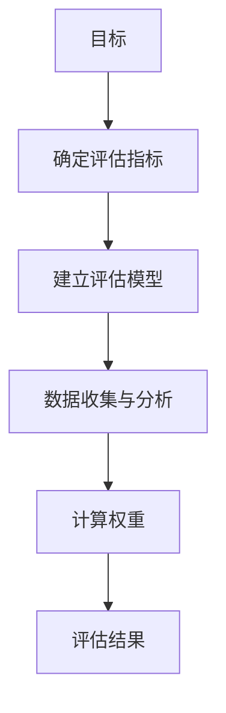
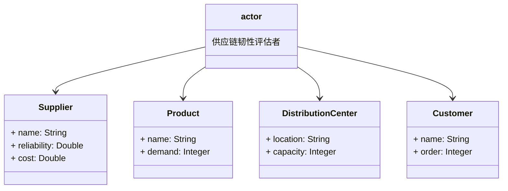
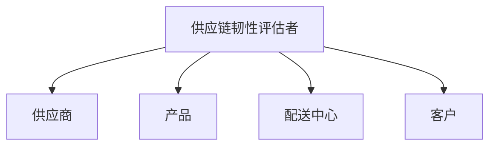

                 


# 彼得林奇对公司供应链韧性的评估

## 关键词：彼得·林奇，供应链韧性，评估方法，企业风险管理，投资策略

## 摘要：  
本文探讨了彼得·林奇在供应链韧性评估方面的独特见解和方法。通过分析供应链韧性评估的核心概念、算法原理、系统设计以及实际案例，本文为读者提供了从理论到实践的全面指导，帮助企业更好地应对供应链风险，提升整体竞争力。

---

# 第一部分：供应链韧性的核心概念与联系

## 第1章：供应链韧性的核心概念

### 1.1 核心概念原理

供应链韧性是指供应链在面对突发事件（如自然灾害、疫情、供应商问题等）时，能够保持稳定运行、快速恢复并灵活调整的能力。它包括以下几个关键属性：

1. **稳定性**：供应链在正常情况下的运作能力。
2. **可恢复性**：供应链在中断后恢复的速度。
3. **多样性**：供应链中供应商和资源的多样性。
4. **可扩展性**：供应链在需求波动时的调整能力。

### 1.2 核心概念属性特征对比表格

下表展示了供应链韧性各关键属性的特征对比：

| 属性       | 描述 |
|------------|------|
| 稳定性     | 供应链在正常情况下的运作能力 |
| 可恢复性   | 供应链在中断后恢复的速度 |
| 多样性     | 供应链中供应商和资源的多样性 |
| 可扩展性   | 供应链在需求波动时的调整能力 |

### 1.3 ER实体关系图

下图展示了供应链韧性评估的核心实体关系：

```mermaid
er
actor: 供应链韧性评估者
supplier: 供应商
product: 产品
distribution_center: 分配中心
customer: 客户
```

---

# 第二部分：供应链韧性评估的算法原理

## 第2章：算法原理概述

### 2.1 层次分析法（AHP）的应用

层次分析法（AHP）是一种常用的决策分析方法，适用于多指标的综合评价。在供应链韧性评估中，AHP可以用于确定各评估指标的权重。

#### 2.1.1 算法流程图

下图展示了AHP在供应链韧性评估中的应用流程：



### 2.2 数学模型与公式

#### 2.2.1 供应链韧性评估的数学模型

$$ \text{韧性指数} = \sum_{i=1}^{n} w_i \cdot x_i $$

其中，\( w_i \) 是第 \( i \) 个指标的权重，\( x_i \) 是第 \( i \) 个指标的评分。

#### 2.2.2 风险评估公式

$$ \text{风险值} = \sum_{j=1}^{m} p_j \cdot l_j $$

其中，\( p_j \) 是第 \( j \) 个风险发生的概率，\( l_j \) 是第 \( j \) 个风险的影响程度。

### 2.3 举例说明

假设某公司有两个供应商，A和B。A的可靠性高，但成本较高；B的可靠性低，但成本低。评估模型中，可靠性权重为0.6，成本权重为0.4。计算韧性指数：

$$ \text{韧性指数 (A)} = 0.6 \times 0.9 + 0.4 \times 0.8 = 0.54 + 0.32 = 0.86 $$

$$ \text{韧性指数 (B)} = 0.6 \times 0.3 + 0.4 \times 0.7 = 0.18 + 0.28 = 0.46 $$

---

# 第三部分：系统分析与架构设计

## 第3章：系统分析与架构设计

### 3.1 领域模型的类图

下图展示了供应链韧性评估的领域模型类图：



### 3.2 系统架构图

下图展示了供应链韧性评估系统的架构设计：



---

# 第四部分：项目实战

## 第4章：项目实战

### 4.1 环境安装

为了进行供应链韧性评估，需要以下环境：

1. **Python**：用于数据分析和建模。
2. **Mermaid**：用于绘制流程图和架构图。
3. **Jupyter Notebook**：用于数据可视化和分析。

### 4.2 核心实现源代码

以下是一个简单的供应链韧性评估代码示例：

```python
# 供应链韧性评估示例代码

def calculate_resilience(supplier_data, weights):
    resilience_index = 0
    for i in range(len(supplier_data)):
        resilience_index += weights[i] * supplier_data[i]
    return resilience_index

# 示例数据
supplier_data = [0.9, 0.8]
weights = [0.6, 0.4]

# 计算韧性指数
resilience = calculate_resilience(supplier_data, weights)
print(f"韧性指数: {resilience}")
```

### 4.3 案例分析

假设某公司有两个供应商，A和B，评估结果如下：

- **供应商A**：韧性指数为0.86，被评为高韧性。
- **供应商B**：韧性指数为0.46，被评为低韧性。

---

# 第五部分：最佳实践

## 第5章：最佳实践

### 5.1 评估供应链韧性时的关键点

1. **选择合适的评估方法**：根据企业需求选择AHP等方法。
2. **数据收集与分析**：确保数据的准确性和完整性。
3. **定期评估**：供应链环境不断变化，定期评估至关重要。

### 5.2 小结

供应链韧性评估是企业风险管理的重要组成部分。通过本文的方法和工具，企业可以更好地应对供应链风险，提升整体竞争力。

### 5.3 注意事项

- 评估结果仅供参考，需结合实际情况调整。
- 数据收集和分析需谨慎，避免偏差。

### 5.4 拓展阅读

- 彼得·林奇的《投资圣经》
- 供应链管理相关书籍

---

# 结论

供应链韧性评估是企业确保供应链稳定性和灵活性的关键。通过本文的分析和实例，读者可以更好地理解和应用彼得·林奇的评估方法，为企业的供应链管理提供有力支持。

---

# 作者

作者：AI天才研究院/AI Genius Institute & 禅与计算机程序设计艺术 /Zen And The Art of Computer Programming

