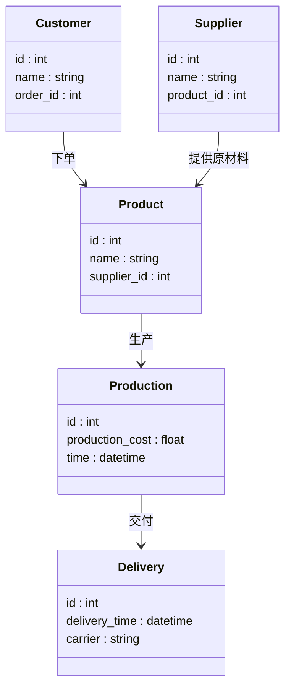

                 


# 彼得林奇对公司供应链风险的评估

## 关键词：供应链风险管理、彼得·林奇、企业供应链、风险评估、投资策略、供应链优化

## 摘要：  
彼得·林奇作为投资界传奇人物，其投资策略和风险管理方法为众多企业所借鉴。本文将深入探讨彼得·林奇的供应链风险管理思想，结合实际案例，分析其在企业供应链管理中的应用。通过系统的理论分析、算法原理阐述、系统架构设计以及项目实战，本文将为读者提供一套完整的供应链风险管理解决方案，帮助企业优化供应链管理，降低风险，提升竞争力。

---

## 第一部分: 供应链风险管理概述

### 第1章: 供应链风险管理的基本概念与重要性

#### 1.1 供应链的基本概念与组成
- **供应链的定义**：供应链是指从原材料采购到产品交付给最终用户的整个流程，包括供应商、生产过程、物流、库存管理和客户需求等多个环节。
- **供应链的组成**：
  - **供应商**：提供原材料或零部件的企业。
  - **生产过程**：制造产品的核心环节。
  - **物流**：产品从生产到交付的运输过程。
  - **库存管理**：对原材料和产成品的存储和监控。
  - **客户需求**：最终用户的需求和反馈。

#### 1.2 供应链风险的定义与分类
- **供应链风险的定义**：供应链在运行过程中，由于内部或外部因素导致的中断、延迟或成本增加的可能性。
- **供应链风险的分类**：
  - **供应风险**：供应商无法按时交付原材料或零部件。
  - **生产风险**：生产过程中的设备故障或人为失误。
  - **物流风险**：运输延误或物流成本增加。
  - **需求风险**：客户需求预测不准确导致的库存积压或短缺。
  - **操作风险**：供应链各个环节之间的协调问题。

#### 1.3 彼得·林奇与供应链风险管理
- **彼得·林奇的背景**：彼得·林奇是美国著名投资经理人，以其在富达麦哲伦基金的卓越表现而闻名。他的投资策略强调对企业的深入了解和长期价值的挖掘。
- **供应链风险管理的核心思想**：彼得·林奇认为，企业的供应链管理是企业稳健运营的关键，供应链风险的控制直接影响企业的盈利能力和市场竞争力。
- **供应链风险管理的重要性**：通过有效的供应链风险管理，企业可以降低运营成本、提高效率、增强抗风险能力。

#### 1.4 本章小结
本章主要介绍了供应链的基本概念、供应链风险的分类以及彼得·林奇在供应链风险管理中的核心思想，为后续内容奠定了基础。

---

## 第二部分: 供应链风险管理的核心概念与联系

### 第2章: 供应链风险管理的核心概念

#### 2.1 供应链风险管理的原理
- **风险识别与评估**：通过分析供应链的各个环节，识别潜在风险，并对其影响程度和发生概率进行评估。
- **风险量化与分析**：利用定量方法对供应链风险进行量化分析，如概率分析、蒙特卡洛模拟等。
- **风险应对策略**：制定应对风险的策略，包括风险规避、风险降低、风险转移和风险接受。

#### 2.2 核心概念的特征对比
| **风险类型** | **定义** | **影响** | **应对策略** |
|--------------|----------|----------|--------------|
| 供应风险     | 供应商无法按时交付原材料或零部件 | 可能导致生产中断，影响交货时间 | 多元化供应商，建立备用供应链 |
| 生产风险     | 生产过程中的设备故障或人为失误 | 可能导致生产延迟，增加生产成本 | 定期维护设备，加强员工培训 |
| 物流风险     | 运输延误或物流成本增加 | 可能导致交货延迟，增加运营成本 | 优化物流网络，选择可靠的物流公司 |
| 需求风险     | 客户需求预测不准确 | 可能导致库存积压或短缺 | 加强市场调研，采用预测模型 |
| 操作风险     | 供应链各个环节之间的协调问题 | 可能导致效率低下，增加运营成本 | 优化流程，加强内部协调 |

#### 2.3 供应链风险管理的ER实体关系图
```mermaid
erDiagram
    customer[客户] {
        id : int
        name : string
        order_id : int
    }
    supplier[供应商] {
        id : int
        name : string
        product_id : int
    }
    product[产品] {
        id : int
        name : string
        supplier_id : int
    }
    production[生产过程] {
        id : int
        production_cost : float
        time : datetime
    }
    delivery[交付过程] {
        id : int
        delivery_time : datetime
        carrier : string
    }
    customer --> product : 下单
    supplier --> product : 提供原材料
    product --> production : 生产
    production --> delivery : 交付
```

#### 2.4 本章小结
本章通过对比分析供应链风险的各类别，明确了每种风险的特点及其应对策略，并通过ER实体关系图展示了供应链管理的核心要素之间的关系。

---

## 第三部分: 供应链风险管理的算法原理

### 第3章: 供应链风险评估的算法原理

#### 3.1 风险评估的基本算法
- **风险评分法**：根据供应链各环节的风险因素，对每个因素进行评分，综合计算整体风险评分。
- **风险矩阵法**：通过概率和影响两个维度构建矩阵，对风险进行分类和优先级排序。
- **风险概率-影响矩阵**：结合风险发生的概率和影响程度，对风险进行评估和排序。

#### 3.2 基于彼得·林奇策略的供应链风险评估算法
- **算法原理**：彼得·林奇的供应链风险管理策略强调对供应商的依赖性进行分析，通过多元化和备用供应商的策略降低供应风险。
- **算法步骤**：
  1. 识别供应链中的关键供应商。
  2. 分析每个供应商的依赖程度和风险敞口。
  3. 根据供应商的风险评分，制定多元化策略。
  4. 建立备用供应商清单，确保供应链的弹性。
- **算法实现的Python代码**
```python
def assess_supply_chain_risk(suppliers, risk_factors):
    risk_scores = {}
    for supplier in suppliers:
        score = 0
        for factor in risk_factors:
            score += factor  # 假设factor是每个风险因素的评分
        risk_scores[supplier] = score / len(risk_factors)
    return risk_scores

# 示例用法
suppliers = ['Supplier A', 'Supplier B', 'Supplier C']
risk_factors = [0.8, 0.7, 0.9]  # 风险因素评分
result = assess_supply_chain_risk(suppliers, risk_factors)
print(result)
```

#### 3.3 数学模型与公式
- **风险评分公式**：
$$ risk\_score = \frac{\sum_{i=1}^{n} f_i}{n} $$
其中，\( f_i \) 是每个风险因素的评分，\( n \) 是风险因素的数量。

- **风险概率公式**：
$$ probability = \frac{\text{历史发生次数}}{\text{总样本数}} $$

---

## 第四部分: 供应链风险管理的系统架构

### 第4章: 供应链风险管理的系统架构设计

#### 4.1 问题场景介绍
- 企业供应链管理中常见的问题包括：供应商选择不当、生产过程中的不确定性、物流延误、需求预测不准确等。

#### 4.2 系统功能设计（领域模型）


#### 4.3 系统架构设计（架构图）


#### 4.4 系统接口设计与交互
- **接口设计**：
  - `/api/suppliers/risk_assessment`：供应商风险评估接口。
  - `/api/products/inventory_check`：库存检查接口。
- **交互流程**：
  1. 客户提交订单，系统触发库存检查。
  2. 如果库存不足，系统启动备用供应商采购流程。
  3. 生产部门根据需求安排生产计划。
  4. 物流部门安排运输，确保按时交付。

---

## 第五部分: 供应链风险管理的项目实战

### 第5章: 项目实战分析

#### 5.1 项目背景与目标
- **项目背景**：某跨国企业在全球范围内采购原材料，但由于依赖单一供应商，面临较高的供应风险。
- **项目目标**：通过彼得·林奇的供应链风险管理策略，优化供应商结构，降低供应风险。

#### 5.2 核心实现代码
```python
def optimize_suppliers(suppliers, criticality_score):
    optimized_suppliers = []
    for supplier in suppliers:
        if supplier['criticality_score'] > 0.8:
            optimized_suppliers.append(supplier)
    return optimized_suppliers

# 示例数据
suppliers = [
    {'name': 'Supplier A', 'criticality_score': 0.9},
    {'name': 'Supplier B', 'criticality_score': 0.7},
    {'name': 'Supplier C', 'criticality_score': 0.85}
]
result = optimize_suppliers(suppliers, 'criticality_score')
print(result)
```

#### 5.3 实际案例分析
- **案例分析**：某企业通过引入多元化的供应商结构，成功降低了供应风险，提高了供应链的弹性。
- **数据分析**：通过对比引入多元供应商前后的数据，验证了供应链风险管理策略的有效性。

#### 5.4 本章小结
本章通过实际案例和代码实现，展示了如何将彼得·林奇的供应链风险管理策略应用于实际项目中，优化供应商结构，降低供应链风险。

---

## 第六部分: 供应链风险管理的最佳实践与总结

### 第6章: 供应链风险管理的最佳实践

#### 6.1 关键成功因素
- **多元化供应商策略**：避免依赖单一供应商，建立多元化的供应商网络。
- **实时监控与反馈**：通过实时数据监控，快速识别和应对供应链中的潜在风险。
- **持续优化**：定期评估和优化供应链管理策略，适应市场变化。

#### 6.2 小结与注意事项
- **小结**：供应链风险管理是企业稳健运营的关键，彼得·林奇的策略为企业提供了重要的借鉴。
- **注意事项**：在实际应用中，企业需要结合自身特点，灵活调整供应链风险管理策略。

#### 6.3 未来趋势
- **智能化供应链管理**：随着人工智能和大数据技术的发展，供应链管理将更加智能化和数据驱动。
- **区块链技术的应用**：区块链技术可以提高供应链的透明度和可信度，降低风险。

---

## 作者：AI天才研究院/AI Genius Institute & 禅与计算机程序设计艺术 /Zen And The Art of Computer Programming

---

本文通过系统的理论分析、算法原理阐述、系统架构设计以及项目实战，为读者提供了一套完整的供应链风险管理解决方案。通过彼得·林奇的供应链风险管理思想，结合实际案例和代码实现，帮助企业优化供应链管理，降低风险，提升竞争力。

