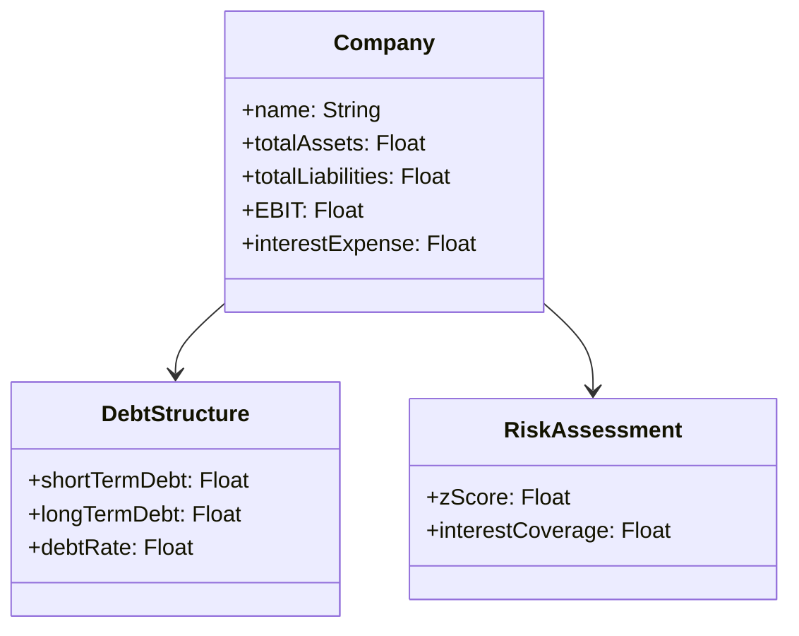

                 


# 彼得林奇对公司债务结构的分析

## 关键词：
- 彼得林奇
- 债务结构
- 财务分析
- 投资策略
- 风险评估

## 摘要：
彼得林奇是全球著名投资专家，以其对公司债务结构的深刻分析闻名。本文从债务的基本概念出发，详细探讨彼得林奇的债务分析方法，包括债务结构的核心要素、风险识别与预警机制、数学模型的应用，以及系统架构设计。文章结合实际案例，提供实战指导，并总结债务分析的关键要点，帮助读者掌握债务结构分析的技巧与应用。

---

# 第一部分: 债务结构分析的背景与基础

## 第1章: 公司债务的基本概念与重要性

### 1.1 债务的基本定义与分类

#### 1.1.1 什么是公司债务
公司债务是指企业在经营过程中，通过借款或发行债券等方式筹集的资金所形成的债务。债务的本质是企业对未来债权人承担的还款义务，包括本金和利息。

#### 1.1.2 债务的分类与特点
债务可以分为短期债务和长期债务：
- **短期债务**：如应付账款、短期贷款等，通常在一年内偿还。
- **长期债务**：如长期贷款、债券等，偿还期限超过一年。

#### 1.1.3 债务在公司财务中的作用
债务是企业融资的重要手段之一。合理利用债务可以优化资本结构，降低融资成本，同时在一定程度上避免股权稀释。然而，过高的债务可能增加企业的财务风险。

### 1.2 债务结构分析的必要性

#### 1.2.1 债务结构对企业财务健康的影响
债务结构直接影响企业的财务健康。合理的债务结构可以提高企业的偿债能力，降低违约风险。

#### 1.2.2 投资者为何关注债务结构
投资者关注债务结构是因为债务水平和结构直接关系到企业的偿债能力和财务风险。过高的债务可能导致企业面临破产风险，而合理的债务结构则有助于企业稳健发展。

#### 1.2.3 债务风险与企业价值的关系
债务风险与企业价值密切相关。适度的债务可以提升企业杠杆效应，增加股东收益，但过高的债务会增加违约风险，降低企业价值。

---

## 第2章: 彼得林奇的债务分析方法

### 2.1 彼得林奇的分析框架

#### 2.1.1 彼得林奇的分析理念
彼得林奇强调基本面分析，认为债务结构是评估企业财务健康的重要指标之一。他主张通过分析企业的债务规模、期限和利率，评估企业的偿债能力和财务风险。

#### 2.1.2 债务分析在投资决策中的地位
彼得林奇认为，债务分析是投资决策中的关键步骤。通过分析债务结构，投资者可以判断企业的财务健康状况，从而做出明智的投资决策。

#### 2.1.3 彼得林奇的经典案例分析
彼得林奇通过分析可口可乐和通用电气等公司的债务结构，揭示了债务分析在投资决策中的重要性。他强调，企业应保持合理的债务水平，避免过度杠杆化。

### 2.2 债务结构的关键指标

#### 2.2.1 负债率的计算与分析
负债率 = 总负债 / 总资产。该指标反映了企业资产中有多少是通过债务融资的。负债率过高可能表明企业财务风险较大。

#### 2.2.2 利息覆盖率的定义与应用
利息覆盖率 = 息税前利润 / 利息支出。该指标衡量了企业偿还债务利息的能力。利息覆盖率低可能表明企业偿债能力较弱。

#### 2.2.3 债务期限结构的分析
债务期限结构指的是短期债务和长期债务的比例。短期债务流动性高，风险较低，而长期债务风险较高，但期限较长。

---

## 第3章: 债务结构的核心要素与风险

### 3.1 债务结构的构成要素

#### 3.1.1 短期债务与长期债务的定义
- **短期债务**：如应付账款、短期贷款等，通常在一年内偿还。
- **长期债务**：如长期贷款、债券等，偿还期限超过一年。

#### 3.1.2 债务利率的类型与影响
- **固定利率债务**：利率在债务期限内保持不变。
- **浮动利率债务**：利率随市场利率变化而调整。

#### 3.1.3 债务担保与抵押的差异
- **担保债务**：由第三方提供担保，债务人无法偿还时，担保人承担还款责任。
- **抵押债务**：以特定资产作为抵押品，债务人无法偿还时，债权人可以处置抵押品。

### 3.2 债务风险的分类与特征

#### 3.2.1 系统性债务风险与非系统性债务风险
- **系统性债务风险**：由整个经济系统中的风险因素引起的债务风险，如经济衰退、通货膨胀等。
- **非系统性债务风险**：由企业自身经营状况引起的债务风险，如管理不善、市场竞争等。

#### 3.2.2 债务违约的定义与表现
债务违约是指债务人无法按期偿还债务本息的行为。表现包括逾期还款、减少还款金额等。

#### 3.2.3 债务链反应的机制与影响
债务链反应是指一家企业的债务违约可能引发连锁反应，影响整个金融系统的稳定性。

---

## 第4章: 彼得林奇的债务分析框架

### 4.1 债务分析的核心步骤

#### 4.1.1 确定债务规模与企业资产的匹配性
彼得林奇认为，企业债务规模应与资产规模相匹配，避免过度杠杆化。

#### 4.1.2 分析债务期限与企业现金流的匹配性
债务期限应与企业现金流的周期相匹配，确保企业有足够的现金流偿还债务。

#### 4.1.3 评估债务利率与企业盈利水平的匹配性
债务利率应与企业的盈利水平相匹配，避免因利率过高导致企业无法偿还利息。

### 4.2 债务风险的识别与预警

#### 4.2.1 债务风险的识别方法
- **财务指标分析**：通过负债率、利息覆盖率等指标评估债务风险。
- **市场风险分析**：关注宏观经济环境和市场利率变化对企业债务的影响。

#### 4.2.2 债务风险的预警机制
- **财务预警模型**：如Z-score模型，用于预测企业违约风险。
- **实时监控**：定期监控企业的财务状况，及时发现潜在风险。

---

## 第5章: 系统架构设计与实战案例

### 5.1 系统功能设计

#### 5.1.1 领域模型设计
使用Mermaid绘制领域模型类图，展示债务结构分析的核心要素。



### 5.2 系统架构设计

#### 5.2.1 系统架构图
使用Mermaid绘制系统架构图，展示债务结构分析系统的各个模块及其交互。


### 5.3 项目实战

#### 5.3.1 环境安装
- 安装Python和相关库（如pandas、numpy）。

#### 5.3.2 核心代码实现

```python
import pandas as pd

def calculate_debt_ratio(company_data):
    debt_ratio = company_data['total_liabilities'] / company_data['total_assets']
    return debt_ratio

def calculate_interest_coverage(company_data):
    interest_coverage = company_data['ebit'] / company_data['interest_expense']
    return interest_coverage

def calculate_z_score(company_data):
    z_score = (1.2 * (company_data['working capital'] / company_data['total_assets'])) + \
               (1.2 * (company_data['retained_earnings'] / company_data['total_assets'])) + \
               (1.0 * (company_data['ebit'] / company_data['total_assets'])) + \
               (0.6 * (company_data['sales'] / company_data['total_assets'])) + \
               (0.6 * (company_data['total_liabilities'] / company_data['total_assets']))
    return z_score

# 示例数据
data = {
    'total_assets': 1000000,
    'total_liabilities': 500000,
    'working_capital': 200000,
    'retained_earnings': 100000,
    'ebit': 150000,
    'interest_expense': 50000,
    'sales': 800000
}

company_data = pd.DataFrame(data, index=[0])

# 计算指标
debt_ratio = calculate_debt_ratio(company_data)
interest_coverage = calculate_interest_coverage(company_data)
z_score = calculate_z_score(company_data)

print(f" Debt Ratio: {debt_ratio[0]:.2f}")
print(f" Interest Coverage: {interest_coverage[0]:.2f}")
print(f" Z-Score: {z_score[0]:.2f}")
```

### 5.4 案例分析与总结

#### 5.4.1 案例分析
以某公司为例，使用上述代码计算其债务比率、利息覆盖率和Z-score，评估其债务风险。

#### 5.4.2 项目小结
通过实战案例，读者可以掌握如何使用Python进行债务结构分析，并应用数学模型评估债务风险。

---

## 第6章: 总结与展望

### 6.1 总结
彼得林奇的债务分析方法为我们提供了重要的启示。通过合理分析债务结构，投资者可以更好地评估企业的财务健康状况，做出明智的投资决策。

### 6.2 展望
未来，随着人工智能和大数据技术的发展，债务结构分析将更加智能化和精准化。投资者可以利用先进的技术工具，进一步优化债务分析方法，提升投资决策的科学性。

---

## 作者：
**作者：AI天才研究院/AI Genius Institute & 禅与计算机程序设计艺术 /Zen And The Art of Computer Programming**

