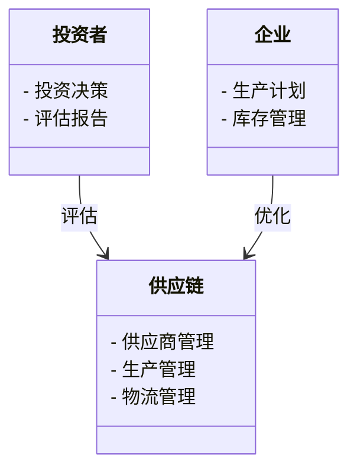

                 


# 彼得林奇对公司全球供应链管理的评估

> 关键词：供应链管理，彼得·林奇，投资评估，系统优化，效率提升

> 摘要：本文从彼得·林奇的投资视角出发，详细探讨了全球供应链管理的评估方法。通过分析供应链管理的核心概念、算法原理、系统架构以及项目实战，本文为读者提供了从理论到实践的全面指导，帮助企业在复杂的全球市场中优化供应链管理，提升竞争力。

---

## 第一部分: 全球供应链管理概述

### 第1章: 供应链管理的基本概念

#### 1.1 供应链管理的定义与特点

供应链管理是指协调和整合企业内外资源，从原材料采购、生产制造、仓储物流到产品交付的全过程管理。其特点包括：

- **系统性**：供应链涉及多个环节和参与者，是一个复杂的系统。
- **协同性**：各环节需要紧密配合，确保效率最大化。
- **动态性**：供应链需要根据市场变化灵活调整。

#### 1.2 供应链管理的核心要素

供应链管理的核心要素包括：

1. **供应商管理**：选择可靠的供应商，确保原材料供应稳定。
2. **生产流程优化**：通过精益生产减少浪费，提高效率。
3. **物流与库存管理**：优化库存水平，降低物流成本。

#### 1.3 供应链管理的演变历程

供应链管理经历了三个阶段：

1. **传统供应链管理阶段**：注重流程优化和成本控制。
2. **现代供应链管理阶段**：引入信息技术，实现可视化和实时监控。
3. **数字化供应链管理阶段**：利用大数据和人工智能提升预测和决策能力。

#### 1.4 彼得·林奇与供应链管理的关联

彼得·林奇作为投资专家，从投资者的角度关注供应链管理：

1. **投资视角**：供应链管理是企业竞争力的重要组成部分，直接影响企业价值。
2. **对投资决策的影响**：高效的供应链管理能够降低企业成本，提高利润率，增强企业的抗风险能力。

---

## 第二部分: 供应链管理的核心概念与联系

### 第2章: 供应链管理的核心概念原理

#### 2.1 供应链管理的系统性分析

供应链管理是一个复杂的系统，涉及多个环节和参与者。其系统性特征体现在：

- **整体性**：各环节相互依存，协同运作。
- **动态性**：需要根据市场变化实时调整。

#### 2.2 供应链管理的核心要素对比

通过对比分析，我们可以更好地理解供应链管理的复杂性：

| 要素         | 供应商管理 | 生产流程优化 | 物流与库存管理 |
|--------------|------------|--------------|----------------|
| 核心目标     | 确保原材料供应 | 提高生产效率 | 降低物流成本 |
| 关键挑战     | 供应商选择与协调 | 浪费与瓶颈 | 库存积压与物流延误 |

#### 2.3 供应链管理的ER实体关系图

以下是一个供应链管理的ER实体关系图：

```mermaid
er
  投资者 --> 供应链: 评估
  企业 --> 供应链: 优化
  供应链 --> 供应商: 采购
  供应链 --> 生产: 制造
  供应链 --> 物流: 运输
```

---

## 第三部分: 供应链管理的算法原理

### 第3章: 供应链管理的评估算法

#### 3.1 供应链管理评估模型的构建

供应链管理评估模型的基本框架包括以下几个步骤：

1. **数据收集**：收集供应商、生产、物流等环节的数据。
2. **数据分析**：分析数据，识别关键问题。
3. **评估与优化**：基于分析结果，提出优化建议。

#### 3.2 供应链管理评估模型的实现

以下是一个简单的供应链管理评估模型的Python代码示例：

```python
def calculate_efficiency(supplier_data, production_data, logistics_data):
    # 计算供应商效率
    supplier_efficiency = supplier_data['delivery_time'] / supplier_data['order_volume']
    
    # 计算生产效率
    production_efficiency = production_data['output'] / production_data['input']
    
    # 计算物流效率
    logistics_efficiency = logistics_data['delivery_accuracy'] / logistics_data['shipment_volume']
    
    # 综合效率评分
    overall_efficiency = (supplier_efficiency + production_efficiency + logistics_efficiency) / 3
    return overall_efficiency

# 示例数据
supplier_data = {'delivery_time': 5, 'order_volume': 10}
production_data = {'output': 8, 'input': 4}
logistics_data = {'delivery_accuracy': 9, 'shipment_volume': 6}

result = calculate_efficiency(supplier_data, production_data, logistics_data)
print(f"综合效率评分为：{result}")
```

#### 3.3 供应链管理评估的数学模型

供应链管理评估的数学模型可以表示为：

$$
\text{综合效率} = \frac{\text{供应商效率} + \text{生产效率} + \text{物流效率}}{3}
$$

其中：

- $$\text{供应商效率} = \frac{\text{交货时间}}{\text{订单量}}$$
- $$\text{生产效率} = \frac{\text{产量}}{\text{投入}}$$
- $$\text{物流效率} = \frac{\text{交付准确率}}{\text{运输量}}$$

---

## 第四部分: 供应链管理的系统分析与架构设计

### 第4章: 供应链管理的系统架构设计

#### 4.1 问题场景介绍

企业需要优化供应链管理，以提高效率和降低成本。我们设计了一个供应链管理系统，帮助企业在全球范围内优化供应链。

#### 4.2 系统功能设计

以下是系统功能模块的领域模型图：



#### 4.3 系统架构设计

以下是系统架构的mermaid图：


---

## 第五部分: 供应链管理的项目实战

### 第5章: 项目实战

#### 5.1 环境安装

需要安装以下工具和库：

- Python 3.x
- Pandas、NumPy、Scikit-learn 等数据分析库
- Mermaid 和 PlantUML 工具

#### 5.2 核心实现代码

以下是评估模型的核心实现代码：

```python
from sklearn.metrics import accuracy_score
import pandas as pd

# 示例数据
data = {
    '供应商效率': [5, 4, 6],
    '生产效率': [8, 7, 9],
    '物流效率': [9, 8, 10]
}
df = pd.DataFrame(data)

# 计算综合效率
df['综合效率'] = (df['供应商效率'] + df['生产效率'] + df['物流效率']) / 3

print(df)
```

#### 5.3 实际案例分析

以某公司为例，分析其供应链管理效率：

1. **数据收集**：收集供应商、生产、物流数据。
2. **数据分析**：识别瓶颈环节。
3. **优化建议**：优化供应商选择和物流路线。

---

## 第六部分: 最佳实践与总结

### 第6章: 最佳实践

1. **关注关键KPI**：如交货时间、生产效率和物流准确率。
2. **持续优化**：定期评估和优化供应链管理。
3. **数据安全**：保护供应链数据，防止泄露。

---

## 结语

通过本文的详细分析，读者可以全面了解彼得·林奇的供应链管理评估方法，并将其应用于实际工作中。供应链管理是企业成功的关键，通过不断优化和创新，企业可以在全球市场中立于不败之地。

---

## 作者：AI天才研究院 & 禅与计算机程序设计艺术

