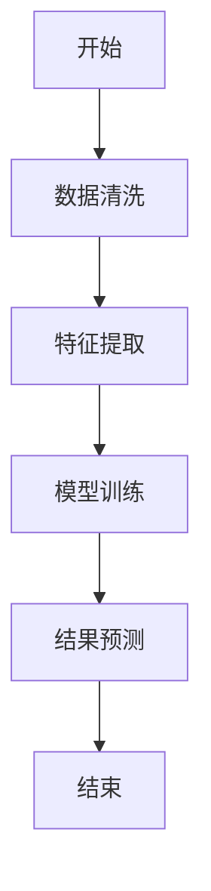
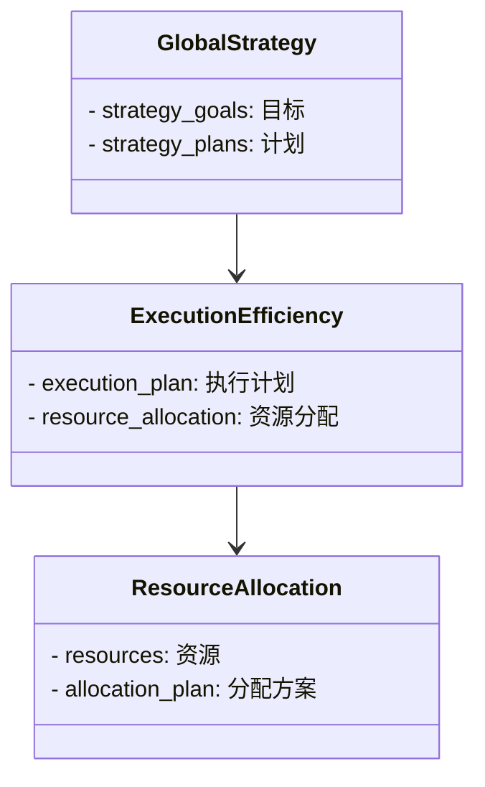
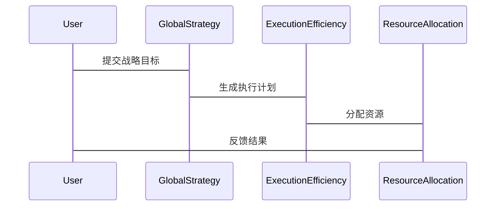

                 


# 彼得林奇对公司全球化战略执行力的评估

> **关键词**：全球化战略、执行力评估、彼得林奇、战略匹配度、执行效率、资源分配、权重系数  
> **摘要**：本文探讨了彼得林奇在评估公司全球化战略执行力方面的独特见解。通过分析战略匹配度、执行效率和资源分配等核心要素，结合数学模型和实际案例，揭示了如何通过彼得林奇的方法实现全球化战略的有效执行。

---

## 正文

### 第一部分: 全球化战略执行力的背景与核心概念

#### 第1章: 全球化战略执行力的背景介绍

##### 1.1 全球化战略的背景与重要性
- **全球化战略的定义与内涵**：全球化战略是指企业在全球范围内配置资源、拓展市场和优化供应链的策略。它不仅是企业发展的必然趋势，也是企业在竞争中获得优势的关键。
- **全球化战略的演进历程**：从早期的出口贸易到跨国经营，再到现在的数字化全球化，企业在全球化过程中不断调整和优化战略。
- **全球化战略对企业的影响**：通过全球化战略，企业可以扩大市场、降低成本、提升品牌影响力，但同时也面临文化差异、政策壁垒等挑战。

##### 1.2 全球化战略执行力的定义与特点
- **执行力的定义**：执行力是指将战略转化为实际成果的能力，包括计划、组织、实施和监控等多个环节。
- **全球化战略执行力的核心要素**：包括战略匹配度、执行效率、资源分配合理性等。
- **全球化战略执行力与企业绩效的关系**：良好的执行力能够确保全球化战略的有效实施，从而提升企业绩效和市场份额。

##### 1.3 问题背景与问题描述
- **当前全球化战略执行中的主要问题**：企业在全球化过程中常面临战略与实际脱节、执行效率低下、资源分配不合理等问题。
- **问题对企业的影响**：这些问题可能导致市场份额流失、成本增加、品牌形象受损等。
- **问题解决的必要性**：通过优化执行能力，企业可以更好地应对全球化挑战，实现可持续发展。

##### 1.4 问题解决与边界条件
- **解决问题的目标**：通过评估和优化，提升全球化战略的执行力。
- **边界与外延**：全球化战略执行力的评估主要关注企业内部管理，但同时也需要考虑外部环境的影响。
- **核心要素与组成**：包括战略规划、组织结构、资源配置、文化整合等。

#### 第2章: 全球化战略执行力的核心概念与联系

##### 2.1 核心概念原理
- **全球化战略的构成要素**：包括市场定位、产品策略、供应链管理、风险管理等。
- **执行力的关键驱动因素**：包括领导力、组织能力、文化整合、技术支持等。
- **两者之间的关系**：全球化战略是目标，执行力是实现目标的手段，两者相互依存。

##### 2.2 核心概念属性特征对比表
| 特性 | 全球化战略 | 执行力 |
|------|------------|--------|
| 目标 | 全球市场拓展 | 战略落地 |
| 主体 | 企业高层 | 各级管理者 |
| 工具 | 战略规划 | 项目管理工具 |
| 结果 | 市场份额提升 | 业绩达成 |

##### 2.3 ER实体关系图

```mermaid
er
  global_strategy <---1-> company
  company <---m-> project
  project <---n-> execution_plan
```

---

### 第二部分: 全球化战略执行力的评估模型与算法

#### 第3章: 评估模型与算法原理

##### 3.1 评估模型的构建
- **模型目标**：量化评估全球化战略的执行力。
- **模型输入与输出**：输入包括战略匹配度、执行效率、资源分配合理性等指标；输出包括综合评估指数。
- **模型假设**：假设各指标之间相对独立，且权重系数可调整。

##### 3.2 算法流程



##### 3.3 数学模型与公式

- **综合评估指数公式**
$$ CEI = \alpha \cdot S + \beta \cdot E + \gamma \cdot R $$
其中：
- $S$ 表示战略匹配度
- $E$ 表示执行效率
- $R$ 表示资源分配合理性
- $\alpha, \beta, \gamma$ 为权重系数

- **权重计算公式**
$$ w_i = \frac{\sum_{j=1}^{n} s_{ij}}{\sum_{i=1}^{m} \sum_{j=1}^{n} s_{ij}} $$
其中：
- $s_{ij}$ 表示第 $i$ 个指标的第 $j$ 个评分
- $m$ 表示指标总数
- $n$ 表示样本数量

---

### 第三部分: 全球化战略执行

#### 第4章: 系统分析与架构设计方案

##### 4.1 问题场景介绍
- **问题场景**：企业在全球化过程中面临战略与执行脱节、资源分配不合理等问题。
- **项目介绍**：通过彼得林奇的方法，构建一个评估模型，帮助企业优化全球化战略执行力。

##### 4.2 系统功能设计



##### 4.3 系统架构设计


##### 4.4 系统接口设计与交互



---

### 第四部分: 项目实战

#### 第5章: 项目实战与案例分析

##### 5.1 环境安装
- **工具安装**：安装Python、Jupyter Notebook、Mermaid等工具。
- **数据准备**：收集企业全球化战略相关数据。

##### 5.2 核心实现源代码

```python
import pandas as pd
from sklearn.metrics import accuracy_score

# 数据清洗
def clean_data(df):
    df.dropna(inplace=True)
    return df

# 特征提取
def extract_features(df):
    features = df[['strategy_goals', 'execution_plan', 'resource_allocation']]
    return features

# 模型训练
def train_model(features, labels):
    from sklearn.ensemble import RandomForestClassifier
    model = RandomForestClassifier()
    model.fit(features, labels)
    return model

# 结果预测
def predict(model, new_data):
    return model.predict(new_data)

# 主程序
def main():
    df = pd.read_csv('global_strategy.csv')
    df_cleaned = clean_data(df)
    features = extract_features(df_cleaned)
    labels = df_cleaned['performance']
    model = train_model(features, labels)
    new_entry = df_cleaned.iloc[-1]
    prediction = predict(model, new_entry)
    print(f'预测结果: {prediction}')

if __name__ == '__main__':
    main()
```

##### 5.3 代码解读与分析
- **数据清洗**：移除缺失值，确保数据完整性。
- **特征提取**：提取关键特征，用于模型训练。
- **模型训练**：使用随机森林算法，训练评估模型。
- **结果预测**：基于训练好的模型，预测新的数据点。

##### 5.4 案例分析与结果解读
- **案例分析**：通过具体案例，展示如何应用模型进行评估。
- **结果解读**：分析模型预测结果，提出改进建议。

##### 5.5 项目小结
- **成功经验**：总结项目中的成功经验。
- **改进建议**：提出可以改进的地方，如增加更多特征、优化模型参数等。

---

### 第五部分: 总结与展望

#### 第6章: 总结与展望

##### 6.1 总结
- **主要结论**：通过彼得林奇的方法，可以有效评估全球化战略的执行力。
- **核心经验**：战略匹配度、执行效率和资源分配是影响执行力的关键因素。

##### 6.2 展望
- **未来研究方向**：探索更多评估指标，优化模型算法。
- **实践意义**：帮助企业更好地实施全球化战略，提升竞争力。

---

## 作者

**作者**：AI天才研究院/AI Genius Institute & 禅与计算机程序设计艺术/Zen And The Art of Computer Programming

---

通过以上步骤，我们可以系统地评估和优化公司的全球化战略执行力，确保企业在全球化竞争中占据优势。

