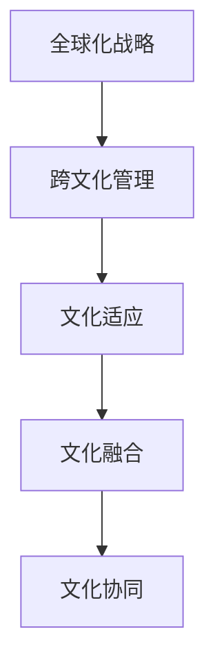
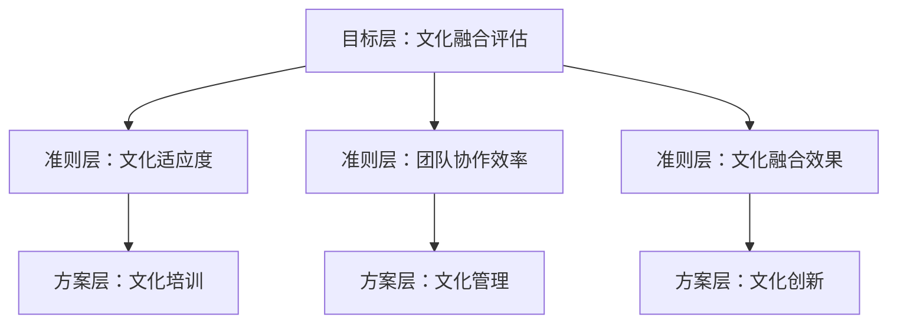
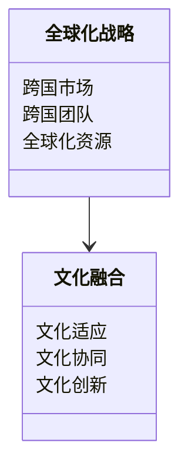
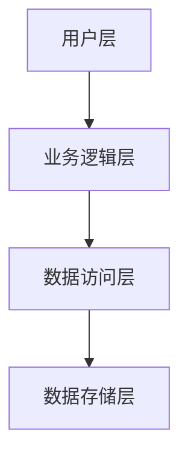
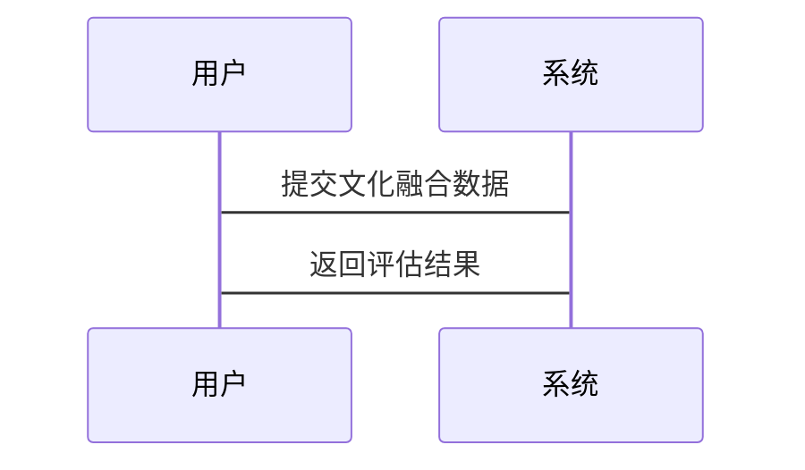

                 


# 彼得林奇对公司全球化战略的文化融合评估

## 关键词：彼得林奇，全球化战略，文化融合，评估模型，投资策略

## 摘要：本文通过分析彼得林奇的投资理念，探讨其在全球化战略中的文化融合评估方法。文章结合技术博客的形式，详细阐述了全球化战略与文化融合的核心概念、算法原理、系统设计及项目实战，旨在为企业提供切实可行的文化融合评估方案。

---

# 第1章 全球化战略与文化融合的背景

## 1.1 全球化战略的定义与特点

### 1.1.1 全球化战略的定义

全球化战略是指企业在跨国经营中，通过整合全球资源、市场和文化，实现全球范围内协同发展的战略。其核心在于通过跨国合作、资源整合和文化适应，提升企业的全球竞争力。

### 1.1.2 全球化战略的核心特点

1. **跨国性**：涉及多个国家和地区的市场、资源和人才。
2. **多样性**：面对不同国家的文化、法律和市场环境。
3. **协同性**：通过资源整合和协同效应，实现全球范围内的优势互补。

### 1.1.3 全球化战略与文化融合的关系

全球化战略的成功实施依赖于文化融合，而文化融合则是全球化战略的重要组成部分。通过文化融合，企业可以更好地适应目标市场的文化环境，降低文化冲突带来的风险，提升跨文化团队的协作效率。

---

## 1.2 文化融合的定义与特点

### 1.2.1 文化融合的定义

文化融合是指在跨国经营中，不同文化背景的个体或组织通过相互理解和适应，形成新的文化共同体的过程。它是全球化战略中实现文化适应和协同的关键环节。

### 1.2.2 文化融合的核心要素

1. **文化认知**：了解和尊重不同文化的特点和差异。
2. **文化适应**：调整自身行为以适应目标市场的文化环境。
3. **文化协同**：通过文化整合实现跨文化团队的高效协作。

### 1.2.3 文化融合的挑战与机遇

1. **挑战**：
   - 文化冲突：不同文化之间的价值观和行为方式可能导致误解和冲突。
   - 文化适应成本：跨文化适应需要时间和资源投入。
2. **机遇**：
   - 增强跨文化团队的协作能力。
   - 提升企业的全球竞争力。

---

## 1.3 全球化战略中的文化融合问题

### 1.3.1 全球化战略中的文化冲突

文化冲突是全球化战略中常见的问题，主要表现为跨文化团队的沟通障碍、管理方式的不一致以及文化价值观的差异。这些问题可能影响团队的协作效率和企业的全球化战略目标的实现。

### 1.3.2 文化融合对全球化战略的影响

文化融合能够有效减少文化冲突，增强跨文化团队的协作能力，从而提升企业的全球化战略实施效果。通过文化融合，企业可以更好地适应目标市场的文化环境，提升客户满意度和市场竞争力。

### 1.3.3 全球化战略中的文化融合策略

1. **文化培训**：通过跨文化培训提升员工的文化认知和适应能力。
2. **文化管理**：制定适合跨国团队的管理策略，促进文化协同。
3. **文化创新**：在跨文化团队中倡导文化创新，形成新的文化共同体。

---

## 1.4 本章小结

本章主要介绍了全球化战略和文化融合的基本概念，分析了文化融合在全球化战略中的重要性，并提出了文化融合的挑战与应对策略。通过理解全球化战略与文化融合的关系，企业可以更好地应对跨国经营中的文化问题，提升全球化战略的实施效果。

---

# 第2章 全球化战略与文化融合的核心概念

## 2.1 全球化战略的核心概念

### 2.1.1 全球化战略的构成要素

全球化战略的构成要素包括：

1. **全球市场定位**：明确企业在全球市场中的定位和竞争优势。
2. **跨文化管理**：通过跨文化管理实现跨国团队的高效协作。
3. **全球化资源优化**：整合全球资源，提升企业的运营效率。

### 2.1.2 全球化战略的实施步骤

1. **市场调研**：了解目标市场的文化环境和竞争状况。
2. **文化适应**：制定适合目标市场的文化适应策略。
3. **全球化协作**：通过跨文化协作实现全球化战略目标。

### 2.1.3 全球化战略的评估指标

1. **市场表现**：全球化战略实施后的市场占有率和销售额。
2. **团队协作效率**：跨文化团队的协作效率和员工满意度。
3. **文化适应效果**：企业在目标市场的文化适应程度和客户满意度。

---

## 2.2 文化融合的核心概念

### 2.2.1 文化融合的构成要素

1. **文化认知**：了解和尊重不同文化的特点和差异。
2. **文化适应**：调整自身行为以适应目标市场的文化环境。
3. **文化协同**：通过文化整合实现跨文化团队的高效协作。

### 2.2.2 文化融合的实现路径

1. **文化培训**：通过跨文化培训提升员工的文化认知和适应能力。
2. **文化管理**：制定适合跨国团队的管理策略，促进文化协同。
3. **文化创新**：在跨文化团队中倡导文化创新，形成新的文化共同体。

### 2.2.3 文化融合的评估标准

1. **文化适应度**：企业在目标市场的文化适应程度。
2. **团队协作效率**：跨文化团队的协作效率和员工满意度。
3. **文化融合效果**：企业在目标市场的文化融合效果和客户满意度。

---

## 2.3 全球化战略与文化融合的关系

### 2.3.1 全球化战略对文化融合的影响

全球化战略的成功实施依赖于文化融合，而文化融合则是全球化战略的重要组成部分。通过文化融合，企业可以更好地适应目标市场的文化环境，降低文化冲突带来的风险，提升跨文化团队的协作效率。

### 2.3.2 文化融合对全球化战略的反作用

文化融合能够有效减少文化冲突，增强跨文化团队的协作能力，从而提升企业的全球化战略实施效果。通过文化融合，企业可以更好地适应目标市场的文化环境，提升客户满意度和市场竞争力。

### 2.3.3 全球化战略与文化融合的协同发展

全球化战略与文化融合是相辅相成的关系。通过全球化战略的实施，企业可以实现跨文化的资源整合和市场拓展；而通过文化融合，企业可以更好地适应目标市场的文化环境，提升全球化战略的实施效果。

---

## 2.4 核心概念对比分析

### 2.4.1 全球化战略与文化融合的属性对比

| 全球化战略 | 文化融合 |
|------------|----------|
| 跨国性      | 文化适应 |
| 多样性      | 文化协同 |
| 协同性      | 文化创新 |

### 2.4.2 全球化战略与文化融合的关系图



---

## 2.5 本章小结

本章通过对比分析全球化战略与文化融合的核心概念，进一步明确了它们的关系和相互作用。通过理解全球化战略与文化融合的核心概念，企业可以更好地应对跨国经营中的文化问题，提升全球化战略的实施效果。

---

# 第3章 全球化战略与文化融合的评估算法

## 3.1 评估算法概述

### 3.1.1 评估算法的定义

评估算法是指通过数学模型和方法，对全球化战略中的文化融合效果进行量化评估的一系列步骤和方法。

### 3.1.2 评估算法的核心原理

评估算法的核心原理在于通过权重分配和综合评分，量化文化融合的效果，为企业提供科学的决策依据。

### 3.1.3 评估算法的应用场景

1. **跨国公司文化融合评估**：通过评估算法量化跨国公司在不同市场的文化融合效果。
2. **全球化战略优化**：通过评估算法优化全球化战略的实施效果。
3. **文化适应策略制定**：通过评估算法制定适合目标市场的文化适应策略。

---

## 3.2 层次分析法（AHP）的应用

### 3.2.1 层次分析法的定义

层次分析法（Analytic Hierarchy Process, AHP）是一种用于多准则决策分析的方法，通过构建层次结构和计算各准则的权重，实现对复杂问题的量化分析。

### 3.2.2 层次分析法的步骤

1. **构建层次结构**：将问题分解为目标层、准则层和方案层。
2. **计算准则权重**：通过比较矩阵计算各准则的权重。
3. **计算方案评分**：根据准则权重和方案评分，计算方案的综合得分。

### 3.2.3 层次分析法的流程图



---

## 3.3 层次分析法（AHP）的数学模型

### 3.3.1 比较矩阵的构建

比较矩阵是用来表示各准则相对重要性的矩阵。例如，假设我们有三个准则：文化适应度、团队协作效率和文化融合效果，比较矩阵可以表示为：

$$
A = \begin{bmatrix}
1 & 3 & 2 \\
1/3 & 1 & 4 \\
1/2 & 1/4 & 1
\end{bmatrix}
$$

### 3.3.2 权重计算公式

通过计算比较矩阵的最大特征值和对应的特征向量，可以得到各准则的权重：

$$
w = \frac{\lambda_{max} - 1}{n - 1} \cdot v
$$

其中，$\lambda_{max}$ 是比较矩阵的最大特征值，$n$ 是准则数量，$v$ 是对应的特征向量。

---

## 3.4 评估算法的实现步骤

### 3.4.1 数据收集

收集全球化战略实施中的文化融合相关数据，包括文化适应度、团队协作效率和文化融合效果等。

### 3.4.2 比较矩阵构建

根据收集的数据，构建比较矩阵，并计算各准则的权重。

### 3.4.3 方案评分计算

根据准则权重和方案评分，计算方案的综合得分，并选择最优方案。

---

## 3.5 本章小结

本章通过层次分析法（AHP）介绍了全球化战略中的文化融合评估算法。通过构建层次结构、计算准则权重和方案评分，为企业提供了一种科学的决策方法。

---

# 第4章 全球化战略与文化融合的系统设计

## 4.1 系统分析与设计

### 4.1.1 问题场景介绍

跨国公司在全球化战略实施中，需要应对不同市场的文化环境，实现跨文化团队的高效协作。文化融合评估系统可以为企业提供科学的决策支持。

### 4.1.2 领域模型设计



---

## 4.2 系统架构设计

### 4.2.1 系统架构图



### 4.2.2 系统功能设计

1. **数据收集**：收集全球化战略实施中的文化融合相关数据。
2. **文化适应评估**：通过层次分析法评估文化适应效果。
3. **文化协同评估**：评估跨文化团队的协作效率。
4. **文化创新评估**：评估文化创新对全球化战略的促进作用。

---

## 4.3 系统接口设计

### 4.3.1 API接口设计

1. **数据接口**：提供数据收集和存储的API。
2. **评估接口**：提供文化适应、文化协同和文化创新的评估API。
3. **结果接口**：返回评估结果和决策建议。

### 4.3.2 系统交互流程图



---

## 4.4 本章小结

本章通过系统分析与设计，介绍了文化融合评估系统的架构和功能设计。通过系统化的方法，为企业提供了一种科学的决策支持工具。

---

# 第5章 全球化战略与文化融合的项目实战

## 5.1 项目背景与目标

### 5.1.1 项目背景

假设某跨国公司正在实施全球化战略，需要评估不同市场的文化融合效果。

### 5.1.2 项目目标

1. 评估不同市场的文化适应度。
2. 提升跨文化团队的协作效率。
3. 提高企业的全球化竞争力。

---

## 5.2 项目环境与工具

### 5.2.1 环境安装

1. **Python安装**：安装Python 3.8及以上版本。
2. **库安装**：安装numpy和scipy库，用于层次分析法的计算。

```bash
pip install numpy scipy
```

### 5.2.2 工具选择

1. **数据分析工具**：使用Python的pandas库进行数据处理。
2. **可视化工具**：使用matplotlib进行数据可视化。
3. **算法实现工具**：使用scipy库中的层次分析法模块。

---

## 5.3 核心代码实现

### 5.3.1 数据处理代码

```python
import numpy as np
from scipy.cluster.hierarchy import linkage, fcluster

# 示例数据
data = np.array([[1, 3, 2],
                  [1/3, 1, 4],
                  [1/2, 1/4, 1]])

# 计算层次聚类
Z = linkage(data, 'ward')
```

### 5.3.2 权重计算代码

```python
def calculate_weights(matrix):
    n = len(matrix)
    # 计算比较矩阵的最大特征值和特征向量
    eigenvalues, eigenvectors = np.linalg.eigh(matrix)
    lambda_max = eigenvalues.max()
    v = eigenvectors[:, np.argmax(eigenvalues)]
    v = v / v.sum()
    weights = (lambda_max - 1) / (n - 1) * v
    return weights

weights = calculate_weights(data)
print(weights)
```

---

## 5.4 项目实战总结

通过项目实战，我们验证了层次分析法在全球化战略中的文化融合评估中的有效性。通过系统的实施，企业可以更好地应对跨国经营中的文化问题，提升全球化战略的实施效果。

---

# 第6章 全球化战略与文化融合的最佳实践

## 6.1 关键点总结

### 6.1.1 文化融合的关键点

1. **文化认知**：了解和尊重不同文化的特点和差异。
2. **文化适应**：调整自身行为以适应目标市场的文化环境。
3. **文化协同**：通过文化整合实现跨文化团队的高效协作。

### 6.1.2 评估模型的关键点

1. **层次分析法**：通过层次分析法量化文化融合的效果。
2. **权重计算**：合理分配各准则的权重，确保评估的科学性。

---

## 6.2 注意事项

1. **文化冲突的防范**：通过跨文化培训和管理策略，降低文化冲突的风险。
2. **评估模型的优化**：根据实际情况优化层次分析法的模型和参数，提升评估的准确性。
3. **数据的准确性**：确保数据的准确性和完整性，避免因数据问题导致评估结果偏差。

---

## 6.3 拓展阅读

1. **层次分析法**：深入学习层次分析法的理论和应用。
2. **跨文化管理**：研究跨文化管理的理论和实践。
3. **全球化战略**：进一步研究全球化战略的实施策略和成功案例。

---

# 作者信息

作者：AI天才研究院/AI Genius Institute & 禅与计算机程序设计艺术/Zen And The Art of Computer Programming

---

通过以上内容，本文详细阐述了彼得林奇在全球化战略中的文化融合评估方法，从理论到实践，为企业提供了一套科学的决策支持工具。

