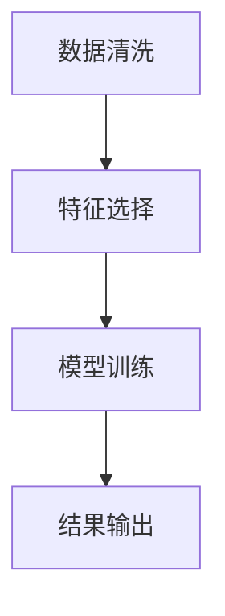
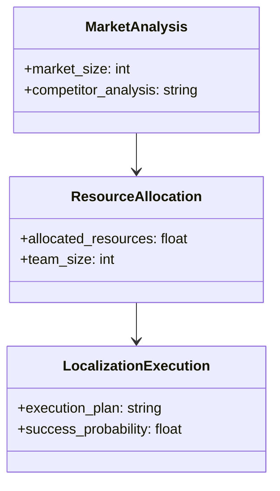
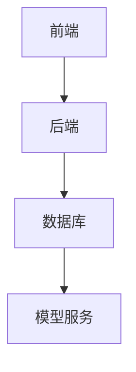
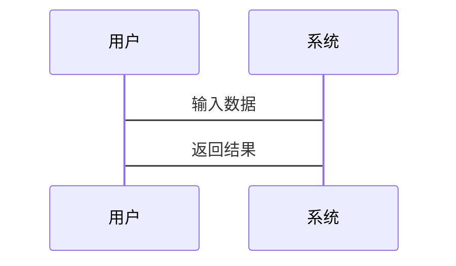

                 


# 彼得林奇对公司全球化战略的本地化执行力评估

## 关键词：彼得林奇，全球化战略，本地化执行，公司评估，战略模型，执行力分析

## 摘要：  
本文基于彼得·林奇的投资理念，深入探讨全球化战略下的本地化执行力评估方法。通过分析本地化执行的核心要素、算法原理和数学模型，结合实际案例，提出一套完整的评估体系，帮助企业有效提升全球化战略的本地化执行能力。

---

# 第一部分：全球化战略与本地化执行的背景与核心概念

## 第1章：全球化战略与本地化执行的背景

### 1.1 全球化战略的定义与重要性  
全球化战略是指企业在跨国市场中拓展业务，通过资源整合、市场布局和文化适应等手段，实现跨文化、跨市场的协同发展。其重要性体现在：  
1. **市场扩展**：通过全球化战略，企业可以进入更大的市场，扩大营收规模。  
2. **资源优化**：在全球范围内配置资源，降低生产成本。  
3. **竞争力提升**：通过全球化布局，企业可以更好地应对国际竞争。  

#### 1.1.1 全球化战略的定义  
全球化战略是指企业在全球范围内进行市场拓展、资源整合和价值创造的系统性规划。

#### 1.1.2 全球化战略在企业中的重要性  
全球化战略是企业实现可持续增长的重要途径，能够帮助企业突破单一市场的限制，提升全球竞争力。

#### 1.1.3 全球化战略的核心要素  
- 市场分析  
- 资源配置  
- 组织架构  

### 1.2 本地化执行的定义与意义  
本地化执行是指企业在特定市场中，根据当地文化、法律和消费者需求调整产品、服务和运营策略的过程。其意义在于：  
1. **提高客户满意度**：通过本地化，企业能够更好地满足当地市场需求。  
2. **增强市场竞争力**：本地化能够帮助企业快速适应当地竞争环境。  
3. **降低风险**：通过本地化，企业可以减少因文化差异或法律问题带来的风险。  

#### 1.2.1 本地化执行的定义  
本地化执行是指企业在特定市场中，调整产品、服务和运营策略以适应当地需求的过程。

#### 1.2.2 本地化执行在企业中的意义  
本地化执行是企业在全球化战略中实现市场适应性和竞争力的重要手段。

#### 1.2.3 本地化执行的核心要素  
- 市场调研  
- 产品调整  
- 营销策略  

### 1.3 全球化战略与本地化执行的关系  
全球化战略与本地化执行是相辅相成的：全球化战略为企业提供总体方向，而本地化执行则是实现这一方向的关键手段。

#### 1.3.1 全球化战略与本地化执行的内在联系  
全球化战略需要通过本地化执行来实现具体的市场目标。

#### 1.3.2 全球化战略中的本地化执行挑战  
- 跨文化管理难度大  
- 本地法规复杂  

#### 1.3.3 本地化执行对全球化战略的影响  
本地化执行的成功直接关系到全球化战略的成败。

---

## 第2章：彼得林奇的全球化战略分析方法  

### 2.1 彼得林奇的公司分析框架  
彼得林奇以其独特的基本面分析方法闻名，强调对企业基本面的深入研究。

#### 2.1.1 彼得林奇的投资理念  
- 长期投资  
- 坚持基本面分析  

#### 2.1.2 彼得林奇的公司基本面分析方法  
- 财务指标分析  
- 市场地位评估  

#### 2.1.3 彼得林奇的全球化战略视角  
彼得林奇认为，全球化是企业增长的重要驱动力，但需要结合本地化执行。

### 2.2 彼得林奇对全球化战略的本地化执行力评估  
彼得林奇提出了一套基于本地化执行力的评估标准，帮助企业优化全球化战略。

#### 2.2.1 彼得林奇的本地化执行力评估标准  
- 本地化团队能力  
- 本地化资源配置  

#### 2.2.2 彼得林奇的全球化战略本地化执行案例分析  
通过具体案例，分析本地化执行对企业全球化战略的影响。

#### 2.2.3 彼得林奇的全球化战略本地化执行评估模型  
构建一个基于彼得林奇理念的评估模型，帮助企业量化本地化执行能力。

---

## 第3章：全球化战略与本地化执行的核心概念  

### 3.1 全球化战略的本地化执行模型  
本地化执行模型是全球化战略的核心工具之一。

#### 3.1.1 模型的定义与构成  
本地化执行模型包括市场分析、资源配置和执行监控三个核心模块。

#### 3.1.2 模型的输入与输出  
- 输入：市场数据、企业资源  
- 输出：本地化执行方案  

#### 3.1.3 模型的评估指标  
- 执行效率  
- 市场适应性  

### 3.2 全球化战略与本地化执行的对比分析  
通过对比分析，明确全球化战略与本地化执行的异同。

#### 3.2.1 全球化战略与本地化执行的对比  
- 全球化战略注重整体布局  
- 本地化执行注重市场适应  

#### 3.2.2 全球化战略与本地化执行的优缺点  
- 全球化战略的优点：市场扩展能力强  
- 本地化执行的缺点：执行成本高  

#### 3.2.3 全球化战略与本地化执行的协同效应  
两者的协同效应是企业实现全球化目标的关键。

### 3.3 全球化战略本地化执行的核心要素  
本地化执行的成功取决于多个关键要素。

#### 3.3.1 本地化战略的制定  
制定清晰的本地化战略是成功的关键。

#### 3.3.2 本地化团队的构建  
组建专业的本地化团队是执行成功的基础。

#### 3.3.3 本地化资源的分配  
合理分配资源是确保执行效果的重要保障。

---

# 第二部分：全球化战略本地化执行的算法与数学模型  

## 第4章：全球化战略本地化执行的算法原理  

### 4.1 算法原理概述  
本地化执行的算法原理包括数据采集、特征提取和模型训练三个主要步骤。

#### 4.1.1 算法的目标与输入  
- 目标：预测本地化执行的成功概率  
- 输入：市场数据、企业资源  

#### 4.1.2 算法的核心步骤  
- 数据清洗  
- 特征选择  
- 模型训练  

#### 4.1.3 算法的输出与结果  
- 输出：本地化执行的成功概率  
- 结果：评估报告  

### 4.2 算法流程图  
使用mermaid绘制算法流程图。



### 4.3 算法实现的Python代码  
以下是实现本地化执行评估的Python代码示例：

```python
import pandas as pd
from sklearn.tree import DecisionTreeClassifier

# 数据加载
data = pd.read_csv('localization_data.csv')

# 数据清洗
data.dropna(inplace=True)

# 特征选择
features = ['market_size', 'resource Allocation']
target = 'success_probability'

# 模型训练
model = DecisionTreeClassifier()
model.fit(data[features], data[target])

# 预测结果
predicted = model.predict(data[features])
```

## 第5章：全球化战略本地化执行的数学模型与公式  

### 5.1 数学模型的构建  
本地化执行评估的数学模型可以表示为：

$$ \text{Success Probability} = \frac{\text{Local Resource Allocation} + \text{Market Adaptability}}{2} $$

### 5.2 模型的优化  
通过调整权重参数，优化模型的预测准确性。

$$ w_1 \times x_1 + w_2 \times x_2 $$

### 5.3 模型的应用  
将数学模型应用于实际案例分析，验证其有效性。

---

## 第6章：全球化战略本地化执行的系统架构设计  

### 6.1 系统功能设计（领域模型）  
使用mermaid绘制领域模型类图。



### 6.2 系统架构设计（系统架构图）  
使用mermaid绘制系统架构图。



### 6.3 系统接口设计  
定义系统接口，包括数据输入、模型调用和结果输出。

#### 6.3.1 数据输入接口  
```python
def input_data(data):
    # 实现数据输入逻辑
    pass
```

#### 6.3.2 模型调用接口  
```python
def call_model(model, data):
    # 实现模型调用逻辑
    pass
```

#### 6.3.3 结果输出接口  
```python
def output_result(result):
    # 实现结果输出逻辑
    pass
```

### 6.4 系统交互设计（交互序列图）  
使用mermaid绘制系统交互序列图。



---

## 第7章：全球化战略本地化执行的项目实战  

### 7.1 项目介绍  
通过一个跨国公司的案例，展示本地化执行评估的实际应用。

### 7.2 核心代码实现  
实现本地化执行评估的核心代码。

```python
import pandas as pd
from sklearn.metrics import accuracy_score

# 数据加载
data = pd.read_csv('localization_data.csv')

# 数据清洗
data.dropna(inplace=True)

# 特征选择
features = ['market_size', 'resource Allocation']
target = 'success_probability'

# 模型训练
model = DecisionTreeClassifier()
model.fit(data[features], data[target])

# 预测结果
predicted = model.predict(data[features])

# 计算准确率
accuracy = accuracy_score(data[target], predicted)
print(f'准确率: {accuracy}')
```

### 7.3 项目小结  
总结项目实施的经验和教训，提出改进建议。

---

## 第8章：全球化战略本地化执行的最佳实践  

### 8.1 小结  
回顾文章的核心内容，强调本地化执行的重要性。

### 8.2 注意事项  
- 数据质量  
- 模型选择  

### 8.3 拓展阅读  
推荐相关领域的书籍和论文，供读者深入学习。

---

## 作者：AI天才研究院/AI Genius Institute & 禅与计算机程序设计艺术 /Zen And The Art of Computer Programming

