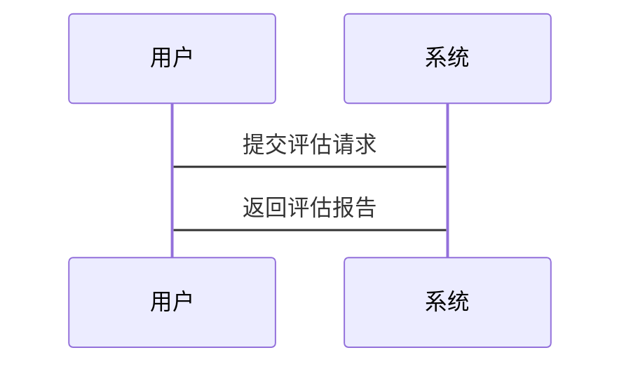

                 


# 彼得·林奇对公司全球化战略的风险收益评估

## 关键词：彼得·林奇，全球化战略，风险收益评估，投资策略，系统架构

## 摘要：  
本文深入分析彼得·林奇的全球化战略及其风险收益评估方法，通过背景介绍、核心概念解析、算法原理、数学模型、系统架构设计、项目实战等多维度展开，结合实际案例和最佳实践，帮助读者全面理解并掌握如何在现代商业环境中进行全球化战略的风险收益评估。

---

## 第1章: 引言

### 1.1 本书的目的与意义  
- **目标**：通过分析彼得·林奇的全球化战略，帮助读者掌握风险收益评估的方法，为企业全球化战略提供理论和实践指导。  
- **意义**：全球化战略是现代企业发展的重要方向，而彼得·林奇的投资理念为企业全球化战略提供了独特的视角。  

### 1.2 彼得·林奇与全球化战略  
- **彼得·林奇的背景**：著名投资经理，以价值投资和风险控制著称。  
- **全球化战略的核心**：通过全球化布局分散风险，挖掘潜在收益。  

### 1.3 本书的结构安排  
- **章节概览**：从理论到实践，从分析到设计，层层递进，帮助读者系统性掌握全球化战略的风险收益评估方法。

---

## 第2章: 全球化战略的背景与概念

### 2.1 全球化战略的定义与特点  
- **定义**：全球化战略是指企业在全球范围内配置资源、拓展市场、优化供应链的过程。  
- **特点**：  
  1. 跨界性：跨越国界，资源整合全球化。  
  2. 复雜性：涉及多国法律、文化差异。  
  3. 风险性：外部环境波动大，内部管理难度高。  

### 2.2 全球化战略的背景分析  
- **历史演变**：从贸易自由化到数字经济时代。  
- **当前趋势**：数字化、智能化、绿色化成为全球化的新驱动力。  
- **挑战**：地缘政治风险、供应链中断、文化冲突等。  

### 2.3 全球化战略的核心要素  
- **核心要素**：  
  1. 市场分析：目标市场选择与潜力评估。  
  2. 资源配置：资金、技术、人才的全球分配。  
  3. 风险管理：政治、经济、法律风险的控制。  

---

## 第3章: 彼得·林奇的全球化战略分析

### 3.1 彼得·林奇的投资哲学  
- **长期投资**：寻找具有持续增长潜力的企业。  
- **价值发现**：关注被低估的投资机会。  
- **风险控制**：通过分散投资降低风险。  

### 3.2 彼得·林奇的全球化战略框架  
- **全球化战略的三个层次**：  
  1. **战略规划**：明确全球化目标和路径。  
  2. **风险管理**：建立风险评估和应对机制。  
  3. **执行监控**：实时跟踪战略实施效果。  

### 3.3 彼得·林奇全球化战略的案例分析  
- **案例一：XYZ公司的全球化扩张**：通过市场分析和资源配置实现快速增长。  
- **案例二：ABC公司的全球化调整**：通过风险管理应对地缘政治风险。  

---

## 第4章: 全球化战略的风险收益评估模型

### 4.1 风险收益评估的基本原理  
- **风险与收益的关系**：收益越高，风险越大。  
- **评估模型的核心**：通过数学模型量化风险和收益的动态关系。  

### 4.2 彼得·林奇的风险收益评估模型  
- **层次分析法**：用于权重分配和综合评估。  
- **决策树模型**：用于风险场景的模拟与分析。  

### 4.3 数学模型与公式  
- **收益计算公式**：  
  $$ \text{收益} = \alpha \times \text{市场增长} + \beta \times \text{竞争优势} $$  
- **风险计算公式**：  
  $$ \text{风险} = \gamma \times \text{外部冲击} + \delta \times \text{内部管理问题} $$  

---

## 第5章: 系统分析与架构设计

### 5.1 问题场景介绍  
- **目标**：构建一个全球化战略的风险收益评估系统。  
- **项目介绍**：从数据收集、模型构建到结果输出的全流程设计。  

### 5.2 系统功能设计  
- **功能模块**：  
  1. 数据采集模块：收集市场、政策等数据。  
  2. 模型构建模块：实现风险收益评估模型。  
  3. 结果输出模块：生成评估报告。  

### 5.3 系统架构设计  


### 5.4 系统接口设计  
- **接口定义**：RESTful API，支持数据输入、模型调用和结果返回。  

### 5.5 系统交互设计  


---

## 第6章: 项目实战

### 6.1 环境安装  
- **工具**：Python、TensorFlow、Jupyter Notebook。  
- **步骤**：安装依赖库，配置开发环境。  

### 6.2 核心实现源代码  
```python
def risk_assessment(market_growth, competitive_edge, external_shock, internal_issues):
    alpha = 0.5
    beta = 0.3
    gamma = 0.4
    delta = 0.2
   收益 = alpha * market_growth + beta * competitive_edge
    风险 = gamma * external_shock + delta * internal_issues
    return 收益 - 风险

# 示例调用
market_growth = 0.1
competitive_edge = 0.2
external_shock = 0.15
internal_issues = 0.1
result = risk_assessment(market_growth, competitive_edge, external_shock, internal_issues)
print(f"最终评估结果：{result}")
```

### 6.3 代码应用解读  
- **输入参数**：市场增长、竞争优势、外部冲击、内部问题。  
- **输出结果**：收益与风险的差值，正数表示潜在收益大于风险。  

### 6.4 实际案例分析  
- **案例分析**：假设XYZ公司市场增长为10%，竞争优势为20%，外部冲击为15%，内部问题为10%。  
- **结果解读**：收益为0.5*0.1 + 0.3*0.2 = 0.05 + 0.06 = 0.11，风险为0.4*0.15 + 0.2*0.1 = 0.06 + 0.02 = 0.08，最终结果为0.11 - 0.08 = 0.03，表示潜在收益大于风险。  

---

## 第7章: 总结与展望

### 7.1 本书总结  
- **核心内容**：彼得·林奇的全球化战略及其风险收益评估方法。  
- **主要收获**：通过系统化的方法实现全球化战略的科学评估与实施。  

### 7.2 最佳实践 Tips  
- **分散风险**：通过全球化布局降低单一市场风险。  
- **持续监控**：实时跟踪市场变化和内部管理问题。  

### 7.3 未来展望  
- **技术进步**：人工智能和大数据技术将进一步提升风险收益评估的准确性。  
- **全球化趋势**：绿色经济和数字化转型将推动全球化战略的进一步发展。  

---

## 作者：AI天才研究院/AI Genius Institute & 禅与计算机程序设计艺术 /Zen And The Art of Computer Programming

