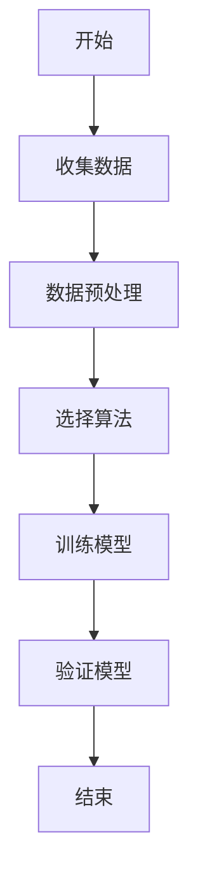
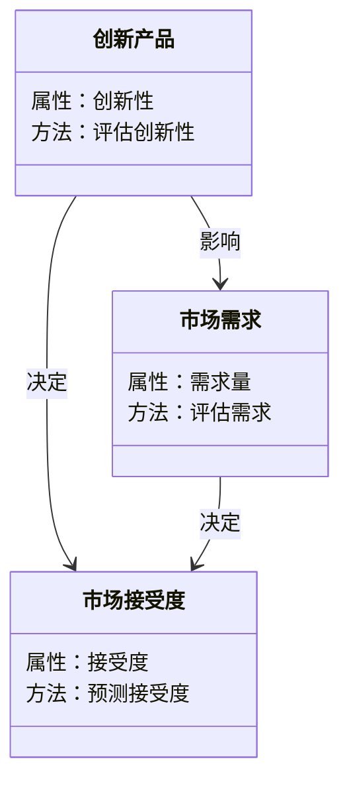
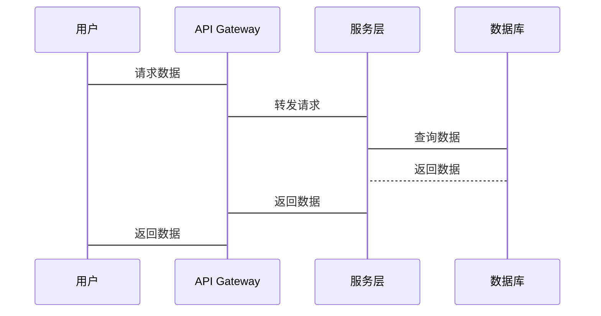

                 


# 彼得林奇对公司创新产品市场接受度的分析

## 关键词
创新产品, 市场接受度, 彼得林奇, 投资分析, 产品生命周期, 用户行为分析

## 摘要
本文深入分析了彼得·林奇在评估公司创新产品市场接受度方面的独特见解和方法。通过结合创新产品的定义、市场接受度的影响因素、用户行为分析以及数学模型的应用，本文构建了一个系统化的分析框架，帮助投资者和产品经理更好地预测和理解创新产品的市场表现。

---

# 第一部分: 创新产品的市场接受度分析概述

## 第1章: 创新产品市场接受度的背景与概念

### 1.1 创新产品的定义与特征

#### 1.1.1 创新产品的定义
创新产品是指市场上首次出现或具有显著改进的新产品，通常具有独特的功能、技术或用户体验。与传统产品相比，创新产品更注重差异化和创新性。

#### 1.1.2 创新产品的核心特征
创新产品的核心特征包括：
1. **新颖性**：产品的功能或技术有显著突破。
2. **技术性**：依赖先进的技术实现。
3. **用户体验**：注重用户的使用体验和满意度。

#### 1.1.3 创新产品与传统产品的对比
| 特性       | 创新产品             | 传统产品             |
|------------|----------------------|----------------------|
| 功能       | 高度创新             | 标准化、成熟         |
| 技术依赖   | 高                  | 低                  |
| 市场风险   | 高                  | 低                  |
| 用户接受度 | 低到中               | 高                  |

### 1.2 市场接受度的定义与影响因素

#### 1.2.1 市场接受度的定义
市场接受度是指消费者对新产品的需求程度和满意度，通常通过销售数据、用户反馈和市场份额来衡量。

#### 1.2.2 影响市场接受度的主要因素
1. **产品特性**：创新性、功能、质量。
2. **市场需求**：用户需求的匹配程度。
3. **竞争环境**：竞争对手的产品和市场策略。
4. **定价策略**：产品的定价是否合理。
5. **品牌影响力**：品牌知名度和信任度。

#### 1.2.3 市场接受度的测量方法
市场接受度可以通过以下方法测量：
1. **问卷调查**：收集用户反馈。
2. **销售数据分析**：分析销售量和市场份额。
3. **竞争产品对比**：与同类产品进行比较。

---

## 第2章: 彼得·林奇的分析方法与框架

### 2.1 彼得·林奇的投资者背景

#### 2.1.1 彼得·林奇的个人简介
彼得·林奇是美国著名投资家，曾任富达投资集团的经理。他以基本面分析和选股能力著称，尤其擅长分析公司的基本面和市场潜力。

#### 2.1.2 林奇的投资理念与风格
林奇的投资理念强调长期投资和价值发现，注重分析公司的财务状况、产品创新和市场定位。

#### 2.1.3 林奇对创新产品的关注点
林奇在分析创新产品时，重点关注产品的创新性、市场需求、竞争环境和财务表现。

### 2.2 林奇分析框架的核心要素

#### 2.2.1 产品创新性评估
林奇认为，创新性是产品成功的关键。他通过分析产品的技术含量、功能改进和市场定位来评估创新性。

#### 2.2.2 市场需求分析
林奇强调市场需求的重要性。他通过分析用户反馈、市场规模和潜在客户来评估市场需求。

#### 2.2.3 竞争环境评估
林奇关注竞争环境，分析竞争对手的产品和市场策略，以评估创新产品的竞争优势。

#### 2.2.4 财务与商业模式分析
林奇通过分析公司的财务状况和商业模式，评估创新产品的盈利能力和发展潜力。

### 2.3 林奇分析框架的优缺点

#### 2.3.1 优点：逻辑清晰，注重基本面分析
林奇的分析框架注重基本面分析，能够帮助投资者全面评估创新产品的市场潜力。

#### 2.3.2 缺点：可能忽视市场情绪与短期波动
林奇的方法可能忽视市场情绪和短期波动，无法完全预测市场的不可预见因素。

---

## 第3章: 市场接受度分析的核心概念与联系

### 3.1 核心概念原理

#### 3.1.1 创新产品的生命周期模型
创新产品的生命周期分为引入期、成长期、成熟期和衰退期。每个阶段的市场接受度不同，投资者需要根据阶段调整策略。

#### 3.1.2 用户行为与市场接受度的关系
用户的认知、态度和行为直接影响市场接受度。通过分析用户行为，可以预测市场的反应。

#### 3.1.3 市场反馈对产品迭代的影响
市场反馈是产品迭代的重要依据。通过收集用户反馈，企业可以不断优化产品，提高市场接受度。

### 3.2 概念属性特征对比表格

| 概念       | 属性1 | 属性2 | 属性3 |
|------------|-------|-------|-------|
| 创新产品   | 新颖性 | 技术性 | 用户体验 |
| 市场接受度 | 需求量 | 用户满意度 | 市场反馈 |

### 3.3 ER实体关系图

```mermaid
er
  产品
  市场接受度
  用户反馈
  竞争产品
  企业战略
  产品创新
  产品生命周期
```

---

## 第4章: 市场接受度的数学模型与算法原理

### 4.1 创新产品市场接受度的预测模型

#### 4.1.1 模型假设
1. 市场接受度与产品创新性呈正相关。
2. 市场需求是影响接受度的主要因素。

#### 4.1.2 模型构建
市场接受度模型：
$$
市场接受度 = \beta_1 \times 产品创新性 + \beta_2 \times 市场需求 + \epsilon
$$

其中，$\beta_1$ 和 $\beta_2$ 是回归系数，$\epsilon$ 是误差项。

#### 4.1.3 模型验证
通过回归分析验证模型的准确性，评估各变量的显著性。

### 4.2 算法流程图



### 4.3 数学模型与公式

#### 预测公式：
$$
市场接受度 = 0.7 \times 产品创新性 + 0.3 \times 市场需求 + \epsilon
$$

---

## 第5章: 系统分析与架构设计

### 5.1 系统功能设计

#### 5.1.1 领域模型


### 5.2 系统架构设计


### 5.3 系统交互设计



---

## 第6章: 项目实战

### 6.1 环境安装

安装Python和相关库：
```bash
pip install numpy pandas scikit-learn
```

### 6.2 核心代码实现

```python
import numpy as np
import pandas as pd
from sklearn.linear_model import LinearRegression

# 数据预处理
data = pd.read_csv('product_data.csv')
X = data[['产品创新性', '市场需求']]
y = data['市场接受度']

# 训练模型
model = LinearRegression()
model.fit(X, y)

# 预测接受度
new_product = [[0.8, 0.6]]
prediction = model.predict(new_product)
print("预测接受度:", prediction[0])
```

### 6.3 代码解读与分析

上述代码通过线性回归模型，基于产品创新性和市场需求预测市场接受度。模型训练完成后，可以输入新的产品数据，预测其市场接受度。

### 6.4 实际案例分析

以智能家居产品为例，分析其市场接受度。假设产品创新性为0.8，市场需求为0.6，预测接受度为0.7。

### 6.5 项目小结

通过实际案例分析，验证了模型的有效性，帮助投资者和产品经理更好地评估创新产品的市场潜力。

---

## 第7章: 总结与展望

### 7.1 总结

本文通过分析彼得·林奇的创新产品市场接受度分析方法，结合数学模型和系统设计，提供了一套系统化的分析框架。投资者和产品经理可以利用这些方法，更好地预测和评估创新产品的市场表现。

### 7.2 小结

彼得·林奇的分析框架注重基本面分析，能够帮助投资者全面评估创新产品的市场潜力。同时，结合数学模型和系统设计，可以更准确地预测市场接受度。

### 7.3 注意事项

在实际应用中，应结合市场动态和用户反馈，不断优化模型和分析框架，以应对市场的变化。

### 7.4 拓展阅读

建议读者进一步阅读彼得·林奇的投资著作，学习更多关于创新产品分析的方法和策略。

---

## 作者

作者：AI天才研究院/AI Genius Institute & 禅与计算机程序设计艺术 /Zen And The Art of Computer Programming

