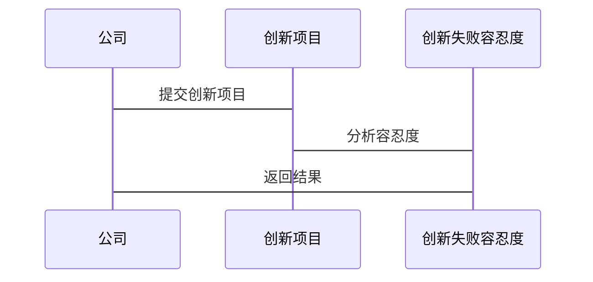

                 


# 彼得林奇对公司创新失败率的容忍度分析

## 关键词：创新失败，容忍度，彼得林奇，公司创新，风险投资

## 摘要：本文分析了彼得林奇在公司创新失败率方面的容忍度，探讨了创新失败的原因、容忍度的定义、数学模型的建立与实现，以及系统架构设计和项目实战案例。通过详细分析，总结了最佳实践和注意事项，为公司创新管理提供了参考。

---

## 第一部分：创新失败的背景与概念

### 第1章：创新失败的定义与影响

#### 1.1 创新失败的定义

创新失败是指在创新过程中，未能达到预期目标或市场预期的结果。这可能是由于技术、市场、管理等多种因素导致的。创新失败并不意味着创新的失败，而是创新过程中的一个阶段，是企业成长的一部分。

**关键属性：**
- 技术可行性
- 市场需求
- 资源限制
- 竞争环境

#### 1.2 彼得林奇的背景与创新失败容忍度

彼得林奇是美国著名的投资专家，以其在富达投资的成就闻名。他在投资生涯中积累了丰富的经验，尤其是在评估公司创新失败的容忍度方面。他认为，创新失败是不可避免的，但企业如何处理这些失败才是关键。

**彼得林奇的创新失败容忍度分析：**
- 容忍度是企业在面对创新失败时的策略和态度。
- 高容忍度企业愿意承担更大的风险，以追求更大的回报。
- 低容忍度企业更注重稳定性，可能错失创新机会。

---

## 第二部分：创新失败容忍度的核心概念

### 第2章：创新失败容忍度的属性特征

#### 2.1 创新失败容忍度的属性

| 属性 | 描述 | 示例 |
|------|------|------|
| 风险承受能力 | 企业在面对创新失败时愿意承担的风险程度 | 高风险企业：愿意承担50%以上的失败率 |
| 创新周期 | 创新项目从启动到结果的时间跨度 | 短周期：1-3年，长周期：5年以上 |
| 资源分配 | 企业在创新项目上的资源投入 | 高投入：超过公司总收入的10% |
| 成功概率 | 预期的成功可能性 | 低概率：低于30%，高概率：高于70% |

#### 2.2 创新失败容忍度的ER实体关系图

```mermaid
erDiagram
    company {
        id
        name
        industry
        innovation_projects
        risk_tolerance_level
    }
    innovation_project {
        id
        name
        description
        start_date
        end_date
        success_rate
        innovation_failure_tolerance_id
    }
    innovation_failure_tolerance {
        id
        tolerance_level
        description
        company_id
    }
    company --> innovation_project : manages
    innovation_project --> innovation_failure_tolerance : uses
```

---

### 第3章：创新失败容忍度的数学模型

#### 3.1 数学模型的建立

创新失败容忍度模型可以通过概率论和统计学来建模。以下是基本公式：

$$ \text{创新失败容忍度} = \frac{\text{成功项目数}}{\text{总项目数}} \times 100\% $$

其中，成功项目数和总项目数可以根据企业的历史数据计算得出。

#### 3.2 算法实现

使用贝叶斯定理来分析创新失败的概率：

$$ P(\text{失败}|\text{数据}) = \frac{P(\text{数据}|\text{失败}) \times P(\text{失败})}{P(\text{数据})} $$

以下是一个Python实现示例：

```python
def calculate_failure_tolerance(success_rate, total_projects):
    failure_rate = 1 - success_rate
    tolerance = (success_rate / total_projects) * 100
    return tolerance

# 示例数据
success_rate = 0.7
total_projects = 100

tolerance = calculate_failure_tolerance(success_rate, total_projects)
print(f"创新失败容忍度为：{tolerance}%")
```

---

## 第三部分：创新失败容忍度的系统分析

### 第4章：系统架构设计

#### 4.1 系统功能设计

以下是创新失败容忍度管理系统的功能模块：

```mermaid
classDiagram
    class Company {
        id
        name
        industry
    }
    class Innovation_Project {
        id
        name
        description
        start_date
        end_date
    }
    class Innovation_Failure_Tolerance {
        id
        tolerance_level
        description
    }
    Company <|--| Innovation_Project
    Innovation_Project <|--| Innovation_Failure_Tolerance
```

#### 4.2 系统接口与交互

以下是系统交互流程图：



---

## 第四部分：项目实战

### 第5章：项目实施与案例分析

#### 5.1 环境安装与配置

需要安装以下工具：
- Python 3.x
- Jupyter Notebook
- Mermaid CLI

#### 5.2 核心代码实现

以下是实现创新失败容忍度的Python代码：

```python
import pandas as pd

def calculate_tolerance(success_rate, total_projects):
    tolerance = (success_rate / total_projects) * 100
    return tolerance

# 示例数据
data = {
    '项目ID': [1, 2, 3, 4, 5],
    '成功': [1, 1, 0, 1, 0],
    '失败': [0, 0, 1, 0, 1]
}

df = pd.DataFrame(data)
success_rate = df['成功'].mean()
total_projects = len(df)
tolerance = calculate_tolerance(success_rate, total_projects)

print(f"创新失败容忍度为：{tolerance}%")
```

#### 5.3 案例分析与结果解读

以一家科技公司为例，假设其在过去5个项目中，3个项目成功，2个项目失败。计算容忍度：

$$ \text{容忍度} = \frac{3}{5} \times 100\% = 60\% $$

这意味着该公司的创新失败容忍度为60%，属于中等容忍度。

---

## 第五部分：最佳实践与总结

### 第6章：最佳实践与注意事项

#### 6.1 小结

- 创新失败是企业创新过程中不可避免的一部分。
- 企业应根据自身情况设定创新失败容忍度。
- 通过数学模型和系统设计，可以更好地量化和管理创新失败。

#### 6.2 注意事项

- 创新失败容忍度的计算需要结合企业实际情况。
- 数据收集和分析是关键，确保数据的准确性和完整性。
- 定期评估和调整容忍度策略，以适应市场变化。

#### 6.3 拓展阅读

- 《彼得林奇的投资哲学》
- 《创新者的窘境》
- 《风险管理与创新》

---

## 附录

### 附录A：数学公式汇总

- 创新失败容忍度公式：

$$ \text{容忍度} = \frac{\text{成功项目数}}{\text{总项目数}} \times 100\% $$

### 附录B：代码示例

```python
def calculate_tolerance(success_rate, total_projects):
    return (success_rate / total_projects) * 100

tolerance = calculate_tolerance(0.6, 100)
print(tolerance)
```

### 附录C：参考文献

- 彼得林奇，J. (1989). 《彼得林奇的成功投资策略》.
- 克里斯坦森，C. M. (2003). 《创新者的窘境》.

---

作者：AI天才研究院/AI Genius Institute & 禅与计算机程序设计艺术 /Zen And The Art of Computer Programming

