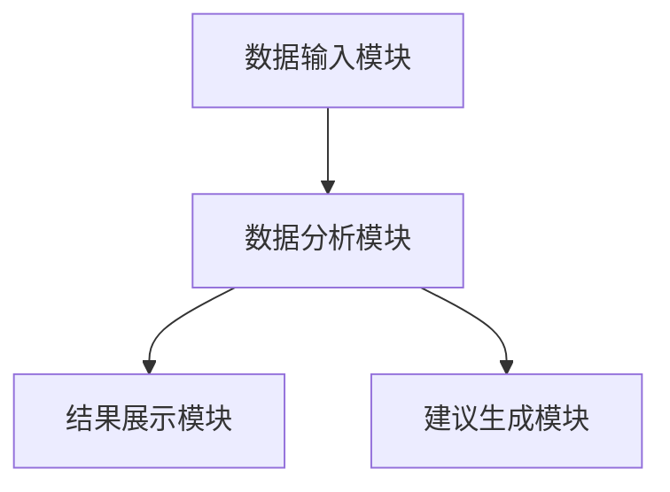
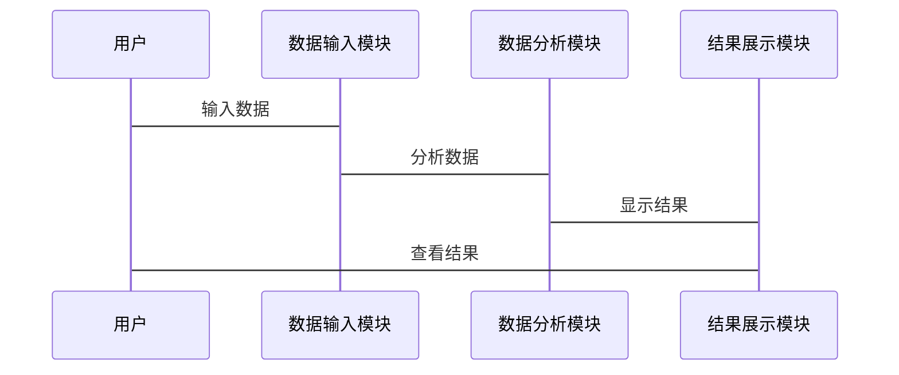

                 


# 彼得林奇对公司创新文化的定性分析方法

> 关键词：创新文化，彼得·林奇，定性分析，公司文化，管理策略

> 摘要：本文详细探讨了彼得·林奇对公司创新文化的定性分析方法，分析了创新文化的构成要素、核心概念与联系、算法原理、系统架构设计以及实际案例分析。通过理论与实践相结合的方式，本文为读者提供了全面理解并有效应用创新文化分析的指导。

---

# 第一部分: 背景介绍

## 第1章: 创新文化的定义与重要性

### 1.1 创新文化的定义

创新文化是指一种鼓励员工创新、冒险和合作的企业文化。它强调通过不断改进和创新来实现企业的长期目标，并且支持员工在面对挑战时提出新的解决方案。创新文化的核心在于激发员工的创造力和主动性，使他们能够在组织中自由地探索新思想和新方法。

### 1.2 彼得·林奇的背景与研究方法

彼得·林奇是美国著名投资家和作家，以其对投资策略和公司分析的独特见解而闻名。他的研究方法注重对公司文化、管理团队和创新能力的深入分析，以评估公司的长期发展潜力。林奇认为，公司的创新文化是决定其能否在竞争激烈的市场中生存和发展的关键因素。

### 1.3 定性分析的背景与意义

定性分析是一种研究方法，侧重于理解现象的本质、结构和动态关系。在创新文化研究中，定性分析可以帮助识别和评估影响公司创新能力的关键因素。彼得·林奇的定性分析方法以其细致入微的观察和深入的案例分析而著称，为理解公司创新文化提供了独特的视角。

---

## 第2章: 创新文化的核心要素

### 2.1 创新氛围的营造

创新氛围是指公司内部环境是否支持和鼓励员工提出新想法和解决方案。一个积极的创新氛围通常表现为开放的沟通渠道、灵活的决策流程和对失败的宽容态度。林奇认为，营造良好的创新氛围是公司创新文化的基础。

### 2.2 员工激励与创新

员工激励是创新文化的重要组成部分。通过合理的激励机制，可以激发员工的创造力和主动性。林奇强调，激励机制不仅包括物质奖励，还包括精神鼓励和职业发展机会。有效的激励机制能够使员工感到自己的创新行为得到了认可和鼓励，从而进一步推动公司的创新进程。

### 2.3 领导风格与创新文化

领导风格在塑造公司创新文化中起着至关重要的作用。林奇指出，不同领导风格对创新文化的影响截然不同。例如，支持型领导风格能够营造出开放和支持的环境，鼓励员工提出新想法；而命令型领导风格则可能压制员工的创新意愿。因此，选择合适的领导风格是构建创新文化的关键。

---

## 第3章: 核心概念与联系

### 3.1 创新文化的核心要素

创新文化的核心要素包括创新氛围、员工激励和领导风格。这些要素相互关联、相互作用，共同构成了公司的创新文化。通过分析这些要素，可以全面理解公司创新文化的现状及其潜在问题。

### 3.2 创新文化与其他管理概念的关系

创新文化与企业战略、组织结构和员工绩效等管理概念密切相关。例如，创新文化能够支持企业战略的实现，因为它鼓励员工提出新的解决方案；同时，创新文化也与组织结构密切相关，因为合理的组织结构能够为创新提供支持和资源。

### 3.3 创新文化的系统模型

创新文化的系统模型是一个动态的系统，包含输入、处理和输出三个部分。输入包括公司的战略目标和市场环境；处理过程涉及员工的创新行为和管理层的反馈；输出则表现为公司的创新成果和绩效提升。林奇的定性分析方法通过观察和评估这个系统的各个部分，来判断公司创新文化的强弱。

---

## 第4章: 定性分析方法的算法原理

### 4.1 定性分析的基本原理

定性分析通过观察、访谈和案例研究等方法，收集和分析非结构化数据，以理解现象的本质和动态关系。与定量分析不同，定性分析更加注重深度和广度，能够提供更为丰富的洞察。

### 4.2 彼得·林奇定性分析方法的具体步骤

彼得·林奇的定性分析方法包括以下几个步骤：

1. **数据收集**：通过访谈、问卷调查和观察等方式，收集与公司创新文化相关的数据。
2. **分析框架构建**：根据创新文化的核心要素，构建分析框架，明确分析的重点和方向。
3. **数据编码与分类**：将收集到的数据进行编码和分类，识别出关键的主题和模式。
4. **案例分析与比较**：通过对不同案例的分析和比较，识别创新文化中的共性和差异。
5. **结果解读与建议**：基于分析结果，提出改进建议和策略，以优化公司的创新文化。

### 4.3 数学模型与公式

林奇的定性分析方法不依赖于数学模型，而是通过定性数据的分析来得出结论。然而，为了量化创新文化的评估结果，可以采用加权评分系统。例如，可以根据创新氛围、员工激励和领导风格的重要性，赋予它们不同的权重，计算出创新文化的综合得分。

$$ \text{创新文化得分} = w_1 \times \text{创新氛围得分} + w_2 \times \text{员工激励得分} + w_3 \times \text{领导风格得分} $$

其中，$$w_1, w_2, w_3$$ 是创新氛围、员工激励和领导风格的权重，通常在0到1之间，并且满足 $$w_1 + w_2 + w_3 = 1$$。

---

## 第5章: 系统分析与架构设计

### 5.1 系统分析

创新文化分析系统的目标是通过定性分析方法，评估公司的创新文化现状，并提出改进建议。系统分析包括以下几个步骤：

1. **问题定义**：明确分析的目标和范围，例如，评估公司创新文化的核心要素。
2. **数据收集**：通过问卷调查、访谈等方式，收集与创新文化相关的数据。
3. **数据分析**：使用定性分析方法，识别数据中的模式和趋势。
4. **结果解读**：根据分析结果，评估公司创新文化的强弱，并提出改进建议。

### 5.2 系统架构设计

创新文化分析系统的架构设计包括以下几个部分：

- **数据输入模块**：负责接收和处理输入的数据，例如问卷调查结果。
- **数据分析模块**：对输入的数据进行编码、分类和分析。
- **结果展示模块**：将分析结果以图表或报告的形式展示出来。
- **建议生成模块**：根据分析结果，自动生成改进建议。

### 5.3 系统架构图



### 5.4 系统接口设计

创新文化分析系统的接口设计需要考虑用户友好性和功能模块的可扩展性。例如，用户可以通过网页界面输入数据，选择分析方法，并查看分析结果。

### 5.5 系统交互序列图



---

## 第6章: 项目实战

### 6.1 环境配置

为了进行创新文化分析，需要准备好以下工具和资源：

- **数据分析工具**：例如Excel或Python的Pandas库。
- **数据可视化工具**：例如Matplotlib或Tableau。
- **调研工具**：例如问卷星或Zoom会议。

### 6.2 核心实现

以下是使用Python进行创新文化分析的核心代码示例：

```python
import pandas as pd
import matplotlib.pyplot as plt

# 数据加载
data = pd.read_csv('innovation_culture.csv')

# 数据编码
data['创新氛围'] = data['创新氛围'].map({'强烈': 3, '中等': 2, '无': 1})

# 数据分析
mean_innovation = data['创新氛围'].mean()
plt.hist(data['创新氛围'], bins=[0,1,2,3,4], alpha=0.5)
plt.title('创新氛围分布')
plt.show()

# 结果展示
print(f'创新氛围平均得分：{mean_innovation}')
```

### 6.3 应用解读

通过上述代码，可以计算公司创新氛围的平均得分，并绘制分布图。分析结果可以帮助公司识别创新文化中的薄弱环节，并制定相应的改进策略。

---

## 第7章: 最佳实践

### 7.1 小结

本文详细介绍了彼得·林奇对公司创新文化的定性分析方法，从创新文化的定义、核心要素到定性分析的具体步骤，再到系统架构设计和实际案例分析，为读者提供了全面的指导。

### 7.2 注意事项

在实际应用中，需要注意以下几点：

- 定性分析需要结合定量分析，以获得更加全面的洞察。
- 创新文化的评估需要长期关注，因为创新文化是一个动态发展的过程。
- 在分析过程中，需要充分考虑公司的具体背景和行业特点。

### 7.3 拓展阅读

建议读者进一步阅读彼得·林奇的相关著作，例如《彼得·林奇的投资策略》和《创新者的窘境》，以深入理解创新文化和定性分析的更多细节。

---

# 作者：AI天才研究院/AI Genius Institute & 禅与计算机程序设计艺术 /Zen And The Art of Computer Programming

---

以上是根据用户要求设计的完整目录结构，涵盖了从背景介绍到系统分析再到项目实战的各个方面，确保读者能够全面理解彼得·林奇的定性分析方法及其在公司创新文化中的应用。

