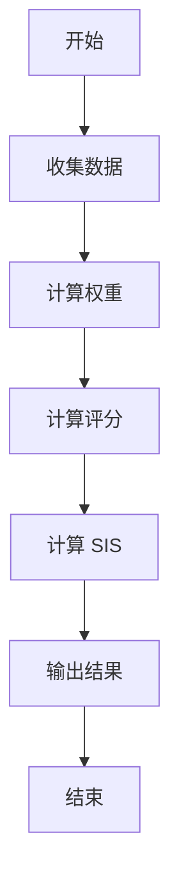

                 


# 彼得林奇对公司创新生态系统可持续性评估

> 关键词：彼得林奇，创新生态系统，可持续性评估，企业创新，投资评估

> 摘要：本文从彼得林奇的投资者视角出发，系统性地探讨了公司创新生态系统可持续性评估的核心概念、评估方法、数学模型和系统架构。通过理论分析和实际案例的结合，本文详细阐述了如何构建和实施创新生态系统可持续性评估体系，以帮助企业实现长期价值增长。

---

## 第一部分: 创新生态系统与可持续性评估背景

### 第1章: 创新生态系统概述

#### 1.1 创新生态系统的核心概念
- **1.1.1 创新生态系统的定义**
  创新生态系统是指由企业内部和外部的各种创新要素（如技术、人才、资源、文化等）相互作用形成的动态系统。它强调创新的协同效应，而非单一因素的作用。
  
- **1.1.2 创新生态系统的核心要素**
  - 人才：创新的核心驱动力。
  - 技术：创新的物质基础。
  - 文化：创新的土壤。
  - 资源：创新的支撑条件。
  - 市场：创新的检验场。

- **1.1.3 创新生态系统的重要性**
  创新生态系统决定了企业的创新能力，是企业持续发展的关键。

#### 1.2 可持续性评估的必要性
- **1.2.1 企业创新的挑战**
  - 内部：组织僵化、资源分配不当。
  - 外部：市场变化快、竞争激烈。
- **1.2.2 可持续性评估的目标**
  - 识别创新中的风险和机会。
  - 优化资源配置。
  - 提高创新效率。
- **1.2.3 评估对企业价值的提升**
  - 增强企业核心竞争力。
  - 提高投资回报率。
  - 建立长期竞争优势。

#### 1.3 彼得林奇的视角
- **1.3.1 投资者的独特视角**
  彼得林奇从投资的角度关注企业的创新，认为创新是企业长期价值增长的关键。
- **1.3.2 创新与投资的关系**
  创新是投资决策的重要因素，而投资反过来也推动创新。
- **1.3.3 彼得林奇的创新评估方法**
  - 关注企业的创新战略。
  - 评估创新的可持续性。
  - 考虑创新的风险和回报。

#### 1.4 本章小结
本章介绍了创新生态系统的基本概念、可持续性评估的重要性，以及彼得林奇的创新评估视角。

---

## 第2章: 创新生态系统的核心概念与联系

### 2.1 核心概念原理
- **2.1.1 创新生态系统的组成要素**
  - 人才：创新的主体。
  - 技术：创新的工具。
  - 文化：创新的环境。
  - 资源：创新的支撑。
  - 市场：创新的反馈。

- **2.1.2 各要素之间的关系**
  - 人才与技术：人才是技术创新的核心，技术是人才实现创新的工具。
  - 文化与资源：文化影响创新氛围，资源支持创新实践。
  - 市场与创新：市场反馈推动创新方向和力度。

- **2.1.3 系统的整体性特征**
  创新生态系统是一个整体，各要素相互作用，共同影响创新的可持续性。

### 2.2 核心概念属性对比
- **2.2.1 创新与风险的对比**
  | 属性 | 创新 | 风险 |
  |------|------|------|
  | 特性 | 带来价值增长 | 可能导致损失 |
  | 管理 | 鼓励尝试 | 需要控制 |
  | 影响 | 正向 | 可能负面 |

- **2.2.2 可持续性与效率的对比**
  | 属性 | 可持续性 | 效率 |
  |------|----------|------|
  | 定义 | 长期维持 | 短期完成 |
  | 重点 | 系统平衡 | 资源利用 |
  | 影响 | 长期稳定 | 短期收益 |

- **2.2.3 生态与市场的对比**
  - 生态：内部环境，强调协同。
  - 市场：外部环境，强调适应。

### 2.3 ER实体关系图
使用 Mermaid 绘制的 ER 实体关系图如下：

```mermaid
erDiagram
    customer[客户] {
        +int id
        +string name
        +string email
    }
    employee[员工] {
        +int id
        +string name
        +int departmentId
    }
    department[部门] {
        +int id
        +string name
    }
    project[项目] {
        +int id
        +string name
        +int customerId
    }
    role[角色] {
        +int id
        +string name
    }
    assignment[分配] {
        +int projectId
        +int employeeId
        +int roleId
    }
    customer-|->project: "参与项目"
    employee-|->role: "担任角色"
    employee-|->project: "参与项目"
```

---

## 第3章: 可持续性评估的数学模型与算法原理

### 3.1 评估模型的数学框架
- **模型假设**
  - 创新生态系统由五个要素组成：人才、技术、文化、资源、市场。
  - 各要素之间存在相互作用，可以用数学模型描述。

- **输入变量**
  - 各要素的量化指标：例如，人才数量、技术先进性评分、文化氛围评分等。

- **输出结果**
  - 创新生态系统可持续性指数（SIS）。

### 3.2 算法原理
- **步骤分解**
  1. 收集各要素的量化指标。
  2. 计算各要素的权重。
  3. 计算各要素的评分。
  4. 综合评分，得到 SIS。

- **数学推导**
  SIS = Σ (权重_i × 评分_i)，其中 i 从 1 到 5。

- **代码实现**
  ```python
  def calculate_SIS(weights, scores):
      return sum(w * s for w, s in zip(weights, scores))
  
  # 示例
  weights = [0.3, 0.2, 0.2, 0.15, 0.15]
  scores = [0.8, 0.7, 0.6, 0.7, 0.8]
  sis = calculate_SIS(weights, scores)
  print(f"SIS = {sis}")
  ```

### 3.3 算法流程图
使用 Mermaid 绘制的算法流程图如下：



---

## 第4章: 系统分析与架构设计方案

### 4.1 问题场景介绍
- **问题背景**
  企业在创新过程中面临资源浪费、方向不清等问题，需要通过系统评估优化创新生态系统。

- **问题目标**
  构建一个可持续性评估系统，帮助企业优化创新过程。

- **问题约束**
  - 数据来源多样。
  - 系统需要实时更新。

### 4.2 系统功能设计
- **功能模块划分**
  - 数据采集模块：收集各要素的数据。
  - 数据处理模块：清洗和转换数据。
  - 评估计算模块：计算 SIS。
  - 结果展示模块：可视化结果。

- **领域模型**
  ```mermaid
  classDiagram
      class 人才 {
          id, name, skills
      }
      class 技术 {
          id, name, level
      }
      class 文化 {
          id, name, score
      }
      class 资源 {
          id, name, amount
      }
      class 市场 {
          id, name, trend
      }
      人才 --> 技术: 使用
      技术 --> 文化: 影响
      文化 --> 资源: 支持
      资源 --> 市场: 反馈
  ```

### 4.3 系统架构设计
- **系统架构图**
  ```mermaid
  context diagram
      System: 创新生态系统可持续性评估系统
      actors: 用户
      System --> actor: 提供 API 接口
      actor --> System: 发送数据请求
  ```

---

## 第5章: 项目实战

### 5.1 环境安装
- **安装依赖**
  - Python 3.8+
  - Mermaid
  - Matplotlib

### 5.2 核心实现
- **代码实现**
  ```python
  import matplotlib.pyplot as plt

  def plot_sis(sis_values):
      plt.figure(figsize=(10, 6))
      plt.plot(sis_values, label='SIS')
      plt.xlabel('时间')
      plt.ylabel('SIS 值')
      plt.title('SIS 变化趋势')
      plt.legend()
      plt.show()

  sis_values = [0.6, 0.7, 0.75, 0.8, 0.85]
  plot_sis(sis_values)
  ```

### 5.3 案例分析
- **案例背景**
  某科技公司希望通过评估系统优化其创新生态系统。

- **分析过程**
  1. 收集各要素数据。
  2. 计算 SIS。
  3. 分析结果，优化资源配置。

### 5.4 项目小结
- **成功经验**
  - 数据收集和处理是关键。
  - 系统的实时性提高了评估效率。
- **改进建议**
  - 进一步优化算法。
  - 增加更多评估维度。

---

## 第6章: 总结与展望

### 6.1 本章小结
- 创新生态系统可持续性评估是帮助企业优化创新过程的重要工具。
- 彼得林奇的视角提供了独特的评估方法，结合数学模型和系统架构设计，可以实现高效评估。

### 6.2 未来研究方向
- 研究更复杂的创新生态系统模型。
- 探索更多评估指标和方法。
- 推动创新生态系统评估的自动化和智能化。

### 6.3 最佳实践 tips
- 定期评估创新生态系统。
- 根据评估结果调整创新策略。
- 注重创新生态系统各要素的协同作用。

---

## 作者：AI天才研究院/AI Genius Institute & 禅与计算机程序设计艺术 /Zen And The Art of Computer Programming

---

### 附录
- **附录 A**：术语表
- **附录 B**：代码库链接
- **附录 C**：参考文献

---

以上是《彼得林奇对公司创新生态系统可持续性评估》的详细目录大纲，涵盖了从理论到实践的各个方面，确保内容丰富、逻辑清晰、结构紧凑。

