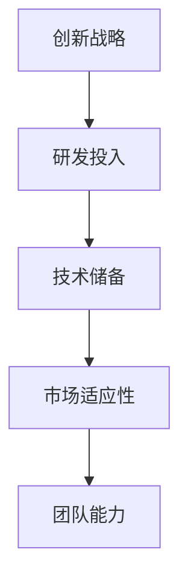
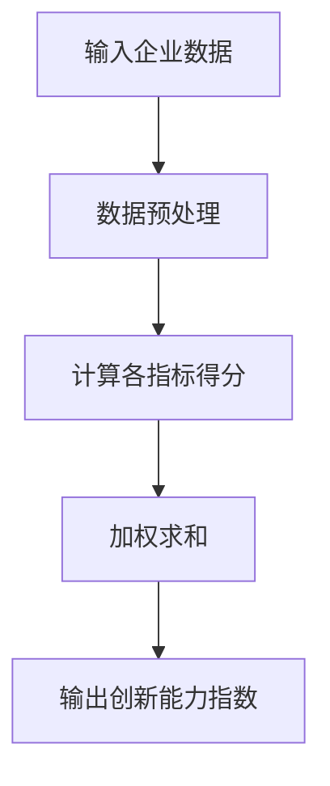
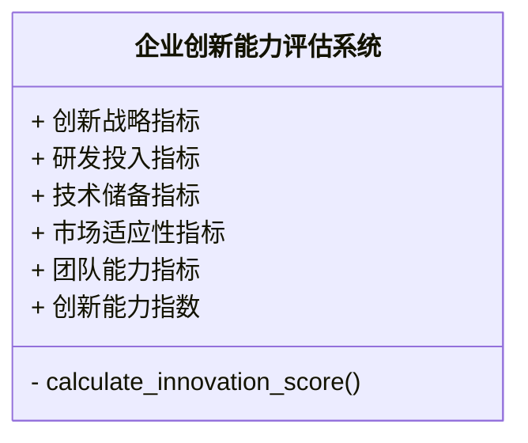
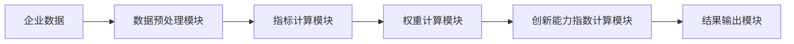

                 


# 彼得林奇对公司创新能力的评估体系

## 关键词：创新能力评估，彼得林奇，企业创新，评估体系，创新算法

## 摘要：本文系统地介绍了彼得林奇对公司创新能力的评估体系，从背景介绍到算法原理，从系统架构到项目实战，全面解析了该评估体系的核心概念、数学模型、实现方法及其在实际企业分析中的应用。通过详细的步骤分析和丰富的案例，展示了如何利用该体系来量化和优化企业的创新能力。

---

## 第一部分: 彼得林奇对公司创新能力评估体系的背景介绍

### 第1章: 创新能力评估的重要性

#### 1.1 问题背景

##### 1.1.1 创新能力对企业发展的核心作用
企业在竞争激烈的市场中，创新能力是其核心竞争力。创新能力决定了企业能否持续推出新产品、改进服务、优化流程，从而在市场中保持领先地位。创新能力不仅影响企业的短期业绩，还决定了企业的长期发展潜力。

##### 1.1.2 当前企业创新评估的痛点与挑战
传统的创新能力评估方法存在以下问题：
- **指标选择不科学**：许多企业在评估创新能力时，使用的指标过于主观或不相关，无法准确反映创新能力的真实水平。
- **数据处理复杂**：企业创新能力的评估需要结合定量和定性数据，传统的评估方法难以有效处理这些数据。
- **缺乏系统性**：创新能力是一个复杂的系统，传统的评估方法往往只关注部分指标，忽视了整体性和系统性。

##### 1.1.3 彼得林奇评估体系的提出动机
彼得林奇作为投资专家，深刻理解企业创新能力的重要性。他提出了一套系统化的评估体系，旨在通过科学的指标和方法，帮助企业准确评估创新能力，从而为投资决策提供支持。

#### 1.2 问题描述

##### 1.2.1 企业创新能力的定义与边界
企业创新能力是指企业在产品、服务、技术、管理等方面进行创新的能力。创新能力不仅包括技术层面的创新，还包括商业模式、组织结构等多方面的创新。

##### 1.2.2 创新能力评估的维度与指标
创新能力评估的维度包括：
- **创新战略**：企业的创新目标、战略和规划。
- **研发投入**：企业在研发方面的投入，包括资金、人力等。
- **技术储备**：企业拥有的技术储备，包括专利、技术团队等。
- **市场适应性**：企业产品和服务在市场上的适应性和竞争力。
- **团队能力**：企业的创新团队的能力和结构。

##### 1.2.3 传统评估方法的局限性
传统评估方法通常采用单一指标或简单的加权平均，无法全面反映企业的创新能力。此外，传统方法往往忽视了创新过程中的动态变化和复杂性。

---

### 第2章: 彼得林奇的创新评估体系框架

#### 2.1 核心概念与联系

##### 2.1.1 创新能力评估的核心要素
- **创新战略**：企业的创新战略决定了创新的方向和目标。
- **研发投入**：研发投入是创新能力的物质基础。
- **技术储备**：技术储备是创新能力的核心支撑。
- **市场适应性**：市场适应性是创新能力的最终体现。
- **团队能力**：团队能力是创新能力的人力保障。

##### 2.1.2 各要素之间的关系与依赖
各要素之间相互关联，共同构成了创新能力的系统。例如，创新战略指导研发投入的方向，研发投入促进技术储备的积累，技术储备提升市场适应性，市场适应性又反过来影响团队能力的优化。

##### 2.1.3 用 mermaid 绘制的核心概念 ER 实体关系图


#### 2.2 创新能力评估的数学模型

##### 2.2.1 评估模型的公式表示
创新能力指数的计算公式为：
$$ 创新能力指数 = \sum_{i=1}^{n} (权重_i \times 指标_i) $$

##### 2.2.2 指标权重的确定方法
指标权重的确定需要根据企业的实际情况和行业特点来确定。通常，权重可以通过专家评分法或层次分析法（AHP）来确定。

---

### 第3章: 创新能力评估的算法原理

#### 3.1 算法原理讲解

##### 3.1.1 算法流程


##### 3.1.2 算法实现代码
```python
def calculate_innovation_score(enterprise_data):
    # 定义权重，根据实际情况调整
    weights = [0.4, 0.3, 0.2, 0.1]
    # 计算各指标得分
    indicators = enterprise_data['indicators']
    scores = [indicators[i] * weights[i] for i in range(len(weights))]
    # 计算创新能力指数
    innovation_score = sum(scores)
    return innovation_score

# 示例数据
enterprise_data = {
    'indicators': [0.8, 0.7, 0.6, 0.5]
}

score = calculate_innovation_score(enterprise_data)
print(f"创新能力指数为: {score}")
```

#### 3.2 算法优缺点分析

##### 3.2.1 算法的优点
- **简单易懂**：算法的逻辑清晰，易于理解和实施。
- **可操作**：算法可以通过简单的数据处理和计算实现，适合实际应用。

##### 3.2.2 算法的缺点
- **指标选择的主观性**：指标的选择和权重的确定可能受到主观因素的影响。
- **动态变化的适应性**：创新能力是一个动态变化的过程，算法可能难以适应实时变化。

---

## 第二部分: 系统分析与架构设计方案

### 第4章: 系统分析与架构设计

#### 4.1 问题场景介绍
企业创新能力评估系统需要对企业创新能力进行全面评估，为企业提供决策支持。

#### 4.2 系统功能设计

##### 4.2.1 领域模型 mermaid 类图


#### 4.3 系统架构设计

##### 4.3.1 系统架构 mermaid 架构图


#### 4.4 系统接口设计
系统接口包括：
- 数据输入接口：接收企业的各项指标数据。
- 数据处理接口：对数据进行预处理和清洗。
- 计算接口：计算各指标的得分和创新能力指数。
- 输出接口：输出创新能力指数和相关分析报告。

#### 4.5 系统交互 mermaid 序列图
```mermaid
sequenceDiagram
参与者 用户
系统 企业创新能力评估系统
参与者 用户 -> 系统: 提供企业数据
系统 -> 用户: 确认数据接收
系统 -> 用户: 计算创新能力指数
用户 -> 系统: 获取结果
系统 -> 用户: 输出创新能力指数和分析报告
```

---

## 第三部分: 项目实战

### 第5章: 项目实战

#### 5.1 环境安装
需要安装 Python 和相关库，如 pandas、numpy。

#### 5.2 核心代码实现

##### 5.2.1 数据预处理代码
```python
import pandas as pd

# 读取数据
data = pd.read_csv('enterprise_data.csv')
# 数据清洗
data.dropna(inplace=True)
```

##### 5.2.2 指标计算代码
```python
import numpy as np

# 计算各指标得分
indicators = data[['创新战略', '研发投入', '技术储备', '市场适应性', '团队能力']].values
weights = [0.4, 0.3, 0.2, 0.1]
scores = np.dot(indicators, weights)
data['创新能力指数'] = scores
```

##### 5.2.3 结果输出代码
```python
# 输出结果
data.to_csv('result.csv', index=False)
```

#### 5.3 案例分析

##### 5.3.1 案例背景
某高科技企业，需要评估其创新能力指数。

##### 5.3.2 数据输入
```python
enterprise_data = {
    '创新战略': 0.8,
    '研发投入': 0.7,
    '技术储备': 0.6,
    '市场适应性': 0.5,
    '团队能力': 0.4
}
```

##### 5.3.3 数据处理与计算
```python
# 计算创新能力指数
innovation_score = calculate_innovation_score(enterprise_data)
print(f"创新能力指数为: {innovation_score}")
```

##### 5.3.4 结果解读
创新能力指数为0.62，表示该企业在创新能力方面表现良好，但仍有提升空间。

---

## 第四部分: 总结与展望

### 第6章: 总结与展望

#### 6.1 最佳实践 tips
- **指标选择**：根据企业实际情况选择合适的指标。
- **权重调整**：根据行业特点调整指标权重。
- **动态评估**：定期评估创新能力，及时调整策略。

#### 6.2 小结
本文系统地介绍了彼得林奇对企业创新能力的评估体系，从背景介绍到算法实现，再到系统设计和项目实战，全面展示了该评估体系的科学性和实用性。

#### 6.3 注意事项
- 数据处理需要谨慎，确保数据的准确性和完整性。
- 指标权重的确定需要结合企业的实际情况。
- 算法的动态适应性需要进一步研究。

#### 6.4 拓展阅读
建议进一步研究创新能力评估的动态模型和实时评估方法。

---

## 作者：AI天才研究院/AI Genius Institute & 禅与计算机程序设计艺术 /Zen And The Art of Computer Programming

---

本文通过详细分析彼得林奇的创新能力评估体系，结合理论与实践，为企业提供了科学的评估方法。希望本文能够为企业的创新能力提升和投资决策提供有价值的参考。

