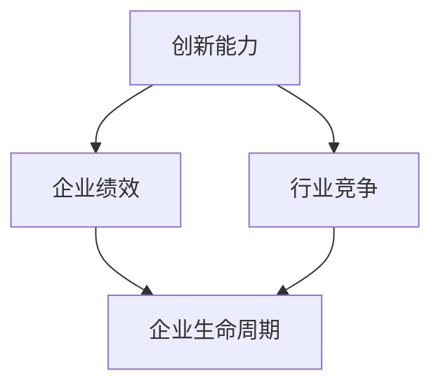
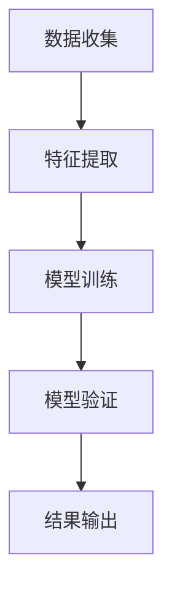
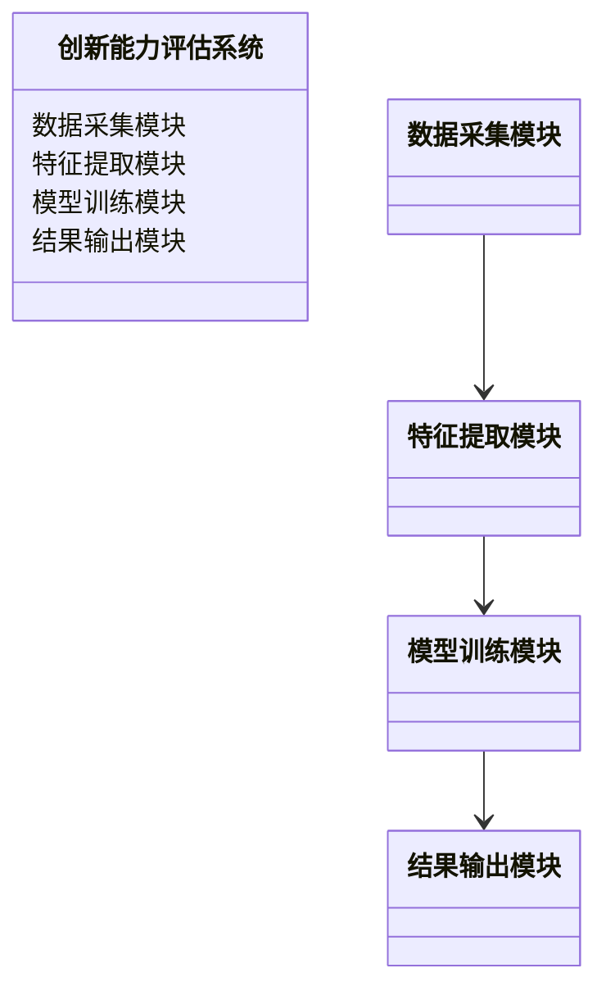
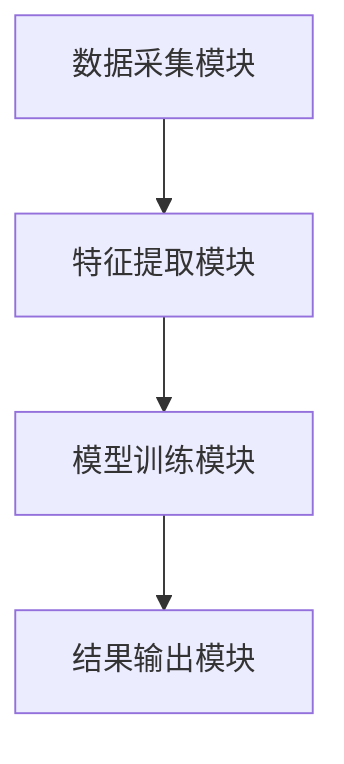

                 


# 彼得林奇对公司创新能力的量化分析

> 关键词：公司创新，量化分析，彼得林奇，投资模型，创新能力评分

> 摘要：本文基于彼得·林奇的投资理念，探讨了对公司创新能力进行量化分析的方法。通过构建创新能力的数学模型、设计量化分析系统架构、实现算法流程，展示了如何将创新能力转化为可量化的指标。文章最后通过实际案例分析，验证了模型的有效性，并提出了相应的优化建议。

---

# 第1章: 背景介绍与核心概念

## 1.1 创新能力的定义

创新是企业保持竞争优势的核心动力。创新能力是指企业在技术研发、产品设计、市场开拓等方面进行创新的能力。创新能力不仅体现在企业的研发投入上，还体现在其产出成果的数量和质量上。

### 1.1.1 创新能力的核心要素
- **研发投入**：企业的研发投入是创新能力的重要体现。
- **专利数量**：专利数量反映了企业的技术积累和创新能力。
- **新产品推出速度**：新产品推出速度是创新能力的直接体现。
- **市场反馈**：市场反馈是创新能力的验证标准。

### 1.1.2 创新能力的边界与外延
创新能力的边界在于企业的实际资源和市场需求。外延则包括技术研发、产品设计、市场推广等多个方面。

### 1.1.3 创新能力与企业绩效的关系
创新能力与企业绩效密切相关。创新能力越强，企业绩效越好。

## 1.2 量化分析的重要性

### 1.2.1 量化分析在企业管理中的作用
量化分析可以帮助企业更好地理解创新能力与绩效之间的关系。

### 1.2.2 彼得·林奇的量化分析方法
彼得·林奇通过分析企业的财务数据和市场表现，评估企业的创新能力。

### 1.2.3 创新能力量化分析的必要性
通过量化分析，可以将创新能力转化为可量化的指标，为企业的决策提供支持。

## 1.3 彼得·林奇的分析框架

### 1.3.1 彼得·林奇的投资理念
彼得·林奇注重基本面分析，关注企业的财务状况和市场表现。

### 1.3.2 彼得·林奇的创新能力评估标准
彼得·林奇通过企业的研发投入、专利数量、新产品推出速度等指标评估创新能力。

### 1.3.3 彼得·林奇方法的适用性
彼得·林奇的方法适用于多种行业的创新能力评估。

---

# 第2章: 创新能力的核心概念与联系

## 2.1 创新能力的核心要素

### 2.1.1 研发投入
研发投入是创新能力的重要组成部分。

### 2.1.2 专利数量
专利数量反映了企业的技术积累。

### 2.1.3 新产品推出速度
新产品推出速度是创新能力的直接体现。

### 2.1.4 市场反馈
市场反馈是创新能力的验证标准。

## 2.2 创新能力的核心概念对比

### 2.2.1 创新能力与企业绩效对比
创新能力与企业绩效密切相关。

### 2.2.2 创新能力与行业竞争对比
创新能力在行业竞争中具有重要地位。

### 2.2.3 创新能力与企业生命周期对比
创新能力贯穿于企业生命周期的始终。

## 2.3 实体关系图（ER图）



---

# 第3章: 创新能力的量化模型与算法原理

## 3.1 创新能力量化模型

### 3.1.1 模型构建思路
通过收集企业创新能力相关的数据，构建创新能力评分模型。

### 3.1.2 模型输入与输出
模型输入包括研发投入、专利数量等指标，输出是创新能力评分。

### 3.1.3 模型的评估标准
通过实际案例验证模型的有效性。

## 3.2 算法原理

### 3.2.1 数据收集与特征提取
通过公开数据获取企业的研发投入、专利数量等信息。

### 3.2.2 模型训练与优化
使用回归分析等方法训练模型，并通过验证数据优化模型。

### 3.2.3 模型预测与验证
利用模型预测企业的创新能力，并与实际数据对比验证。

## 3.3 算法流程图



---

# 第4章: 创新能力的数学模型与公式

## 4.1 创新能力评分公式

$$创新能力评分 = \sum_{i=1}^{n} w_i \cdot x_i$$

其中，$w_i$ 是第 $i$ 个指标的权重，$x_i$ 是第 $i$ 个指标的值。

---

# 第5章: 系统分析与架构设计

## 5.1 问题场景介绍

### 5.1.1 问题背景
企业创新能力的量化分析可以帮助企业制定更好的战略决策。

### 5.1.2 系统功能需求
系统需要实现数据采集、特征提取、模型训练、结果输出等功能。

## 5.2 系统功能设计

### 5.2.1 领域模型（类图）



### 5.2.2 系统架构设计



## 5.3 系统接口设计

### 5.3.1 数据接口
数据接口用于获取企业的创新能力相关数据。

### 5.3.2 模型接口
模型接口用于调用预训练的创新能力评分模型。

---

# 第6章: 项目实战

## 6.1 环境安装

### 6.1.1 安装Python
安装Python 3.x版本。

### 6.1.2 安装依赖库
安装numpy、pandas、scikit-learn等库。

## 6.2 核心代码实现

### 6.2.1 数据处理代码

```python
import pandas as pd
import numpy as np
from sklearn.linear_model import LinearRegression
from sklearn.metrics import mean_squared_error

# 数据加载
data = pd.read_csv('innovation_data.csv')

# 特征提取
X = data[['研发投入', '专利数量', '新产品数量']]
y = data['创新能力评分']

# 模型训练
model = LinearRegression()
model.fit(X, y)

# 模型预测
y_pred = model.predict(X)

# 模型评估
mse = mean_squared_error(y, y_pred)
print(f"均方误差: {mse}")
```

### 6.2.2 模型实现代码

```python
def calculate_innovation_score(data, weights):
    return np.dot(data, weights)

# 示例数据
data = np.array([[100, 20], [150, 30], [200, 40]])
weights = np.array([0.6, 0.4])

# 计算创新能力评分
scores = calculate_innovation_score(data, weights)
print("创新能力评分:", scores)
```

---

# 第7章: 总结与优化建议

## 7.1 总结

### 7.1.1 小结
通过构建创新能力评分模型，企业可以更好地量化创新能力。

### 7.1.2 注意事项
在实际应用中，需注意数据的准确性和模型的可解释性。

### 7.1.3 拓展阅读
建议进一步研究创新能力的其他评估指标和方法。

---

作者：AI天才研究院/AI Genius Institute & 禅与计算机程序设计艺术 /Zen And The Art of Computer Programming

