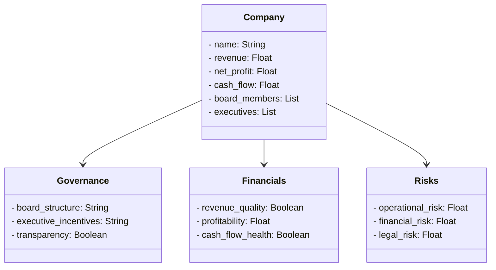

                 

# 彼得林奇对公司可持续发展的分析

> 关键词：彼得·林奇、公司治理、财务表现、风险管理、可持续发展、投资评估、企业价值

> 摘要：本文深入分析了彼得·林奇对公司可持续发展的分析方法，从公司治理、财务表现和风险管理三个核心维度出发，结合实际案例，探讨了这些因素如何影响公司的长期价值和投资决策。

---

## 第一部分：公司可持续发展概述

### 第1章：可持续发展的定义与重要性

#### 1.1 可持续发展的定义
- **多维度解读**：可持续发展不仅关注企业的盈利能力，还涉及环境、社会和治理（ESG）因素。它要求企业在追求经济利益的同时，兼顾社会责任和环境保护。
- **对企业的影响**：良好的可持续发展实践可以提升企业的声誉，降低风险，并吸引更多注重社会责任的投资者。
- **与企业价值的关系**：可持续发展是企业长期价值的重要组成部分，能够增强企业的抗风险能力和长期盈利能力。

#### 1.2 可持续发展的重要性
- **社会责任视角**：企业需要承担减少碳足迹、保护员工权益等社会责任。
- **投资者关注视角**：投资者越来越关注企业的ESG表现，这已成为影响投资决策的重要因素。
- **风险管理视角**：可持续发展帮助企业识别和管理潜在的环境和社会风险，从而提高企业的稳定性。

#### 1.3 彼得·林奇的分析方法
- **投资理念**：林奇注重基本面分析，关注企业的财务健康和管理层质量。
- **可持续发展在投资中的作用**：他认识到，企业治理不善或忽视社会责任可能导致长期风险，进而影响投资回报。
- **核心要素**：林奇关注企业的治理结构、财务透明度和管理层激励机制，这些都是企业可持续发展的关键因素。

---

## 第二部分：公司治理分析

### 第2章：公司治理的核心要素

#### 2.1 董事会结构
- **董事会组成**：董事会应包含独立董事和资深行业专家，以确保决策的独立性和专业性。
- **董事会职责**：制定公司战略、监督高管团队，并确保企业遵守法律法规。

#### 2.2 高管薪酬与激励机制
- **薪酬结构**：高管的薪酬应与公司绩效挂钩，激励管理层追求长期目标。
- **股权激励**：通过股票期权等长期激励措施，确保高管与股东利益一致。

#### 2.3 股东权利与透明度
- **股东参与**：股东应有权参与公司重大决策，确保管理层 accountability。
- **信息公开**：企业需定期披露财务和运营信息，提高透明度，增强投资者信心。

---

## 第三部分：财务表现分析

### 第3章：财务健康状况评估

#### 3.1 收入质量
- **收入来源**：分析公司收入是否来自核心业务，避免依赖短期热点。
- **收入增长**：关注收入的可持续增长，而非单纯追求高增长。

#### 3.2 利润能力
- **净利率**：衡量公司盈利效率，高净利率表明公司管理效率高。
- **毛利率**：分析产品成本控制能力，高毛利率显示竞争优势。

#### 3.3 现金流
- **经营活动现金流**：正值表明公司具备自我造血能力。
- **自由现金流**：用于再投资和偿还债务，维持企业健康发展。

---

## 第四部分：风险管理

### 第4章：风险识别与控制

#### 4.1 运营风险
- **供应链管理**：确保供应链稳定，避免因供应链中断导致的风险。
- **产品质量**：保持产品质量，维护品牌形象。

#### 4.2 财务风险
- **债务水平**：过高债务可能导致财务压力，影响企业稳定性。
- **汇率风险**：国际贸易企业需关注汇率波动对财务的影响。

#### 4.3 法律风险
- **合规性**：确保企业遵守相关法律法规，避免法律纠纷。
- **知识产权**：保护自有知识产权，防范侵权风险。

---

## 第五部分：系统分析与架构设计

### 第5章：系统架构设计

#### 5.1 领域模型类图

#### 5.2 系统架构图

---

## 第六部分：项目实战

### 第6章：苹果公司案例分析

#### 6.1 治理结构分析
- **董事会组成**：苹果董事会包括多位独立董事和行业专家，确保决策的独立性和专业性。
- **高管激励**：公司高管通过股票期权激励，与股东利益紧密绑定。

#### 6.2 财务表现解读
- **收入质量**：苹果的主要收入来自核心产品（如iPhone和Mac），收入稳定且可持续。
- **盈利能力**：高净利率显示公司管理效率高，具备强大的市场竞争力。
- **现金流**：经营活动现金流强劲，自由现金流充足，支持再投资和创新。

#### 6.3 风险管理
- **运营风险**：苹果通过多元化供应链管理，降低运营风险。
- **财务风险**：公司债务水平低，财务健康，具备较强的抗风险能力。
- **法律风险**：苹果注重知识产权保护，积极应对专利诉讼，法律风险较低。

---

## 第七部分：总结与展望

### 第7章：总结与投资建议

#### 7.1 核心总结
- **公司治理**：良好的治理结构和透明度是企业可持续发展的基石。
- **财务表现**：健康的财务状况和可持续的收入增长是投资的重要考量。
- **风险管理**：有效的风险管理能力能够降低企业的潜在风险，确保长期稳定发展。

#### 7.2 投资建议
- **关注治理结构**：优先选择治理结构完善、管理层激励机制合理的企业。
- **评估财务健康**：分析企业的收入质量、盈利能力及现金流状况。
- **重视风险管理**：评估企业对潜在风险的应对能力，选择风险控制能力强的企业。

#### 7.3 注意事项
- **动态调整**：企业内外部环境不断变化，需持续关注企业的最新动态。
- **分散投资**：避免过度集中，降低投资风险。

#### 7.4 未来展望
- **技术驱动**：随着技术进步，可持续发展将更加依赖数据分析和人工智能技术。
- **ESG投资趋势**：投资者越来越关注企业的ESG表现，未来可持续发展将成投资决策的核心因素。

---

## 作者

作者：AI天才研究院/AI Genius Institute & 禅与计算机程序设计艺术 /Zen And The Art of Computer Programming

