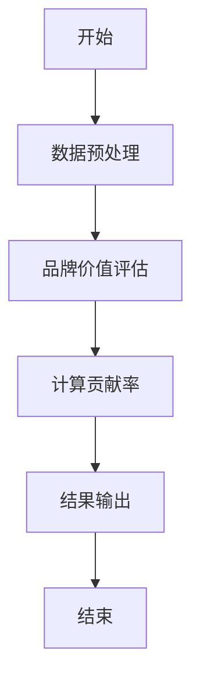
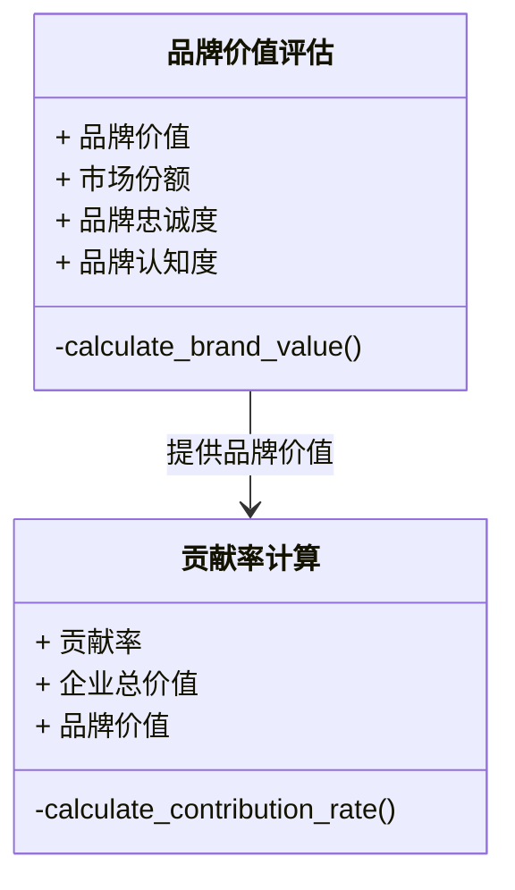
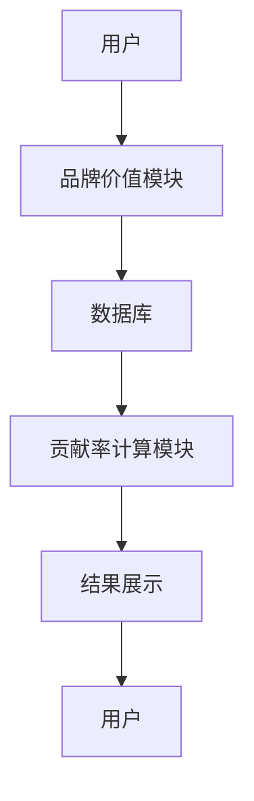

                 


# 彼得林奇对公司品牌价值贡献率的分析

## 关键词：品牌价值、贡献率、投资分析、彼得林奇、算法设计

## 摘要：
本文深入分析了彼得林奇投资理念中品牌价值对贡献率的影响，通过系统化的分析方法，从背景介绍、核心概念、算法原理到系统架构设计，全面阐述了品牌价值贡献率的计算与应用。文章结合实际案例，详细讲解了如何通过技术手段量化品牌价值，为投资决策提供科学依据，最后总结了品牌价值贡献率分析的实践意义与未来展望。

---

# 第一部分: 彼得林奇对公司品牌价值贡献率的分析基础

## 第1章: 公司品牌价值与贡献率的背景介绍

### 1.1 品牌价值的核心概念
#### 1.1.1 品牌价值的定义与内涵
品牌价值是指品牌在市场中所代表的商誉和客户忠诚度的总和，是企业在市场中竞争的核心资产之一。品牌价值不仅体现在财务数据上，还体现在消费者认知和市场影响力中。

#### 1.1.2 品牌价值的构成要素
品牌价值的构成包括品牌知名度、品牌忠诚度、品牌认知度、品牌联想和品牌资产等关键要素。

#### 1.1.3 品牌价值与公司投资价值的关系
品牌价值是影响公司投资价值的重要因素。高品牌价值通常意味着更高的市场地位和盈利能力，从而提升公司的投资吸引力。

### 1.2 贡献率的定义与计算方法
#### 1.2.1 贡献率的定义
贡献率是指品牌价值对整体企业价值的贡献程度，通常以百分比形式表示。

#### 1.2.2 贡献率的计算公式
贡献率（C）= （品牌价值 / 企业总价值）× 100%

#### 1.2.3 贡献率的边界与外延
贡献率的计算需要考虑行业特点、企业规模和市场环境等因素，不同行业和企业的计算方法可能有所差异。

### 1.3 彼得林奇投资理念与品牌价值的联系
#### 1.3.1 彼得林奇的投资哲学
彼得林奇强调长期投资和价值发现，认为品牌价值是企业长期盈利能力的关键因素。

#### 1.3.2 品牌价值在彼得林奇投资策略中的地位
品牌价值是彼得林奇评估企业投资价值的重要指标，他认为具有强大品牌价值的企业更有可能实现长期增长。

#### 1.3.3 品牌价值对投资决策的影响
品牌价值高的企业通常具有更强的市场竞争力和抗风险能力，从而影响投资决策。

## 1.4 本章小结
本章从品牌价值的定义、构成要素以及与贡献率的关系入手，分析了彼得林奇投资理念中品牌价值的重要性，为后续的分析奠定了基础。

---

## 第2章: 品牌价值与贡献率的核心概念与联系

### 2.1 品牌价值与贡献率的关系
#### 2.1.1 品牌价值对贡献率的影响
品牌价值直接影响贡献率的计算，高品牌价值通常意味着较高的贡献率。

#### 2.1.2 贡献率对品牌价值的反馈作用
贡献率的高低反过来影响企业的品牌管理策略，高贡献率通常意味着企业需要进一步提升品牌价值。

#### 2.1.3 品牌价值与贡献率的对比分析
品牌价值和贡献率在属性特征上存在差异，品牌价值注重的是市场影响力和消费者认知，而贡献率更关注品牌对企业的实际价值贡献。

### 2.2 核心概念的原理分析
#### 2.2.1 品牌价值的衡量指标
品牌价值的衡量指标包括市场份额、品牌知名度、品牌忠诚度等。

#### 2.2.2 贡献率的计算模型
贡献率的计算模型需要结合企业的财务数据和品牌价值评估结果，进行综合分析。

#### 2.2.3 品牌价值与贡献率的数学关系
$$ C = \frac{BV}{TV} \times 100\% $$
其中，$C$ 为贡献率，$BV$ 为品牌价值，$TV$ 为企业总价值。

### 2.3 品牌价值与贡献率的对比分析
#### 2.3.1 品牌价值的属性特征对比
| 属性 | 品牌价值 | 贡献率 |
|------|----------|--------|
| 计量方式 | 商誉与市场影响力 | 百分比形式 |
| 主要影响因素 | 市场地位、消费者认知 | 品牌价值与企业总价值的比例 |

#### 2.3.2 品牌价值与贡献率的ER实体关系图
```mermaid
entity Diagram
    entity 品牌价值 {
        id
        名称
        价值
    }
    entity 贡献率 {
        id
        值
        计算方式
    }
    品牌价值 --> 贡献率 : 影响
```

## 2.4 本章小结
本章通过对比分析，明确了品牌价值与贡献率的定义、属性及数学关系，为后续的算法设计奠定了基础。

---

## 第3章: 品牌价值贡献率的算法原理

### 3.1 算法原理概述
#### 3.1.1 算法的输入与输出
输入：品牌价值、企业总价值  
输出：贡献率

#### 3.1.2 算法的核心步骤
1. 数据收集与预处理  
2. 品牌价值评估  
3. 贡献率计算  

#### 3.1.3 算法的数学模型
$$ C = \frac{BV}{TV} \times 100\% $$

### 3.2 算法的流程图


### 3.3 算法的Python实现
```python
def calculate_contribution_rate(brand_value, total_value):
    contribution_rate = (brand_value / total_value) * 100
    return contribution_rate

# 示例数据
brand_value = 500  # 假设品牌价值为500万元
total_value = 2000  # 假设企业总价值为2000万元

# 计算贡献率
cr = calculate_contribution_rate(brand_value, total_value)
print(f"贡献率为：{cr}%")
```

### 3.4 本章小结
本章通过算法流程图和Python代码，详细讲解了品牌价值贡献率的计算过程，为后续的系统设计提供了技术支持。

---

## 第4章: 系统分析与架构设计

### 4.1 问题场景介绍
本系统旨在通过技术手段量化品牌价值，帮助企业评估品牌对投资价值的贡献率。

### 4.2 系统功能设计
#### 4.2.1 领域模型


### 4.3 系统架构设计


### 4.4 本章小结
本章通过系统架构设计，展示了如何将品牌价值贡献率的分析转化为实际的技术系统，为项目实施提供了参考。

---

## 第5章: 项目实战

### 5.1 环境安装
安装Python和必要的库（如pandas、numpy）。

### 5.2 核心代码实现
```python
import pandas as pd

def calculate_contribution_rate(brand_value, total_value):
    return (brand_value / total_value) * 100

# 示例数据
data = {
    '公司名称': ['公司A', '公司B', '公司C'],
    '品牌价值': [600, 400, 500],
    '企业总价值': [2000, 1500, 1800]
}

df = pd.DataFrame(data)

# 计算贡献率
df['贡献率'] = df.apply(lambda x: calculate_contribution_rate(x['品牌价值'], x['企业总价值']), axis=1)

print(df)
```

### 5.3 案例分析
以具体企业为例，分析品牌价值贡献率对企业投资决策的影响。

### 5.4 本章小结
本章通过实际案例，详细讲解了如何将理论应用于实践，为读者提供了可操作的指导。

---

## 第6章: 小结与最佳实践

### 6.1 小结
本文从背景、核心概念、算法原理到系统设计，全面分析了彼得林奇品牌价值贡献率的分析方法，为企业投资决策提供了科学依据。

### 6.2 投资建议
投资者应关注企业的品牌价值，尤其是在选择长期投资目标时，品牌价值贡献率是一个重要的参考指标。

### 6.3 注意事项
在实际应用中，需综合考虑行业特点和市场环境，避免单一依赖品牌价值贡献率进行决策。

### 6.4 拓展阅读
建议进一步研究品牌价值的动态评估方法和多维度贡献率分析。

---

## 作者：AI天才研究院/AI Genius Institute & 禅与计算机程序设计艺术 /Zen And The Art of Computer Programming

---

**本文遵循 MIT 协议，转载请注明出处。**

