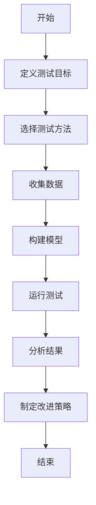
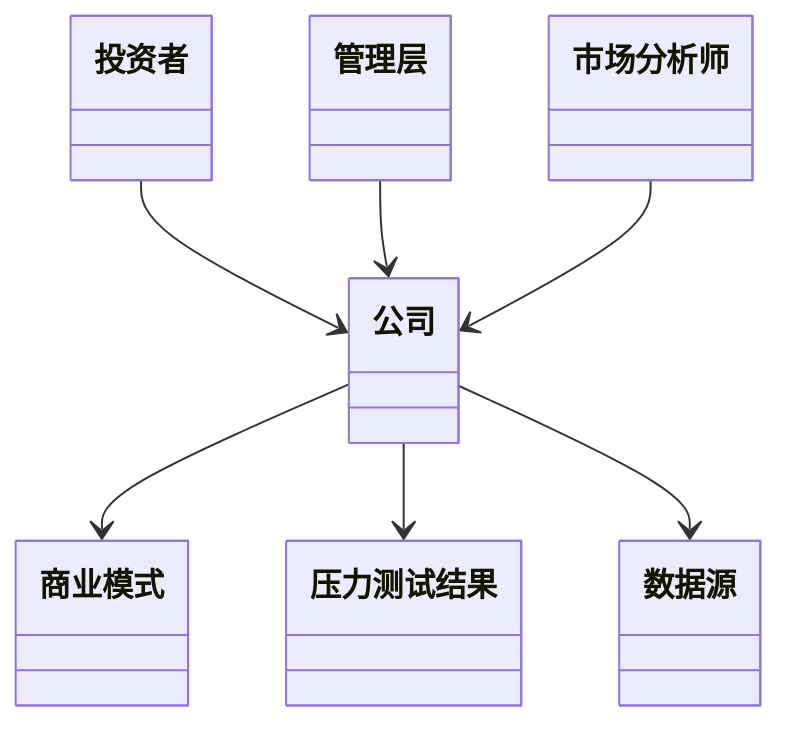
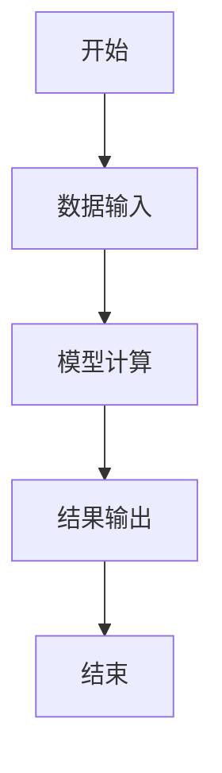
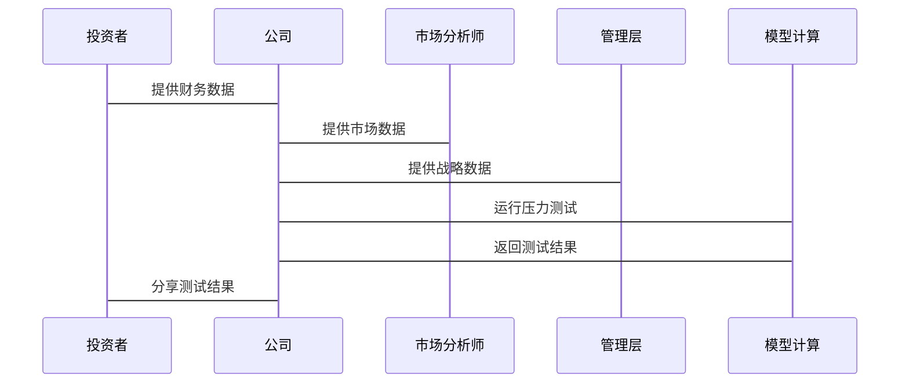

                 


# 彼得林奇对公司商业模式适应性的压力测试方法

> 关键词：彼得·林奇，商业模式适应性，压力测试，公司分析，风险管理

> 摘要：本文将探讨如何利用彼得·林奇的投资理念，对公司商业模式的适应性进行压力测试。通过分析商业模式在不同压力情景下的表现，识别潜在风险并提出优化策略，帮助公司在复杂多变的市场环境中保持竞争力。

---

# 第一部分: 背景介绍与核心概念

## 第1章: 背景介绍

### 1.1 压力测试的基本概念

压力测试是一种通过模拟极端市场条件或突发事件，评估公司或系统在压力情景下的表现和抗风险能力的方法。其核心目标是识别潜在风险点，并制定应对策略。

### 1.2 商业模式适应性的定义

商业模式适应性指公司根据外部环境变化调整自身业务模式的能力。它涉及收入来源、成本结构、客户关系等多个方面，是公司长期可持续发展的关键。

### 1.3 压力测试在商业模式中的重要性

1. **风险识别**：发现商业模式中的脆弱点，提前制定应对策略。
2. **稳健性评估**：确保公司在极端情况下仍能维持运营。
3. **优化决策**：通过压力测试结果，优化商业模式，提高竞争力。

## 第2章: 压力测试的核心概念与框架

### 2.1 压力测试的核心要素

1. **测试目标**：明确测试目的是为了评估公司在特定压力下的表现。
2. **测试情景**：设定可能的极端市场条件，如经济衰退、政策变化等。
3. **数据来源**：包括财务数据、市场数据、竞争对手数据等。
4. **测试方法**：选择合适的模型和工具，如情景分析、敏感性分析等。

### 2.2 压力测试的基本框架

1. **定义测试目标**：明确压力测试的目标和范围。
2. **选择测试方法**：根据目标选择合适的情景分析或定量模型。
3. **收集数据**：获取与测试目标相关的数据。
4. **构建模型**：建立数学模型，模拟压力情景下的公司表现。
5. **运行测试**：执行压力测试，记录结果。
6. **分析结果**：解读测试结果，识别潜在风险。
7. **制定改进策略**：根据测试结果优化商业模式。

---

# 第二部分: 核心概念与联系

## 第3章: 压力测试的核心原理

### 3.1 压力测试的数学模型

压力测试通常采用数学模型，如线性回归模型和非线性回归模型，来预测公司在不同情景下的表现。

#### 3.1.1 线性回归模型

$$ y = \beta_0 + \beta_1x + \epsilon $$

其中，$y$ 是因变量（如公司利润），$x$ 是自变量（如市场需求），$\beta_0$ 和 $\beta_1$ 是回归系数，$\epsilon$ 是误差项。

#### 3.1.2 非线性回归模型

$$ y = f(x) + \epsilon $$

非线性模型更适合处理复杂的市场关系，例如指数增长模型。

### 3.2 商业模式适应性压力测试的特征对比

下表对比了不同压力测试方法的特点：

| 方法         | 特点                               |
|--------------|------------------------------------|
| 情景分析     | 基于假设的极端情景，定性分析为主   |
| 敏感性分析   | 通过改变单一变量，评估影响程度     |
| 回归分析     | 基于统计模型，量化变量间的关系     |
| 蒙特卡洛模拟 | 通过随机抽样，模拟多种可能结果       |

### 3.3 实体关系图与流程图

#### 3.3.1 实体关系图（ER图）

```mermaid
er
actor: 投资者
actor: 管理层
actor: 市场分析师
class: 公司
class: 商业模式
class: 压力测试结果
class: 数据源
```

#### 3.3.2 压力测试流程图



---

# 第三部分: 算法原理讲解

## 第4章: 算法原理与数学模型

### 4.1 压力测试的算法步骤

1. **数据收集**：收集公司财务数据、市场数据、竞争对手数据等。
2. **模型构建**：建立数学模型，模拟压力情景下的公司表现。
3. **运行测试**：执行压力测试，获取测试结果。
4. **结果分析**：解读测试结果，识别潜在风险。
5. **策略优化**：根据测试结果，优化商业模式。

### 4.2 线性回归模型的实现

以下是使用Python实现线性回归模型的代码示例：

```python
import numpy as np
from sklearn.linear_model import LinearRegression

# 示例数据
X = np.array([5, 10, 15, 20, 25]).reshape(-1, 1)
y = np.array([2, 4, 6, 8, 10])

# 模型训练
model = LinearRegression()
model.fit(X, y)

# 预测结果
print(model.predict(X))
```

### 4.3 模型验证与结果解读

通过模型预测结果，可以评估公司在不同压力情景下的表现。例如，在市场需求下降的情况下，预测公司利润是否会大幅下降，从而判断商业模式的适应性。

---

# 第四部分: 系统分析与架构设计

## 第5章: 系统分析与架构设计

### 5.1 系统功能设计

以下是系统功能设计的类图：



### 5.2 系统架构设计

以下是系统架构设计的流程图：



### 5.3 系统接口设计

系统接口设计包括数据输入接口、模型计算接口和结果输出接口。

### 5.4 系统交互设计

以下是系统交互的序列图：



---

# 第五部分: 项目实战

## 第6章: 项目实战与案例分析

### 6.1 项目背景

以一家零售公司为例，分析其商业模式在市场需求下降情况下的适应性。

### 6.2 环境安装

安装必要的Python库，如`numpy`和`scikit-learn`。

### 6.3 代码实现

以下是实现压力测试的代码示例：

```python
import numpy as np
from sklearn.linear_model import LinearRegression

# 示例数据
X = np.array([5, 10, 15, 20, 25]).reshape(-1, 1)
y = np.array([2, 4, 6, 8, 10])

# 模型训练
model = LinearRegression()
model.fit(X, y)

# 预测结果
print(model.predict(X))
```

### 6.4 结果解读与分析

通过对测试结果的分析，识别公司在不同压力情景下的表现，判断商业模式的适应性。

### 6.5 案例分析

以零售公司为例，分析市场需求下降对公司利润的影响，提出优化建议。

---

# 第六部分: 最佳实践与总结

## 第7章: 最佳实践与总结

### 7.1 最佳实践

1. **数据质量**：确保数据的准确性和完整性。
2. **模型选择**：根据具体情况选择合适的模型。
3. **结果分析**：深入分析测试结果，识别潜在风险。

### 7.2 小结

通过本文的分析，我们可以看到，压力测试是评估公司商业模式适应性的重要工具。利用彼得·林奇的投资理念，我们可以更好地识别风险，优化商业模式，提升公司在复杂环境中的竞争力。

### 7.3 注意事项

1. **数据隐私**：确保数据的安全性和隐私性。
2. **模型局限性**：认识到模型的局限性，避免过度依赖。
3. **持续监控**：定期进行压力测试，保持对市场变化的敏感性。

### 7.4 拓展阅读

建议读者进一步阅读彼得·林奇的著作《彼得·林奇的投资心理学》，深入了解其投资理念和方法。

---

# 结语

通过本文的探讨，我们不仅了解了如何利用彼得·林奇的投资理念进行商业模式适应性压力测试，还掌握了具体的实施方法和注意事项。希望本文能为读者在实际工作中提供有价值的参考和指导。

---

**作者：AI天才研究院/AI Genius Institute & 禅与计算机程序设计艺术 /Zen And The Art of Computer Programming**

