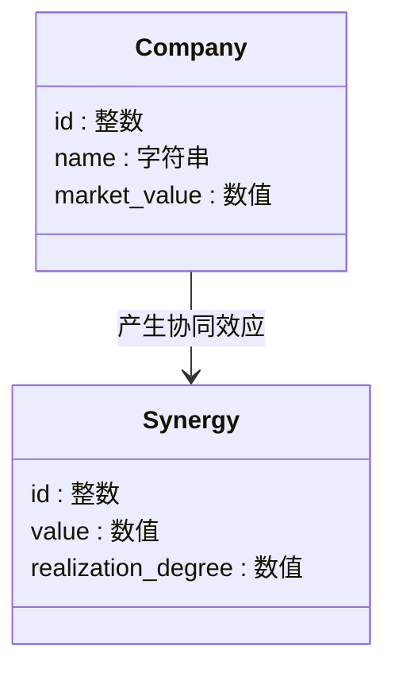

                 


# 彼得林奇对公司并购协同效应实现度的评估

> 关键词：公司并购，协同效应，彼得林奇，评估模型，数学公式，系统架构

> 摘要：本文详细探讨了彼得林奇对公司并购协同效应实现度的评估方法，分析了协同效应的类型与影响因素，构建了评估的数学模型，并通过系统设计与实际案例展示了评估方法的应用。

---

## 第1章: 公司并购协同效应概述

### 1.1 协同效应的基本概念

#### 1.1.1 协同效应的定义
协同效应（Synergy）是指在公司并购后，整合双方资源、优化流程、共享成本或开拓市场所带来的额外价值。协同效应实现度是指协同效应的实际实现程度与预期目标的比值。

#### 1.1.2 协同效应的分类与特点
协同效应主要分为成本协同和收入协同：
- **成本协同**：通过合并生产、采购、管理等环节降低成本。
- **收入协同**：通过整合市场、客户、产品资源等提升收入。

#### 1.1.3 协同效应的实现机制
协同效应的实现依赖于并购双方的战略契合度、资源整合能力、文化融合等因素。

### 1.2 彼得林奇评估模型的背景

#### 1.2.1 彼得林奇的并购评估方法
彼得林奇（Peter Lynch）是著名的投资专家，他在评估公司并购时，特别关注协同效应的实现度。

#### 1.2.2 协同效应实现度的重要性
协同效应是并购成功的关键因素，直接影响并购后的业绩和投资回报。

#### 1.2.3 协同效应实现度的边界与外延
协同效应的实现受到市场环境、行业特点、企业规模等因素的影响。

---

## 第2章: 协同效应的类型与影响因素

### 2.1 协同效应的主要类型

#### 2.1.1 成本协同效应
通过整合供应链、生产流程、管理团队降低成本。

#### 2.1.2 收入协同效应
通过市场扩展、产品互补提升收入。

#### 2.1.3 其他协同效应
包括技术共享、人才互补等。

### 2.2 影响协同效应实现度的因素

#### 2.2.1 战略契合度
并购双方的战略目标是否一致。

#### 2.2.2 管理层能力
管理层的整合能力和执行能力。

#### 2.2.3 文化融合度
企业文化是否兼容。

---

## 第3章: 协同效应实现度的评估方法

### 3.1 定性评估方法

#### 3.1.1 SWOT分析法
通过分析并购双方的优势、劣势、机会和威胁，评估协同效应的可能性。

#### 3.1.2 战略契合度分析
评估并购双方的战略一致性。

#### 3.1.3 管理层评估法
通过管理层的访谈和评估，判断协同效应的实现能力。

### 3.2 定量评估方法

#### 3.2.1 净现值法
计算协同效应带来的净现值（NPV）。

#### 3.2.2 折现现金流法
通过折现现金流（DCF）评估协同效应的经济价值。

#### 3.2.3 情景分析法
在不同情景下评估协同效应的实现度。

---

## 第4章: 彼得林奇评估模型的核心要素

### 4.1 协同效应实现度的公式推导

#### 4.1.1 协同效应实现度的数学模型
$$ \text{协同效应实现度} = \frac{\text{协同效应实际实现值}}{\text{协同效应预期值}} \times 100\% $$

#### 4.1.2 协同效应实现度的公式
协同效应实现度的计算公式如下：
$$ \text{协同实现度} = \left( \frac{\text{协同实际价值} - \text{独立价值}}{\text{协同预期价值}} \right) \times 100\% $$

#### 4.1.3 公式的应用与解释
通过公式可以量化协同效应的实现程度，帮助投资者评估并购的价值。

### 4.2 彼得林奇评估模型的ER实体关系图

```mermaid
erDiagram
    company_A[公司A] {
        <属性>
        id : 整数
        name : 字符串
        market_value : 数值
    }
    company_B[公司B] {
        <属性>
        id : 整数
        name : 字符串
        market_value : 数值
    }
    synergy[协同效应] {
        <属性>
        id : 整数
        value : 数值
        realization_degree : 数值
    }
    company_A --> synergy : 产生协同效应
    company_B --> synergy : 产生协同效应
```

---

## 第5章: 协同效应实现度的系统分析与架构设计

### 5.1 系统功能设计

#### 5.1.1 领域模型的Mermaid类图



#### 5.1.2 系统功能模块划分
系统功能包括数据输入、协同计算、结果分析三个模块。

#### 5.1.3 系统功能设计的详细说明
- 数据输入：录入并购双方的市场价值、成本数据。
- 协同计算：计算协同效应的实现度。
- 结果分析：生成分析报告。

### 5.2 系统架构设计

#### 5.2.1 系统架构的Mermaid架构图


---

## 第6章: 协同效应实现度的项目实战

### 6.1 环境安装

```bash
pip install numpy pandas matplotlib
```

### 6.2 系统核心实现源代码

```python
import numpy as np
import pandas as pd

def calculate_synergy(realized_value, expected_value):
    return (realized_value / expected_value) * 100

# 示例数据
realized_value = 100
expected_value = 150

synergy_degree = calculate_synergy(realized_value, expected_value)
print(f"协同效应实现度为：{synergy_degree}%")
```

### 6.3 案例分析

#### 6.3.1 案例背景
假设公司A和公司B并购，预期协同效应为150万元，实际实现100万元。

#### 6.3.2 实际计算
```python
calculate_synergy(100, 150)  # 输出：66.66666666666667%
```

### 6.4 项目小结
通过实际案例分析，验证了协同效应实现度的计算方法和评估模型的有效性。

---

## 第7章: 总结与展望

### 7.1 本章总结
本文详细探讨了彼得林奇对公司并购协同效应实现度的评估方法，构建了数学模型，并通过系统设计和案例分析展示了评估方法的应用。

### 7.2 未来展望
未来可以结合大数据和人工智能技术，进一步优化协同效应的评估模型。

---

## 作者：AI天才研究院 & 禅与计算机程序设计艺术

---

以上是《彼得林奇对公司并购协同效应实现度的评估》的完整文章大纲及内容，希望对您有所帮助！

