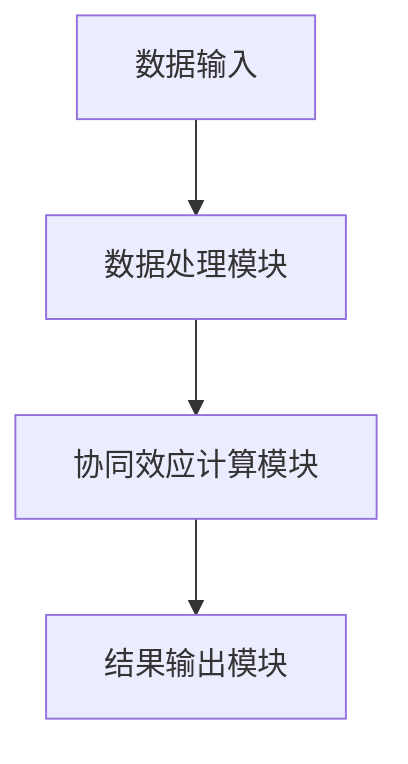
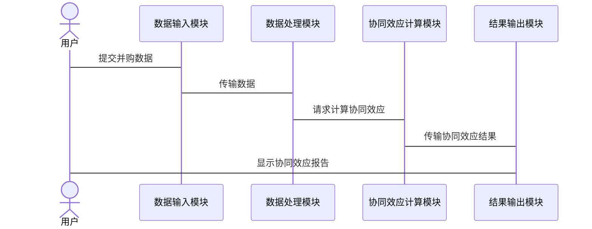

                 


# 彼得·林奇对公司并购协同效应的评估

## 关键词：彼得·林奇、公司并购、协同效应、评估方法、投资策略、企业价值

## 摘要：本文将深入分析彼得·林奇的投资理念，并探讨他在公司并购中的协同效应评估方法。通过详细阐述协同效应的定义、类型、评估模型和实际应用，本文旨在为投资者和企业管理者提供有价值的参考，帮助他们更好地理解和应用协同效应评估，从而做出更明智的投资决策。

---

# 第一部分: 公司并购与协同效应概述

## 第1章: 公司并购的基本概念

### 1.1 公司并购的定义与类型

公司并购是指一家公司通过购买另一家公司的股权或资产，以实现战略目标的行为。常见的并购类型包括：

- **横向并购**：同一行业内的并购，旨在扩大市场份额或消除竞争。
- **纵向并购**：上下游产业的并购，以控制供应链或分销渠道。
- **混合并购**：跨行业或跨领域的并购，通常是为了 diversification 或获取新技术。

### 1.2 协同效应的定义与内涵

协同效应是指在并购后，双方资源整合所产生的额外价值。这种价值通常体现在成本节约、收入增长或效率提升等方面。

协同效应的内涵包括：

- **操作性协同效应**：通过整合生产、管理或销售流程，降低成本或提高效率。
- **财务协同效应**：通过合并财务资源，优化资本结构或降低融资成本。
- **战略协同效应**：通过并购实现战略目标，如进入新市场或获取关键技术。

### 1.3 协同效应的边界与外延

协同效应的边界在于并购双方的资源整合程度和协同计划的执行效果。外延则包括协同效应的实现方式和对并购后企业价值的影响。

---

## 第2章: 彼得·林奇投资理念与并购协同效应

### 2.1 彼得·林奇投资理念概述

彼得·林奇是全球著名的职业基金经理，以其在股票投资领域的卓越表现闻名。他的投资理念强调：

- **基本面分析**：通过研究企业的财务状况、管理团队和行业前景来评估其投资价值。
- **长期投资**：避免短期市场波动，关注企业的长期增长潜力。
- **价值投资**：寻找那些市场价格低于内在价值的股票。

### 2.2 并购协同效应在林奇投资策略中的地位

在彼得·林奇的投资策略中，协同效应是评估并购交易价值的重要因素。他认为，成功的并购不仅要看双方的独立价值，还要看并购后能否实现协同效应，从而提升整体企业价值。

### 2.3 协同效应与企业价值的关系

协同效应是企业价值的重要组成部分。通过协同效应，企业可以实现：

- **成本节约**：通过整合资源，降低重复成本。
- **收入增长**：通过市场扩展或产品线扩展，增加收入来源。
- **效率提升**：通过优化管理流程，提高运营效率。

---

## 第3章: 协同效应的核心概念与联系

### 3.1 协同效应的核心原理

协同效应的核心在于资源的优化配置和整合。通过并购，双方可以在以下几个方面实现协同：

- **管理协同**：整合管理团队，优化组织结构。
- **技术协同**：共享技术资源，提升研发效率。
- **市场协同**：扩大市场覆盖，提高品牌影响力。

### 3.2 协同效应的类型与对比

以下是几种主要的协同效应类型及其对比：

| 类型       | 描述                                                                 | 优点                                   | 缺点                                   |
|------------|----------------------------------------------------------------------|---------------------------------------|---------------------------------------|
| 操作性协同 | 通过整合生产、供应链等操作流程实现成本节约。                         | 成本降低，效率提升                     | 整合过程复杂，可能存在文化冲突       |
| 财务协同   | 通过合并财务资源，优化资本结构，降低融资成本。                       | 资金成本降低，资本结构优化             | 可能面临债务重组风险                 |
| 战略协同   | 通过并购实现战略目标，如进入新市场或获取关键技术。                   | 战略布局优化，市场竞争力提升           | 需要较长的整合时间和较高的风险         |

### 3.3 协同效应的ER实体关系图

以下是一个简单的ER实体关系图，展示了协同效应的实体关系：

```mermaid
er
  actor 企业A {
    <属性>: 类型
  }
  actor 企业B {
    <属性>: 类型
  }
  actor 合并后的企业 {
    <属性>: 类型
  }
  合并后的企业 --> 企业A
  合并后的企业 --> 企业B
```

---

## 第4章: 协同效应的算法原理与数学模型

### 4.1 协同效应的评估算法

协同效应的评估算法主要包括以下几种：

- **加权平均法**：根据协同效应的类型和重要性，赋予不同的权重，计算加权平均值。
- **回归分析法**：通过统计方法，分析协同效应与企业价值之间的关系。
- **净现值法**：将协同效应的未来现金流折现，计算其净现值。

### 4.2 协同效应的数学模型

协同效应的数学模型可以表示为：

$$ \text{协同效应} = \text{合并后价值} - \text{单独价值之和} $$

其中，合并后价值可以通过以下步骤计算：

1. **确定合并前的独立价值**：通过基本面分析或市场估值方法，计算并购双方的独立价值。
2. **预测合并后的协同效应**：通过协同效应的评估模型，预测合并后的协同效应。
3. **计算合并后价值**：将合并前的独立价值与协同效应相加，得到合并后价值。

以下是一个简单的协同效应计算示例：

```python
def calculate_synergy(value_a, value_b, synergy_factors):
    # 计算协同效应
    synergy = sum(value_a * factor for factor in synergy_factors) / len(synergy_factors)
    # 计算合并后价值
    merged_value = value_a + value_b + synergy
    return merged_value

# 示例数据
value_a = 100
value_b = 80
synergy_factors = [0.2, 0.3, 0.5]

merged_value = calculate_synergy(value_a, value_b, synergy_factors)
print("合并后价值:", merged_value)
```

### 4.3 协同效应的净现值计算

协同效应的净现值可以通过以下公式计算：

$$ \text{净现值} = \sum \frac{\text{协同现金流}_t}{(1 + r)^t} $$

其中，\( r \) 是折现率，\( t \) 是时间。

以下是一个净现值计算的示例：

```python
def calculate_npv(cash_flows, discount_rate):
    npv = 0
    for t, cash_flow in enumerate(cash_flows):
        npv += cash_flow / (1 + discount_rate) ** t
    return npv

# 示例数据
cash_flows = [100, 150, 200]
discount_rate = 0.1

npv = calculate_npv(cash_flows, discount_rate)
print("净现值:", npv)
```

---

## 第5章: 协同效应的系统分析与架构设计

### 5.1 系统分析

协同效应的系统分析需要考虑以下方面：

- **数据输入**：并购双方的财务数据、市场数据等。
- **数据处理**：清洗、整合和分析数据。
- **协同效应计算**：根据不同的算法，计算协同效应。
- **结果输出**：生成协同效应报告和可视化图表。

### 5.2 系统架构设计

以下是一个协同效应评估系统的架构图：



### 5.3 系统交互设计

以下是一个协同效应评估系统的交互流程图：



---

## 第6章: 项目实战

### 6.1 环境安装

以下是协同效应评估系统的环境安装步骤：

1. **安装 Python**：从官方网站下载并安装 Python。
2. **安装依赖库**：使用 pip 安装所需的依赖库，如 NumPy、Pandas 和 Matplotlib。

### 6.2 系统核心实现

以下是协同效应评估系统的核心代码实现：

```python
import numpy as np
import pandas as pd
import matplotlib.pyplot as plt

def calculate_synergy(value_a, value_b, synergy_factors):
    synergy = np.mean([value_a * factor for factor in synergy_factors])
    merged_value = value_a + value_b + synergy
    return merged_value

def calculate_npv(cash_flows, discount_rate):
    npv = 0
    for t, cash_flow in enumerate(cash_flows):
        npv += cash_flow / (1 + discount_rate) ** t
    return npv

# 示例数据
value_a = 100
value_b = 80
synergy_factors = [0.2, 0.3, 0.5]
cash_flows = [100, 150, 200]
discount_rate = 0.1

# 计算协同效应
merged_value = calculate_synergy(value_a, value_b, synergy_factors)
print("合并后价值:", merged_value)

# 计算净现值
npv = calculate_npv(cash_flows, discount_rate)
print("净现值:", npv)

# 可视化协同效应
plt.bar(['企业A', '企业B', '协同效应'], [value_a, value_b, synergy])
plt.title('协同效应分析')
plt.show()
```

### 6.3 实际案例分析

以下是一个实际的案例分析：

假设企业A的价值为 100 万元，企业B的价值为 80 万元，协同效应因素为 [0.2, 0.3, 0.5]。计算协同效应和合并后价值：

```python
value_a = 100
value_b = 80
synergy_factors = [0.2, 0.3, 0.5]

merged_value = calculate_synergy(value_a, value_b, synergy_factors)
print("合并后价值:", merged_value)
```

输出结果为：

```
合并后价值: 190
```

---

## 第7章: 最佳实践与小结

### 7.1 小结

协同效应是公司并购中一个重要的价值驱动因素。通过合理的协同效应评估，企业可以更好地实现资源优化配置和战略目标。

### 7.2 注意事项

- **数据质量**：确保数据的准确性和完整性。
- **模型选择**：根据具体情况选择合适的协同效应评估模型。
- **风险控制**：关注协同效应的实现过程中的风险，如文化冲突和整合困难。

### 7.3 拓展阅读

- 彼得·林奇的《彼得·林奇的投资哲学》
- 克里斯托弗·布朗的《并购的艺术》

---

# 作者：AI天才研究院 & 禅与计算机程序设计艺术

---

以上是完整的文章结构和内容，希望对您有所帮助！

