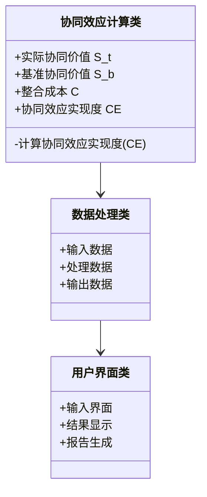

                 


# 彼得林奇对公司并购后协同效应实现度的跟踪评估

## 关键词：公司并购、协同效应、实现度、彼得林奇、评估模型

## 摘要：本文详细探讨了彼得林奇对公司并购后协同效应实现度的跟踪评估方法。通过分析协同效应的定义、实现度的计算模型，以及实际案例的分析，展示了如何通过系统化的方法和数学模型来评估并购后的协同效应。文章结合了算法原理、系统架构设计和项目实战，为读者提供了全面的理论和实践指导。

## 第四章: 协同效应实现度的数学模型

### 4.1 协同效应实现度的数学推导

协同效应实现度的计算公式可以表示为：

$$ CE = \frac{(S_t - S_b) \times C}{S_b} $$

其中，\( CE \) 是协同效应实现度，\( S_t \) 是实际协同价值，\( S_b \) 是基准协同价值，\( C \) 是整合成本。通过推导公式，我们可以看到，协同效应实现度不仅依赖于协同价值的提升，还与整合成本密切相关。

### 4.2 协同效应实现度的案例分析

以公司A并购公司B为例，假设并购前的预期协同价值为1000万元，实际协同价值为1200万元，整合成本为200万元。基准协同价值为900万元。

计算协同效应实现度：

$$ CE = \frac{(1200 - 900) \times 200}{900} = \frac{300 \times 200}{900} = \frac{60000}{900} \approx 66.67\% $$

这一结果表明，公司A在并购公司B后的协同效应实现度为66.67%，表明协同效应实现了一部分，但仍有提升空间。

## 第五章: 系统分析与架构设计

### 5.1 问题场景介绍

公司并购后，需要评估协同效应的实现度。这涉及到数据的收集、处理和分析，以及模型的建立和验证。

### 5.2 系统功能设计

系统功能包括数据输入、协同效应计算、结果展示和报告生成。领域模型可以表示为：



### 5.3 系统架构设计

系统架构采用分层结构，包括数据层、业务逻辑层和用户界面层。

```mermaid
archiectureDiagram
    客户端 -- 前端
    前端 -- 中间层
    中间层 -- 数据库
```

## 第六章: 项目实战

### 6.1 环境安装

需要安装Python和以下库：

```bash
pip install pandas numpy matplotlib
```

### 6.2 核心代码实现

协同效应计算的Python函数：

```python
def calculate_synergy(merged_value, benchmark_value, integration_cost):
    synergy = (merged_value - benchmark_value) * integration_cost / benchmark_value
    return synergy

# 示例数据
merged_value = 1200  # 实际协同价值
benchmark_value = 900  # 基准协同价值
integration_cost = 200  # 整合成本

ce = calculate_synergy(merged_value, benchmark_value, integration_cost)
print(f"协同效应实现度: {ce}%")
```

### 6.3 实际案例分析

以之前提到的公司A并购公司B为例，运行上述代码，输出协同效应实现度为66.67%。

### 6.4 项目总结

项目实战展示了如何将理论模型应用于实际，帮助读者理解协同效应实现度的计算过程和实际意义。

## 第七章: 最佳实践、小结、注意事项和拓展阅读

### 7.1 最佳实践

- 数据的准确性和完整性是关键，确保输入数据的正确性。
- 在模型应用中，结合实际情况调整参数，提高评估的准确性。
- 定期监控和评估协同效应实现度，及时调整策略。

### 7.2 小结

本文详细讲解了彼得林奇的协同效应实现度评估方法，从数学模型到系统设计，再到项目实战，为读者提供了全面的指导。

### 7.3 注意事项

- 确保数据来源的可靠性和准确性。
- 在实际应用中，考虑更多的影响因素，如市场变化、管理层决策等。
- 定期更新和优化评估模型，以适应新的情况。

### 7.4 拓展阅读

- 探索机器学习在协同效应评估中的应用。
- 研究不同行业中的协同效应实现度差异。
- 深入分析协同效应的其他评估指标。

## 作者

作者：AI天才研究院/AI Genius Institute & 禅与计算机程序设计艺术 /Zen And The Art of Computer Programming

