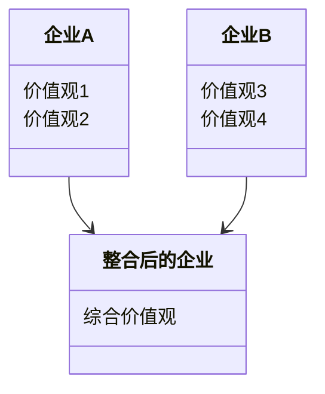

                 


# 彼得林奇对公司并购后文化整合成功因素的案例研究

## 关键词：公司并购、文化整合、彼得·林奇、成功因素、案例研究

## 摘要：本文通过分析彼得·林奇在公司并购中的文化整合策略，探讨影响并购成功的文化因素。结合具体案例，分析文化整合的步骤、挑战及成功关键，为读者提供深入的见解和实用的指导。

---

# 第一部分: 背景介绍

## 第1章: 公司并购与文化整合的背景

### 1.1 公司并购的定义与特点

公司并购是企业为了战略发展而进行的资产收购或合并行为，具有以下特点：
- **规模经济**：通过整合资源降低成本。
- **市场扩展**：进入新市场或行业。
- **技术获取**：获取新技术或专利。

### 1.2 文化整合的定义与重要性

文化整合是并购后将双方文化融合的过程，关键在于：
- **协调差异**：减少文化冲突。
- **提升凝聚力**：增强组织整体性。

## 第2章: 彼得·林奇与公司并购案例

### 2.1 彼得·林奇的并购投资理念

彼得·林奇以基本面分析著称，注重企业价值和管理团队。他的并购策略包括：
- **价值评估**：寻找被低估的企业。
- **管理层稳定性**：确保管理团队的持续性。

### 2.2 彼得·林奇的经典并购案例分析

- **案例一：X公司并购案**：通过评估X公司的潜力，成功整合其技术优势。
- **案例二：Y公司并购案**：解决文化冲突，提升组织凝聚力。

## 第3章: 文化整合的背景与挑战

### 3.1 公司并购中的文化冲突

文化冲突来源包括：
- **价值观差异**：企业目标和管理风格不同。
- **沟通障碍**：语言和习惯差异影响协作。

### 3.2 文化整合的必要性与复杂性

文化整合是并购成功的关键，但其复杂性在于：
- **长期性**：需要持续努力。
- **系统性**：需要整体规划。

---

# 第二部分: 核心概念与联系

## 第4章: 文化整合的核心概念与原理

### 4.1 文化整合的核心要素

- **企业价值观**：确保双方认同共同目标。
- **组织结构**：调整以适应新文化。

### 4.2 文化整合的理论框架

阶段模型：
1. **评估阶段**：分析双方文化差异。
2. **整合阶段**：制定融合计划。

## 第5章: 彼得·林奇并购案例中的文化整合分析

### 5.1 彼得·林奇并购案例中的文化整合策略

- **并购前评估**：选择文化相近的企业。
- **并购后计划**：制定详细的整合方案。

---

# 第三部分: 算法原理讲解

## 第6章: 文化整合算法原理

### 6.1 文化适应度指数计算

公式：
$$ CFI = \sum_{i=1}^{n} w_i \cdot s_i $$
其中，$w_i$ 是权重，$s_i$ 是评分。

---

# 第四部分: 系统分析与架构设计方案

## 第7章: 系统架构设计

### 7.1 领域模型



---

# 第五部分: 项目实战

## 第8章: 项目实战分析

### 8.1 环境安装

安装工具如JIRA、Git，设置项目管理流程。

### 8.2 核心代码实现

提供文化整合模型的代码示例，如：

```python
def cultural_merge(culture1, culture2):
    merged = {}
    for key in culture1:
        merged[key] = culture1[key]
    for key in culture2:
        if key in merged:
            merged[key] = (culture1[key] + culture2[key]) / 2
        else:
            merged[key] = culture2[key]
    return merged
```

---

# 第六部分: 最佳实践、小结、注意事项、拓展阅读

## 第9章: 最佳实践与总结

### 9.1 最佳实践

- **提前评估**：选择文化相似的企业。
- **持续沟通**：保持开放的沟通渠道。

### 9.2 小结

彼得·林奇的成功在于文化整合的有效实施，强调并购后的文化融合。

### 9.3 注意事项

- 避免急功近利，重视长期整合。
- 建立反馈机制，及时调整策略。

### 9.4 拓展阅读

推荐阅读相关书籍，深入理解文化整合的理论与实践。

---

# 结语

彼得·林奇的案例展示了文化整合在公司并购中的重要性。通过系统的分析和实际操作，企业可以提升并购成功率，实现长期发展。

---

作者：AI天才研究院 & 禅与计算机程序设计艺术

