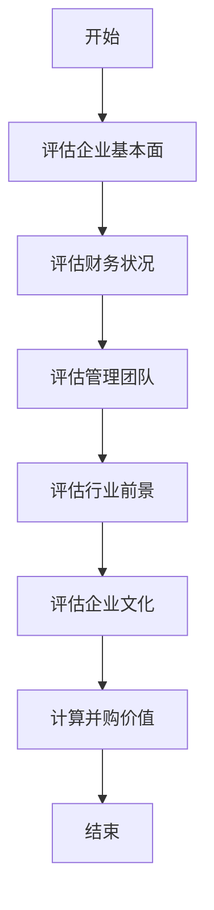
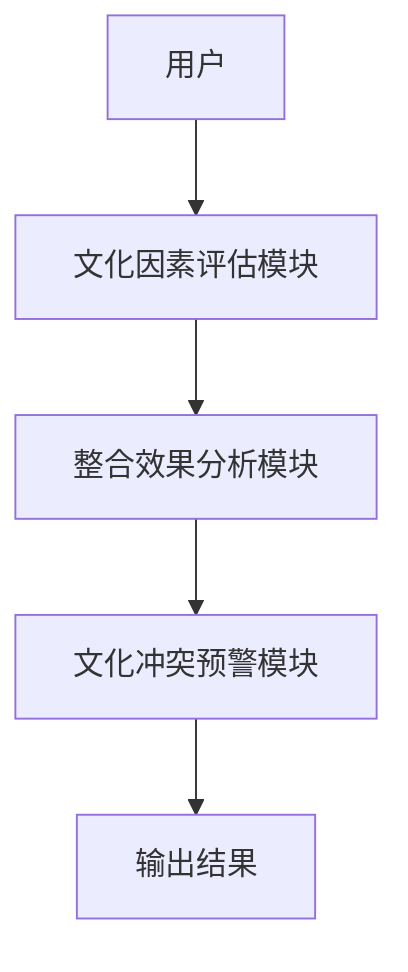

                 


# 彼得林奇对公司并购后文化整合的评估

> 关键词：公司并购、文化整合、彼得林奇、并购评估、文化冲突

> 摘要：本文通过分析彼得林奇的投资哲学与并购策略，探讨公司在并购后文化整合的重要性及其对并购成功的影响。文章从文化整合的定义与属性、文化整合与并购成功的关联、文化整合评估的算法与数学模型等角度展开，结合实际案例，深入剖析文化整合在公司并购中的核心地位。

---

## 第1章: 公司并购的背景与现状

### 1.1 公司并购的定义与特点

#### 1.1.1 公司并购的定义
公司并购是指一家企业通过购买另一家企业的股权或资产，以实现企业扩张或战略重组的过程。并购通常分为两种形式：一种是横向并购，即在同一行业内的并购；另一种是纵向并购，即在供应链上下游的并购。

#### 1.1.2 公司并购的核心特点
- **规模效应**：通过并购扩大企业规模，降低单位成本。
- **协同效应**：通过整合资源、优化流程，提高效率。
- **风险分散**：通过并购进入新市场或新领域，分散经营风险。

#### 1.1.3 公司并购的分类与形式
- **横向并购**：在同一行业内的并购，目的是扩大市场份额。
- **纵向并购**：在供应链上下游的并购，目的是控制价值链。
- **混合并购**：跨行业并购，目的是多元化经营。

### 1.2 文化整合的定义与重要性

#### 1.2.1 文化整合的定义
文化整合是指在并购后，将被并购企业的文化与原有企业的文化进行融合，形成新的企业文化的过程。文化整合的核心在于协调两种文化的冲突，实现文化互补与融合。

#### 1.2.2 文化整合的重要性
- **提升企业凝聚力**：通过文化整合，增强员工对企业文化的认同感。
- **促进协同效应**：文化整合有助于消除部门间的信息壁垒，提升协作效率。
- **增强企业竞争力**：文化整合能够提升企业的整体竞争力，使其在市场中更具优势。

#### 1.2.3 文化整合的挑战与机遇
- **挑战**：文化冲突、管理风格差异、员工抵触情绪等。
- **机遇**：通过文化整合，实现优势互补，提升企业创新能力。

### 1.3 彼得林奇与公司并购的关联

#### 1.3.1 彼得林奇的投资哲学
彼得林奇是美国著名投资专家，以其独特的投资哲学闻名。他主张投资具有强大竞争优势的企业，并长期持有。他的投资哲学强调基本面分析和企业价值评估。

#### 1.3.2 彼得林奇并购策略的核心思想
彼得林奇认为，并购的核心在于寻找具有强大竞争优势的企业，并通过合理的价格进行并购。他强调，并购不仅仅是资产的整合，更是文化和管理的整合。

#### 1.3.3 彼得林奇与文化整合的结合
彼得林奇的成功并购案例中，文化整合起到了至关重要的作用。他通过对企业文化的深入了解，确保了并购后的整合顺利进行，从而实现了企业的长期发展。

---

## 第2章: 公司并购后文化整合的背景与问题

### 2.1 公司并购的背景分析

#### 2.1.1 经济全球化与并购浪潮
经济全球化推动了跨国并购的浪潮，企业通过并购实现全球化布局。

#### 2.1.2 企业扩张的内在需求
企业为了实现规模经济和协同效应，往往选择并购作为扩张的主要手段。

#### 2.1.3 并购驱动因素分析
- **市场驱动**：通过并购扩大市场份额。
- **成本驱动**：通过并购降低生产成本。
- **技术驱动**：通过并购获取新技术和新能力。

### 2.2 文化整合的必要性

#### 2.2.1 并购后整合的核心问题
- **文化冲突**：不同企业的文化差异可能导致管理混乱。
- **组织协调**：并购后的组织架构需要重新调整。
- **员工融合**：员工的文化差异可能影响团队协作。

#### 2.2.2 文化冲突的常见表现
- **管理风格差异**：不同企业有不同的管理风格，可能导致冲突。
- **价值观差异**：企业文化的核心价值观不同，可能导致员工抵触情绪。

#### 2.2.3 文化整合对并购成功的影响
- **正面影响**：文化整合能够提升企业凝聚力，促进协同效应。
- **负面影响**：文化冲突可能导致并购失败，影响企业绩效。

### 2.3 彼得林奇并购评估的核心问题

#### 2.3.1 并购评估的基本框架
彼得林奇的并购评估框架包括对企业基本面、财务状况、管理团队、行业前景等方面的分析。

#### 2.3.2 文化因素在并购评估中的地位
彼得林奇认为，文化因素是并购成功的重要条件。他强调，并购不仅仅是资产的整合，更是文化和管理的整合。

#### 2.3.3 彼得林奇并购评估的独特视角
彼得林奇通过对企业文化的深入了解，确保了并购后的整合顺利进行，从而实现了企业的长期发展。

---

## 第3章: 文化整合的核心概念与联系

### 3.1 文化整合的定义与属性

#### 3.1.1 文化整合的定义
文化整合是指在并购后，将被并购企业的文化与原有企业的文化进行融合，形成新的企业文化的过程。

#### 3.1.2 文化整合的核心属性对比
| 属性 | 被并购企业 | 原有企业 | 整合后企业 |
|------|------------|----------|------------|
| 核心价值观 | 不同 | 不同 | 融合后统一 |
| 管理风格 | 不同 | 不同 | 融合后统一 |
| 企业愿景 | 不同 | 不同 | 融合后统一 |

#### 3.1.3 文化整合的ER实体关系图
```mermaid
erDiagram
  CULTURE {
    id INT
    name VARCHAR
    description TEXT
  }
  EMPLOYEE {
    id INT
    name VARCHAR
    role VARCHAR
  }
  DEPARTMENT {
    id INT
    name VARCHAR
    manager_id INT
  }
  CULTURE relates to EMPLOYEE
  CULTURE relates to DEPARTMENT
```

### 3.2 文化整合与并购成功的关联

#### 3.2.1 文化整合对并购绩效的影响
文化整合能够提升企业绩效，实现协同效应。

#### 3.2.2 文化整合与企业协同效应的关系
文化整合是实现企业协同效应的重要前提。

#### 3.2.3 文化整合与企业长期发展的联系
文化整合能够增强企业的核心竞争力，促进企业的长期发展。

### 3.3 彼得林奇并购评估模型

#### 3.3.1 模型的构成与核心要素
彼得林奇并购评估模型包括以下几个核心要素：
- 企业基本面
- 财务状况
- 管理团队
- 行业前景
- 企业文化

#### 3.3.2 模型的数学表达与公式
彼得林奇并购评估模型可以用以下公式表示：
$$
\text{并购价值} = \text{企业基本面} \times \text{财务状况} \times \text{管理团队} \times \text{行业前景} \times \text{企业文化}
$$

#### 3.3.3 模型的流程图与步骤说明


---

## 第4章: 并购评估的算法原理

### 4.1 文化整合评估的算法选择

#### 4.1.1 常见并购评估算法对比
- **层次分析法（AHP）**：适用于多因素评估。
- **加权评分法**：适用于简单评估。

#### 4.1.2 文化整合评估的适用算法
加权评分法适用于文化整合评估，能够将不同文化因素进行量化评估。

#### 4.1.3 算法的优缺点分析
- **优点**：简单易行，适合初步评估。
- **缺点**：需要主观确定权重，可能影响评估结果。

### 4.2 文化整合评估的数学模型

#### 4.2.1 文化整合指数的定义
文化整合指数是衡量文化整合程度的量化指标。

#### 4.2.2 文化整合指数的计算公式
$$
\text{文化整合指数} = \sum_{i=1}^{n} w_i \times s_i
$$
其中，$w_i$ 是第 $i$ 个文化因素的权重，$s_i$ 是第 $i$ 个文化因素的评分。

#### 4.2.3 文化整合指数的应用
通过文化整合指数，可以评估并购后的文化整合效果，为后续管理决策提供依据。

---

## 第5章: 系统分析与架构设计方案

### 5.1 问题场景介绍

#### 5.1.1 系统目标
设计一个文化整合评估系统，帮助企业在并购后实现文化整合。

#### 5.1.2 系统功能需求
- 文化因素评估
- 整合效果分析
- 文化冲突预警

### 5.2 系统架构设计

#### 5.2.1 系统架构图


#### 5.2.2 系统功能模块
- 文化因素评估模块
- 整合效果分析模块
- 文化冲突预警模块

---

## 第6章: 项目实战

### 6.1 环境安装

#### 6.1.1 系统环境
- 操作系统：Windows 10
- 开发工具：PyCharm
- 数据库：MySQL

### 6.2 系统核心实现源代码

#### 6.2.1 文化整合指数计算代码
```python
def calculate_cultural_integration_index(factors):
    weights = [0.4, 0.3, 0.2, 0.1]
    index = 0
    for i in range(len(factors)):
        index += weights[i] * factors[i]
    return index
```

#### 6.2.2 文化冲突预警代码
```python
def cultural_conflict预警(factors):
    threshold = 0.6
    if sum(factors) < threshold:
        return "文化冲突预警"
    else:
        return "文化整合顺利"
```

### 6.3 代码应用解读与分析

#### 6.3.1 文化整合指数计算代码解读
该函数根据不同的文化因素及其权重，计算文化整合指数。

#### 6.3.2 文化冲突预警代码解读
该函数根据文化因素的综合评分，判断是否需要发出文化冲突预警。

### 6.4 实际案例分析

#### 6.4.1 案例介绍
以亚马逊收购全食超市为例，分析文化整合的成功与否。

#### 6.4.2 文化整合分析
亚马逊的文化强调创新与效率，而全食超市的文化强调顾客体验。通过文化整合，亚马逊成功实现了对全食超市的管理整合。

### 6.5 项目小结

#### 6.5.1 项目总结
文化整合是并购成功的关键因素，需要企业在并购前进行充分的评估和规划。

#### 6.5.2 项目经验
通过实际案例分析，验证了文化整合评估模型的有效性。

---

## 第7章: 总结与最佳实践

### 7.1 总结

#### 7.1.1 核心内容回顾
文化整合是并购成功的关键因素，需要企业在并购前进行充分的评估和规划。

#### 7.1.2 并购评估的核心要点
彼得林奇的并购评估模型强调了文化因素的重要性。

### 7.2 最佳实践 tips

#### 7.2.1 评估阶段
在并购前，对企业文化进行充分评估，确保文化整合的可能性。

#### 7.2.2 整合阶段
在并购后，制定详细的文化整合计划，确保整合顺利进行。

#### 7.2.3 监测阶段
在整合过程中，持续监测文化整合的效果，及时调整策略。

### 7.3 小结

#### 7.3.1 文化整合的重要性
文化整合是并购成功的关键因素，需要企业在并购前进行充分的评估和规划。

#### 7.3.2 并购评估的核心要点
彼得林奇的并购评估模型强调了文化因素的重要性。

### 7.4 注意事项

#### 7.4.1 避免文化冲突
在并购过程中，避免文化冲突，确保文化整合顺利进行。

#### 7.4.2 文化整合的长期性
文化整合是一个长期过程，需要企业在并购后持续关注。

### 7.5 拓展阅读

#### 7.5.1 推荐书籍
- 《彼得林奇的成功投资》
- 《公司并购与文化整合》

#### 7.5.2 推荐文章
- 网络资源：公司并购与文化整合的相关文章。

---

## 作者：AI天才研究院/AI Genius Institute & 禅与计算机程序设计艺术 /Zen And The Art of Computer Programming

---

以上是《彼得林奇对公司并购后文化整合的评估》的完整目录大纲及部分章节内容，您可以根据需要进一步扩展和补充每个部分的内容。

