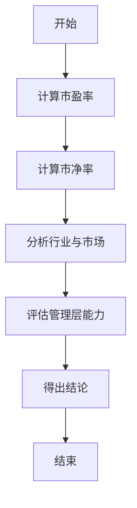
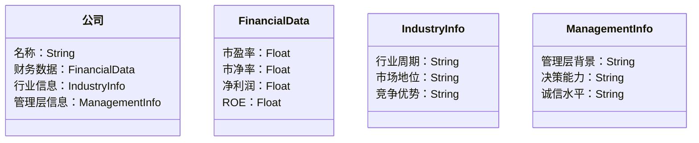
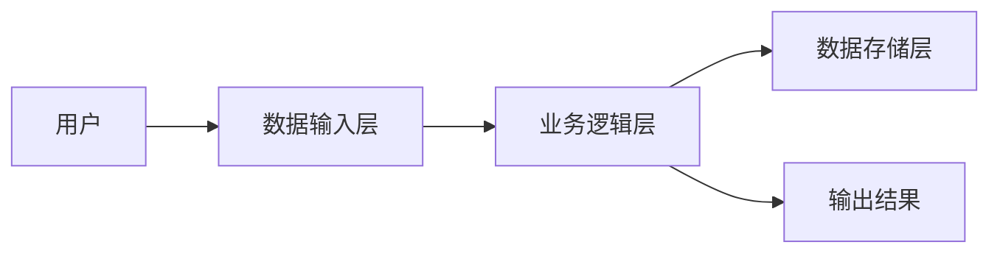

                 


# 彼得林奇对公司并购策略的评估标准

> 关键词：公司并购、彼得·林奇、评估标准、财务指标、行业分析、管理层能力

> 摘要：本文详细探讨了彼得·林奇在公司并购中的评估标准，从背景介绍到具体评估方法，结合数学模型和实际案例，深入剖析了其投资策略的精髓，帮助读者掌握并购评估的核心要点。

---

## 第一部分：公司并购与彼得·林奇的评估标准概述

### 第1章：公司并购的基本概念

#### 1.1 公司并购的定义与分类

##### 1.1.1 公司并购的基本定义
公司并购是指一家公司通过购买另一家公司的一部分或全部股权，以实现扩张、重组或战略调整的一种经济活动。并购可以分为横向并购、纵向并购和混合并购。

##### 1.1.2 并购的分类与特点
- **横向并购**：在同一行业内的并购，旨在扩大市场份额。
- **纵向并购**：在产业链上下游的并购，以整合资源。
- **混合并购**：跨行业并购，通常出于多元化发展的目的。

##### 1.1.3 并购的动机与目标
- **动机**：市场扩张、资源获取、竞争优势。
- **目标**：提升市场份额、优化资产结构、增强盈利能力。

#### 1.2 彼得·林奇与投资策略

##### 1.2.1 彼得·林奇的背景介绍
彼得·林奇是美国著名投资经理，以其在富达投资管理公司的成就闻名。他擅长通过基本面分析挖掘被低估的股票。

##### 1.2.2 彼得·林奇的投资理念
- **价值投资**：寻找具有潜在增值空间的企业。
- **长期投资**：关注企业的长期发展潜力。

##### 1.2.3 彼得·林奇的并购策略特点
- **注重基本面分析**：关注企业的财务状况和市场地位。
- **风险控制**：避免过度杠杆化和市场波动带来的风险。

### 第2章：彼得·林奇的公司并购评估标准

#### 2.1 财务指标评估

##### 2.1.1 市盈率（P/E Ratio）
- **定义**：市盈率=股价/每股收益。
- **作用**：衡量股票价格是否被高估或低估。

##### 2.1.2 市净率（P/B Ratio）
- **定义**：市净率=股价/每股净资产。
- **作用**：评估股票相对于账面价值的高低。

##### 2.1.3 净利润与ROE（净资产收益率）
- **定义**：ROE=净利润/股东权益。
- **作用**：衡量企业盈利能力。

##### 2.1.4 现金流与债务情况
- **现金流**：评估企业持续经营的能力。
- **债务情况**：评估企业财务健康状况。

#### 2.2 行业与市场分析

##### 2.2.1 行业周期分析
- **周期性行业**：如制造业和建筑业。
- **非周期性行业**：如公用事业和消费品行业。

##### 2.2.2 市场地位与竞争优势
- **市场占有率**：评估企业在行业中的地位。
- **竞争优势**：评估企业的核心竞争力。

##### 2.2.3 行业整合趋势
- **行业整合**：通过并购优化资源配置。
- **整合风险**：评估整合过程中的潜在问题。

#### 2.3 管理层能力评估

##### 2.3.1 管理层的背景与经验
- **管理团队**：评估管理层的专业背景和经验。
- **决策能力**：评估管理层在并购中的决策能力。

##### 2.3.2 管理层的诚信与道德
- **管理层诚信**：评估管理层的道德水平。
- **道德风险**：评估管理层在并购中的道德风险。

### 第3章：彼得·林奇并购评估模型

#### 3.1 模型概述

##### 3.1.1 模型的核心思想
- **基本面分析**：通过财务指标和行业分析评估企业价值。
- **管理层评估**：关注管理层的能力和道德水平。

##### 3.1.2 模型的适用场景
- **企业并购**：适用于企业并购前的评估。
- **投资决策**：适用于投资者在并购中的决策。

##### 3.1.3 模型的局限性
- **复杂性**：模型较为复杂，需要大量数据支持。
- **主观性**：部分指标具有主观性，评估结果可能受个人影响。

#### 3.2 模型的数学公式与计算方法

##### 3.2.1 市盈率计算公式
$$市盈率 = \frac{股价}{每股收益}$$

##### 3.2.2 市净率计算公式
$$市净率 = \frac{股价}{每股净资产}$$

##### 3.2.3 净利润与ROE计算公式
$$ROE = \frac{净利润}{股东权益}$$

#### 3.3 模型的流程图


---

## 第二部分：系统分析与架构设计

### 第4章：系统功能设计

#### 4.1 项目介绍

##### 4.1.1 项目目标
- 开发一个基于彼得·林奇评估标准的公司并购评估系统。

##### 4.1.2 项目范围
- 系统将涵盖财务指标分析、行业分析和管理层评估。

#### 4.2 系统功能设计

##### 4.2.1 领域模型


##### 4.2.2 系统架构设计


##### 4.2.3 系统接口设计
- **输入接口**：接收公司财务数据、行业信息和管理层信息。
- **输出接口**：输出并购评估结果。

#### 4.3 系统交互设计


---

## 第三部分：项目实战与案例分析

### 第5章：项目实战

#### 5.1 环境安装

##### 5.1.1 安装Python
- 使用Anaconda安装Python 3.8以上版本。

##### 5.1.2 安装必要的库
```bash
pip install pandas matplotlib numpy
```

#### 5.2 系统核心实现源代码

##### 5.2.1 数据读取与处理
```python
import pandas as pd

# 读取数据
data = pd.read_csv('company_data.csv')

# 计算市盈率和市净率
data['市盈率'] = data['股价'] / data['每股收益']
data['市净率'] = data['股价'] / data['每股净资产']
```

##### 5.2.2 行业分析
```python
import matplotlib.pyplot as plt

# 绘制行业分布图
data['行业周期'].value_counts().plot(kind='bar')
plt.title('行业周期分布')
plt.show()
```

##### 5.2.3 管理层评估
```python
def evaluate_management(管理层背景, 决策能力, 诚信水平):
    score = 0
    if 管理层背景 == '优秀':
        score += 30
    if 决策能力 == '优秀':
        score += 40
    if 诚信水平 == '优秀':
        score += 30
    return score

# 示例评估
score = evaluate_management('优秀', '优秀', '优秀')
print(f'管理层评估得分：{score}')
```

#### 5.3 案例分析

##### 5.3.1 案例选择
选择一家制造业公司和一家消费品公司进行评估。

##### 5.3.2 案例分析与结果解读
- 制造业公司：市盈率合理，市净率偏高，行业处于周期性上升阶段，管理层背景优秀。
- 消费品公司：市盈率偏高，市净率合理，行业处于成熟阶段，管理层决策能力强。

##### 5.3.3 并购可行性分析
- 制造业公司：适合并购，行业前景良好，管理层能力强。
- 消费品公司：需谨慎，市盈率偏高，行业竞争激烈。

#### 5.4 项目小结
通过实际案例分析，验证了彼得·林奇评估标准的有效性，帮助企业做出更明智的并购决策。

---

## 第四部分：总结与展望

### 第6章：总结与展望

#### 6.1 最佳实践 tips
- **数据准确性**：确保输入数据的准确性。
- **模型适用性**：根据实际情况调整模型参数。
- **持续学习**：关注行业动态和市场变化。

#### 6.2 小结
彼得·林奇的并购评估标准为企业提供了系统的分析框架，结合定量和定性分析，帮助企业做出明智的并购决策。

#### 6.3 注意事项
- **数据隐私**：注意保护企业数据隐私。
- **模型局限性**：认识到模型的局限性，避免过度依赖。

#### 6.4 拓展阅读
建议读者进一步阅读彼得·林奇的《彼得·林奇的投资策略》和相关并购案例分析书籍。

---

## 作者：AI天才研究院/AI Genius Institute & 禅与计算机程序设计艺术 /Zen And The Art of Computer Programming

---

通过以上目录结构，我们可以系统地了解彼得·林奇的公司并购评估标准，并通过实际案例和系统设计进一步加深理解。

