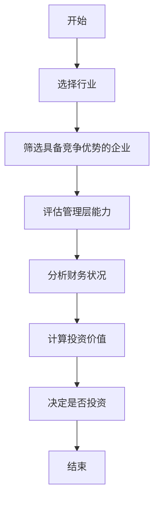
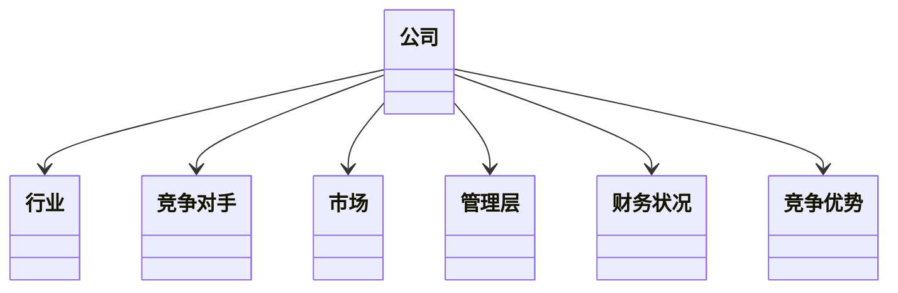

                 


# 彼得林奇对公司扩张策略的看法

## 关键词：彼得林奇，公司扩张，投资策略，选股标准，风险控制，企业成长

## 摘要：  
彼得·林奇作为全球著名投资家，以其独特的选股策略和对公司扩张的深刻见解闻名。本文将从彼得林奇的背景和投资哲学出发，分析其对公司扩张策略的看法，包括选股标准、风险控制、竞争优势评估等方面，并结合实际案例，探讨其策略在现代企业中的应用。文章结构清晰，逻辑严谨，旨在为读者提供深入的分析和实践指导。

---

## 第一部分: 彼得林奇的背景与投资哲学

### 第1章: 彼得·林奇的生平与投资成就

#### 1.1 彼得·林奇的早期经历  
彼得·林奇（Peter Lynch）于1942年9月16日出生于美国波士顿，是一位传奇的投资家。他在青少年时期就展现出了对投资的兴趣，15岁时通过投资一只封闭式基金赚到了第一桶金。林奇的早期经历为他后来的投资事业奠定了基础。

#### 1.2 林奇在富达投资的成就  
林奇的职业生涯中最辉煌的时期是在富达投资（Fidelity Investments）担任基金经理的时期。他管理的麦哲伦基金（Fidelity Magellen Fund）在1977年至1990年期间取得了年均29%的回报率，远超市场平均水平。这一成就使他成为全球最受尊敬的投资专家之一。

#### 1.3 林奇的投资哲学概述  
林奇的投资哲学以“购买并持有”为核心，强调长期投资和对公司基本面的深入研究。他认为，成功的投资取决于对公司的深入了解，包括管理层能力、竞争优势和财务状况。

---

### 第2章: 公司扩张策略的定义与分类

#### 2.1 公司扩张的定义  
公司扩张是指企业在现有业务基础上，通过横向或纵向整合、多元化发展等方式扩大业务规模和市场影响力的过程。扩张策略的核心在于利用内部资源和外部机会，提升企业的竞争力和市场份额。

#### 2.2 公司扩张的分类  
公司扩张可以分为以下几种类型：
- **横向扩张**：在同一市场或相关市场中扩大业务规模，例如并购竞争对手或拓展新市场。
- **纵向扩张**：通过垂直整合供应链，从原材料采购到生产、销售的各个环节进行控制。
- **多元化扩张**：进入新的行业或市场，分散风险并寻找新的利润增长点。

---

### 第3章: 彼得林奇对公司扩张策略的核心观点

#### 3.1 林奇对扩张策略的评价标准  
林奇在评估公司的扩张策略时，重点关注以下几个方面：
- **企业竞争优势**：公司是否具备独特的竞争优势，例如技术壁垒、成本优势或品牌影响力。
- **管理层能力**：管理层是否具备战略眼光和执行力，能够推动扩张策略的实施。
- **财务状况**：公司是否有足够的财务资源支持扩张，包括现金流、负债水平和盈利能力。

#### 3.2 林奇对扩张策略的优缺点分析  
林奇认为，扩张策略既有优点也有缺点：
- **优点**：扩张可以带来新的利润增长点，提升企业的市场地位，增强抗风险能力。
- **缺点**：扩张可能面临市场竞争加剧、资源整合困难和财务风险增加等问题。
- **平衡观点**：林奇强调，企业在制定扩张策略时，应根据自身情况权衡利弊，避免盲目扩张。

---

## 第二部分: 彼得林奇对公司扩张策略的核心概念与联系

### 第4章: 彼得林奇的扩张策略分析框架

#### 4.1 林奇的选股标准  
林奇在选股时，注重以下几点：
- **企业基本面分析**：关注公司的收入、利润、毛利率等财务指标。
- **企业成长性评估**：考察公司的增长率、市场份额和未来发展的潜力。
- **企业估值方法**：通过市盈率、市净率等指标评估公司的合理估值。

#### 4.2 林奇的风险控制策略  
林奇的风险控制策略包括：
- **风险评估**：通过分析行业趋势、市场环境和公司基本面，识别潜在风险。
- **风险分散**：通过多元化投资降低风险，避免过度依赖单一业务或市场。
- **风险应对**：制定应对策略，例如调整投资组合或加强内部管理。

---

### 第5章: 彼得林奇策略与传统投资策略的对比

#### 5.1 传统投资策略概述  
传统投资策略主要包括基本面分析和技术分析。基本面分析关注公司的财务数据和行业趋势，技术分析则通过价格走势预测市场变化。

#### 5.2 林奇策略的独特性  
林奇策略的独特性体现在以下几个方面：
- **以管理层能力为核心**：林奇认为，管理层的能力是公司成功的关键因素。
- **注重企业竞争优势**：他强调企业必须具备独特的竞争优势，才能在扩张中立于不败之地。
- **长期投资视角**：林奇倡导长期投资，避免短期波动的干扰。

---

## 第三部分: 彼得林奇策略的算法原理与系统分析

### 第6章: 彼得林奇选股模型的数学模型

#### 6.1 选股模型的数学表达  
林奇的选股模型可以表示为：
$$
\text{投资价值} = \sum_{i=1}^{n} (\text{权重}_i \times \text{评分}_i)
$$
其中，$\text{权重}_i$是各项指标的权重，$\text{评分}_i$是各项指标的评分。

#### 6.2 选股模型的流程图  
以下是林奇选股模型的mermaid流程图：



---

### 第7章: 系统分析与架构设计

#### 7.1 系统功能设计  
以下是公司扩张策略分析的领域模型：



#### 7.2 系统架构设计  
以下是系统架构的mermaid图：


---

## 第四部分: 项目实战与案例分析

### 第8章: 项目实战

#### 8.1 环境安装  
需要安装以下工具：
- Python 3.x
- Mermaid工具
- 数据分析工具（如Excel或Python的Pandas库）

#### 8.2 核心代码实现  
以下是Python代码实现：

```python
def calculate_investment_value(company_data):
    weights = {'收入': 0.3, '利润': 0.3, '市场份额': 0.2, '竞争优势': 0.2}
    scores = {
        '收入': company_data['收入评分'],
        '利润': company_data['利润评分'],
        '市场份额': company_data['市场份额评分'],
        '竞争优势': company_data['竞争优势评分']
    }
    investment_value = 0
    for key in weights:
        investment_value += weights[key] * scores[key]
    return investment_value

# 示例数据
company_data = {
    '收入评分': 85,
    '利润评分': 90,
    '市场份额评分': 75,
    '竞争优势评分': 95
}

result = calculate_investment_value(company_data)
print(f"投资价值: {result}")
```

#### 8.3 案例分析  
以微软的扩张策略为例，分析其在云服务领域的扩张是否符合林奇的选股标准。

---

## 第五部分: 最佳实践与总结

### 第9章: 最佳实践

#### 9.1 小结  
彼得·林奇的扩张策略强调对管理层能力、竞争优势和财务状况的深入分析，同时注重风险控制和长期投资。

#### 9.2 注意事项  
企业在制定扩张策略时，应结合自身实际情况，避免盲目扩张和过度杠杆。

#### 9.3 拓展阅读  
推荐阅读彼得·林奇的《彼得·林奇的股票投资策略》和《股票投资的成功之道》。

---

## 作者：AI天才研究院/AI Genius Institute & 禅与计算机程序设计艺术 /Zen And The Art of Computer Programming

