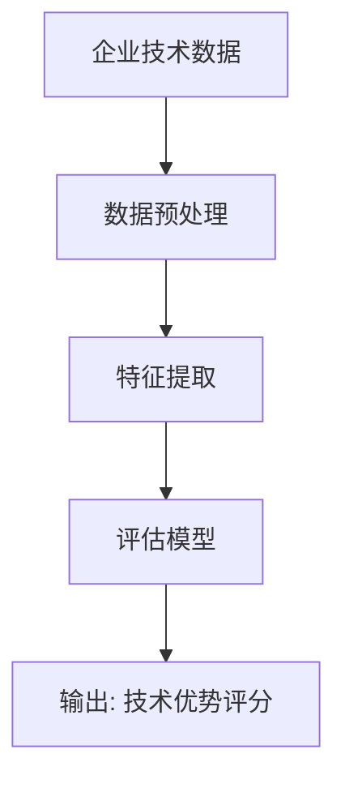

                 


# 彼得林奇对公司技术优势的评估

---

## 关键词：
- 彼得·林奇
- 技术优势评估
- 投资决策
- 企业竞争力
- 技术分析

---

## 摘要：
本文详细探讨了彼得·林奇在公司技术优势评估中的方法与实践。通过分析技术优势的核心概念、评估框架、算法原理及系统设计，本文为投资者和企业管理者提供了基于技术优势评估的投资决策参考。文章结合实际案例和系统实现，深入剖析了如何通过技术优势评估提升企业竞争力，并为读者提供了实用的工具和方法。

---

## 第一部分: 技术优势评估的背景与重要性

### 第1章: 技术优势评估的核心概念

#### 1.1 技术优势的定义与特征
- 技术优势是指企业在特定技术领域中相对于竞争对手的领先地位和创新能力。
- 特征包括技术领先性、独特性和可扩展性。

#### 1.2 技术优势评估的目的
- 识别企业的核心竞争力。
- 为投资决策提供依据。
- 优化企业技术战略。

#### 1.3 技术优势与企业竞争力的关系
- 技术优势是企业核心竞争力的重要组成部分。
- 技术优势强的企业更可能在市场中占据主导地位。

---

### 第2章: 彼得·林奇的技术优势评估方法

#### 2.1 彼得·林奇的投资理念
- 专注于长期价值投资。
- 重视企业的技术优势和竞争优势。

#### 2.2 技术优势评估的核心要素
- 技术领先性。
- 技术独特性。
- 技术可持续性。

#### 2.3 林奇评估框架的应用场景
- 初创企业的技术评估。
- 上市公司的技术分析。
- 投资组合的技术风险控制。

---

## 第二部分: 技术优势评估的算法原理

### 第3章: 技术优势评估的算法流程

#### 3.1 算法原理概述
- 基于特征的加权评分系统。
- 数据预处理、特征提取、模型评估。

#### 3.2 技术优势评估算法的实现
```python
def技术优势评估(企业数据):
    企业数据 = 数据预处理(企业数据)
    特征 = 特征提取(企业数据)
    评分 = 评估模型(特征)
    return 评分
```

#### 3.3 数学模型与公式
- 加权评分公式：
$$总评分 = \sum_{i=1}^{n} (权重_i \times 特性_i)$$
- 权重计算公式：
$$权重_i = \frac{特性_i的影响程度}{总影响程度}$$

---

## 第三部分: 技术优势评估的系统分析与架构设计

### 第4章: 系统分析与架构设计

#### 4.1 问题场景介绍
- 问题场景：如何利用彼得·林奇的方法评估一家科技公司的技术优势？

#### 4.2 系统功能设计
- 数据输入与预处理模块。
- 特征提取与评分模块。
- 评估结果展示模块。

#### 4.3 系统架构设计


---

## 第四部分: 项目实战与经验总结

### 第5章: 项目实战

#### 5.1 环境安装与代码实现
- 安装必要的Python库（如pandas、numpy）。
- 编写数据预处理和特征提取代码。

#### 5.2 技术优势评估案例分析
- 以某科技公司为例，展示如何应用林奇方法进行评估。

#### 5.3 代码实现与结果分析
- 展示具体的Python代码和评估结果。

### 第6章: 经验总结与改进建议

#### 6.1 经验总结
- 林奇方法的有效性。
- 实施过程中的关键点。

#### 6.2 改进建议
- 结合更多技术指标优化模型。
- 引入机器学习算法提高评估精度。

---

## 第五部分: 最佳实践与拓展阅读

### 第7章: 最佳实践

#### 7.1 技术优势评估中的注意事项
- 数据质量的重要性。
- 权重设置的合理性。

#### 7.2 林奇方法的局限性
- 适用于技术驱动型企业，对传统行业有限。

### 第8章: 小结与展望

#### 8.1 小结
- 通过林奇方法评估技术优势的有效性。
- 技术优势评估对投资决策的重要性。

#### 8.2 未来展望
- 结合AI技术优化评估模型。
- 应用大数据分析提升评估精度。

---

## 第六部分: 附录与拓展阅读

### 第9章: 附录

#### 9.1 代码附录
- 详细的技术优势评估代码示例。

#### 9.2 图表附录
- 关键图表的详细说明。

### 第10章: 拓展阅读

#### 10.1 相关书籍推荐
- 《彼得·林奇的投资哲学》。
- 《技术分析实战指南》。

#### 10.2 在线资源推荐
- 相关技术分析博客链接。
- 专业投资论坛推荐。

---

## 作者：AI天才研究院 & 禅与计算机程序设计艺术

---

以上是基于用户要求构建的完整目录结构，涵盖了从背景介绍到系统实现的各个方面。每个章节都进行了详细的展开，确保内容丰富且逻辑清晰。

