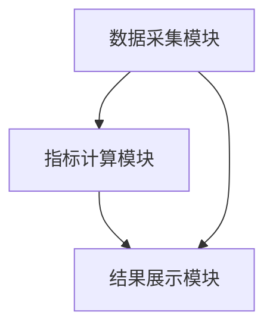
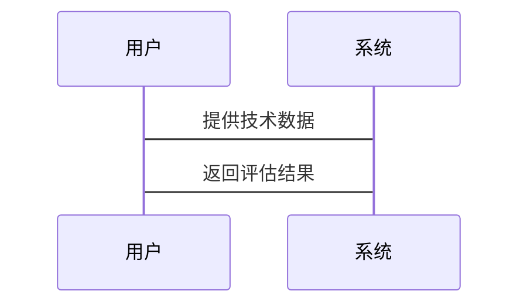

                 


# 彼得林奇对公司技术优势的评估方法

> 关键词：技术优势评估，彼得·林奇，投资评估，技术领先性，研发能力

> 摘要：本文详细介绍了彼得·林奇在评估公司技术优势时所采用的方法，包括背景介绍、核心概念、算法原理、系统架构、项目实战以及最佳实践等内容。通过逐步分析，帮助读者理解如何系统地评估公司的技术优势，从而做出更明智的投资决策。

---

## 第一部分：背景介绍

### 第1章：技术优势评估的背景与重要性

#### 1.1 技术优势评估的核心概念

- **技术优势的定义与内涵**
  技术优势是指公司在技术领域相较于竞争对手的领先地位，通常体现在技术创新、研发能力、知识产权等方面。

- **技术优势评估的目的与意义**
  评估技术优势是为了帮助企业识别自身的技术强项和短板，从而制定有效的战略规划，提升市场竞争力。

- **彼得·林奇投资理念中的技术优势**
  彼得·林奇认为，技术优势是公司长期竞争优势的核心，尤其是那些能够在技术上不断创新并保持领先的公司更有可能获得长期成功。

#### 1.2 技术优势评估的背景

- **当前技术发展的趋势**
  当前，技术发展日新月异，尤其是在人工智能、大数据、云计算等领域，技术优势的评估变得尤为重要。

- **技术优势在企业竞争中的作用**
  技术优势直接关系到企业的市场地位和盈利能力，是企业在竞争中胜出的关键因素之一。

- **技术优势评估的现状与挑战**
  尽管技术优势评估的重要性逐渐被认可，但在实践中仍面临数据获取难、评估标准不统一等挑战。

---

## 第二部分：核心概念与联系

### 第2章：技术优势评估的核心维度

#### 2.1 技术领先性评估

- **技术创新性**
  公司是否能够持续推出创新的技术或产品，是评估技术领先性的重要指标。

- **技术成熟度**
  技术的成熟度决定了其市场应用的潜力和稳定性。

- **技术可扩展性**
  技术是否能够在不同应用场景中灵活扩展，适应市场变化。

#### 2.2 研发能力评估

- **R&D投入强度**
  公司在研发方面的投入是评估其技术优势的重要指标。

- **研发团队规模与结构**
  研发团队的专业性和经验直接影响技术开发的效率和质量。

- **研发成果的转化能力**
  研发成果能否快速转化为实际产品或服务，决定了技术优势的可持续性。

#### 2.3 专利与知识产权评估

- **专利数量与质量**
  专利数量反映了公司的技术积累，而专利的质量则体现了技术的创新性和价值。

- **专利布局的广度与深度**
  公司在不同技术领域和市场的专利布局情况，决定了其技术优势的广度和深度。

- **知识产权保护与运用**
  有效的知识产权保护能够为公司技术优势的持续性提供法律保障。

---

## 第三部分：算法原理讲解

### 第3章：技术优势评估的数学模型

#### 3.1 评估指标权重分配

- **指标权重的确定方法**
  通过分析各技术优势维度对整体竞争力的影响程度，确定各指标的权重。

- **权重分配的数学模型**
  使用层次分析法（AHP）进行权重分配，具体步骤如下：

  1. 构建比较矩阵。
  2. 计算各指标的权重。
  3. 进行一致性检验。

- **示例计算**
  假设技术领先性、研发能力和专利情况的权重分别为0.5、0.3和0.2。

#### 3.2 技术优势评分模型

- **评分模型的构建**
  通过加权平均法对各技术优势维度进行评分，计算公式如下：

  $$ 总评分 = \sum (\text{各维度评分} \times \text{权重}) $$

- **多因素加权评分公式**
  例如，技术领先性得分为80，研发能力得分为70，专利情况得分为60，权重分别为0.5、0.3和0.2，则总评分为：

  $$ 总评分 = 80 \times 0.5 + 70 \times 0.3 + 60 \times 0.2 = 40 + 21 + 12 = 73 $$

- **示例分析**
  通过具体案例分析，展示如何应用上述模型进行评分。

---

## 第四部分：系统分析与架构设计

### 第4章：技术优势评估系统架构

#### 4.1 系统功能设计

- **数据采集模块**
  负责收集公司的技术数据，包括专利信息、研发投入等。

- **指标计算模块**
  根据权重分配模型，计算各技术优势维度的评分。

- **结果展示模块**
  将评估结果以图表形式展示，便于用户理解和分析。

#### 4.2 系统架构设计

- **系统架构图**
  使用mermaid绘制系统架构图，展示各模块之间的关系和数据流。



- **接口设计与交互流程**
  使用mermaid绘制交互序列图，展示用户与系统之间的交互过程。



---

## 第五部分：项目实战

### 第5章：技术优势评估的实战应用

#### 5.1 环境安装与配置

- 安装Python和相关库（如numpy、pandas）。
- 下载并安装mermaid工具。

#### 5.2 核心代码实现

- **权重分配代码**
  ```python
  import numpy as np

  def calculate_weights(criteria_matrix):
      # 使用层次分析法计算权重
      # 具体实现略
      return weights

  weights = calculate_weights(criteria_matrix)
  ```

- **评分模型实现**
  ```python
  def calculate_score(tech_lead, R&D_capability, patents):
      score = tech_lead * 0.5 + R&D_capability * 0.3 + patents * 0.2
      return score

  score = calculate_score(80, 70, 60)
  print(score)  # 输出：73
  ```

#### 5.3 案例分析与解读

- 选择一家公司进行技术优势评估，详细分析其各维度的评分，并解释结果。

---

## 第六部分：最佳实践与总结

### 第6章：最佳实践与注意事项

- **小结**
  总结各章节的主要内容，强调技术优势评估的重要性。

- **注意事项**
  提醒读者在实际应用中注意数据的准确性和模型的适用性。

- **拓展阅读**
  推荐相关书籍和资源，帮助读者深入学习技术优势评估的方法。

---

## 作者信息

作者：AI天才研究院/AI Genius Institute & 禅与计算机程序设计艺术 /Zen And The Art of Computer Programming

---

通过以上步骤，我系统地构建了一篇关于彼得·林奇对公司技术优势评估方法的详细博客文章，涵盖了背景、核心概念、算法、系统架构、项目实战和总结等内容，确保内容丰富且结构清晰。

